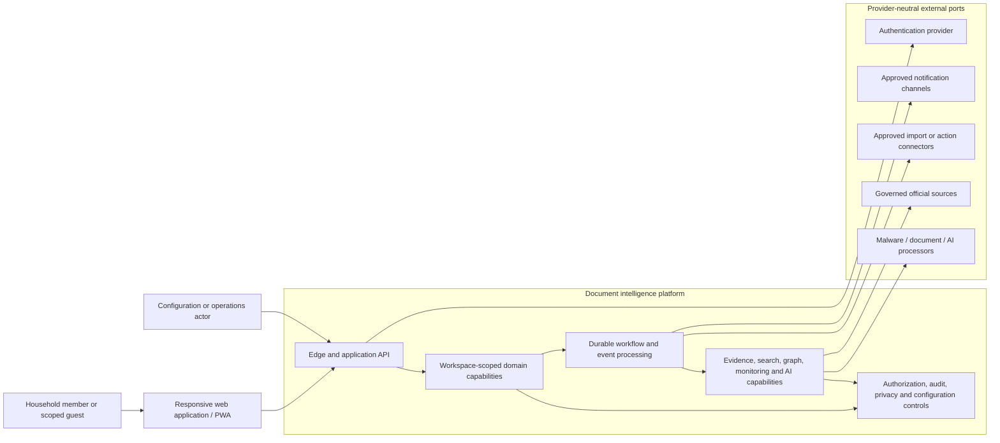
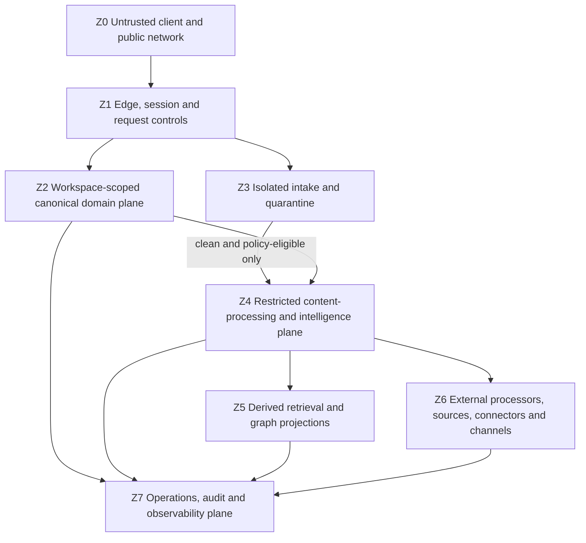
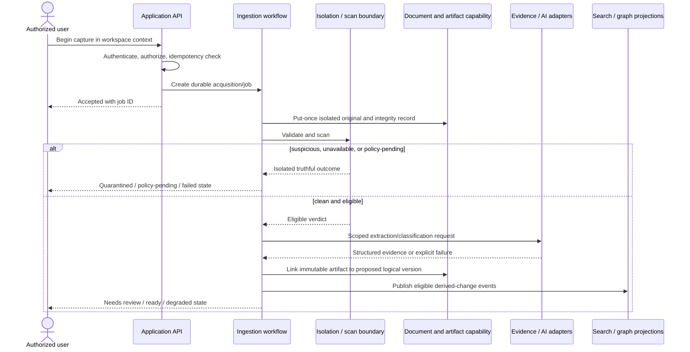

# Phase 1 Solution Architecture

| Field | Value |
|---|---|
| Document ID | `ARCH-SOL-001` |
| Version | `0.1` |
| Status | **DRAFT — not an approved implementation baseline or accepted ADR** |
| Product phase | Phase 1 — Personal and Family, with Phase 2 extension points |
| Jurisdiction | Australia first; jurisdiction-neutral core |
| Updated | 26 August 2026 |
| Normative basis | Approved `DEC-001`–`DEC-011` and `DEC-020`–`DEC-024`; draft `PROD-PRD-001` |
| Companion | [`ARCH-DOM-001`](02-domain-model.md) |

## 1. Purpose, authority, and non-decisions

This document defines the logical architecture needed to satisfy the draft Phase 1 product requirements. Its `ARCH-P1-*` rules are stable draft architecture rules. They become implementation constraints only when this specification and the applicable product baseline are approved.

The source-of-truth hierarchy in [`CODEX.md`](../../CODEX.md) applies. Approved entries in the [decision register](../00-context/decision-register.md) constrain this design. The [Phase 1 PRD](../01-product/02-phase-1-prd.md), [feature catalogue](../01-product/03-feature-catalogue.md), [use-case catalogue](../01-product/04-use-case-catalogue.md), [personas and journeys](../01-product/05-personas-and-journeys.md), and [scope and metrics](../01-product/06-scope-and-success-metrics.md) are draft inputs rather than implementation authority.

This document deliberately does **not** select:

- a cloud or infrastructure provider;
- a programming language, framework, runtime, or repository topology;
- a relational, object, search, vector, graph, cache, queue, or analytics product;
- an identity, key-management, malware-scanning, OCR, AI, notification, or observability vendor;
- a modular-monolith, process, service, container, cluster, or serverless deployment count; or
- an accepted Architecture Decision Record.

The components below are logical ownership and policy boundaries. Several may be deployed together, and one may later be split, provided the ports, invariants, evidence, authorization, and compatibility contracts remain intact. Any deployment or vendor choice requires a separate proposed/accepted ADR.

## 2. Architecture drivers

The architecture is shaped by these product facts:

1. Highly sensitive content and derivatives exist in a multi-tenant service with strict workspace isolation (`DEC-022`).
2. Identity, membership, workspace, subject, and resource are distinct (`DEC-003`).
3. Original evidence is immutable while logical documents and derived interpretations evolve (`DEC-005`).
4. Canonical facts are independent of occurrences and preserve temporal history (`DEC-004`).
5. Search, graph, AI, notifications, export, workers, and external actions enforce current authorization (`DEC-008`).
6. Consequential recommendations and effects require evidence, explanation, bound approval, and audit (`DEC-006`).
7. Taxonomy, policy, rules, sources, workflows, and AI capabilities are versioned configuration (`DEC-007`).
8. Long-running document processing, monitoring, impact, export, and deletion workflows must survive retry, duplication, reordering, interruption, and provider failure.
9. The Australian residency option applies to the complete processing path, not only original storage (`DEC-022`); its data-class/processor matrix remains open in `DEC-040`.
10. Core contracts must remain portable across providers (`DEC-009`) and extensible to organisation workspaces without Phase 2 UI in Phase 1 (`DEC-002`).

## 3. Logical context

The diagram is a context model, not a network or deployment topology. All arrows crossing the platform boundary are authenticated, authorized, purpose-limited, observable, and subject to residency/data-processing policy.

## 4. Stable architecture rules

### 4.1 Logical and contract boundaries

| Rule ID | Draft architecture rule |
|---|---|
| `ARCH-P1-001` | Logical component boundaries express ownership, trust, and contract responsibilities; they MUST NOT be interpreted as a mandated service or deployment topology. |
| `ARCH-P1-002` | Core domain behavior MUST depend on provider-neutral ports. Provider adapters MUST conform to versioned capability, security, residency, evidence, failure, and deletion contracts. |
| `ARCH-P1-003` | Every household command, query, job, event, derivative, artifact grant, audit record, and external effect MUST carry an explicit validated workspace context; identity alone is never the tenancy boundary. |
| `ARCH-P1-004` | Resource, event, workflow, and correlation identities MUST be opaque and stable. Content hashes, filenames, provider IDs, display names, or mutable natural keys MUST NOT become canonical platform identities. |
| `ARCH-P1-005` | API, event, configuration, policy, schema, prompt/tool, parser, and projection contracts MUST be versioned and support compatibility validation, deterministic replay, and additive evolution. |

### 4.2 Authorization and trust

| Rule ID | Draft architecture rule |
|---|---|
| `ARCH-P1-006` | Current authorization MUST be evaluated at request and execution time for direct reads, candidate retrieval, fields, graph edges, evidence anchors, derivatives, notifications, exports, and effects. |
| `ARCH-P1-007` | Every logical component that reads or changes protected state is a policy-enforcement point. An edge check or permission copied at ingestion is insufficient. |
| `ARCH-P1-008` | Authorization decisions MUST include actor/workload identity, workspace, resource and field/edge scope, operation, purpose, grant, policy version, relevant time, and requested disclosure class. Missing or conflicting inputs fail closed. |
| `ARCH-P1-009` | Responses, counts, facets, timing, errors, cache behavior, graph paths, citations, scores, notifications, and audit views MUST protect restricted resource and relationship existence. Minimal “impact exists” disclosure requires an explicit policy outcome. |
| `ARCH-P1-010` | Workers and adapters MUST use distinct least-privileged workload identities and scoped delegation; user or model text MUST NOT be treated as authority. |
| `ARCH-P1-011` | Original/preview access MUST use short-lived, actor-, workspace-, resource-, version-, purpose-, and operation-scoped redemption that reauthorizes on use; permanent public artifact URLs are prohibited. |
| `ARCH-P1-012` | Product operator, support, configuration, and security duties MUST be separated. No operator role has standing raw-content access, and exceptional access requires a separately approved, time-bound, audited policy. |

### 4.3 Data protection, trust zones, and residency

| Rule ID | Draft architecture rule |
|---|---|
| `ARCH-P1-013` | Every data class and derivative MUST carry classification, workspace/reference scope, residency/processing policy, retention state, and provenance sufficient for enforcement. |
| `ARCH-P1-014` | The Australian residency option MUST govern originals, canonical records, indexes, graph/vector/search projections, caches, exports, backups, logs, analytics, support paths, AI/OCR processing, and disaster recovery according to the approved matrix. |
| `ARCH-P1-015` | An external processor or connector call MUST pass a policy gate covering purpose, consent, data class, minimum payload, provider capability, residency route, retention, deletion, and revocation. If no approved route exists, processing is blocked or explicitly withheld pending consent where policy permits. |
| `ARCH-P1-016` | Unscanned, suspicious, or unsupported-policy content MUST remain in an isolation zone unavailable to ordinary preview, extraction, indexing, graph, search, AI, and download paths. |
| `ARCH-P1-017` | Encryption, key, token, and secret operations MUST use explicit ports and separated authority. Keys and credentials MUST NOT be embedded in domain state, event payloads, logs, or model context. |
| `ARCH-P1-018` | Ordinary logs, metrics, traces, analytics, errors, and screenshots MUST exclude raw document content, query/answer text, evidence passages, tokens, secrets, and unapproved sensitive values. |

### 4.4 Synchronous and asynchronous consistency

| Rule ID | Draft architecture rule |
|---|---|
| `ARCH-P1-019` | A synchronous command MUST authenticate, establish workspace context, authorize, validate, enforce concurrency/idempotency, and durably record either the completed local transition or an accepted workflow before returning success. |
| `ARCH-P1-020` | Long-running work MUST be represented by an explicit durable state machine with truthful pending, review, retry, failed, cancelled, blocked, partial, and terminal outcomes as applicable. |
| `ARCH-P1-021` | A canonical state transition and its required event publication MUST be atomic through a transactional outbox or a provider-neutral equivalent; no fact/document/approval transition may be committed while its required downstream trigger is silently lost. |
| `ARCH-P1-022` | Asynchronous handlers MUST tolerate duplicate, delayed, and out-of-order delivery using stable event IDs, aggregate revisions, idempotency keys, causation/correlation, and monotonic transition checks. |
| `ARCH-P1-023` | External side effects MUST use an explicit command, idempotency/reconciliation identity, timeout/unknown outcome, retry policy, and compensating or forward-repair path. A distributed transaction with an external provider MUST NOT be assumed. |
| `ARCH-P1-024` | A queued job MUST reauthorize its workload and affected resources before disclosing a result or producing a consequence; stale user grants or captured model context cannot authorize later work. |

### 4.5 Canonical records, evidence, and derived stores

| Rule ID | Draft architecture rule |
|---|---|
| `ARCH-P1-025` | Each canonical aggregate has one logical write owner. Other components interact through commands, queries, or events and MUST NOT mutate another aggregate’s records or state machine directly. |
| `ARCH-P1-026` | Accepted original artifacts, document evidence occurrences, governed-source snapshots, fact occurrences, and consequential resolution/approval records are immutable or append-only. Corrections create new linked state. |
| `ARCH-P1-027` | Full-text, semantic/vector, graph, ranking, comparison, readiness, conversation, and analytics stores are derived projections, not independent truth. They MUST be rebuildable from retained authoritative records and versioned transformation inputs. |
| `ARCH-P1-028` | Every derived record MUST retain workspace, source resource/version, source revision/event, projection/schema/model version, built time, authorization-policy reference, deletion state, and freshness watermark appropriate to its use. |
| `ARCH-P1-029` | Derived reads MUST apply request-time authorization and canonical deletion/deny fences. A projection that cannot prove acceptable freshness or scope MUST fail closed, omit the result, or return an explicit incomplete/stale state. |
| `ARCH-P1-030` | Caches and conversation state MUST be workspace-partitioned and include authorization/policy and source-revision fingerprints. Revocation, deletion, or material policy change MUST invalidate or bypass affected entries. |
| `ARCH-P1-031` | A deletion request MUST create an authoritative deletion fence/tombstone before asynchronous purge. New and late jobs, events, restores, projections, exports, and caches MUST honor the fence and MUST NOT resurrect active access. |
| `ARCH-P1-032` | Backup restore and disaster recovery MUST replay current authorization, deletion fences, configuration, and audit continuity before restored data is serviceable; backup expiry and residual state remain truthful until `DEC-039` is resolved. |

### 4.6 Intelligence, monitoring, and controlled action

| Rule ID | Draft architecture rule |
|---|---|
| `ARCH-P1-033` | Every AI use MUST enter through a registered capability gateway that validates authorized context/tools, structured output, evidence, model/prompt/tool/schema versions, confidence/review policy, fallback, cost, and telemetry before result use. |
| `ARCH-P1-034` | A surfaced material claim or promoted field MUST reference a stable authorized evidence anchor resolving to an exact document version/page/passage or immutable governed-source snapshot. |
| `ARCH-P1-035` | Documents, source pages, metadata, connector content, and model output are untrusted inputs. Embedded instructions MUST NOT change system policy, tool scope, schemas, citations, or action authority. |
| `ARCH-P1-036` | Governed-source retrieval MUST preserve immutable observations separately from mutable health. Applicability MUST be evaluated before impact and remain separate from authority, freshness, evidence strength, confidence, severity, and urgency. |
| `ARCH-P1-037` | Graph traversal MUST authorize each node/field/edge/result, bind typed versioned edges and provenance, and terminate deterministically under cycle, depth, fan-out, stale-edge, and incomplete-data limits. |
| `ARCH-P1-038` | Consequential execution MUST require current policy evaluation and approval bound to exact inputs, target, effect, actor, policy, and expiry. Action submission, elapsed time, or file presence MUST NOT establish verified closure. |

### 4.7 Audit, observability, degraded behavior, and evolution

| Rule ID | Draft architecture rule |
|---|---|
| `ARCH-P1-039` | Security- and consequence-relevant transitions MUST durably create privacy-safe audit evidence. If required audit durability cannot be established, the protected transition fails or remains explicitly incomplete. |
| `ARCH-P1-040` | Every request, command, event, job, adapter call, approval, action, and projection MUST preserve privacy-safe trace, causation, correlation, attempt, and contract-version identifiers. |
| `ARCH-P1-041` | Dependency failure, stale state, truncated coverage, policy uncertainty, partial effect, and recovery progress MUST be explicit machine-readable and user-safe states; last-known success MUST NOT masquerade as current success. |
| `ARCH-P1-042` | Retry, backoff, circuit opening, quarantine/dead-letter handling, replay, and repair MUST be bounded, observable, idempotent, and operator-controlled without requiring raw-content logs. |
| `ARCH-P1-043` | Phase 1 contracts MUST reserve organisation, business-unit, records, hold, information-barrier, DLP, policy/control/evidence, and enterprise-identity extension types without enabling Phase 2 user interfaces or workflows. |
| `ARCH-P1-044` | Behavior governed by `DEC-031`–`DEC-040` MUST remain disabled, conditional, or expressed through an inert/configurable branch until approved; code defaults MUST NOT close an open decision. |
| `ARCH-P1-045` | Every enabled component and adapter MUST pass contract, authorization, isolation, residency, idempotency, evidence, deletion, audit, failure, and portability conformance tests linked to the requirements it implements. |

## 5. Logical components and ownership

| Logical component | Owns | Does not own | Primary inbound/outbound ports |
|---|---|---|---|
| Responsive web/PWA client | Accessible interaction state, resumable local transfer state, user-visible job polling/subscription | Authorization truth, canonical resources, long-lived secrets, silent offline content copies | Application API; upload/artifact transfer; approved notification registration |
| Edge and application API | Request authentication handoff, workspace-context validation, rate/abuse controls, request shaping, API compatibility | Domain truth or authorization policy | Authentication, authorization, domain command/query, artifact grant, job-status ports |
| Identity and session boundary | Platform identity reference, authenticated session assurance, workload identity verification | Workspace membership, resource ownership, subject identity, authorization outcome | External authentication adapter; session/recovery port pending `DEC-038` |
| Workspace, subject, and membership capability | Workspace, membership, subject, relationship, ownership lifecycle | Document/fact access decisions inferred from role alone | Workspace commands/queries; authorization; audit; event publication |
| Authorization capability | Versioned policy evaluation and minimal-disclosure decisions | Authentication provider internals or protected content | Policy-decision port used by every enforcement point; policy/config registry |
| Sharing and grant capability | Purpose/resource/field/action/time-scoped grants, invitation/link lifecycle | Underlying resource content | Authorization; notification; signed grant redemption; audit |
| Document repository and lifecycle | Logical documents, versions, artifact links, effective/supersession/archive/trash states | Original byte mutation, extraction truth, final purge timing | Artifact store; lifecycle commands; comparison/evidence queries; deletion coordinator |
| Artifact access capability | Immutable artifact identity, scoped issuance/redemption, integrity checks | Permanent public URLs or access policy ownership | Artifact store; authorization; cryptographic/key port; audit |
| Ingestion orchestration | Acquisition and ingestion job state, step attempts, retry/reconciliation | Provider-specific parsing logic or fact approval | Upload/intake; malware/clinical boundary; processor adapters; event/job runtime |
| Quarantine and content-policy boundary | Scan/policy verdicts and isolation lifecycle | Ordinary document browsing or indexing | Malware scanner port; clinical-content policy branch; restricted security evidence |
| Evidence and interpretation capability | Derived extraction/classification results, evidence anchors, review state, processing provenance | Canonical fact resolution or requirement fulfilment | Document-processing and AI ports; reviewer commands; evidence query |
| Fact and entity capability | Canonical fact aggregates, immutable occurrences, resolution events, entity identities, conflicts | Direct document mutation or impact traversal | Evidence queries; resolution commands; authorization; change-event publication |
| Dependency and impact capability | Typed dependency projection/records, traversal results, impact assessments and paths | Source authority, approvals, external execution | Graph port; policy; fact/document/rule events; recommendation workflow |
| Search, comparison, and answer capability | Authorized retrieval orchestration, citations, safe conversation state, answer provenance | Canonical facts or independent authorization | Full-text/semantic/graph ports; AI capability gateway; evidence resolver; policy |
| AI capability gateway | Capability registry enforcement, structured-output validation, tool/context policy, provenance and fallback | Canonical state mutation or independent approval | Model/tool adapters; authorization; evidence; evaluation/telemetry |
| Source registry and monitoring capability | Source definitions, subscriptions, observations/snapshots, health, rules/runs, applicability candidates | Household fact truth or final recommendation | Scheduler; source retrieval/parser ports; configuration; event publication |
| Recommendation, approval, and action workflow | Recommendation, approval, action command/execution, reconciliation, fulfilment/closure state | Provider-specific effect semantics or evidence fabrication | Policy/approval; action adapters; tasks; evidence verifier; audit |
| Task and notification capability | Task lifecycle, assignment, reminders, delivery attempts/preferences | Recommendation truth or channel-specific authority | Workflow events; notification adapters; authorization; scheduler |
| Configuration publication capability | Versioned reference packages, validation, approval/publication, activation, rollback/repair | Hidden code defaults for product policy | Configuration repository; approval; impact/replay; audit |
| Export and deletion coordinator | Export/deletion jobs, snapshot scope, manifests, deletion fences, purge acknowledgements and residuals | Unilateral ownership of each store’s purge mechanics | Authorization; every store/adapter purge port; artifact packaging; audit |
| Audit capability | Tamper-evident privacy-safe security and consequence records | General debug logs, raw content, mutable product truth | Append/query-by-authorized-scope; integrity verification/export redaction |
| Observability capability | Health, metrics, traces, safe diagnostic events and alerts | Evidence/content store or authorization decision | Telemetry port; redaction/schema enforcement; incident routing |
| Durable workflow/event runtime | Scheduling, delivery, retries, leases, outbox dispatch, replay orchestration | Domain transition validity | Event journal; clock/scheduler; handler registrations; dead-letter repair |

Each row identifies logical ownership. It does not require a separate process, network hop, or datastore.

## 6. Provider-neutral ports

| Port | Required contract properties |
|---|---|
| Authentication/session | Identity and assurance reference, authentication time/method class, session/workload expiry, revocation signal, privacy-safe errors; recovery remains conditional on `DEC-038`. |
| Authorization/policy decision | Actor/workload, workspace, resource/field/edge, purpose, operation, grant, time, policy/config versions, allow/deny/minimal-disclosure result and safe reason. |
| Immutable artifact | Scoped put-once, hash/integrity, get via grant, quarantine state, lifecycle/deletion acknowledgement, residency placement and restore behavior. |
| Malware/content safety | Versioned scan/policy input, verdict, engine/rule version, timeout/unavailable outcome, restricted evidence reference; no fall-through on failure. |
| Native extraction/OCR | Input artifact/evidence scope, structured output schema, page/span anchors, processor version, confidence, residency/retention declaration, failure and cancellation. |
| Model/embedding/reranking/tool | Registered capability, authorized context/tool scope, structured schema, evidence references, model/tool versions, usage/cost class, safety/failure, data-processing and retention declaration. |
| Full-text/semantic/graph projection | Workspace/source revision, filter and current-policy context, result provenance/freshness, truncation, deletion fence, reindex/rebuild and purge acknowledgement. |
| Governed-source retrieval/parser | Source definition/version, official endpoint identity, immutable observation/no-change evidence, hash, retrieval/parser time/version, coverage, health/error, retry and replay. |
| Import connector | Consent/purpose, workspace, external item/version identity, permission metadata, cursor/retry, delete/disconnect/revocation and residency behavior. Enabled providers depend on `DEC-031`. |
| External action connector | Bound action command, target/effect digest, idempotency key, approval reference, timeout/unknown result, status reconciliation, reversal capability and evidence. |
| Notification channel | Recipient/grant, privacy classification, template/version, preference/quiet-period decision, dedup key, delivery status and revoke/suppress behavior. Channel commitments depend on `DEC-037`. |
| Cryptographic/key/secret | Purpose and placement-scoped encryption/signing, rotation/version, unwrap/redemption authorization, deletion/retirement and audit without secret exposure. |
| Clock/scheduler | Monotonic job timing, jurisdiction/time-zone-aware schedule input, unique trigger identity, replay and clock-skew handling. |
| Audit | Append-only safe event, actor/workload, workspace/target reference, action/decision/outcome, policy/reason, time, correlation, integrity and authorized export/redaction. |
| Telemetry | Registered content-free schema, trace/correlation, component/capability/version, health/latency/cost class, sampling and drop/redaction outcome. |

Adapter conformance is bidirectional: the platform validates provider output, and the adapter must refuse any request outside the declared contract or approved processing route.

## 7. Trust, isolation, and residency zones

| Zone | Trust rule | Permitted content |
|---|---|---|
| Z0 | Treat device, network, filenames, MIME types, metadata, document text, and instructions as untrusted. | User-controlled data only for the active interaction; durable offline sensitive content is not assumed. |
| Z1 | Authenticate, validate workspace context, constrain payload/rate, and invoke policy. Edge approval never replaces component enforcement. | Minimal request/session metadata and encrypted transfer. |
| Z2 | Canonical workspace boundaries and aggregate ownership. | Authorized canonical records and safe references to artifacts/evidence. |
| Z3 | Strong isolation; no ordinary read/index/AI path. | Unscanned, suspicious, unsupported, or policy-pending bytes and restricted safety verdicts. |
| Z4 | Least-privileged per-job access; evidence and provider data-processing policy enforced. | Only the minimum authorized content/fields required by the registered capability. |
| Z5 | Derived and rebuildable; current authorization and deletion fences always applied. | Workspace-tagged indexes/projections with source/provenance metadata, not independent truth. |
| Z6 | Outside platform trust; adapter, consent, residency, minimization, encryption, and reconciliation required. | Only contract-approved minimum payload. Official public-source snapshots are separated from household data. |
| Z7 | Operations is not a content backdoor. Audit and telemetry are separate stores and purposes. | Privacy-safe references and structured control outcomes; restricted incident evidence only in an approved security store. |

An **Australian residency realm** overlays every zone. It is not synonymous with one region, store, or provider. The placement label follows each data class and derivative through processing, indexing, backup, support, analytics, export, and restoration. Until `DEC-040` is approved, the architecture preserves placement/policy hooks and blocks any route whose compliance cannot be established; it does not invent a cross-border exception.

Shared reference-plane source snapshots may be reused across workspaces only when they contain governed public/official material and no household identifier, query, credential, or personalized response. A source retrieval containing personal information becomes workspace-scoped content.

## 8. Authoritative and derived data roles

| Logical data role | Authority and mutability | Recovery/deletion expectation |
|---|---|---|
| Canonical domain records | Aggregate-owned, workspace-scoped, revisioned; mutable only through valid transitions, with additive history for consequential state. | Backed up and recovered consistently with events/audit; deletion fence governs later purge. |
| Immutable original artifacts | Put-once bytes plus integrity/provenance; never overwritten by processing or metadata change. | Purged only through controlled deletion; integrity verified; restore honors deletion fence. |
| Quarantine artifacts | Isolated bytes and restricted verdicts; not an ordinary vault view. | Release/delete only by approved policy; late scan results cannot bypass state. |
| Evidence occurrences and source snapshots | Immutable/append-only, exact source and temporal provenance. | May be tombstoned/purged subject to `DEC-039`; retained references must not leak content. |
| Event journal/outbox | Durable transition publication and replay metadata; payload minimized and versioned. | Retention supports required replay/audit without becoming a content copy. |
| Audit ledger | Append-only privacy-safe evidence of security/consequence actions. | Retention/minimization tension is unresolved by `DEC-039`; deleted resource values are not retained in ordinary audit. |
| Configuration/reference registry | Versioned draft/approved/active/superseded packages with effective time and publication history. | Prior versions retained for reconstruction; unsafe version cannot activate. |
| Full-text/semantic/graph projections | Derived, workspace/source/version tagged, eventually convergent, rebuildable. | Delete/revoke filtered synchronously by fences/policy, then physically purged and acknowledged. |
| Cache/conversation/session projections | Short-lived derivative with workspace, actor/grant, source and policy fingerprint. | Revocation/deletion invalidates or bypasses immediately according to policy. |
| Export staging | Ephemeral authorized snapshot and checksummed manifest; not a new system of record. | Access expires; staged data purges by job policy and remains within residency scope. |
| Observability/analytics | Registered content-free operational facts and product signals. | Governed retention/deletion and residency; never used to reconstruct document content. |

## 9. Synchronous and asynchronous boundaries

### 9.1 Synchronous boundary

Synchronous handling is appropriate when the caller needs an immediate authorization or local transition result:

- authenticate/session validation and workspace selection;
- policy evaluation and effective-access preview;
- canonical command validation and optimistic-concurrency result;
- workspace/subject/membership/grant creation when locally durable;
- artifact-upload initiation and scoped access-grant issuance;
- fact/review/recommendation decisions when the local transition is durable;
- safe canonical document/fact/task reads; and
- job-state or health queries.

A synchronous success means the local authoritative transition and required audit/outbox evidence are durable. It does not claim downstream extraction, indexing, impact, delivery, external effect, export, purge, or backup expiry is complete.

### 9.2 Asynchronous boundary

The following are durable workflows or projections:

- transfer finalization, validation, malware scan, clinical-policy routing, OCR/extraction, classification, reprocessing, previews and thumbnails;
- search/semantic/graph indexing, comparison, entity/dependency proposal and rebuild;
- governed-source retrieval, parsing, health, rule evaluation, monitoring and replay;
- fact/document/rule change publication, impact traversal and recommendation generation;
- external action execution and reconciliation;
- task escalation and notification delivery;
- export assembly/validation and deletion/purge propagation;
- integrity verification, backup/restore checks and residency validation; and
- AI evaluation, batch analysis, and approved analytics aggregation.

Each workflow exposes a stable job/case ID and its truthful state. Transports may deliver duplicates or reorder messages; correctness cannot depend on exactly-once transport behavior.

### 9.3 Consistency model

- Aggregate-local invariants are strongly enforced by the aggregate write owner.
- Cross-aggregate reactions are event-driven and eventually convergent, with a durable outbox/equivalent and explicit pending state.
- Current authorization and deletion fences are consulted synchronously even when content discovery uses an eventually consistent projection.
- External effects use saga/reconciliation semantics; “unknown” is a real state.
- Projection lag is measured per workspace/source revision and surfaced when it affects completeness.
- No user-visible “complete,” “current,” “delivered,” “acted,” “closed,” or “purged” state is inferred solely from queue submission.

## 10. End-to-end flows

### 10.1 Workspace establishment

1. The edge authenticates and obtains an opaque identity/assurance reference.
2. The workspace component validates eligibility, type, jurisdiction/residency selection, idempotency, and policy/config versions.
3. The authorization component evaluates create authority; `ORGANISATION` creation is denied in Phase 1.
4. The workspace transition creates the workspace, explicit owner membership, and owner subject atomically within its aggregate boundary.
5. Required audit and outbox records become durable before success.
6. Projections and onboarding tasks update asynchronously; their failure does not duplicate the workspace and remains visible.

### 10.2 Capture, quarantine, and document understanding

No branch promotes an extracted value to canonical truth, requirement fulfilment, approval, or closure. `DEC-036` determines the final suspected-clinical retention branch; ordinary processing remains blocked until then.

### 10.3 Search and cited answer

1. The request establishes actor/grant, workspace, purpose, conversation scope, and current policy revision.
2. Candidate stores are selected only if their residency, health, projection freshness, and deletion-fence state are acceptable.
3. Candidate retrieval is workspace-filtered, then each resource, version, field, edge, snippet, facet, count, and evidence anchor is reauthorized.
4. Only authorized evidence enters reranking/model context through a registered capability.
5. Structured claims are validated against exact citations and limitation classes.
6. Citation redemption reauthorizes again. Conversation state stores safe references and cannot revive revoked evidence.
7. If a model is unavailable, deterministic authorized search may remain available; an answer is not fabricated.

### 10.4 Governed-source monitoring

1. A scheduler creates one stable trigger for an active source/rule/subscription version.
2. The source adapter retrieves an official endpoint and produces an immutable snapshot or verifiable no-change observation.
3. Mutable source health records attempt/success/failure/freshness without replacing prior observations.
4. A versioned parser/rule derives candidate changes with exact snapshot provenance.
5. Applicability evaluates jurisdiction, subject/resource context, effective period, evidence, and policy before impact.
6. Applicable or review-required candidates publish an idempotent change; non-applicable outcomes retain rationale.
7. Parser/retrieval failure marks the source and dependent results stale/failed; the last success remains dated, not current.

### 10.5 Fact change, impact, approval, action, and closure

1. An authorized resolution appends a bitemporal fact-resolution event and atomically publishes a fact-change event.
2. The impact workflow claims it idempotently, rechecks applicable configuration/source health, and traverses authorized typed dependencies with explicit limits.
3. It persists an assessment with authorized paths, truncation, separated scoring dimensions, and recommendation candidates.
4. An authorized actor records a distinct decision. Approval binds exact evidence, inputs, target/effect, actor, policy, and expiry.
5. Execution reauthorizes and compares the current input/effect digest. Changed inputs invalidate or reroute approval.
6. An external action command uses an idempotency key and remains pending/unknown/partial until reconciled.
7. Closure requires configured replacement or fulfilment evidence and verification; task submission or elapsed time is insufficient.

### 10.6 Revocation and policy change

1. The grant/policy owner commits the new revision and publishes an invalidation event.
2. Direct reads immediately use the current policy; derived stores and caches also consult current policy/fences.
3. Active sessions, artifact grants, conversation state, queued jobs, notifications, exports, and external commands are cancelled, blocked, or reauthorized according to their safe transition.
4. Projection/cache invalidation converges asynchronously and is measured; stale entries cannot be exposed during lag.
5. Privacy-safe audit records the revocation and each consequential blocked/continued outcome.

### 10.7 Export and deletion

1. Export or deletion begins with step-up/current authorization and a declared workspace/resource snapshot scope.
2. Export enumerates through canonical ownership and policy, records inclusions/exclusions, builds a checksummed manifest asynchronously, validates it, and issues short-lived access. `DEC-033` controls the final envelope.
3. Deletion creates a durable case and authoritative deny/deletion fence before purge fan-out.
4. Each canonical, artifact, derived, cache, connector, export, analytics, and backup role acknowledges pending/complete/exception state under its contract.
5. Late events, retries, reindex, and restore honor the fence and cannot reactivate data.
6. Completion is claimed only against the approved active-purge, backup-expiry, and minimized-audit conditions in `DEC-039`; until then the UI shows residuals truthfully.

## 11. Authorization enforcement model

### 11.1 Decision inputs and enforcement points

Policy evaluation is attribute- and relationship-aware rather than role-only. Relevant inputs include:

- identity or workload and assurance;
- membership, subject relationships, grant, purpose, and expiry;
- workspace type/status and residency realm;
- resource owner/subject/type/version/state and field sensitivity;
- dependency edge type and endpoint policies;
- requested operation and consequence class;
- jurisdiction, effective time, configuration/policy revision;
- evidence/source health and disclosure class; and
- session/job/action/approval context.

Enforcement occurs at edge/API, canonical query/command handlers, artifact redemption, worker step, evidence resolution, search candidates and output, graph traversal, AI context/tool calls, notification rendering/delivery, export enumeration, audit query, support tooling, and action execution.

### 11.2 Derived-store enforcement

Index-time labels reduce candidate exposure but never replace current policy. Every derived record carries safe canonical references; current policy and deletion fences filter candidates before content leaves a store and again before it reaches a user/model. Where field/edge policy cannot be enforced by a projection, the service retrieves only identifiers and resolves authorized content from an enforcing component.

An authorization service outage fails protected reads/effects closed. A pre-approved, bounded degraded mode may preserve non-sensitive public/reference behavior, but household content or relationship-existence disclosure cannot rely on cached allows whose current validity is unknown.

## 12. Derived-store freshness, rebuild, and deletion

Every derived store publishes:

- last applied event/revision per partition;
- source schema and transformation/model version;
- policy/config revision used for materialization;
- oldest/newest build time and backlog/lag;
- failed/dead-letter event count and repair state;
- deletion-fence watermark and purge acknowledgements; and
- coverage/truncation limits relevant to queries.

Reads compare required canonical/source/policy revisions with the projection watermark. Safe outcomes are:

1. serve authorized results and declare accepted freshness;
2. serve a bounded partial result with explicit incompleteness when product policy allows;
3. use a safer canonical fallback for a limited query; or
4. return unavailable/stale without leaking whether a restricted match exists.

Rebuild creates a new projection generation from authoritative records and versioned transforms, validates counts/integrity/authorization/deletion conformance, then switches atomically or through a safe versioned transition. Old generations remain inaccessible and are purged. Rebuild is never a reason to replay deleted content or erase prior provenance.

## 13. Failure and degraded behavior

| Failure | Required architecture response | Prohibited response |
|---|---|---|
| Authentication/session unavailable | Reject or limit to truly public/reference behavior; preserve safe retry context. | Treat a stale or missing session as authenticated. |
| Authorization unavailable/stale | Fail protected access/effect closed; show privacy-safe unavailability. | Reuse cached broad allow or reveal matching-resource existence. |
| Artifact integrity mismatch | Isolate, stop processing/access, record security incident and evidence. | Rehash and silently accept changed bytes. |
| Scanner unavailable/timeout | Keep content isolated and retry/escalate. | Bypass scanning for availability. |
| Clinical policy uncertain | Stop ordinary processing and show policy-pending containment. | Classify as insurance evidence or choose the `DEC-036` retention branch. |
| OCR/parser/model failure | Retain original and prior derived history; return retry/review/degraded state. | Fabricate fields, citations, comparison, or success. |
| Event delivery unavailable | Retain canonical transition plus durable outbox/equivalent; expose backlog. | Commit a required transition with no recoverable publication. |
| Duplicate/out-of-order event | Deduplicate or reconcile using event ID/revision and monotonic state rules. | Repeat notification, action, approval, version, or purge effects. |
| Search/vector/graph stale | Apply current policy/fences; use bounded fallback or explicit incomplete/unavailable response. | Claim exhaustive/current results. |
| Governed source/parser stale | Mark health and dependent output stale/failed; retry and support deterministic replay. | Present last success as current or infer no change. |
| AI gateway unavailable/invalid | Use approved deterministic fallback or explicit refusal/degraded state. | Allow unvalidated provider text to mutate state or appear verified. |
| External action timeout/unknown | Persist unknown/partial state and reconcile before retry/closure. | Mark success from request submission or retry without idempotency. |
| Notification failure | Keep task/recommendation truth; record retry/failure and respect privacy/preferences. | Mark delivered/acknowledged or widen channel/recipient. |
| Audit write failure | Block or leave consequential transition incomplete; alert safely. | Complete a protected effect without required audit evidence. |
| Telemetry pipeline failure | Drop/buffer only registered safe telemetry and alert on health; preserve product correctness. | Add raw content to diagnose or block safe user work solely for analytics. |
| Export interruption | Resume against the same authorized snapshot or supersede with a new explicitly authorized job; report completeness. | Provide an unvalidated partial package as complete. |
| Purge dependency failure | Keep deletion fence and pending/exception state; retry/escalate and prevent access. | Remove the fence, claim full erasure, or allow restore. |
| Residency route unavailable | Block the processing/copy or request approved consent where policy permits. | Send data to an unapproved location/provider. |

## 14. Observability without content leakage

### 14.1 Telemetry envelope

Permitted ordinary telemetry includes opaque component/capability/contract versions, workspace pseudonym, job/event correlation, state transition codes, duration/size buckets, retry/failure categories, projection lag, source/adapter health, policy outcome class, data-placement label, and cost/usage category. Workspace and resource identifiers are access-controlled and pseudonymized where operational correlation does not require the canonical value.

Prohibited ordinary telemetry includes raw filenames, documents, images, extracted values, prompts, queries, answers, evidence passages, provider credentials/tokens, signed URLs, malware payloads, unrestricted external URLs, and relationship details.

### 14.2 Audit is not telemetry

Audit captures attributable security and consequence state transitions. Telemetry diagnoses health and performance. They have different access, schema, integrity, retention, export, and deletion rules. Neither is a shadow content store. Restricted incident evidence, when strictly necessary, uses a separately authorized security-evidence path with minimization, access logging, and retention—not general logs.

### 14.3 Required health signals

- authentication/authorization availability and policy revision;
- cross-workspace denial and negative-test health;
- ingestion state counts, age, quarantine, scan/parser/AI availability and retry backlog;
- projection lag, rebuild generation, deletion-fence watermark, stale cache/authorization checks;
- source attempt/success/freshness/parser/coverage and replay health;
- approval bypass attempts, external action unknown/partial outcomes and reconciliation age;
- audit integrity/write latency and telemetry-redaction violations;
- export validation, deletion propagation and backup residual status; and
- residency placement/processor policy violations.

Product metrics `MET-P1-001`–`MET-P1-022` consume registered domain/analytics signals but cannot weaken operational privacy rules.

## 15. Phase 2 extension points

Phase 1 reserves, but does not enable:

- `ORGANISATION` workspace creation and organisation membership/identity federation;
- business units, clients, matters, cases, vendors, contracts, policies, controls and enterprise evidence resources;
- SSO/SCIM, enterprise role administration, information barriers and delegated tenant administration;
- sensitivity labels, DLP, customer-managed key policy and richer residency policy;
- record declaration, file plans, event-based retention, legal hold, custodians, disposition review and destruction certificates; and
- cross-repository search/governance and enterprise connector administration.

Extension is achieved through versioned resource kinds, policies, configuration packages, ports, events, and projection schemas. Phase 1 identifiers and evidence/fact/audit histories are not replaced. Reserved types remain inert and absent from consumer navigation, APIs available to Phase 1 actors, reference packs, and backlog claims.

## 16. Open and proposed decisions

| Decision | Architecture kept open | Safe draft boundary |
|---|---|---|
| `DEC-030` — proposed slices | Deployment and data partitioning are not coupled to slice boundaries. | Traceability labels slices as proposed; implementation gate remains closed. |
| `DEC-031` — connectors | Import/action ports and consent/reconciliation contracts exist without an enabled provider list. | Upload, camera, and manual entry only are assumed; connector adapters remain disabled until selected. |
| `DEC-032` — continuity release | Grant/approval/evidence primitives can support a future release case. | No automated incapacity/death trigger releases content; curated export and ordinary grants remain separate. |
| `DEC-033` — export envelope | Manifest/package schema is extensible and records exclusions. | No final claim of “complete” categories until approved. |
| `DEC-034` — readiness score | Derived-score port/projection is optional and permission-aware. | Omit the aggregate score; individual authorized findings may exist. |
| `DEC-035` — launch pack | Configuration loader and contract validation accept versioned packs. | No document type, schema, requirement profile, or governed source is hard-coded as public-launch scope. |
| `DEC-036` — clinical handling | Isolated policy-pending state blocks ordinary processing. | Do not select reject, quarantine-for-decision, or encrypted-original retention as the final behavior. |
| `DEC-037` — channels | Task model and notification port are channel-neutral. | Do not enable or promise a delivery channel not approved by the decision. |
| `DEC-038` — recovery | Authentication/session boundary exposes a recovery port and audit hooks. | Support/operator cannot reset ownership or disclose content; final recovery flow remains disabled/conditional. |
| `DEC-039` — deletion timing | Deletion fences, per-store acknowledgements, backup residual and audit-minimization states exist. | Durations and completion promise remain unset; active access stays denied once the fence applies. |
| `DEC-040` — residency matrix | Every data class/copy/processor has placement-policy hooks and evidence. | No cross-border route or exception is inferred; unsupported processing is blocked or disclosed before approved consent. |

## 17. Requirement traceability

### 17.1 Rule-family coverage

| Architecture rules | Primary requirement coverage | Feature/use-case evidence |
|---|---|---|
| `ARCH-P1-001`–`005` | `REQ-P1-CFG-001`–`005`, `REQ-P1-AI-001`, `007`, all API/event compatibility dependencies | `FEAT-P1-007`, `014`, `022`; `UC-P1-018` |
| `ARCH-P1-003`, `006`–`012` | `REQ-P1-WS-001`–`007`, `REQ-P1-FCT-006`, `REQ-P1-GPH-002`, `004`, `REQ-P1-SRCH-003`, `REQ-P1-SHR-001`–`005`, `REQ-P1-TRUST-001`–`004`, `008` | `FEAT-P1-001`, `002`, `011`–`014`, `023`–`025`, `030`; `UC-P1-001`, `005`, `009`, `013`, `017`, `019` |
| `ARCH-P1-013`–`018` | `REQ-P1-ING-003`, `REQ-P1-DOC-004`, `007`, `REQ-P1-AI-005`, `007`, `REQ-P1-TRUST-001`, `003`, `005`, `009` | `FEAT-P1-003`, `005`, `006`, `014`, `026`, `030`; `UC-P1-002`, `005`, `017` |
| `ARCH-P1-019`–`024` | `REQ-P1-WS-002`, `REQ-P1-ING-001`–`009`, `REQ-P1-MON-001`, `004`, `REQ-P1-ACT-001`, `005`–`008`, `REQ-P1-NTF-001`–`004` | `FEAT-P1-001`, `004`, `009`, `016`–`019`, `021`, `026`, `027`; `UC-P1-001`, `002`, `006`, `007`, `010`, `014` |
| `ARCH-P1-025`–`032` | `REQ-P1-DOC-001`–`008`, `REQ-P1-FCT-001`–`006`, `REQ-P1-GPH-001`–`005`, `REQ-P1-SRCH-001`–`005`, `REQ-P1-TRUST-002`, `006`, `007` | `FEAT-P1-003`, `008`–`013`, `015`, `029`; `UC-P1-003`–`005`, `011`–`013` |
| `ARCH-P1-033`–`038` | `REQ-P1-ING-005`–`008`, `REQ-P1-AI-001`–`007`, `REQ-P1-SRCH-002`–`005`, `REQ-P1-MON-001`–`007`, `REQ-P1-GPH-001`–`005`, `REQ-P1-HLT-001`–`005`, `REQ-P1-ACT-001`–`008` | `FEAT-P1-009`–`020`, `028`; `UC-P1-002`, `004`–`008` |
| `ARCH-P1-039`–`042` | `REQ-P1-TRUST-003`, `004`, all requirements with failure/retry/audit acceptance | `FEAT-P1-004`–`006`, `009`, `013`, `014`, `017`–`021`, `026`–`030`; all critical use cases |
| `ARCH-P1-043` | `REQ-P1-WS-001`, `REQ-P1-CFG-005` | `FEAT-P1-001`, `007`; `GAP-010` reserve |
| `ARCH-P1-044` | Conditional parts of `REQ-P1-ING-009`, `REQ-P1-HLT-004`, `REQ-P1-SHR-004`, `REQ-P1-NTF-003`–`004`, `REQ-P1-TRUST-005`–`009` | `FEAT-P1-025`–`030`; `UC-P1-014`, `016`, `017` and decision-dependent journeys |
| `ARCH-P1-045` | All 90 `REQ-P1-*` requirements and launch gates | `FEAT-P1-001`–`030`, `AC-P1-E2E-001`, `AC-P1-SEC-001`, `AC-P1-ING-001`, `AC-P1-RAG-001`, `AC-P1-MON-001`, `AC-P1-DEL-001`, `AC-P1-AI-001`, `AC-P1-A11Y-001` |

### 17.2 Component-to-requirement coverage check

| Requirement group | Primary logical owners |
|---|---|
| `REQ-P1-WS-*` | Workspace/subject/membership; sharing/grants; authorization |
| `REQ-P1-DOC-*` | Document lifecycle; artifact access; ingestion; export/deletion |
| `REQ-P1-ING-*` | Ingestion; quarantine; evidence/interpretation; connector port |
| `REQ-P1-FCT-*` | Fact/entity; evidence; authorization |
| `REQ-P1-GPH-*` | Dependency/impact; authorization; configuration |
| `REQ-P1-SRCH-*` | Search/answer; evidence resolver; AI gateway; authorization |
| `REQ-P1-MON-*` | Source registry/monitoring; configuration; durable workflow |
| `REQ-P1-HLT-*` | Requirement/finding projection in monitoring/impact; evidence verifier; optional score projection |
| `REQ-P1-ACT-*` | Recommendation/approval/action workflow; dependency/impact; audit |
| `REQ-P1-NTF-*` | Task/notification; scheduler; channel adapters |
| `REQ-P1-SHR-*` | Sharing/grants; authorization; task/notification; conditional continuity workflow |
| `REQ-P1-AI-*` | AI capability gateway; evidence; authorization; telemetry/evaluation ports |
| `REQ-P1-TRUST-*` | Authorization; audit; artifact/crypto; export/deletion; residency/recovery ports |
| `REQ-P1-CFG-*` | Configuration publication; authorization; event/replay; all consuming capabilities |

## 18. Readiness and validation obligations

Before this architecture can support implementation readiness:

1. the draft PRD and applicable open decisions are approved or conditional branches are excluded from the slice;
2. [`ARCH-DOM-001`](02-domain-model.md), the authorization/security architecture, privacy/deletion contract, API/event schemas, NFRs, and initial reference-data schemas agree with these boundaries;
3. proposed ADRs decide deployment, persistence, identity, key, processing, AI, messaging, observability, and residency mechanisms without weakening the rules above;
4. contract tests prove adapters are replaceable and fail safely;
5. end-to-end tests prove current authorization across direct and derived channels, immutable evidence, durable publication, stale/degraded states, bound approval, deletion fences, audit, and residency; and
6. traceability links every implemented component and test to `ARCH-P1-*`, `DOM-P1-*`, `REQ-P1-*`, `UC-P1-*`, security/NFR, API/event, and backlog IDs.

No diagram, component name, or port in this draft grants permission to implement before the repository readiness gate is satisfied.
