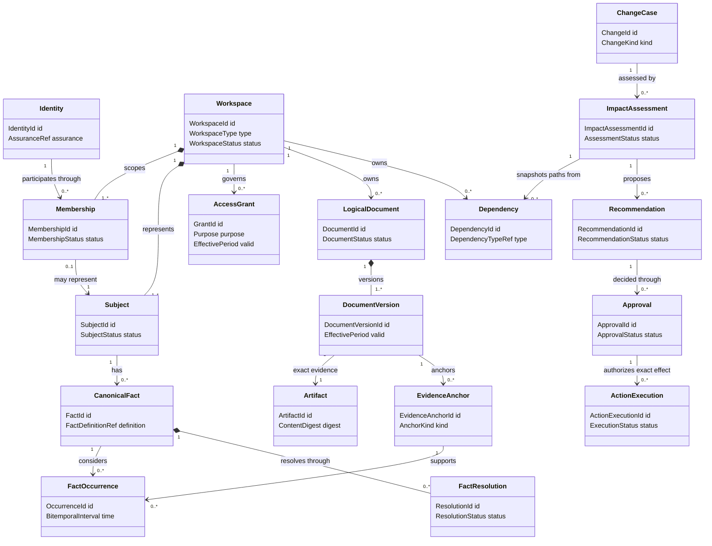
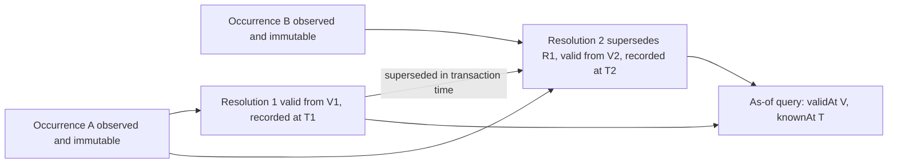
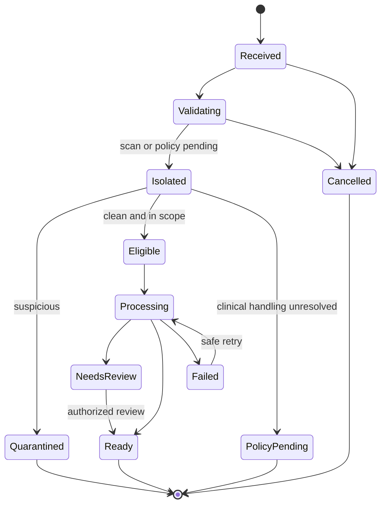
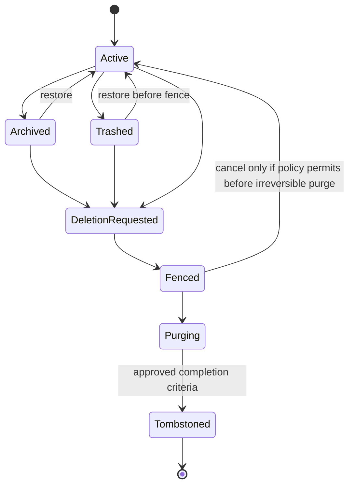
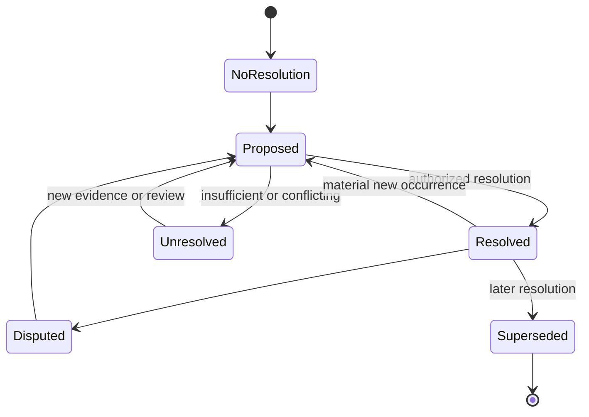
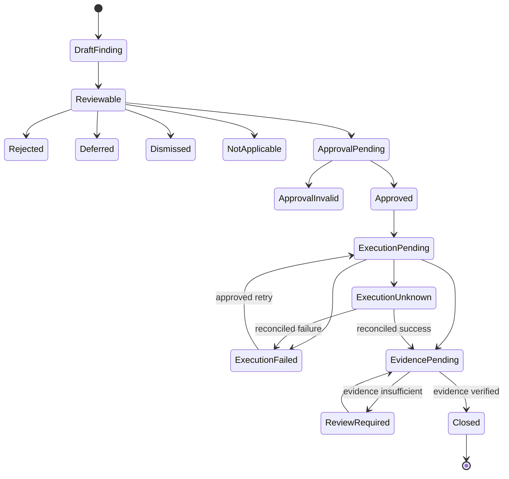

# Phase 1 Domain Model

| Field | Value |
|---|---|
| Document ID | `ARCH-DOM-001` |
| Version | `0.1` |
| Status | **DRAFT — not an approved implementation baseline or accepted data-model ADR** |
| Product phase | Phase 1 — Personal and Family, with Phase 2 extension points |
| Jurisdiction | Australia first; jurisdiction-neutral core |
| Updated | 26 August 2026 |
| Normative basis | Approved `DEC-001`–`DEC-011` and `DEC-020`–`DEC-024`; draft `PROD-PRD-001` |
| Companion | [`ARCH-SOL-001`](01-solution-architecture.md) |

## 1. Purpose, authority, and modelling boundary

This document defines Phase 1 domain language, identity and ownership boundaries, logical aggregates, invariants, temporal semantics, lifecycle ownership, dependency semantics, and the tensions between immutable evidence, deletion, and audit. Stable draft domain rules use `DOM-P1-*` IDs.

The hierarchy in [`CODEX.md`](../../CODEX.md) applies. Approved [decisions](../00-context/decision-register.md) outrank this draft. The [Phase 1 PRD](../01-product/02-phase-1-prd.md), [feature catalogue](../01-product/03-feature-catalogue.md), [use cases](../01-product/04-use-case-catalogue.md), and [personas/journeys](../01-product/05-personas-and-journeys.md) supply draft product behavior.

This is a logical domain model. It does not choose tables, collections, documents, graph stores, event-sourcing products, identifiers, ORMs, frameworks, service boundaries, or physical transactions. “Aggregate” means a consistency and write-ownership boundary, not necessarily one serialized object or database partition. Physical design and accepted ADRs remain future work.

## 2. Ubiquitous language

| Term | Domain meaning |
|---|---|
| Identity | A platform authentication principal reference. It is not a household subject, membership, owner, or permission by itself. |
| Workspace | The top-level household tenancy and policy boundary. Phase 1 permits PERSONAL and FAMILY; ORGANISATION is reserved. |
| Membership | An identity’s participation record in one workspace. It does not imply visibility of every resource. |
| Subject | A person or other represented party to whom documents, facts, obligations, or actions may relate. A subject may have no identity/account. |
| Relationship | An effective-dated descriptive link among subjects/entities. It may inform policy but is not authorization by itself. |
| Resource | A workspace-scoped protected domain object or derivative with stable identity and policy classification. |
| Access grant | An explicit purpose/resource/field/action/time-scoped authority record, separate from membership and subject relationship. |
| Artifact | Exact put-once bytes received or generated under a controlled workflow, plus integrity and acquisition provenance. |
| Logical document | The continuing semantic document identity that may have multiple immutable versions/artifacts. |
| Document version | One immutable evidence-bearing version of a logical document, with explicit effective/supersession state. |
| Evidence anchor | A stable reference to an exact artifact/document version and page/passage/coordinates/span, or an immutable governed-source snapshot segment. |
| Occurrence | An immutable assertion observed in evidence, manual entry, connector input, event, or source; it is not accepted truth by default. |
| Canonical fact | A stable fact identity whose accepted/effective values are produced by explicit resolution over occurrences. |
| Resolution event | An append-only decision accepting, correcting, disputing, superseding, or intentionally leaving a fact/rule unresolved. |
| Governed source | A versioned official/approved source definition with authority, jurisdiction, topic, coverage, retrieval, parser, freshness, and ownership metadata. |
| Source observation | An immutable snapshot or verifiable no-change result from a governed source. |
| Rule | A versioned, effective-dated actionable interpretation with applicability, evidence, review, and publication state; a source page alone is not a rule. |
| Dependency | A typed, directed, evidenced and authorized relationship used for navigation, reasoning, or impact. |
| Change | A durable, idempotent record that a fact, document, event, dependency, configuration, or rule materially changed. |
| Applicability | A decision about whether a rule/change concerns a specific jurisdiction, subject/resource, context, and effective period. |
| Impact assessment | A versioned snapshot of affected resources/paths and coverage limits for one change under specific policies/configuration. |
| Recommendation | A proposed consequence or next action backed by change, applicability, impact path, evidence, and uncertainty. |
| Approval | An authorized decision bound to exact reviewed inputs, target, effect, policy, actor, and expiry. It is not a reusable permission. |
| Action execution | A provider-neutral attempt to produce an approved effect, including unknown/partial/retry/reconciliation state. |
| Fulfilment evidence | Evidence evaluated against configured criteria to prove or reject completion; file presence alone is insufficient. |
| Deletion fence | An authoritative deny marker that prevents reads, new derivatives, late-event reactivation, export, or restore while purge progresses. |
| Tombstone | A minimized non-content record preserving identity-generation/deletion facts needed to prevent resurrection and reconcile audit. |

## 3. Stable domain rules

### 3.1 Identity, scope, and aggregate foundations

| Rule ID | Draft domain rule |
|---|---|
| `DOM-P1-001` | Identity, membership, workspace, subject, relationship, owner binding, and access grant MUST remain distinct domain concepts with distinct stable identities. |
| `DOM-P1-002` | Every household resource, derivative, workflow, event, and audit reference MUST be scoped to exactly one workspace, except explicitly global non-household reference/configuration records. |
| `DOM-P1-003` | A workspace-scoped resource MUST NOT reference or depend directly on a resource in another household workspace. Shared official reference records use a separate `ReferenceRef`; cross-workspace collaboration requires an explicit grant/import boundary. |
| `DOM-P1-004` | Canonical IDs MUST be opaque, immutable, non-recycled, and free of PII, provider identity, mutable type names, filenames, hashes, or business meaning. |
| `DOM-P1-005` | External/provider identifiers MUST be namespaced by integration/source and mapped to platform IDs; they MUST NOT replace platform identity or prove logical-document equality. |
| `DOM-P1-006` | Global reference-plane records MUST contain no household identifier or personalized content. A personalized source/connector result becomes workspace-scoped. |
| `DOM-P1-007` | PERSONAL, FAMILY, and reserved ORGANISATION are versioned workspace types. Phase 1 MUST NOT create or activate ORGANISATION workspaces. |
| `DOM-P1-008` | Only an aggregate’s logical write owner may validate and change its invariant-bearing state; other aggregates refer by stable ID/revision and communicate through commands/events. |
| `DOM-P1-009` | Every mutable aggregate MUST expose a monotonic revision or equivalent concurrency token. A stale command MUST fail or be explicitly reconciled; it cannot overwrite a later decision. |
| `DOM-P1-010` | An accepted aggregate transition and its required domain event/audit evidence MUST be durably correlated; a transition requiring downstream work cannot silently lose its trigger. |
| `DOM-P1-011` | Cross-aggregate workflows are explicitly pending/eventually convergent. No aggregate may claim another aggregate’s work, external effect, projection, export, or purge is complete from request submission alone. |
| `DOM-P1-012` | Search, semantic/vector, graph, comparison, readiness, conversation, and analytics projections are derived views, not aggregate roots or independent truth. |

### 3.2 Workspace, subjects, membership, and grants

| Rule ID | Draft domain rule |
|---|---|
| `DOM-P1-013` | An active workspace has one explicit owner binding. Ownership transfer, recovery, or succession MUST NOT create an observable state with no owner or concurrent unapproved owners. Final recovery/continuity behavior remains conditional. |
| `DOM-P1-014` | Membership and administrative role do not grant blanket resource, field, edge, search, answer, notification, export, deletion, or action access. |
| `DOM-P1-015` | A subject may exist without credentials, identity, email, or membership. Creating a managed dependant MUST NOT fabricate an account. |
| `DOM-P1-016` | A relationship describes context and effective time; it does not itself prove consent, legal authority, ownership, or access. |
| `DOM-P1-017` | An access grant binds grantor/authority, grantee, workspace, purpose, resource/field/action scope, valid time, policy version, and lifecycle. Expiry/revocation does not erase grant history. |
| `DOM-P1-018` | Membership administration, content access, consent, fact resolution, approval, export, deletion, and recovery are independent authorities. |

### 3.3 Documents, artifacts, ingestion, and evidence

| Rule ID | Draft domain rule |
|---|---|
| `DOM-P1-019` | Accepted original artifact bytes and their content digest/acquisition provenance are put-once. Reprocessing, preview, normalization, correction, versioning, archive, or restore MUST NOT mutate them. |
| `DOM-P1-020` | Artifact, acquisition attempt, logical document, and document version are distinct. Hash equality means byte equality only; logical identity requires an explicit decision. |
| `DOM-P1-021` | A document version references exactly one accepted source artifact (or an explicitly specified controlled generated artifact), a logical document, provenance, and version identity. Prior versions remain addressable until governed purge. |
| `DOM-P1-022` | Version, amendment, cancellation, effective, supersession, archive, trash, restore, and deletion transitions are additive and evidenced; invalid or ambiguous transitions route to review. |
| `DOM-P1-023` | An evidence anchor MUST identify the exact source kind, workspace/reference scope, artifact/document/snapshot version, page and passage/coordinates/span as applicable, and anchor schema version. |
| `DOM-P1-024` | Classification, extraction, comparison, summary, dependency proposal, and other derived analyses MUST retain their input references, processor/model/prompt/tool/schema versions, confidence, review state, transaction time, and supersession. |
| `DOM-P1-025` | Ingestion owns a truthful idempotent state machine. Unscanned, suspicious, suspected-clinical, cancelled, or deletion-fenced content cannot enter ordinary preview, extraction, search, graph, AI, or notification state. |

### 3.4 Facts, entities, rules, and time

| Rule ID | Draft domain rule |
|---|---|
| `DOM-P1-026` | A canonical fact is independent of every document, connector, manual, event, or source occurrence and is identified by workspace, subject/entity, and versioned fact definition. |
| `DOM-P1-027` | A fact/rule occurrence is immutable. Correction creates a new occurrence or resolution linked to the earlier record; it MUST NOT rewrite the observed evidence. |
| `DOM-P1-028` | Promotion, correction, dispute, tolerance, or supersession of a canonical value/rule is an explicit append-only resolution event with actor/workload, reason, evidence, confidence, policy/approval, and time. |
| `DOM-P1-029` | Consequential fact values, rules, relationships, and policies MUST preserve valid/effective time and platform transaction time using non-destructive bitemporal intervals. |
| `DOM-P1-030` | Overlapping, contradictory, stale, restricted, or insufficient occurrences remain represented. The model MUST support unresolved, resolved, disputed, and intentionally tolerated conflict without deleting evidence. |
| `DOM-P1-031` | Subject and resource-entity identity is independent of display name and source occurrence. Rename, merge proposal, split, or correction MUST preserve links and history and requires explicit policy. |
| `DOM-P1-032` | A rule definition/version is distinct from its source observation and from a workspace applicability result. Publication requires governed configuration/evidence; parsing alone cannot activate a consequential rule. |
| `DOM-P1-033` | A governed-source observation is immutable or a verifiable no-change record. Mutable source health—attempt, last success, freshness, parser failure, retry, disabled state—MUST be stored separately. |

### 3.5 Dependencies, requirements, change, and impact

| Rule ID | Draft domain rule |
|---|---|
| `DOM-P1-034` | Every dependency uses a versioned type definition with permitted source/target kinds, direction, cardinality, validity, and supersession rules. Untyped arbitrary edges are not active domain dependencies. |
| `DOM-P1-035` | An active dependency retains workspace/reference scope, endpoint revisions as needed, provenance/evidence, confidence, review state, valid/transaction time, creator, and supersession lineage. |
| `DOM-P1-036` | Dependency existence and traversal are protected resources. A graph projection cannot widen access or reveal a restricted node, edge, subject, value, count, snippet, or path. |
| `DOM-P1-037` | Traversal and impact paths MUST record cycles, depth/fan-out limits, stale edges, missing data, projection revision, and truncation. “No impact” is distinct from “no authorized or complete path found.” |
| `DOM-P1-038` | An expected-document requirement uses a versioned profile, context, jurisdiction, accepted alternatives, exception/waiver rules, effective period, evidence criteria, and applicability outcome. |
| `DOM-P1-039` | File receipt, extraction, evidence review, fact resolution, requirement applicability, fulfilment, approval, action execution, evidence verification, and closure are distinct states owned by distinct aggregates. |
| `DOM-P1-040` | A change is a stable idempotent domain record tied to one material source transition and its evidence/revision. Replayed or corrected changes supersede/reconcile explicitly rather than duplicating consequences. |
| `DOM-P1-041` | An impact assessment is a versioned snapshot of one change, applicability, authorized dependency paths, coverage limits, and separated severity, urgency, confidence, evidence strength, and source health. |
| `DOM-P1-042` | A recommendation is distinct from impact and action. It binds the observed change, applicability, impact path/evidence, affected resource, proposed effect, uncertainty, and approval requirement. |

### 3.6 Decisions, approvals, action, closure, tasks, and delivery

| Rule ID | Draft domain rule |
|---|---|
| `DOM-P1-043` | Approve, reject, edit, defer, dismiss, and mark-not-applicable are distinct recommendation decisions. Only an authorized approval may create an approval binding for a consequential effect. |
| `DOM-P1-044` | An approval binding includes exact input/resource revisions or digest, target/effect digest, actor, authority/grant, policy/config revision, consequence class, issue/expiry time, and supersession/revocation state. A material change invalidates it. |
| `DOM-P1-045` | An action execution is distinct from approval and uses a stable command/idempotency identity with requested, dispatched, unknown, partial, succeeded, failed, reconciled, and reversed/forward-repaired outcomes as supported. |
| `DOM-P1-046` | Recommendation/action closure requires the configured fulfilment or replacement evidence and an explicit verification decision. Time elapsed, submission, delivery, external acknowledgement, or file presence alone is not closure. |
| `DOM-P1-047` | A task retains causal recommendation/obligation/change, assignee/grant, due date, evidence requirement, state history, and policy. Notification delivery attempts are separate entities and cannot change task truth by themselves. |

### 3.7 Export, deletion, audit, configuration, and evolution

| Rule ID | Draft domain rule |
|---|---|
| `DOM-P1-048` | Archive, trash, account deletion, membership removal, resource deletion request, deletion fence, active purge, backup expiry, connector deletion, and audit minimization are distinct operations and states. |
| `DOM-P1-049` | A deletion case owns the authoritative fence and per-data-role purge acknowledgements/exceptions. Once active, the fence blocks reads, new derivatives, late events, exports, support, and restore regardless of projection lag. |
| `DOM-P1-050` | A tombstone retains only the minimum opaque identity/generation, workspace scope, deletion case, policy basis, transition time, and reconciliation data needed to prevent resurrection. It MUST NOT retain raw content, extracted values, filenames, or unnecessary content hashes. |
| `DOM-P1-051` | Audit preserves the fact and integrity of a consequential/security event using safe references. When referenced content is deleted, audit may retain a non-resolving/tombstoned reference but not a hidden copy of the deleted value; exact retention/minimization awaits `DEC-039`. |
| `DOM-P1-052` | Backup restore MUST apply deletion fences/tombstones and current policy before records become active. Backup residual and expiry are explicit until the approved deletion objective is met. |
| `DOM-P1-053` | An export case binds an authorization snapshot, scope, manifest schema, inclusions/exclusions, source revisions, integrity results, expiry, and job state. It does not transfer ownership or bypass another subject’s rights. |
| `DOM-P1-054` | An integration/consent record binds workspace, identity/grant, purpose, provider-neutral integration kind, external-ID namespace, permissions, consent/revocation time, processing/residency policy, cursor/state, and retained-data consequence. |
| `DOM-P1-055` | Consequential configuration is published as a versioned package with jurisdiction, effective time, evidence/source, owner, validation, review/approval, activation, supersession, rollback/repair, and impact/replay history. |
| `DOM-P1-056` | Phase 2 resource kinds and policy dimensions are reserved extensions. They MUST NOT alter Phase 1 IDs or activate organisation/records/hold/DLP/information-barrier behavior without future decisions and ADRs. |
| `DOM-P1-057` | Domain states or transitions governed by `DEC-031`–`DEC-040` remain conditional, inert, or policy-pending until approved; an implementation default cannot create a new product decision. |

## 4. Scope and ownership model

### 4.1 Domain scopes

| Scope | Examples | Boundary |
|---|---|---|
| Platform identity scope | Identity reference, authentication assurance, workload identity | May link to memberships but does not contain workspace resources or imply access. |
| Global reference/configuration scope | Jurisdiction definitions, public governed-source definitions/snapshots, document/fact/dependency type definitions, schemas | Contains no household identifier or personalized response. Publication is governed and versioned. |
| Workspace scope | Memberships, subjects, grants, documents, artifacts, occurrences, facts, entities, dependencies, subscriptions, findings, recommendations, tasks, exports, deletion cases, audit references | Exactly one `WorkspaceId` on every record and event; no direct cross-household resource reference. |
| External namespace | Connector/source item IDs and cursors | Namespaced mapping only; not canonical identity or ownership. |

### 4.2 High-level relationship model

The diagram omits many entities for readability and does not imply containment beyond marked composition. Authorization is not inferred from any association.

## 5. Aggregate catalogue

| Aggregate root | Owned entities/value objects | Consistency responsibility | Key references and emitted events |
|---|---|---|---|
| `Workspace` | Owner binding, memberships, subjects, effective-dated relationships, workspace type/status, jurisdiction/residency-profile reference | Exactly one active owner binding; permitted workspace type; subject without identity; auditable membership/relationship transitions | Identity refs, policy/config refs; emits workspace/membership/subject/relationship changes |
| `AccessGrant` | Grantee/grantor refs, purpose, resource/field/action scopes, valid period, invitation/link redemption, status/revocation | Grant scope cannot exceed grantor authority; time/purpose explicit; lifecycle additive | Workspace/resource/policy refs; emits grant activated/expired/revoked |
| `ArtifactRecord` | Put-once artifact metadata, digest, acquisition provenance, isolation/integrity state, storage/placement reference | Bytes/digest immutable; ordinary access forbidden while isolated; purge only via deletion case | Ingestion/deletion refs; emits artifact stored, integrity failed, isolated, purge acknowledged |
| `IngestionCase` | Acquisition attempts, idempotency, step attempts, validation/scan/clinical-policy/processing/review state, errors/retries | Monotonic truthful state; duplicate/out-of-order safety; no processing before eligible verdict | Artifact/document/analysis refs; emits stage/result events |
| `LogicalDocument` | Document versions, version ordering, effective/supersession/amendment/cancellation relations, archive/trash state | Logical identity distinct from bytes; no in-place version replacement; conformed-view inputs explicit | Artifact/evidence refs; emits version/lifecycle/material-change events |
| `DocumentAnalysis` | Analysis run, classification, structured fields, evidence anchors, processor provenance, review decisions, supersession | Inputs/outputs/version/review state immutable per run; review cannot approve facts/fulfilment | Document version/schema/capability refs; emits reviewed occurrence candidates |
| `ResourceEntity` | Stable property, vehicle, provider, policy, organisation or other household entity identity, names/aliases/status, merge/split proposals | Identity independent from name/source; merge/split explicit and reversible/traceable where allowed | Subject/evidence refs; emits entity changes |
| `CanonicalFact` | Fact identity, occurrence refs, bitemporal resolution events, conflict state | Occurrences preserved; accepted effective state derived only from valid resolution events; concurrency protects occurrence set | Subject/entity/fact-definition/evidence/approval refs; emits fact/conflict changes |
| `DependencyRecord` | Typed edge, endpoint refs/revisions, provenance, confidence/review, valid/transaction time, supersession | Type/endpoints valid; same workspace or approved global reference; no active edge without provenance | Node/evidence/type refs; emits dependency activated/superseded |
| `MonitoringSubscription` | Strategy, rule/source/resource scope, schedule/context, lifecycle, dedup/replay cursor | Subscription binds active rule/config version and workspace context | Rule/source/resource refs; emits triggers |
| `SourceObservation` | Immutable snapshot or no-change evidence, retrieval/parser provenance, observed time/hash/coverage | Observation cannot be overwritten; personalized response cannot be global | Governed source/parser refs; emits source observation |
| `SourceHealth` | Last attempt/success, freshness, error/parser state, retry/disabled status | Health updates do not replace observations or imply no change | Source refs; emits health changed |
| `RuleResolution` | Versioned rule text/structure, evidence/snapshot refs, applicability schema, effective/transaction time, publication resolution | Parser output alone inactive; publication additive and evidenced | Config/source refs; emits rule published/superseded |
| `RequirementCase` | Requirement profile/application, alternatives, exception/waiver, evidence submissions/verifications, fulfilment state | Applicability and fulfilment distinct; file/field presence not fulfilment | Subject/resource/rule/evidence/task refs; emits finding/fulfilment changes |
| `ChangeCase` | Change identity/kind, exact source transition/revision, evidence, reconciliation/supersession | One material source transition yields idempotent change identity | Fact/document/rule/event/config refs; emits impact requested |
| `ImpactAssessment` | Applicability, dependency-path snapshots, scoring dimensions, coverage/truncation, assessment revision/state | Applicability precedes impacts; dimensions remain separate; paths bind inspected revisions | Change/policy/source/dependency refs; emits recommendation candidates |
| `Recommendation` | Recommendation content, evidence/path refs, proposed effect, uncertainty, consequence class, decisions | Decisions distinct; actionable state requires evidence/applicability/path/approval policy | Impact/resource/actor refs; emits decision/approval request |
| `Approval` | Binding, actor/authority, decision, issued/expiry/revocation/supersession, audit correlation | Exact effect and inputs bound; material change or lost authority invalidates | Recommendation/policy/input refs; emits approval granted/invalidated |
| `ActionExecution` | Command/idempotency, target/effect, provider-neutral request/result, attempts, unknown/partial/reconcile/repair/reversal, closure evidence refs | Cannot dispatch without valid binding; execution not closure; retry cannot duplicate effect | Approval/adapter/evidence refs; emits execution/verification state |
| `Task` | Cause, assignee/grant, due date, evidence requirement, status history, snooze/reassignment | Task state independent from notification delivery and evidence verification | Recommendation/obligation/subject refs; emits task state/delivery request |
| `NotificationDelivery` | Recipient/grant/channel/template, dedup, preference/quiet decision, attempts/status | Cannot reveal content beyond current channel policy; delivery not task completion | Task/grant/policy refs; emits delivery outcome |
| `ConfigurationPackage` | Versioned definitions/schemas/rules/sources/workflows/policies/capabilities, validation, review/approval, effective period, publication/repair | Invalid/unapproved package inactive; prior versions retained; IDs not recycled | Evidence/approver refs; emits package published/superseded/replay requested |
| `ExportCase` | Authorized scope snapshot, categories, source revisions, exclusions, manifest, validation, staged artifacts, expiry | Completeness means approved envelope only; current authorization and third-party rights apply | Workspace/resources/artifacts/audit refs; emits export ready/failed/expired |
| `DeletionCase` | Scope, authority, cooling-off/policy state, authoritative fence, per-role purge/exception/backup/audit-minimization acknowledgements, tombstone | Fence precedes purge; no resurrection; completion follows approved criteria | Every affected resource/data-role ref; emits fence/purge/residual changes |

Audit records are an append-only control record stream rather than a household business aggregate. They are transactionally or durably correlated with protected aggregate transitions and have separate integrity/access/retention rules.

## 6. Identity and stable-reference model

### 6.1 ID classes

| ID class | Examples | Rule |
|---|---|---|
| Platform principal | `IdentityId`, `WorkloadId` | Globally opaque reference; no email/provider ID embedded. |
| Workspace aggregate/resource | `WorkspaceId`, `MembershipId`, `SubjectId`, `DocumentId`, `FactId`, `TaskId` | Stable for life of record; always accompanied by `WorkspaceId` outside its aggregate. |
| Immutable version/evidence | `ArtifactId`, `DocumentVersionId`, `EvidenceAnchorId`, `OccurrenceId`, `SourceObservationId` | Never repointed to different content/version. |
| Workflow/control | `IngestionCaseId`, `ChangeId`, `ImpactAssessmentId`, `ApprovalId`, `ActionExecutionId`, `ExportCaseId`, `DeletionCaseId` | Stable across retry; attempt IDs are separate children. |
| Configuration/reference | `FactDefinitionId`, `DependencyTypeId`, `RuleDefinitionId`, `SourceDefinitionId`, `SchemaId`, `PolicyId`, `CapabilityId` plus version | Stable semantic ID with immutable versions; retired IDs never reused. |
| External mapping | `IntegrationId` + provider namespace + external item/version ID | Scoped mapping only; may change/disappear without changing platform ID. |
| Delivery/dedup | `EventId`, `IdempotencyKey`, `CausationId`, `CorrelationId`, `AttemptId` | Not a resource ID or secret; uniqueness/retention scope defined by contract. |

### 6.2 Reference value objects

- `WorkspaceContext`: workspace ID/type/status, residency-profile reference, policy/config revisions.
- `ActorContext`: identity/workload, membership/grant, assurance, purpose, delegated scope and expiry.
- `ResourceRef`: workspace ID, resource kind, resource ID, optional exact revision/version.
- `ReferenceRef`: global reference kind, stable ID and exact version; never points at another household workspace.
- `ExternalRef`: integration/source namespace, external item ID, optional version/cursor and provenance.
- `AuthorizationScope`: resource/field/edge/action/purpose set and minimal-disclosure class.
- `ContentDigest`: algorithm/version and digest; evidence of byte equality, not identity or authorization.
- `IdempotencyContext`: key, command kind, actor/workspace scope, request/effect digest, expiry and prior result reference.

All value objects are immutable by value. Secrets, access tokens, signed URLs, raw document values, and model context are not IDs or domain value objects.

## 7. Bitemporal model

### 7.1 Two time axes

- **Valid/effective time** answers: “For what real-world period does this value, relationship, rule, or status claim to apply?”
- **Transaction time** answers: “When did the platform record or supersede this claim or decision?”

Use half-open intervals `[from, to)` where a bounded interval is required. An open end means “until superseded/ended,” not “verified forever.” Event occurrence, evidence observation, user-stated effective date, platform-recorded time, review time, and source publication/effective time remain separate fields.

### 7.2 Fact semantics

1. Occurrences may overlap and conflict; they are evidence, not canonical interval constraints.
2. A resolution event selects or describes an effective value/conflict state for a valid period and is append-only in transaction time.
3. A correction effective in the past appends a new resolution with its current transaction time; it does not rewrite what the system previously knew.
4. A query must specify or default both `validAt` and `knownAt`. “Current” means effective now under the latest non-superseded transaction view, not newest upload.
5. Policy may require one accepted canonical value for a point in valid time; where this cannot be established, the fact remains conflicted/unresolved rather than forcing non-overlap.
6. Restricted occurrences cannot influence a view shown to an unauthorized actor unless an approved minimal-disclosure/review-routing policy exists.

### 7.3 Rule and relationship semantics

Rules, relationships, memberships, grants, and policies use the same temporal vocabulary where consequences depend on historical applicability. Source observation time does not automatically equal rule effective time. A rule resolution binds the exact observation/evidence, parser/schema, reviewer/approval, jurisdiction, and effective interval. Replay evaluates the version and temporal perspective explicitly rather than silently applying today’s rule to yesterday’s event.

## 8. Evidence, provenance, and immutable semantics

### 8.1 Provenance envelope

An evidence-bearing or derived record references:

- workspace or global-reference scope;
- source kind and stable source/artifact/document/snapshot version ID;
- evidence anchor schema and location;
- acquisition/retrieval/observation time and external source identity where applicable;
- processor/parser/model/prompt/tool/schema/capability versions;
- confidence and review/resolution status;
- actor/workload, policy/approval and transaction time for consequential decisions; and
- supersession/reprocessing lineage.

### 8.2 Immutability does not mean permanent retention

An immutable artifact/occurrence/snapshot cannot be modified while retained. Controlled purge may remove it when an approved deletion case permits. After purge:

- no active content, derivative, model context, cache, export, or support copy remains accessible;
- domain references become inaccessible/tombstoned under policy rather than being silently repointed;
- prior conclusions may display that their source was deleted/unavailable without revealing the source value;
- audit retains only the approved safe fact of the transition; and
- restoration/replay cannot recreate the purged active record from a late event or backup.

## 9. Dependency and graph semantics

### 9.1 Authoritative dependency record versus projection

`DependencyRecord` is the authoritative typed relationship and provenance record. A graph database/index, if later selected, is a projection. Rebuilding or replacing it cannot change edge identity, validity, evidence, authorization classification, or supersession.

A dependency endpoint is either:

- a workspace `ResourceRef` within the same workspace; or
- an approved global `ReferenceRef` such as a governed rule/source definition.

It is never an unscoped display name, arbitrary URL, vector neighbor, inferred prompt text, or another household’s resource.

### 9.2 Edge definition

Each edge includes:

- `DependencyId` and exact type-definition version;
- directed `from` and `to` refs and optional endpoint revisions;
- purpose/semantic class and permitted cardinality;
- evidence/provenance and derivation method;
- confidence and review state;
- valid and transaction intervals;
- sensitivity/disclosure class and policy references;
- supersedes/superseded-by lineage; and
- lifecycle state.

An AI or deterministic rule may propose an edge, but activation follows the type’s validation/review policy.

### 9.3 Traversal and impact paths

Traversal evaluates current authorization per endpoint, protected field, edge and derived result. A returned `ImpactPath` is an assessment-time snapshot of the exact edge/resource/rule revisions and authorized evidence used. It records truncation, cycles, policy omissions and projection watermark so a later graph change does not rewrite the prior explanation.

Possible outcomes are separately represented:

- complete authorized path found;
- authorized path found but overall traversal incomplete;
- impact may exist but evidence/path is restricted under a minimal-disclosure policy;
- no applicable path found within declared coverage; and
- traversal unavailable/stale.

None is automatically equivalent to “no real-world impact.”

## 10. Lifecycle and state ownership

Exact status IDs belong in versioned reference data. The diagrams define conceptual transitions and owners.

### 10.1 Ingestion and document lifecycle

The `IngestionCase` owns processing state; `ArtifactRecord` owns isolation/integrity; `LogicalDocument` owns version/lifecycle. “Ready” means eligible derived processing state only—not fact acceptance, requirement fulfilment, action approval, or closure.

Document/archive state never mutates artifact bytes. `DEC-039` controls cooling-off, purge, backup and audit completion criteria.

### 10.2 Fact resolution

This is the state of a resolution view, not the lifecycle of occurrences. Occurrences remain immutable and may continue to support historical answers.

### 10.3 Recommendation, approval, action, and closure

The `Recommendation`, `Approval`, `ActionExecution`, and evidence-verification owner are separate aggregates even when presented as one journey. Material changes invalidate approval rather than moving the same approval back to pending.

### 10.4 State-ownership matrix

| State concern | Authoritative owner | Other components may do |
|---|---|---|
| Workspace/membership/subject/relationship | `Workspace` | Project views and request policy evaluation; not rewrite membership. |
| Purpose/time-scoped access | `AccessGrant` | Enforce/revoke/invalidate caches; not broaden scope. |
| Artifact integrity/isolation/purge acknowledgement | `ArtifactRecord` | Read through scoped grant; process only after eligible verdict. |
| Ingestion progress/retry/cancellation | `IngestionCase` | Execute a step and report attempt outcome. |
| Version/effective/supersession/archive/trash | `LogicalDocument` | Compare/project; not select a controlling version silently. |
| Derived extraction/review | `DocumentAnalysis` | Propose occurrences; not resolve facts. |
| Canonical fact/conflict | `CanonicalFact` | Provide evidence/impact; not overwrite resolution. |
| Dependency lifecycle | `DependencyRecord` | Project/traverse; not infer active edge without record. |
| Source observation | `SourceObservation` | Parse/derive under versioned run; never overwrite. |
| Source operational health | `SourceHealth` | Display/degrade downstream; not alter observation. |
| Rule publication | `RuleResolution` / `ConfigurationPackage` | Evaluate applicability; not activate parser output. |
| Requirement fulfilment | `RequirementCase` | Submit evidence/task; not mark satisfied by upload. |
| Material change identity | `ChangeCase` | Assess/replay; not create duplicate consequences. |
| Impact/applicability/coverage | `ImpactAssessment` | Present paths; not approve action. |
| Recommendation decision | `Recommendation` | Request approval/task; not execute. |
| Approval validity | `Approval` | Execution revalidates; cannot edit binding. |
| External/internal effect | `ActionExecution` | Reconcile/verify; not declare fulfilment itself. |
| Task work state | `Task` | Notification mirrors attention; delivery not completion. |
| Delivery attempt | `NotificationDelivery` | Update attempt status; not task truth. |
| Export completeness | `ExportCase` | Data owners contribute items/acknowledgements. |
| Deletion fence/purge completion | `DeletionCase` | Data owners acknowledge purge/residual; no one removes fence unilaterally. |
| Audit integrity | Audit capability | Aggregates append safe evidence; business state cannot edit audit history. |

## 11. Approval, action, and evidence model

### 11.1 Recommendation decision versus approval

A user response to a recommendation is a `RecommendationDecision`. Reject, defer, dismiss, and not-applicable close or postpone a proposal under their own rules; they do not create an approval. Edit produces a new recommendation revision/effect that requires fresh policy evaluation.

Approval requires:

- authorized actor/workload and valid grant/assurance;
- recommendation and exact revision;
- evidence, applicable rule/source and impact-assessment revisions;
- source resource/field revisions and a stable input digest;
- target, operation, proposed effect and effect digest;
- policy/configuration versions and consequence class;
- issue, expiry, revocation and supersession state; and
- privacy-safe audit correlation.

Any material change to these inputs invalidates or supersedes the binding. Model output, prior approval of a similar action, notification acknowledgement, or membership role cannot supply approval.

### 11.2 Action execution

`ActionExecution` records intent and reality separately:

1. requested under a valid binding;
2. dispatched to an internal handler or provider-neutral adapter;
3. acknowledged, rejected, timed out, or outcome unknown;
4. reconciled as failed, partial or succeeded;
5. retried, reversed, compensated, or forward-repaired where the action contract supports it; and
6. submitted for evidence verification.

Exactly-once external effect is never assumed. The action command includes an idempotency/reconciliation identity and immutable effect digest. An adapter’s “accepted” response is not proof of real-world completion.

### 11.3 Evidence and closure

`EvidenceSubmission` links exact replacement/fulfilment evidence to configured criteria. `EvidenceVerification` records verifier, evidence, criteria/rule version, outcome, confidence, reason, time, and authorization. Closure occurs only when the owning `RequirementCase` or recommendation workflow accepts the verification outcome. A later contradictory document may open a new change/finding without rewriting the prior closure history.

## 12. Deletion, tombstone, and audit tensions

### 12.1 Competing obligations

The model must simultaneously:

- preserve immutable original and decision history while retained;
- provide governed deletion and purge;
- prevent late jobs, projections and backup restores from resurrecting data;
- retain enough privacy-safe audit integrity to prove a deletion/security action occurred; and
- avoid turning audit, event logs, metrics, exports, backups or tombstones into hidden content stores.

`DEC-039` remains open on timing and retained-audit minimization, so this model defines states and invariants but no duration or legal-retention rule.

### 12.2 Deletion case

```mermaid
flowchart LR
    Request[Authorized deletion request]
    Scope[Scope and rights evaluation]
    Cooloff[Cooling-off / policy pending]
    Fence[Authoritative deletion fence]
    Purge[Per-role purge and acknowledgements]
    Residual[Backup / audit / exception residuals]
    Tombstone[Minimized tombstone]
    Complete[Completion under approved policy]

    Request --> Scope
    Scope --> Cooloff
    Cooloff --> Fence
    Fence --> Purge
    Purge --> Residual
    Residual --> Tombstone
    Tombstone --> Complete
```

The fence is consulted synchronously before active access even while physical purge is asynchronous. Each data owner reports one of: not applicable, pending, complete, retained by approved exception, failed/retry, or residual-until-date. Completion aggregates only under the approved policy.

### 12.3 Audit after deletion

An audit record may retain opaque deleted-resource/tombstone reference, event type, actor class, policy, authorization decision, outcome, time, correlation, and integrity evidence. It must not retain raw filename, document/fact value, evidence passage, unrestricted external ID, or content-bearing reason merely to make the old audit view convenient. Authorized audit views state that referenced content was deleted/unavailable.

If policy later requires erasing actor or target linkage, the audit design must preserve integrity using approved pseudonymization/redaction or cryptographic continuity without inventing retention behavior here.

## 13. Authorization implications of the model

Authorization can attach to:

- workspace, membership and subject;
- resource and exact version;
- fact definition, fact value, occurrence and evidence anchor;
- dependency edge and existence;
- operation, purpose and time;
- recommendation visibility, decision, approval, execution, verification and closure;
- task assignment versus evidence visibility;
- export category/item and deletion authority; and
- audit event or safe aggregate view.

Containment does not imply inherited read authority unless an active policy expressly says so. For example, document access need not reveal every extracted sensitive field; task authority need not reveal the protected evidence; family administration does not imply export/deletion authority; source-rule visibility does not reveal a restricted applicability input.

Every aggregate stores policy-relevant attributes and safe references, but authorization policy remains a versioned external domain capability rather than hard-coded aggregate role logic. Denied/restricted existence is not converted into “missing evidence” or “no relationship.”

## 14. Configuration and jurisdiction model

Versioned configuration defines at least:

- workspace, resource, relationship, role, permission and workflow types;
- document types, formats, extraction schemas and field sensitivity;
- fact/entity definitions and resolution/review policy;
- dependency node/edge types and traversal limits;
- requirement profiles, alternatives, exceptions and verification criteria;
- monitoring strategies/rules, source definitions, coverage and freshness;
- severity, urgency, confidence, applicability, evidence and state vocabularies;
- AI capabilities, schemas, tools, thresholds and fallback;
- notification templates/channels/policies; and
- jurisdiction packs and effective versions.

Configuration identifiers are jurisdiction-neutral. An Australia pack binds local terminology, document/rule/source definitions and scenarios through those contracts. `DEC-035` leaves the first public pack contents open; no type/source named in examples becomes enabled merely because the model can represent it.

## 15. Phase 2 extension model

The following are reserved types, not Phase 1 capabilities:

- organisation workspace, business unit and enterprise membership/identity-provider reference;
- client, matter, case, vendor, contract, policy, control and enterprise evidence resources;
- record declaration/classification, file plan, retention schedule/event, legal hold, custodian, disposition decision and destruction certificate;
- sensitivity label, DLP policy, information-barrier segment and residency policy;
- tenant administration, SSO/SCIM, cross-repository resource and enterprise connector administration.

Phase 2 may add new workspace/resource/policy kinds and constraints, but it must preserve existing workspace, subject, document, artifact, evidence, fact, dependency, rule, approval, action and audit IDs. Phase 1 UI and APIs offered to household actors do not enumerate or activate reserved types.

## 16. Open and proposed decisions

| Decision | Domain behavior deliberately unresolved | Model provision without closure |
|---|---|---|
| `DEC-030` | Final slice sequencing and launch profile | Aggregates have no slice-dependent identity; slice tags are traceability metadata only. |
| `DEC-031` | Enabled private-email/cloud import and external-action connectors | `Integration`, `ExternalRef`, consent and action-execution contracts are provider-neutral; no connector kind is enabled by default. |
| `DEC-032` | Automated emergency/incapacity/after-death release | Grants, subjects, evidence, challenge/approval and audit can support a future continuity case; no automatic release transition is active. |
| `DEC-033` | Complete export categories | `ExportCase` has versioned envelope/categories and explicit exclusions; “complete” awaits approved envelope. |
| `DEC-034` | Aggregate readiness/content-health score | Individual `RequirementCase`/finding state exists; aggregate score remains an optional derived projection with no canonical truth role. |
| `DEC-035` | First document types, schemas, requirement profiles and Australian sources | Config/package model supports them; none is hard-coded as launch-active. |
| `DEC-036` | Reject, quarantine-for-user-decision, or retain encrypted unprocessed suspected clinical content | `IngestionCase` and `ArtifactRecord` support an isolated `PolicyPending` branch that blocks ordinary processing; final retention transition is absent. |
| `DEC-037` | In-app/email/push commitments | Task and `NotificationDelivery` are separate; channel kinds are configured and no unapproved channel becomes required. |
| `DEC-038` | Recovery assurance, delay, challenge and support process | Identity/workspace owner binding and recovery case extension point exist; no support/relationship shortcut transfers ownership or access. |
| `DEC-039` | Cooling-off, active purge, backup expiry and retained-audit minimization | `DeletionCase`, fence, acknowledgements, residuals, tombstone and audit-redaction states exist without durations or completion claim. |
| `DEC-040` | Residency data classes/processors and cross-border exceptions | `DataPlacementPolicyRef` and processing-consent refs apply to every artifact/record/derivative/integration; no route is presumed approved. |

## 17. Requirement and feature traceability

### 17.1 Rule-family coverage

| Domain rules | Primary requirement coverage | Primary features/use cases |
|---|---|---|
| `DOM-P1-001`–`018` | `REQ-P1-WS-001`–`007`, `REQ-P1-SHR-001`–`005`, `REQ-P1-TRUST-002`, `008` | `FEAT-P1-001`, `002`, `023`–`025`, `030`; `UC-P1-001`, `009`, `013`, `015`–`017` |
| `DOM-P1-019`–`025` | `REQ-P1-DOC-001`–`008`, `REQ-P1-ING-001`–`008`, `REQ-P1-SRCH-005` | `FEAT-P1-003`–`005`, `008`, `009`, `015`; `UC-P1-002`, `003` |
| `DOM-P1-026`–`033` | `REQ-P1-FCT-001`–`006`, `REQ-P1-MON-002`–`005`, `REQ-P1-CFG-002`–`004` | `FEAT-P1-010`, `011`, `016`, `017`, `022`; `UC-P1-004`, `006`, `018` |
| `DOM-P1-034`–`042` | `REQ-P1-GPH-001`–`005`, `REQ-P1-MON-001`, `006`, `007`, `REQ-P1-HLT-001`–`005`, `REQ-P1-ACT-001`–`004` | `FEAT-P1-012`, `016`–`018`, `020`, `028`; `UC-P1-006`–`008` |
| `DOM-P1-043`–`047` | `REQ-P1-ACT-005`–`008`, `REQ-P1-NTF-001`–`004`, `REQ-P1-SHR-005` | `FEAT-P1-019`, `021`, `023`, `027`; `UC-P1-007`, `010` |
| `DOM-P1-048`–`055` | `REQ-P1-ING-009`, `REQ-P1-TRUST-003`–`009`, `REQ-P1-CFG-001`–`004` | `FEAT-P1-006`, `007`, `022`, `026`, `029`, `030`; `UC-P1-011`, `012`, `014`, `017`–`019` |
| `DOM-P1-056` | `REQ-P1-WS-001`, `REQ-P1-CFG-005` | `FEAT-P1-001`, `007`; Phase 2 reservation |
| `DOM-P1-057` | Conditional requirements affected by `DEC-031`–`DEC-040` | `FEAT-P1-025`–`030`; decision-dependent use cases and journeys |

### 17.2 Requirement-group ownership check

| Requirement group | Domain ownership |
|---|---|
| `REQ-P1-WS-*` | `Workspace`, `AccessGrant`, identity references and authorization attributes |
| `REQ-P1-DOC-*` | `ArtifactRecord`, `LogicalDocument`, `DocumentAnalysis`, deletion references |
| `REQ-P1-ING-*` | `IngestionCase`, `ArtifactRecord`, `DocumentAnalysis`, `Integration` |
| `REQ-P1-FCT-*` | `CanonicalFact`, occurrences/resolutions, `ResourceEntity`, evidence refs |
| `REQ-P1-GPH-*` | `DependencyRecord`, versioned type definitions, impact-path snapshots |
| `REQ-P1-SRCH-*` | Derived authorized projections over documents/evidence/facts/dependencies; no new truth aggregate |
| `REQ-P1-MON-*` | `MonitoringSubscription`, `SourceObservation`, `SourceHealth`, `RuleResolution`, configuration |
| `REQ-P1-HLT-*` | `RequirementCase`; optional readiness projection only |
| `REQ-P1-ACT-*` | `ChangeCase`, `ImpactAssessment`, `Recommendation`, `Approval`, `ActionExecution` |
| `REQ-P1-NTF-*` | `Task`, `NotificationDelivery`, configured preference/policy |
| `REQ-P1-SHR-*` | `AccessGrant`, `Workspace` membership/authority separation, impact-exists policy result |
| `REQ-P1-AI-*` | `DocumentAnalysis`/other derived results plus capability/provenance value objects; AI owns no approved truth |
| `REQ-P1-TRUST-*` | Workspace scoping, authorization attributes, audit refs, `ExportCase`, `DeletionCase`, placement/consent value objects |
| `REQ-P1-CFG-*` | `ConfigurationPackage`, reference definitions and publication/resolution history |

## 18. Model validation obligations

Before a physical data model or implementation ADR is accepted, fixtures and contract tests must prove:

1. every workspace resource/event/derivative has one valid workspace scope and no household cross-reference;
2. identity, membership, subject, relationship, grant and resource access remain distinct;
3. original bytes, occurrences, source observations and prior resolution/approval versions cannot be overwritten;
4. bitemporal fact/rule queries reproduce valid-at and known-at history, including backdated correction and conflict;
5. dependency type/endpoints/provenance validate, current authorization protects edge existence, and traversal terminates with explicit incompleteness;
6. ingestion retries/out-of-order events do not duplicate artifacts, versions, facts, actions, notifications, or purge effects;
7. approvals invalidate on material input/policy/authority change and cannot be created by model text;
8. closure requires verified configured evidence;
9. deletion fences block direct and derived reads, late events, rebuild and restore before physical convergence;
10. tombstone/audit/export schemas contain no prohibited content and behave under `DEC-039` branches;
11. configuration can load a second synthetic jurisdiction pack and reserved Phase 2 types without changing core IDs; and
12. all open-decision branches remain disabled or policy-pending rather than selecting a default.

No physical schema, persistence product, graph product, event transport, framework, or deployment topology may be inferred from this draft without an approved ADR.
