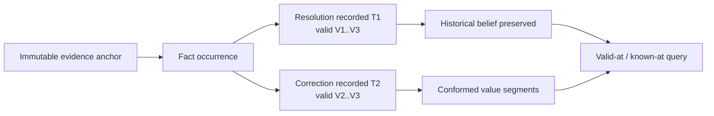
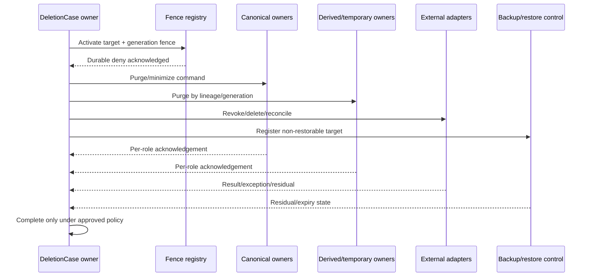

# Phase 1 Logical Data Model

| Field | Value |
|---|---|
| Document ID | `ARCH-DATA-001` |
| Version | `0.1` |
| Status | **DRAFT — architecture, security, privacy, and product-owner approval required** |
| Product phase | Phase 1 — Personal and Family, with Phase 2 extension points |
| Jurisdiction | Australia first; jurisdiction-neutral core |
| Updated | 26 August 2026 |
| Normative basis | Approved `DEC-001`–`DEC-011` and `DEC-020`–`DEC-024`; draft `PROD-PRD-001`, `ARCH-SOL-001`, `ARCH-DOM-001`, and security contracts |
| Proposed ADRs | [`ADR-ARCH-001`](06-adrs/ADR-001-bitemporal-fact-and-rule-history.md), [`ADR-ARCH-002`](06-adrs/ADR-002-immutable-originals-and-rebuildable-derivatives.md), [`ADR-ARCH-003`](06-adrs/ADR-003-current-authorization-for-derived-projections.md), [`ADR-ARCH-004`](06-adrs/ADR-004-durable-commands-events-and-eventual-consistency.md), [`ADR-ARCH-005`](06-adrs/ADR-005-provider-neutral-ports-and-residency-policy.md) |

## 1. Purpose, authority, and boundary

This document refines the aggregates and invariants in [`ARCH-DOM-001`](02-domain-model.md) into a storage-product-neutral logical data model. It defines logical entities, stable keys, tenant and reference scopes, temporal semantics, constraints, access-path abstractions, deletion lineage, and migration obligations. Stable draft rules use `DATA-P1-*` IDs.

The source-of-truth hierarchy in [`CODEX.md`](../../CODEX.md) applies. Approved entries in the [decision register](../00-context/decision-register.md) outrank this draft. The [Phase 1 PRD](../01-product/02-phase-1-prd.md), architecture/domain documents, and [`SEC-ARCH-001`](../06-security/01-security-architecture.md), [`SEC-AUTH-001`](../06-security/02-authorization-model.md), [`SEC-PRIV-001`](../06-security/03-privacy-and-data-governance.md), [`SEC-AUD-001`](../06-security/04-audit-and-provenance.md), and [`SEC-THR-001`](../06-security/05-threat-model.md) are draft inputs that must be reconciled before approval.

This is not a physical schema. Entity names do not mandate a table, collection, document, stream, graph, index, partition, database, or service. A logical entity may map to more than one physical structure; several logical entities may share one physical structure if ownership, scope, history, authorization, deletion, and compatibility guarantees remain intact. The five linked ADRs are `PROPOSED`, not accepted implementation authority.

This document deliberately does not select:

- storage, search, vector, graph, cache, queue, warehouse, backup, or audit products;
- identifier encoding, encryption implementation, partition count, replication topology, or physical index syntax;
- event sourcing, change-data-capture, ORM, migration framework, or transaction technology;
- cloud, processor, identity, key, AI/OCR, analytics, or observability providers; or
- retention, purge, backup-expiry, recovery, or cross-border durations left open by `DEC-038`–`DEC-040`.

## 2. Logical modelling conventions

### 2.1 Scope classes

| Scope class | Permitted contents | Required boundary |
|---|---|---|
| Platform identity scope | Opaque identity references, authentication-provider mappings, assurance references | Contains no household resource; authentication does not imply membership or access. |
| Global reference scope | Published jurisdiction-neutral definitions, jurisdiction packs, schemas, governed public-source definitions/snapshots | Contains no household ID or personalized result; publication is versioned and governed. |
| Workspace scope | Memberships, subjects, grants, documents, facts, dependencies, workflows, derivatives, exports, deletion state, safe audit references | Exactly one validated `WorkspaceId`; no direct reference to another household workspace. |
| External namespace | Provider/source item IDs, cursors, receipts, and reconciliation references | Namespaced by integration/source; never canonical ownership or identity. |
| Operational control scope | Privacy-safe health, migration, projection, deployment, and reconciliation state | Tenant references are opaque and access-controlled; raw household content is prohibited. |

### 2.2 Record classes

| Record class | Semantics |
|---|---|
| Aggregate record | Current command-side identity and lifecycle state owned by one logical aggregate. Prior decisions remain in additive history. |
| Immutable occurrence | Put-once evidence or observation received from a document, manual entry, connector, event, or governed source. |
| Resolution/publication event | Append-only decision accepting, correcting, disputing, superseding, or publishing a value/rule. |
| Bitemporal segment | Logical interpretation valid in a real-world interval and known to the platform during a transaction-time interval. |
| Derived projection | Rebuildable, versioned access path or materialized result sourced from retained authoritative records. |
| Workflow record | Durable state, attempts, idempotency, causation, and reconciliation for asynchronous or external work. |
| Fence/tombstone | Minimum authoritative deny/reconciliation state that prevents access or resurrection during and after purge. |
| Audit envelope | Privacy-safe, append-only evidence of a security or consequential request, decision, transition, or outcome. |

### 2.3 Time notation

- `occurred_at` is when an observation/event is asserted to have occurred; its source and uncertainty are retained.
- `valid_from` / `valid_to` describe when a value, relationship, or rule applies in the represented world.
- `recorded_at` is when the platform durably accepted a record.
- `superseding_recorded_at` is derived from the first valid superseding resolution/publication and defines transaction-time closure without rewriting the earlier occurrence.
- `effective_from` / `effective_to` describe publication or policy activation, not merely upload time.
- `created_at`, `updated_at`, or provider timestamps alone are insufficient for consequential history.
- Logical intervals are half-open: `[from, to)`. An absent `to` means open-ended under the relevant policy, not infinite retention.

## 3. Stable logical-data rules

### 3.1 Keys, tenancy, and ownership

| Rule ID | Draft logical-data rule |
|---|---|
| `DATA-P1-001` | This model defines logical identity, ownership, constraints, and access paths; it MUST NOT be interpreted as a mandated physical schema or product selection. |
| `DATA-P1-002` | Every household entity, derivative, workflow, event, and audit reference MUST carry exactly one validated `WorkspaceId`, including records whose physical placement or key can otherwise imply tenancy. |
| `DATA-P1-003` | Global reference-plane records MUST contain no household identifier, personalized input/output, grant, or content-derived household value. |
| `DATA-P1-004` | Platform IDs MUST be opaque, immutable, non-recycled, and independent of content, PII, display names, provider IDs, type names, and physical location. |
| `DATA-P1-005` | A workspace resource reference MUST include or resolve under both `WorkspaceId` and stable resource ID; a bare resource ID is insufficient at a trust boundary. |
| `DATA-P1-006` | External IDs MUST be namespaced by source/integration and mapped to platform IDs. They MUST NOT prove subject, document, fact, or resource equality by themselves. |
| `DATA-P1-007` | Every mutable aggregate MUST expose a monotonic revision or equivalent concurrency token and reject or explicitly reconcile stale writes. |
| `DATA-P1-008` | Each invariant-bearing entity has one logical write owner; another component MUST NOT directly change its lifecycle, resolution, approval, or deletion state. |
| `DATA-P1-009` | Required references MUST resolve to the declared entity kind, workspace/reference scope, compatible version, and permitted lifecycle state before a transition is accepted. |
| `DATA-P1-010` | A workspace record MUST NOT reference another household workspace. Collaboration uses an explicit grant/export/import boundary; public reference records use a `ReferenceRef`. |

### 3.2 Temporal, version, and history semantics

| Rule ID | Draft logical-data rule |
|---|---|
| `DATA-P1-011` | Consequential timestamps MUST record UTC instants plus the source timezone/calendar context required to reproduce a local legal, due-date, or user-facing interpretation. |
| `DATA-P1-012` | Facts, consequential rules, authority-bearing relationships, and policies MUST preserve valid/effective time independently from platform transaction time. |
| `DATA-P1-013` | Temporal intervals MUST use unambiguous half-open semantics and MUST reject invalid intervals where the end precedes or equals the start unless an explicit point-event type applies. |
| `DATA-P1-014` | Fact/rule occurrences, resolutions, publications, evidence observations, and consequential decisions MUST be append-only while retained; correction uses a linked new record. |
| `DATA-P1-015` | The data model MUST reproduce both “what applied at valid time V” and “what the platform knew at transaction time T,” including conflicts and backdated corrections. |
| `DATA-P1-016` | A retroactive correction MUST preserve the prior belief and its transaction-time visibility; it MUST NOT rewrite `recorded_at`, evidence, or prior resolution history. |
| `DATA-P1-017` | A source observation, parsed rule candidate, rule definition version, publication decision, and workspace applicability result MUST remain distinct records. |
| `DATA-P1-018` | Configuration and policy versions MUST carry publication, effective, supersession, review, and rollback/repair lineage; upload or validation alone cannot activate them. |
| `DATA-P1-019` | A historical decision, assessment, approval, export, or audit record MUST retain exact source/configuration/policy revisions or immutable digests sufficient to reconstruct its then-current basis. |
| `DATA-P1-020` | Clock source, observed skew, missing source time, and uncertain valid time MUST be representable; the platform MUST NOT fabricate precision needed for a consequential conclusion. |

### 3.3 Originals, evidence, and derived data

| Rule ID | Draft logical-data rule |
|---|---|
| `DATA-P1-021` | Accepted original bytes, integrity digest, acquisition provenance, immutable governed-source snapshots, and exact evidence anchors MUST NOT be changed in place while retained. |
| `DATA-P1-022` | Acquisition attempt, accepted artifact, logical document, and document version MUST have distinct identities. Byte equality is deduplication evidence, not logical-document identity. |
| `DATA-P1-023` | A document version MUST identify one logical document, exact accepted/generated artifact, version lineage, effective/supersession semantics, and evidence provenance. |
| `DATA-P1-024` | An evidence anchor MUST resolve to an exact retained artifact/document/snapshot version and page/passage/coordinates/span under a versioned anchor schema. |
| `DATA-P1-025` | Every derived result MUST identify all authoritative inputs and revisions, transform/parser/model/prompt/tool/schema versions, build time, confidence/review state, and supersession lineage. |
| `DATA-P1-026` | Search, semantic/vector, graph, comparison, readiness, conversation, analytics, and conformed-current views MUST remain rebuildable projections, never independent truth. |
| `DATA-P1-027` | A protected projection record MUST retain workspace, canonical source reference, disclosure class, policy/configuration reference or epoch, deletion generation, and purpose/capability scope needed for filtering. |
| `DATA-P1-028` | Every projection MUST expose source and deletion watermarks, generation/schema/transform versions, build coverage, lag, failure count, and repair state appropriate to its reads. |
| `DATA-P1-029` | Reprocessing MUST create a new immutable derived result and explicit active/supersession decision; it MUST NOT replace the original or erase a prior result’s provenance. |
| `DATA-P1-030` | Projection rebuild MUST create and validate a new generation before cutover, preserve current authorization/deletion fences, and make the retired generation inaccessible before purge. |

### 3.4 Relationships, workflows, and consistency

| Rule ID | Draft logical-data rule |
|---|---|
| `DATA-P1-031` | An active dependency MUST use a versioned type, valid endpoint kinds/direction/cardinality, exact endpoint scope, provenance, review state, valid/transaction time, and supersession lineage. |
| `DATA-P1-032` | File receipt, processing, document review, fact resolution, rule publication, applicability, impact, approval, execution, evidence verification, task completion, and closure MUST remain separately owned states. |
| `DATA-P1-033` | Domain events MUST have stable event and aggregate IDs, workspace, aggregate revision, schema version, occurred/recorded time, causation, correlation, and idempotency identity. |
| `DATA-P1-034` | Command and event deduplication state MUST be scoped to the operation/producer, workspace, and idempotency key for a declared retention window; a collision MUST NOT cross actors or tenants. |
| `DATA-P1-035` | An accepted canonical transition and its required event/audit publication MUST be durably coupled through an outbox or provider-neutral equivalent that makes loss detectable and repairable. |
| `DATA-P1-036` | Security- and consequence-relevant records MUST retain safe audit correlation; audit fields MUST use references/codes rather than copying content, values, filenames, prompts, or passages. |
| `DATA-P1-037` | External effects MUST retain command/effect digest, adapter/reconciliation identity, attempt history, timeout/unknown/partial result, retry policy, and repair/compensation evidence. |
| `DATA-P1-038` | A lineage edge MUST declare relationship type, exact source/target revisions, derivation, time, policy/classification, and deletion behavior; a generic untyped foreign reference is insufficient for evidence. |
| `DATA-P1-039` | State transitions MUST be validated against the owning versioned state machine and expected revision; invalid, duplicate, late, or reordered transitions are rejected or explicitly reconciled. |
| `DATA-P1-040` | A request, delivery acknowledgement, elapsed time, or downstream enqueue MUST NOT set another aggregate’s completion state; verified completion requires the owning aggregate’s evidence and transition. |

### 3.5 Privacy, deletion, restore, and migration

| Rule ID | Draft logical-data rule |
|---|---|
| `DATA-P1-041` | Every data entity/field and processing lineage MUST identify classification, purpose, subject/workspace scope, residency policy, retention rule/state, processor route, and accountable owner as applicable. |
| `DATA-P1-042` | An accepted deletion case MUST establish an authoritative target/generation fence before asynchronous purge; all reads, writes, replay, rebuild, export, connector, support, and restore paths MUST consult it. |
| `DATA-P1-043` | Purge completion MUST aggregate explicit per-data-role acknowledgements, not-applicable results, approved exceptions, failures, and declared residuals; missing acknowledgement is not success. |
| `DATA-P1-044` | A tombstone MUST retain only opaque identity/generation, workspace scope, deletion case/policy, transition time, and minimum reconciliation data; content and unnecessary reversible hashes are prohibited. |
| `DATA-P1-045` | Restore MUST apply current authorization, configuration, residency placement, deletion fences/tombstones, and audit continuity before any restored record or derivative becomes serviceable. |
| `DATA-P1-046` | Every canonical and projection schema MUST have a stable version and compatibility classification; unknown or incompatible versions fail closed rather than being guessed. |
| `DATA-P1-047` | Canonical migrations MUST be additive or use an explicit expand/validate/migrate/switch/retire sequence that preserves old-reader safety until the approved compatibility window closes. |
| `DATA-P1-048` | A canonical migration that changes interpretation MUST create traceable transformation lineage, validation evidence, affected-workspace scope, and rollback or forward-repair state without rewriting immutable evidence. |
| `DATA-P1-049` | Derived-store schema or transform migration SHOULD use deterministic rebuild from authoritative records; in-place derivative conversion MUST prove equivalent lineage, deletion, authorization, and rollback behavior. |
| `DATA-P1-050` | Migration and repair MUST be resumable, idempotent, workspace-isolated, residency-eligible, observable without content leakage, and reconciled by counts, identities, constraints, hashes where permitted, and sampled semantic checks. |

## 4. Logical relationship model

```mermaid
erDiagram
    IDENTITY_REF ||--o{ MEMBERSHIP : participates_through
    WORKSPACE ||--o{ MEMBERSHIP : contains
    WORKSPACE ||--o{ SUBJECT : represents
    SUBJECT ||--o{ SUBJECT_IDENTITY_LINK : may_link
    IDENTITY_REF ||--o{ SUBJECT_IDENTITY_LINK : authenticates
    SUBJECT ||--o{ SUBJECT_RELATIONSHIP : endpoint
    WORKSPACE ||--o{ ACCESS_GRANT : governs
    MEMBERSHIP ||--o{ ROLE_ASSIGNMENT : carries
    ACCESS_GRANT ||--|{ GRANT_SCOPE : limits

    WORKSPACE ||--o{ ARTIFACT_RECORD : scopes
    LOGICAL_DOCUMENT ||--|{ DOCUMENT_VERSION : versions
    ARTIFACT_RECORD ||--o{ DOCUMENT_VERSION : evidences
    DOCUMENT_VERSION ||--o{ EVIDENCE_ANCHOR : anchors
    DOCUMENT_VERSION ||--o{ DOCUMENT_ANALYSIS : derives

    SUBJECT ||--o{ CANONICAL_FACT : has
    CANONICAL_FACT ||--o{ FACT_OCCURRENCE : receives
    CANONICAL_FACT ||--o{ FACT_RESOLUTION : resolves
    EVIDENCE_ANCHOR ||--o{ FACT_OCCURRENCE : supports

    SOURCE_DEFINITION_VERSION ||--o{ SOURCE_OBSERVATION : observes
    SOURCE_OBSERVATION ||--o{ RULE_OCCURRENCE : proposes
    RULE_DEFINITION_VERSION ||--o{ RULE_PUBLICATION : publishes
    RULE_PUBLICATION ||--o{ APPLICABILITY_EVALUATION : evaluates

    DEPENDENCY_RECORD }o--|| RESOURCE_REF : from
    DEPENDENCY_RECORD }o--|| RESOURCE_REF : to
    CHANGE_CASE ||--o{ IMPACT_ASSESSMENT : assessed_by
    IMPACT_ASSESSMENT ||--o{ RECOMMENDATION : proposes
    RECOMMENDATION ||--o{ APPROVAL : may_require
    APPROVAL ||--o{ ACTION_EXECUTION : authorizes
    ACTION_EXECUTION ||--o{ EVIDENCE_VERIFICATION : closed_by

    WORKSPACE ||--o{ DELETION_CASE : owns
    DELETION_CASE ||--|{ DELETION_TARGET : fences
    DELETION_CASE ||--o{ PURGE_ACKNOWLEDGEMENT : reconciles
    DELETION_TARGET ||--o| TOMBSTONE : leaves
```

`RESOURCE_REF` is a typed logical reference, not an entity table. The graph projection is not shown as truth; `DependencyRecord` remains authoritative. Audit and projection lineage reference these entities without copying protected content.

## 5. Logical entity catalogue

### 5.1 Identity, workspace, and access plane

| Logical entity | Stable key | Scope/time | Required constraints |
|---|---|---|---|
| `IdentityRef` | `IdentityId` | Platform identity; lifecycle/current assurance refs | Distinct from subject and membership; no provider ID as key. |
| `ExternalIdentityMap` | `IdentityMapId` | Provider namespace + provider subject; effective/history | Unique active mapping within provider namespace; protected authentication data. |
| `Workspace` | `WorkspaceId` | Workspace; type/status/config/residency revisions | PERSONAL/FAMILY active in Phase 1; ORGANISATION reserved/inert. |
| `WorkspaceOwnerBinding` | `OwnerBindingId` | Workspace; valid and transaction time | Exactly one current effective owner binding; transfer/recovery conditional on `DEC-038`. |
| `Membership` | `MembershipId` | Workspace + identity; lifecycle/history | One current participation record per identity/workspace/policy class; not content authority. |
| `Subject` | `SubjectId` | Workspace; subject lifecycle | May exist without identity, credentials, contact detail, or membership. |
| `SubjectIdentityLink` | `SubjectIdentityLinkId` | Workspace; valid/transaction time | Evidence- and policy-backed association; changing it does not re-key subject history. |
| `SubjectRelationship` | `RelationshipId` | Workspace; valid/transaction time | Typed, effective-dated, evidenced; not authority by itself. |
| `RoleAssignment` | `RoleAssignmentId` | Workspace + membership; valid/effective/policy version | Role definition is versioned configuration; assignment grants only named administrative capabilities. |
| `AccessGrant` | `GrantId` | Workspace; valid time, issue/revoke/expiry history | Grantor/authority, grantee, purpose, policy, onward delegation and lifecycle required. |
| `GrantScope` | `GrantScopeId` | Child of grant; target/action/field/edge constraints | Typed positive/negative scope; no implicit graph expansion or bulk/export right. |
| `AuthorizationEpoch` | `(WorkspaceId, EpochKind)` | Workspace; monotonic control revision | Incremented by relevant policy/grant/security/deletion change; projection aid, never independent allow. |

### 5.2 Artifact, document, evidence, and derivative plane

| Logical entity | Stable key | Scope/time | Required constraints |
|---|---|---|---|
| `AcquisitionAttempt` | `AcquisitionId` | Workspace; attempt/receipt time | Route, actor/service, idempotency, source refs, outcome; retries remain visible. |
| `ArtifactRecord` | `ArtifactId` | Workspace; put-once acceptance/lifecycle | Immutable bytes reference, digest, media/size, provenance, isolation and deletion generation. |
| `LogicalDocument` | `DocumentId` | Workspace; aggregate revision/history | Continuing semantic identity; type/subject links do not replace policy. |
| `DocumentVersion` | `DocumentVersionId` | Workspace + document; effective/transaction time | Exact artifact link, lineage, version relation, archive/trash/supersession state. |
| `EvidenceAnchor` | `EvidenceAnchorId` | Workspace or global reference; immutable source revision | Exact version/snapshot plus bounded page/passage/coordinates/span and anchor schema. |
| `DocumentAnalysis` | `AnalysisId` | Workspace; processing transaction time | Input revision set, capability/schema/model versions, confidence, review/supersession. |
| `DerivedResult` | `DerivedResultId` | Workspace; build/supersession time | Typed output with lineage and no canonical truth authority. |
| `ProjectionRecordRef` | `(ProjectionKind, GenerationId, ProjectionRecordId)` | Workspace; generation/build time | Canonical source ref, policy/deletion epoch, transform version, no orphaned content. |
| `ProjectionWatermark` | `(ProjectionKind, PartitionRef, GenerationId)` | Operational/workspace partition | Source revision/event, deletion epoch, policy/config revision, lag/coverage/repair state. |

### 5.3 Facts, rules, sources, and temporal interpretation

| Logical entity | Stable key | Scope/time | Required constraints |
|---|---|---|---|
| `ResourceEntity` | `EntityId` | Workspace; identity/merge/split proposal history | Display names and occurrences are attributes/evidence, never identity. |
| `FactDefinitionVersion` | `(FactDefinitionId, Version)` | Global/reference configuration; effective/publication time | Value schema, subject/entity kinds, sensitivity, cardinality, resolution policy. |
| `CanonicalFact` | `FactId` | Workspace + subject/entity + definition instance | Stable fact identity independent of values and occurrences; aggregate revision. |
| `FactOccurrence` | `FactOccurrenceId` | Workspace; asserted valid time + recorded time | Immutable value assertion, source/evidence, derivation, confidence and review state. |
| `FactResolution` | `FactResolutionId` | Workspace; valid interval + recorded time | Append-only decision, actor/workload, reason code, evidence, policy/approval and supersession link. |
| `FactValueSegment` | `FactSegmentId` | Workspace; valid and transaction intervals | Rebuildable conformed view of resolutions; carries source resolution IDs and conflict state. |
| `SourceDefinitionVersion` | `(SourceDefinitionId, Version)` | Global/reference; publication/effective time | Authority tier, jurisdiction/topic/coverage, endpoint policy, parser/cadence/freshness ownership. |
| `SourceObservation` | `ObservationId` | Global reference or workspace-personalized; observed/recorded time | Immutable snapshot/no-change evidence, digest, retrieval route, source/parser version. |
| `SourceHealth` | `(SourceDefinitionId, HealthScopeId)` | Mutable operational/reference state | Last attempt/success, freshness, failure/retry/disabled; never overwrites observations. |
| `RuleDefinitionVersion` | `(RuleDefinitionId, Version)` | Global/reference configuration; effective/publication time | Jurisdiction, applicability schema, evidence/review/authority requirements. |
| `RuleOccurrence` | `RuleOccurrenceId` | Global reference or workspace; valid/recorded time | Immutable parsed/manual candidate linked to exact observation/evidence. |
| `RulePublication` | `RulePublicationId` | Reference/configuration; valid and transaction time | Append-only approved/rejected/corrected publication decision and supersession. |
| `ApplicabilityEvaluation` | `ApplicabilityId` | Workspace; assessment-time snapshot | Rule version, subject/resource/context, valid/known time, evidence, current source health, outcome, uncertainty and policy. |

### 5.4 Dependencies, monitoring, decisions, and action

| Logical entity | Stable key | Scope/time | Required constraints |
|---|---|---|---|
| `DependencyTypeVersion` | `(DependencyTypeId, Version)` | Global/reference configuration | Permitted endpoint kinds, direction, cardinality, traversal and review rules. |
| `DependencyRecord` | `DependencyId` | Workspace; valid/transaction time | Typed endpoints, provenance, confidence/review, disclosure class, supersession. |
| `MonitoringSubscription` | `SubscriptionId` | Workspace; active/effective lifecycle | Trigger strategy, exact rule/source/resource versions, cadence, owner, dedup state. |
| `RequirementProfileVersion` | `(RequirementProfileId, Version)` | Reference/configuration; effective time | Context, alternatives/exceptions, evidence and verification criteria. |
| `RequirementCase` | `RequirementCaseId` | Workspace; lifecycle/history | Applicability, expected evidence, waiver/alternative, fulfilment verification; upload is not fulfilment. |
| `ChangeCase` | `ChangeId` | Workspace; occurrence/recorded time | One material source transition/revision and idempotency identity. |
| `ImpactAssessment` | `ImpactAssessmentId` | Workspace; immutable assessment snapshot | Change/rule/applicability/path revisions, coverage/truncation, separated scores. |
| `Recommendation` | `RecommendationId` | Workspace; revision/disposition history | Proposed effect, evidence/path, uncertainty, approval class; distinct from execution. |
| `Approval` | `ApprovalId` | Workspace; issue/expiry/revoke time | Exact input/effect digest, actor/authority, target, policy/config version; non-reusable. |
| `ActionExecution` | `ActionExecutionId` | Workspace; attempt/reconciliation history | Stable command/effect/idempotency identity and truthful unknown/partial/result states. |
| `EvidenceSubmission` | `EvidenceSubmissionId` | Workspace; submission time | Exact evidence/version plus declared criterion; no automatic closure. |
| `EvidenceVerification` | `EvidenceVerificationId` | Workspace; decision/transaction time | Criteria/rule version, verifier, evidence refs, result/confidence/reason. |
| `Task` | `TaskId` | Workspace; state/due history | Causal source, assignee/grant, evidence requirement, workflow version. |
| `NotificationDelivery` | `NotificationDeliveryId` | Workspace; attempt/delivery/ack time | Recipient/channel policy, minimum content class, dedup/retry; never changes task truth. |

### 5.5 Configuration, integration, lifecycle, and control

| Logical entity | Stable key | Scope/time | Required constraints |
|---|---|---|---|
| `ConfigurationPackage` | `(PackageId, Version)` | Global/reference or scoped policy; publication/effective time | Jurisdiction, evidence/source, owner, validation, approval, activation, supersession and repair. |
| `Integration` | `IntegrationId` | Workspace; consent/connect/disconnect lifecycle | Provider-neutral kind, external namespace, scopes, cursor, purpose, placement and deletion policy. |
| `ConsentRecord` | `ConsentId` | Workspace or identity-processing scope; valid/transaction time | Purpose, processor/channel, data classes, notice version, issue/withdrawal and retained-data consequence. |
| `ExportCase` | `ExportCaseId` | Workspace; authorization snapshot and workflow time | Versioned envelope, expected/included/excluded manifest, checksums, expiry and temp deletion. |
| `DeletionCase` | `DeletionCaseId` | Workspace; request/policy/fence/completion lifecycle | Exact authority/scope, target generation, policy, cancellation/residual state; timing waits on `DEC-039`. |
| `DeletionTarget` | `DeletionTargetId` | Workspace; fence-effective time | Resource/data-role target, generation and fence status; immutable target scope after activation. |
| `PurgeAcknowledgement` | `PurgeAckId` | Workspace + deletion case/data role | Pending/complete/not-applicable/exception/failure/residual, evidence and reconciliation revision. |
| `Tombstone` | `TombstoneId` | Workspace; post-purge reconciliation lifetime | Minimum non-content deleted identity/generation and policy reference only. |
| `BackupResidual` | `BackupResidualId` | Workspace/control scope; backup generation/expiry state | Data-role/generation, inaccessible state, declared expiry/exception and restore gate evidence. |
| `DomainEvent` | `EventId` | Workspace or reference; occurred/recorded time | Aggregate/revision, schema, causation/correlation/idempotency and privacy classification. |
| `OutboxPublication` | `PublicationId` | Same scope as transition; durable publish lifecycle | Event payload reference/digest, attempts, acknowledgement and repair; no raw duplicated content by default. |
| `AuditEnvelope` | `AuditEventId` | Workspace/reference/privileged scope; append-only | Conforms to `SEC-AUD-001`; safe refs/codes, integrity, classification, retention/residency profile. |

### 5.6 Specialist contract supporting records

The completed document-intelligence contracts refine the aggregates above with these logical child, value, configuration, proposal, run, and projection records. They do not create additional write owners where their owning aggregate is named.

| Logical record | Stable key/reference | Scope/time | Required constraint and specialist owner |
|---|---|---|---|
| `TaxonomyRelease` | `(TaxonomyReleaseId, Version)` | Global/reference; publication/effective time | Immutable compatible profile set; taxonomy contract owns publication. |
| `DocumentTypeProfile` | `(DocumentTypeId, ProfileVersion)` | Global/reference; valid/transaction time | Immutable classification/applicability/sensitivity/processing/lifecycle configuration. |
| `SupportedFormatProfile` | `(FormatProfileId, Version)` | Global/reference; effective time | Validation/preview/extraction/OCR/unsupported behavior; no format hard-coded in data access. |
| `IngestionCase` | `IngestionCaseId` | Workspace; workflow revision/history | Owns receipt-through-ready/cancel/purge interaction state; accepted bytes remain `ArtifactRecord` authority. |
| `SafetyAssessment` | `SafetyAssessmentId` | Workspace; additive verdict history | Restricted child result for validation, malware, unsupported, and suspected-clinical policy; never ordinary document metadata. |
| `StageRun` | `StageRunId` | Workspace; immutable attempt time | Exact processing contract/input generation/attempt; retry appends another run. |
| `PublicationCheckpoint` | `PublicationCheckpointId` | Workspace; target/generation/watermark time | Required derived target acknowledgement/failure/repair owned by ingestion workflow. |
| `ExtractionSchema` | `(ExtractionSchemaId, Version)` | Global/reference; publication/effective time | Immutable typed field/evidence/review/privacy contract. |
| `ExtractionRun` | `ExtractionRunId` | Workspace; immutable execution time | One capability execution over exact inputs/configuration; corresponds to a `StageRun`. |
| `ExtractionResultSet` | `ExtractionResultSetId` | Workspace; immutable generation | Validated structured output contained by `DocumentAnalysis`; not fact truth. |
| `FieldResult` | `FieldResultId` | Workspace; immutable proposal plus additive review lineage | Stable schema field/occurrence identity, source form, normalized proposal, evidence and confidence. |
| `ReviewDecision` | `ReviewDecisionId` | Workspace; append-only transaction time | Human/policy decision over exact result revision; cannot mutate provider output or resolve a fact implicitly. |
| `DerivedOccurrenceProposal` | `OccurrenceProposalId` | Workspace; immutable derivation time | Proposed fact/entity/obligation occurrence from reviewed extraction; downstream owner validates activation. |
| `ActiveInterpretationReference` | `InterpretationReferenceId` | Workspace; revisioned purpose-specific pointer | Selects one retained analysis generation for one named use without rewriting any result. |
| `EntityIdentityProposal` | `EntityIdentityProposalId` | Workspace; immutable proposal/review history | Candidate create/link/merge/split/correction with exact evidence/method/calibration; cannot mutate `ResourceEntity`. |
| `DependencyNodeTypeVersion` | `(DependencyNodeTypeId, Version)` | Global/reference; publication/effective time | Constrains references to existing resource/reference identities and endpoint roles. |
| `DependencyProposal` | `DependencyProposalId` | Workspace; immutable derivation/review time | Candidate typed edge with evidence/method/confidence; not an active dependency. |
| `GraphProjectionGeneration` | `GraphGenerationId` | Workspace partition/control; build/cutover time | Rebuildable `DependencyRecord` representation with policy/deletion/source watermarks. |
| `ImpactPath` | `ImpactPathId` | Workspace; immutable assessment-time snapshot | Exact endpoint/edge/type/evidence revisions plus authorization, limits, omissions, cycles and watermark. |
| `MonitoringRuleVersion` | `(MonitoringRuleId, Version)` | Reference/configuration; valid/effective/publication time | Immutable trigger/materiality/applicability/change-identity contract. |
| `TriggerOccurrence` | `TriggerOccurrenceId` | Workspace or reference input; immutable occurrence time | Evidence that a condition was offered for evaluation; not change/applicability/impact truth. |
| `MonitoringRun` | `MonitoringRunId` | Workspace; immutable/revisioned workflow attempt | Binds subscription/rule/trigger/input/policy/output and retry/replay lineage. |
| `SourceEndpointVersion` | `(SourceEndpointId, Version)` | Global/reference; publication/effective time | Governed destination/retrieval/network/content contract; raw URL is not authority. |
| `SourceCoverageManifestVersion` | `(CoverageManifestId, Version)` | Global/reference; valid/publication time | Positive and negative scope/gap declaration for source coverage. |
| `SourceParserDefinitionVersion` | `(SourceParserDefinitionId, Version)` | Global/reference; publication/effective time | Immutable input/output/coverage/failure/replay contract. |
| `SourceRetrievalAttempt` | `SourceRetrievalAttemptId` | Reference or isolated workspace scope; immutable attempt time | Request/route/result/error evidence without unrestricted response content in metadata. |
| `SourceParseRun` | `SourceParseRunId` | Same scope as observation; immutable execution time | Exact observation/parser/tool/schema/coverage/failure lineage; cannot publish a rule. |
| `RecommendationDecision` | `RecommendationDecisionId` | Workspace; append-only decision time | Approve-request/reject/edit/defer/dismiss/not-applicable disposition; only the approval owner creates `Approval`. |
| `HealthEvaluation` | `HealthEvaluationId` | Workspace; immutable evaluation generation | Profile/case/context/evidence/source-health/policy findings, coverage and prior lineage. |
| `EvidenceOptionVersion` | `(EvidenceOptionId, Version)` | Reference/configuration; valid/effective time | Immutable primary/alternative evidence and verification criteria. |
| `ExceptionOrWaiverRequest` | `ExceptionRequestId` | Workspace; additive request/review history | Request under an explicit profile rule; never an exception or fulfilment by itself. |
| `ReadinessProjection` | `ReadinessProjectionId` | Workspace; rebuildable evaluation generation | Optional permission-safe aggregate signal only after `DEC-034`; never compliance or canonical truth. |
| `DocumentRelationship` | `DocumentRelationshipId` | Workspace; valid/transaction time | Immutable typed version/amendment/addendum/cancellation/supersession assertion/decision owned by `LogicalDocument`. |
| `ConformedViewEvaluation` | `ConformedViewEvaluationId` | Workspace; immutable temporal evaluation | Derived exact-version/relationship view with conflicts, restrictions, coverage and evidence. |
| `DocumentComparison` | `DocumentComparisonId` | Workspace; immutable ordered-pair evaluation | Exact version pair, algorithm/policy, evidence, differences, coverage and uncertainty. |
| `ObligationOccurrence` | `ObligationOccurrenceId` | Workspace; immutable evidence occurrence | Exact clause/version proposal; not a fact, applicable requirement, fulfilment, approval or closure. |

The specialist contracts own field envelopes and state vocabularies; `DATA-P1-*` continues to own workspace, identity, time, immutability, lineage, authorization, deletion, and migration invariants.

## 6. Key, uniqueness, and referential constraints

### 6.1 Canonical identity constraints

1. A canonical ID is globally non-recycled, but every workspace access still predicates on `WorkspaceId`; global uniqueness is not a tenancy control.
2. `WorkspaceOwnerBinding` has at most one current effective owner after policy evaluation. A proposed transfer may coexist as pending but cannot create two effective owners.
3. A current `Membership` is unique for the configured identity/workspace participation class. Invitation history remains separate or additive.
4. `SubjectIdentityLink` does not collapse either ID. A managed dependant’s later identity links to the existing subject and history.
5. `DocumentVersion` has one source artifact and one logical document. A display sequence may be unique within the logical document but is not the stable key.
6. `CanonicalFact` uniqueness uses workspace, subject/entity, fact-definition version family, and a definition-governed opaque instance discriminator. The fact value is never part of identity.
7. `DependencyRecord` identity is not inferred by equal endpoints. Duplicate proposals reconcile under the type/version policy while preserving occurrence evidence.
8. Event, command, action, notification, export, and purge idempotency keys are scoped to their producer/operation/workspace and cannot be reused as global natural keys.

### 6.2 Referential constraints

- A workspace resource reference resolves only when both workspace and resource generation match.
- A reference to a versioned definition records the exact version used; “latest” may be a query instruction but is not stored as historical evidence.
- Evidence anchors never silently repoint when a new document version, OCR result, or parser appears.
- Approval references exact recommendation/input/effect/policy revisions; a changed digest invalidates it.
- A projection record without a valid canonical source, lineage, workspace, deletion generation, or transform version is quarantined from reads.
- Deletion-fenced targets reject new child records and late events except deletion reconciliation/audit records expressly permitted by policy.
- References to purged records become policy-safe unresolved/tombstoned references; they do not redirect to another resource.

## 7. Bitemporal fact and rule model

### 7.1 Fact interpretation



A fact query supplies:

- `WorkspaceId` and authorized subject/entity/fact scope;
- valid-time instant or interval;
- transaction-time instant (`known_at`), defaulting to current platform knowledge only when explicitly requested;
- configuration/policy revision or declared current-policy evaluation; and
- conflict/incompleteness behavior.

An eligible resolution has `recorded_at <= known_at`, no earlier eligible superseding decision recorded by `known_at`, and a valid interval containing the requested valid time. When competing eligible resolutions or unresolved occurrences exist, the result carries conflict/uncertainty; it does not select by latest timestamp alone.

### 7.2 Rule interpretation

Rule evaluation requires all of:

1. an exact governed source observation or approved manual/configuration evidence;
2. a versioned rule definition and immutable rule occurrence/candidate;
3. an authorized publication/resolution with valid and transaction time;
4. an enabled jurisdiction/configuration package at the evaluated time;
5. a workspace applicability result for the exact subject/resource/context and period; and
6. current source-health/coverage disclosure appropriate to the result.

Source freshness can affect whether a recommendation is safe to present, but it does not rewrite the historical rule publication or observation. `SourceHealth` is mutable operational state; `SourceObservation` and publication history are additive evidence.

### 7.3 Required temporal scenarios

The conformance suite must reproduce:

- a value effective before it was first recorded;
- a later-discovered backdated correction;
- overlapping contradictory occurrences with no resolution;
- a resolution later disputed or superseded;
- a future-dated rule published now, later corrected before effective date;
- a source observation parsed under two parser versions;
- a rule that was published but non-applicable to a workspace at the evaluated time; and
- deletion of evidence while retained safe history truthfully reports an unavailable/tombstoned source.

## 8. Derived-store and logical access-path abstractions

“Index” below means a required access path and conformance behavior, not a physical index product.

| Access-path abstraction | Logical lookup/order | Required guard and freshness behavior |
|---|---|---|
| Resource identity | `WorkspaceId + ResourceKind + ResourceId` | Workspace/deletion/state check precedes return. |
| Membership/participation | `IdentityId + WorkspaceId + membership state/effective time` | Authentication is resolved separately; no content allow is returned. |
| Subject context | `WorkspaceId + SubjectId/relationship type/effective time` | Relationship existence is protected; no authority inferred. |
| Grant evaluation | `WorkspaceId + grantee + purpose + action + target/field/edge + valid time` | Explicit deny/fence/expiry/revocation precedes bounded allow; policy version returned. |
| Document browse | `WorkspaceId + authorized subject/entity/type/status/effective/version` | Counts/facets/snippets use current policy and safe disclosure classes. |
| Evidence resolution | `WorkspaceId/reference scope + anchor + exact source version` | Reauthorize source/field on redemption; deleted/restricted anchor fails safely. |
| Fact temporal query | `WorkspaceId + subject/entity + definition + valid_at + known_at` | Conflict and evidence accessibility remain explicit. |
| Dependency traversal | `WorkspaceId + authorized endpoint + edge type/direction + valid time` | Each node/edge/result authorized; cycles, fan-out, depth, staleness and truncation reported. |
| Text/semantic candidates | `WorkspaceId + query capability + source revision` | Index labels are filters only; candidate/snippet/citation reauthorized against current policy/fence. |
| Workflow/idempotency | `WorkspaceId + workflow/command/event key + revision/state` | Duplicate/out-of-order attempts converge without hiding attempt evidence. |
| Scheduled work | `next_attempt_at + capability/partition + state` | Lease/claim does not authorize content; worker reauthorizes at execution. |
| Projection freshness | `projection kind + partition/generation + watermark` | Reads compare source/policy/deletion requirements and return current, bounded-partial, stale, or unavailable. |
| Deletion fence | `WorkspaceId + target kind/id/generation` | Must be reachable synchronously by every active/restore/rebuild path; missing certainty denies. |
| Audit/correlation | `WorkspaceId + event type/time/correlation/target ref` | Audit-read policy filters fields and target existence; ordinary telemetry stays content-free. |

### 8.1 Projection generations

A projection generation records its source schema range, transform version, build start/end, high-watermarks, policy/deletion epoch, expected/actual counts, validation outcome, and availability state. Cutover is permitted only after:

- all included workspace partitions pass scope and referential validation;
- deleted generations/targets are absent and current fences are applied;
- authorization negative fixtures pass against the new generation;
- content/lineage counts reconcile within explained categories;
- stale/partial behavior is configured and observable; and
- rollback points to a still-policy-safe prior generation, never to one containing prohibited data.

## 9. Deletion lineage and non-resurrection

### 9.1 Lineage roles

| Data role | Examples | Required deletion response |
|---|---|---|
| Canonical aggregate | Document, fact, dependency, task, grant | Fence active reads/writes; purge or retain only approved minimized state. |
| Immutable evidence | Original artifact, occurrence, source snapshot | Purge only through governed case; preserve no hidden content copy. |
| Derived projection | Search/vector/graph/comparison/readiness/conversation | Remove by lineage and prevent rebuild from fenced source. |
| Temporary/output | Preview, upload part, export package, processing scratch | Expire/purge and acknowledge; signed access becomes invalid. |
| External processor/connector | Submitted payload, imported copy, provider command | Invoke contract deletion/revocation and retain reconciliation evidence only. |
| Telemetry/analytics | Pseudonymous safe events, control metrics | Apply retention/deletion class; never rely on “de-identified” as an automatic exemption. |
| Audit/provenance | Safe event and lineage references | Minimize/redact/tombstone under `DEC-039`; do not retain source content. |
| Replica/backup/DR | Copies and generations | Deny service/restore, retain declared residual, expire under approved objective and residency. |

### 9.2 Deletion sequence



`DEC-039` leaves cooling-off, active purge, backup expiry, and audit minimization durations unset. `DEC-040` leaves the placement of deletion evidence and backups unset. The logical states and denial behavior are required; no duration or total-erasure promise is inferred.

### 9.3 Restore and late-event fence

Before restore/replay, each record is checked against workspace status, target/generation tombstones, current configuration, policy epoch, residency route, and schema compatibility. A late event for a deleted generation becomes an auditable discarded/reconciled outcome. It cannot recreate a new ID to evade the tombstone. A replacement resource after deletion receives a new generation and explicit user/domain decision; equality of name, external ID, or bytes does not revive the deleted identity.

## 10. Migration and schema-evolution implications

### 10.1 Compatibility classes

| Class | Meaning | Required treatment |
|---|---|---|
| Additive compatible | Optional field/type/version understood as ignorable by older readers | Validate defaults/absence semantics and privacy classification before publication. |
| Read-compatible/write-gated | New writers emit a version old readers can safely ignore or reject | Gate writer rollout until all consumers prove bounded behavior. |
| Transform required | Existing canonical records need an explicit derivation or state transition | Versioned, resumable migration with lineage, reconciliation and repair. |
| Projection rebuild | Derived schema/transform changes without canonical meaning change | Build new generation from retained authority; validate before cutover. |
| Breaking contract | Identity, scope, semantics, deletion, authorization, or temporal meaning changes | New contract version and approved ADR/decision; no silent in-place reinterpretation. |

### 10.2 Canonical migration sequence

1. Publish the new schema and compatibility classification without activating new semantics.
2. Validate reference-data, security/privacy classification, residency, deletion, and old/new reader behavior.
3. Add storage/contract capacity while preserving the old representation.
4. Backfill or derive by workspace-isolated, resumable, idempotent jobs with explicit source/target revisions.
5. Reconcile identities, counts, constraints, temporal queries, hashes where allowed, audit links, and negative authorization cases.
6. Switch reads/writes through a versioned gate with rollback or forward-repair criteria.
7. Retire the old representation only after the compatibility window, deletion policy, restore tests, and audit evidence permit it.

An immutable occurrence, original, source snapshot, audit event, resolution, approval, or action outcome is never rewritten to “look native” to the new version. A normalized representation is a new derived/canonical version with traceable lineage.

### 10.3 Migration failure and recovery

- A partial workspace migration remains explicitly old/mixed/new under a migration state; it is not reported complete.
- Failed tenant batches do not block safe tenants unnecessarily, but scope isolation and common contract compatibility remain enforced.
- Rollback cannot restore deleted data, stale permissions, superseded security policy, or an ineligible residency placement.
- If semantic reversal is unsafe, use forward repair and retain the failed transformation evidence.
- Backup restore must replay the active schema registry, migrations, fences, and configuration before serving traffic.
- Migration telemetry contains opaque IDs, versions, counts, buckets, and reason codes only; sampled semantic validation uses approved synthetic or separately controlled data.

## 11. Security, privacy, and threat reconciliation

| Concern | Logical-data response | Primary draft controls |
|---|---|---|
| Cross-workspace/IDOR | Mandatory workspace on every protected key/ref/query/event; no cross-household references | `ARCH-P1-003`, `DOM-P1-002`–`003`, `SEC-P1-001`–`002`, `AUTH-P1-001`, `THR-P1-003` |
| Family/field/edge leakage | Separate membership, relationship, roles, grants, field/edge scopes and disclosure classes | `DOM-P1-014`–`018`, `AUTH-P1-002`–`012`, `THR-P1-004`–`006` |
| Evidence/history tampering | Put-once originals/occurrences; append-only resolution/publication; exact lineage | `DEC-004`–`006`, `SEC-P1-012`, `AUD-P1-003`–`004`, `THR-P1-008`–`010` |
| Duplicate/late work | Aggregate revision, scoped idempotency, durable publication, state-owner transitions | `ARCH-P1-019`–`024`, `DOM-P1-009`–`011`, `THR-P1-011` |
| Derivative leakage | Projection lineage/epochs/watermarks plus current output authorization | `ARCH-P1-027`–`030`, `AUTH-P1-019`–`024`, `THR-P1-005`–`006` |
| Content in telemetry/audit | Allow-listed safe refs/codes; audit separate from telemetry | `SEC-P1-017`–`018`, `PRIV-P1-020`, `AUD-P1-027`, `THR-P1-019` |
| Deletion resurrection | Authoritative generation fence, per-role acknowledgements, tombstone, restore gate | `ARCH-P1-031`–`032`, `DOM-P1-048`–`052`, `THR-P1-023` |
| Residency breach | Placement policy on every role, lineage and route; unknown eligibility blocks | `ARCH-P1-013`–`015`, `SEC-P1-028`, `PRIV-P1-027`–`028`, `THR-P1-024` |

## 12. Open-decision fences

| Decision | Data-model provision | Prohibited inference while unresolved |
|---|---|---|
| `DEC-031` | Provider-neutral `Integration`, external namespace, consent/cursor/revocation/deletion lineage | No enabled connector kind, retained-copy rule, or sync semantic. |
| `DEC-032` | Grants and future continuity-case extension can reference evidence/challenge state | No automatic release entity transition or relationship-derived authority. |
| `DEC-033` | Versioned `ExportCase` envelope and explicit manifest exclusions | No claim that the proposed complete category set is approved. |
| `DEC-034` | Item-level `RequirementCase`; optional rebuildable score projection | No aggregate score as canonical truth or compliance guarantee. |
| `DEC-035` | Versioned definitions/packs accept launch configuration | No hard-coded launch type, schema, profile, or source. |
| `DEC-036` | Isolated artifact/ingestion `PolicyPending` state | No final reject, user recovery, retention, or purge transition. |
| `DEC-037` | Channel-neutral `NotificationDelivery` | No required external channel or channel-specific retention assumption. |
| `DEC-038` | Owner binding and recovery extension references | No recovery/ownership/key transfer state machine or duration. |
| `DEC-039` | Deletion case/fence/ack/tombstone/residual entities | No cooling-off, active-purge, backup-expiry, or audit-retention duration. |
| `DEC-040` | Placement policy refs on every data/processing role | No region eligibility, cross-border exception, processor route, or failover assumption. |

## 13. Traceability

| Data-rule family | Primary architecture/domain rules | Primary requirements and security contracts |
|---|---|---|
| `DATA-P1-001`–`010` | `ARCH-P1-001`–`005`, `DOM-P1-001`–`012` | `REQ-P1-WS-001`–`007`, `REQ-P1-TRUST-001`–`002`, `SEC-P1-001`–`002` |
| `DATA-P1-011`–`020` | `DOM-P1-026`–`033`, `DOM-P1-055` | `REQ-P1-FCT-001`–`004`, `REQ-P1-MON-002`–`006`, `REQ-P1-CFG-002`–`004`, `AUD-P1-012`, `015` |
| `DATA-P1-021`–`030` | `ARCH-P1-025`–`032`, `DOM-P1-019`–`025` | `REQ-P1-DOC-001`–`008`, `REQ-P1-ING-004`–`008`, `REQ-P1-SRCH-001`–`005`, `SEC-P1-012`, `019` |
| `DATA-P1-031`–`040` | `ARCH-P1-019`–`024`, `033`–`040`; `DOM-P1-034`–`047` | `REQ-P1-GPH-*`, `REQ-P1-ACT-*`, `REQ-P1-NTF-*`, `AUD-P1-005`–`007`, `013`–`019` |
| `DATA-P1-041`–`050` | `ARCH-P1-013`–`018`, `031`–`045`; `DOM-P1-048`–`057` | `REQ-P1-TRUST-003`–`009`, `REQ-P1-CFG-*`, `PRIV-P1-001`, `011`–`030`, `THR-P1-019`, `023`–`024` |

## 14. Validation and approval gates

Before a physical data design or migration may be accepted, automated fixtures and review evidence must prove:

1. every workspace entity/reference/query/event has one valid workspace and cannot cross household boundaries;
2. canonical IDs survive rename, reclassification, reprocessing, version change, projection replacement, and Phase 2 extension;
3. identity, membership, subject, relationship, role, owner binding, and grant do not collapse;
4. bitemporal fact/rule queries reproduce valid-at/known-at history, conflict, backdating, supersession, and unavailable evidence;
5. originals, occurrences, observations, resolutions, approvals, action outcomes, and audit cannot be silently overwritten;
6. every derivative is rebuildable with exact lineage, watermarks, current authorization, deletion generation, and safe stale behavior;
7. duplicate, delayed, and out-of-order commands/events do not duplicate documents, facts, recommendations, actions, notifications, exports, or purge effects;
8. deletion fences block direct, projected, replayed, restored, support, connector, and AI access before physical convergence;
9. migrations are compatible, resumable, tenant-isolated, residency-eligible, observable, reconcilable, and preserve history;
10. audit/telemetry schemas contain no prohibited content and remain deletion/residency compatible;
11. open-decision branches reject activation instead of choosing hidden defaults; and
12. proposed ADRs are accepted, revised, or intentionally superseded before their implementation choices are relied upon.

No physical product, schema syntax, partition strategy, or migration framework may be inferred from this draft.
