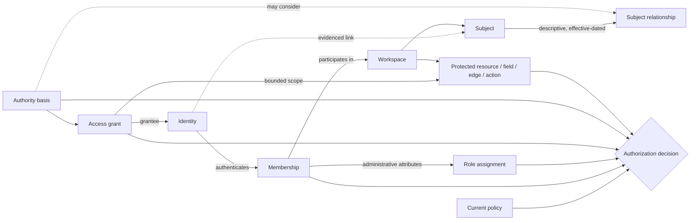
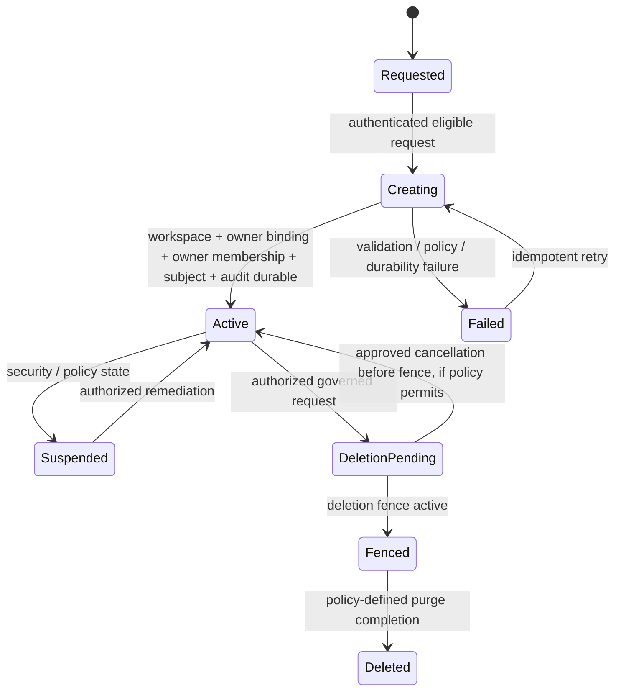

# Phase 1 Workspace, Family, and Membership Model

| Field | Value |
|---|---|
| Document ID | `ARCH-WSP-001` |
| Version | `0.2` |
| Status | **ACTIVE IMPLEMENTATION CONTRACT — Phase 1 fail-closed transition fence approved by `DEC-P1-056`** |
| Product phase | Phase 1 — PERSONAL and FAMILY workspaces; ORGANISATION reserved |
| Jurisdiction | Australia first; jurisdiction-neutral core |
| Updated | 30 August 2026 |
| Normative basis | Approved `DEC-002`, `003`, `006`, `008`, `020`–`023`, `030`–`055`, `DEC-P1-056`; approved PRD and accepted architecture/security/data contracts |
| Companions | [`ARCH-DOM-001`](02-domain-model.md), [`ARCH-DATA-001`](03-logical-data-model.md), [`SEC-AUTH-001`](../06-security/02-authorization-model.md) |

## 1. Purpose, authority, and boundary

This document defines the Phase 1 workspace and participation model: identities, subjects, relationships, owner bindings, memberships, roles, grants, resource/field/edge/action access, family administration, managed-dependant transition fences, guest access, recovery, and continuity boundaries. Stable implementation rules use `WSP-P1-*` IDs.

The hierarchy in [`CODEX.md`](../../CODEX.md) applies. Approved decisions and accepted ADRs outrank this contract. The [Phase 1 PRD](../01-product/02-phase-1-prd.md) is the approved product baseline; use-case, journey and backlog views remain subordinate planning artifacts where their status wording has not yet been reconciled.

This model is an authorization and domain contract, not an identity-provider, policy-engine, token, database, or UI selection. Role labels below describe product concepts; the versioned configuration catalogue owns actual role, permission, relationship, action, and state identifiers under `DEC-007` and `REQ-P1-WS-005`.

The following are explicit decision or release fences, not implicit implementation choices:

- the Phase 1 managed-dependant transition fence is approved by `DEC-P1-056`; richer independent transfer/delegation semantics remain out of scope and require a later governed change;
- automated emergency, incapacity, or after-death release is excluded from Phase 1 by approved `DEC-032`;
- local account/workspace recovery and ownership-transfer success routes are unavailable under approved `DEC-038`; production recovery requires a separate assurance decision;
- production document deletion follows approved `DEC-053`; account/workspace deletion and lawful-retention exceptions remain separate governed release contracts; and
- Azure/Australian placement follows `DEC-049`/`055`, while each invitation, support, notification, backup, failover or external processing route still requires exact eligibility evidence.

## 2. Core concepts and non-equivalences

| Concept | Means | Does not mean |
|---|---|---|
| Identity | An authenticated platform principal reference | Subject, household member, owner, or permission |
| Subject | A person/entity represented by facts, evidence, obligations, or actions | Login account or actor capability |
| Subject–identity link | An evidenced, effective association between a subject and identity | Transfer of resource ownership or blanket access |
| Workspace | The Phase 1 tenant, policy, residency, and resource-scope boundary | Identity-provider tenant or shared folder only |
| Owner binding | The one current authority for the workspace ownership lifecycle | Automatic access to another subject’s private content |
| Membership | An identity’s participation in one workspace | Access to every resource, field, edge, action, export, or audit event |
| Role assignment | Versioned administrative/capability attributes on a membership | A local hard-coded ACL or universal allow |
| Subject relationship | Effective-dated descriptive household/care context | Consent, guardianship, legal authority, or permission by itself |
| Authority basis | Versioned evidence/policy supporting an actor’s ability to act for a subject or delegate | Permanent authority or ownership of the subject’s history |
| Access grant | Explicit purpose/resource/field/edge/action/time-scoped delegation | Role, consent, approval, or ownership |
| Approval | One bound decision for exact consequential inputs and effect | General permission, reusable grant, or future model autonomy |
| Guest link | Short-lived redeemable capability for a bounded grant | Public URL, household membership, or browse access |
| Continuity release | Future policy-governed disclosure after approved trigger ceremony | Account recovery, ordinary grant, or family relationship |

## 3. Stable workspace and participation rules

### 3.1 Identity, workspace, subject, and ownership

| Rule ID | Workspace rule |
|---|---|
| `WSP-P1-001` | Authentication establishes an `IdentityId` and assurance context only; it MUST NOT establish workspace, subject, membership, ownership, or resource authority by itself. |
| `WSP-P1-002` | Every protected human/service operation MUST name exactly one validated workspace context before resource resolution; identity alone is never the tenant boundary. |
| `WSP-P1-003` | PERSONAL and FAMILY are Phase 1 workspace types. ORGANISATION is a reserved inert type and MUST NOT be creatable or exposed to Phase 1 actors. |
| `WSP-P1-004` | Every active workspace MUST have one current effective `WorkspaceOwnerBinding`; a transfer/recovery proposal cannot create an ownerless or dual-effective-owner state. |
| `WSP-P1-005` | Workspace ownership governs the ownership lifecycle but MUST NOT override explicit private-resource, field, edge, consent, export, deletion, or subject-rights policy. |
| `WSP-P1-006` | A `Subject` MUST be representable without identity, credentials, contact address, invitation, or membership. |
| `WSP-P1-007` | Linking an identity to a subject MUST preserve both stable IDs, evidence and effective time; it MUST NOT recreate or silently reassign the subject’s facts, documents, grants, or audit history. |
| `WSP-P1-008` | A subject relationship is descriptive and effective-dated; it MUST NOT independently establish consent, legal authority, resource ownership, or access. |
| `WSP-P1-009` | Acting for another subject MUST use current policy plus an explicit authority basis, grant, or approved rule appropriate to the action and time; a relationship label is insufficient. |
| `WSP-P1-010` | A membership, subject, relationship, grant, role assignment, and resource in one household workspace MUST NOT be attached directly to another household workspace. |

### 3.2 Membership, roles, and authority separation

| Rule ID | Workspace rule |
|---|---|
| `WSP-P1-011` | Membership records participation, lifecycle, and policy attributes for one identity in one workspace; it MUST NOT store an unbounded list of effective content permissions as truth. |
| `WSP-P1-012` | An identity MUST have at most one current membership for a configured participation class in a workspace; invitation and prior-membership history remain additive. |
| `WSP-P1-013` | Invitation, active participation, suspension, departure, revocation, and deletion are distinct conceptual states; exact state IDs and transitions are versioned configuration. |
| `WSP-P1-014` | Roles and administrative capabilities MUST be configuration-driven, versioned, effective-dated, policy-evaluated, and audited. Unknown or stale role versions fail closed. |
| `WSP-P1-015` | Family administration MUST remain separate from private-resource read, sensitive-field read, edge discovery, fact resolution, consent, approval, execution, export, deletion, recovery, and continuity authority. |
| `WSP-P1-016` | Membership administration, resource administration, subject representation, grant delegation, consequential approval, action execution, verification, export, deletion, audit-read, and owner transfer MUST be separately authorizable actions. |
| `WSP-P1-017` | Suspending, revoking, or ending membership MUST stop future participation and trigger current-policy invalidation without deleting or transferring resources, subject history, authored evidence, or audit records. |
| `WSP-P1-018` | A request using an inactive, stale, mismatched, or policy-ineligible membership MUST be denied without disclosing protected workspace/resource existence. |
| `WSP-P1-019` | Service, worker, connector, support, and configuration principals MUST use distinct workload/privileged identities and named capabilities; no service identity may masquerade as a member. |
| `WSP-P1-020` | A role, relationship, permission, or membership policy change MUST publish a new version/authorization epoch and retain proposal, approval, effective, supersession, and audit history. |

### 3.3 Grants and resource, field, edge, and action access

| Rule ID | Workspace rule |
|---|---|
| `WSP-P1-021` | An access grant MUST bind grantor/authority, grantee/access subject, workspace, purpose, resource and optional field/edge/action scope, valid time, policy version, delegation/export constraints, and lifecycle. |
| `WSP-P1-022` | A grantor MUST possess current delegation authority for every delegated scope/action and MUST NOT delegate broader authority, duration, purpose, export, or onward-sharing rights than policy permits. |
| `WSP-P1-023` | Grant scope MUST be explicit and typed. Resource containment, subject assignment, document evidence, graph adjacency, search similarity, task assignment, or common ownership MUST NOT expand it implicitly. |
| `WSP-P1-024` | Workspace mismatch, invalid principal, security suspension, quarantine, deletion fence, explicit deny, expired/revoked session/grant, unsupported policy, or missing required input MUST precede ordinary allow evaluation. |
| `WSP-P1-025` | Multiple memberships, roles, relationships, and grants combine only under the versioned policy’s explicit precedence/union rules; the UI and decision record MUST show the bounded effective result rather than imply a broad role. |
| `WSP-P1-026` | Container/resource read MUST NOT imply access to every sensitive field, extracted value, occurrence, evidence anchor, derived claim, or version. |
| `WSP-P1-027` | Each dependency edge, endpoint, path, count, and existence signal MUST be independently authorized; access to one endpoint MUST NOT reveal another. |
| `WSP-P1-028` | Read, create, edit, resolve, compare, supersede, share, approve, execute, verify, notify, export, archive, trash, restore, purge, and audit-read MUST be separately evaluable actions. |
| `WSP-P1-029` | Current authorization MUST be evaluated at request and execution/output time across API, worker, artifact, search, graph, AI, cache, notification, export, connector, support, and audit paths. |
| `WSP-P1-030` | Errors, timing, empty states, counts, facets, scores, citations, tasks, notifications, and audit views MUST use a disclosure class that prevents inference of restricted content or relationships. |
| `WSP-P1-031` | A guest link MUST map to one bounded grant, be short-lived, audience/use/rate scoped, non-indexable, independently revocable, stored only as protected verifier material, and reauthorized on redemption. |
| `WSP-P1-032` | Grant expiry/revocation MUST invalidate or reauthorize sessions, artifact access, search/graph/AI context, caches, pending notifications, exports, connectors, jobs, and actions; an uncertain consumer fails closed. |

### 3.4 Lifecycle, dependant, guest, recovery, and continuity fences

| Rule ID | Workspace rule |
|---|---|
| `WSP-P1-033` | Workspace creation MUST atomically or recoverably establish the workspace, one owner binding, owner membership, owner subject link, configuration/residency context, and required audit/event evidence without orphan or duplicate state. |
| `WSP-P1-034` | Owner transfer, recovery, or succession MUST remain unavailable in the local Phase 1 profile under approved `DEC-038`; no production success route may activate until a separate assurance decision defines challenge, delay, private-resource, key, support, and abuse controls. |
| `WSP-P1-035` | An invitation MUST bind intended workspace, participation class, inviter authority, audience, expiry, and safe acceptance challenge; accepting it cannot confer authority beyond the resulting membership and explicit grants. |
| `WSP-P1-036` | Member departure/removal MUST inventory active grants, assignments, approvals, actions, sessions, links, notifications, exports, connectors, and owner obligations and reconcile them under policy without silently transferring private resources. |
| `WSP-P1-037` | Managed-dependant transition MUST preserve the existing `SubjectId`, evidence, facts, dependencies, authority history, and audit; it MUST NOT recreate the subject or rewrite prior caregiver provenance. |
| `WSP-P1-038` | A managed dependant MUST NOT receive fabricated credentials, contact details, identity, membership, consent, or ownership merely because a caregiver created the subject. |
| `WSP-P1-039` | Under approved `DEC-P1-056`, `UC-P1-015` is a Phase 1 fail-closed fence: a revisioned attempt may be represented, but it MUST NOT create independent access, credentials, keys, membership, grants, ownership transfer, inherited/delegated authority, consent, export authority, or resource reassignment. |
| `WSP-P1-040` | A guest/adviser MUST be limited to explicit purpose, resources, fields, actions, duration, and audience and MUST NOT enumerate members, subjects, counts, facets, graph topology, private tasks, audit, or exports outside the grant. |
| `WSP-P1-041` | Under approved `DEC-032`, automated emergency, incapacity, or after-death release MUST remain absent in Phase 1; a relationship, nomination, timer, external event, or support assertion cannot trigger disclosure. |
| `WSP-P1-042` | Ordinary time-limited grants and owner-created curated exports MUST remain separate from continuity release and MUST NOT be reinterpreted as evidence or consent for an automatic release. |
| `WSP-P1-043` | Account recovery, workspace owner recovery, managed-dependant transition, and continuity release MUST remain separate workflows with independent authority, evidence, delay, challenge, revocation, and audit semantics. |
| `WSP-P1-044` | Every ownership, membership, role, relationship-authority, invitation, grant, redemption, revocation, dependant-transition, recovery, and continuity attempt/outcome MUST produce privacy-safe audit evidence. |
| `WSP-P1-045` | Phase 2 organisation membership, business-unit roles, SSO/SCIM, information barriers, and delegated tenant administration remain reserved inert extensions and MUST NOT appear in Phase 1 policies or UI. |

## 4. Relationship and authority model

The dotted relationship-to-authority arrow means evidence may inform policy; it never means a relationship grants access. The final authorization decision also includes purpose, assurance, time, state, jurisdiction/residency, approval, policy version, deletion/quarantine/security fences, and disclosure class.

## 5. Logical participation records

| Record | Required attributes | Owner and lifecycle |
|---|---|---|
| `Workspace` | ID, type, status, jurisdiction/configuration, residency policy, revision | Workspace aggregate; creation/suspension/deletion state |
| `WorkspaceOwnerBinding` | binding ID, workspace, owner identity/membership, authority basis, valid/transaction time, status | Workspace aggregate; one current effective binding; transfer fenced |
| `Membership` | ID, identity, workspace, participation class, invitation/acceptance refs, status, policy/config versions, revision | Workspace aggregate; participation only |
| `Subject` | ID, workspace, type, lifecycle, privacy attributes | Workspace aggregate; may have no identity |
| `SubjectIdentityLink` | link ID, subject, identity, evidence/authority, valid/transaction time, state | Workspace aggregate; transition policy controls activation |
| `SubjectRelationship` | relationship ID/type/version, endpoints, valid/transaction time, provenance, review | Workspace aggregate; descriptive context |
| `AuthorityBasis` | basis ID/type/version, actor/subject/action scope, evidence, jurisdiction, valid/transaction time, review/expiry | Authorization/subject-authority owner; not a grant |
| `RoleAssignment` | assignment ID, membership, role definition/version, valid/effective time, approver/audit | Workspace/policy owner; administrative inputs |
| `AccessGrant` | grant ID, issuer/authority, grantee, purpose, scope, valid time, policy, delegation/export, state/revision | Sharing/grant aggregate; explicit access authority |
| `GuestRedemption` | redemption ID, grant/link verifier ref, bound audience/session, issued/used/expiry/revoke state | Sharing boundary; no raw token in data/logs |
| `AuthorizationEpoch` | workspace, epoch kind/value, cause event/revision, effective time | Authorization owner; invalidation/freshness coordination |

## 6. Actor and participation boundaries

Labels in this table are conceptual and map to versioned configuration; every `Policy required` cell requires current evaluation.

| Actor/participation context | Membership administration | Protected resource/field | Grant/delegate | Approve/execute | Export/delete | Boundary |
|---|---|---|---|---|---|---|
| Household owner | Policy required | Policy required | Policy required | Policy required | Separate policy required | Owner binding is not a private-content override. |
| Family administrator | Policy required | Policy required | Policy required | Only if separately authorized | No default | Administration and content/action authorities remain separate. |
| Adult member | Limited by policy | Policy required | Only own/delegable scope | Only if separately authorized | No default | May retain private resources in a family workspace. |
| Managed dependant without identity | Not an actor | Not an actor | Not an actor | Not an actor | Not an actor | Represented subject; caregiver requires current authority. |
| Authenticated guest/adviser | No default | Grant + policy only | No default | Explicit grant and policy only | No default; deletion never | Purpose/time/resource/action bounded. |
| Guest-link redeemer | No | Exact link/grant only | No | Only if explicitly permitted and strongly bound | No default | No workspace browse or reusable public capability. |
| Workspace service | Named capability | Current service policy | Only named capability | Bound capability/approval | Dedicated capability | Payload/model text cannot elevate it. |
| Support/operator | Privileged admin policy | No standing access | No household delegation | No household action | No household export/delete | Exceptional content route absent until separately approved. |

## 7. Authorization decision contract

### 7.1 Trusted inputs

| Input | Required examples |
|---|---|
| Actor/principal | Identity or workload ID, authentication assurance/time, session/security state |
| Workspace participation | Workspace ID/type/status, membership ID/state, owner binding, role assignments |
| Subject authority | Subject ID, relationship and authority-basis versions/effective time, consent where applicable |
| Grant | Grantor/authority, grantee, purpose, exact scope/actions, validity, revocation, delegation/export flags |
| Resource | Stable ID/version, workspace, owner/subject refs, classification, lifecycle, quarantine/deletion state |
| Sub-resource | Field definition/sensitivity, evidence anchor, dependency edge/endpoints, derived result lineage |
| Operation/effect | Named action, consequence class, quantity/bulk scope, target/effect digest |
| Environment | Current time, service/capability, policy/configuration epoch, region/processor eligibility, degraded state |
| Approval | Exact input/effect binding, actor/authority, issue/expiry/revocation, material-change status |

Client roles, token claims, queue payload permissions, model text, filenames, relationship names, and projection ACL labels are hints only until resolved against current authoritative state.

### 7.2 Decision precedence

1. Validate principal, workspace, membership/capability, and resource workspace match.
2. Apply workspace/security suspension, quarantine, deletion fence, revoked session/grant, and explicit deny.
3. Reject unknown/stale policy, role, relationship, resource, field, edge, action, purpose, or residency input.
4. Establish action-specific authority: membership participation, role capability, subject authority, grant, consent, step-up, and approval as applicable.
5. Compute the bounded resource/field/edge/action/effect scope under explicit precedence/union rules.
6. Apply redaction, rate, watermark, reauthorization, review, or other obligations.
7. Return `ALLOW`, `DENY`, `REDACT`, or explicit `MINIMAL_DISCLOSURE` with policy/version, expiry/freshness, safe reason, and audit correlation.
8. Reauthorize at output/effect/redemption time where the operation can be delayed or derived.

An error, stale security input, or missing mandatory attribute returns deny or privacy-safe unavailability. It never falls back to membership-wide access.

## 8. Field, edge, action, and derivative access

| Protected dimension | Example | Required behavior |
|---|---|---|
| Resource | One document, fact, task, subject record, export | Named resource or policy-defined set; no whole-workspace default. |
| Version | Current document versus historical original | Exact version authorization; current access does not guarantee all history. |
| Field/value | Government identifier, financial value, private address | Separate field decision and redaction; container read is insufficient. |
| Evidence anchor | Exact page/passage supporting a claim | Reauthorize source version and passage; citation existence is protected. |
| Dependency edge/path | `policy covers property`, `fact affects licence` | Authorize each edge and endpoint; counts/path length/topology protected. |
| Search/AI derivative | Candidate, facet, snippet, answer, conversation | Candidate and output reauthorized; no inference beyond granted sources. |
| Notification/task | “Action exists” versus underlying evidence | Minimum content policy may route action without exposing subject/value. |
| Approval/action | Resolve fact, publish rule, notify external party, execute connector | Separate action authority, exact target/effect, step-up/approval/current inputs. |
| Export | Item/category/bulk package | Separate high-impact authority; per-item enumeration under current policy. |
| Deletion | Trash, resource purge, account/workspace deletion | Separate destructive authority and affected-subject/rights evaluation. |
| Audit | Event type, actor, target, details | Audit-read scope and safe field view; no hidden-resource side channel. |

## 9. Workspace and membership lifecycles

### 9.1 Workspace establishment

Production document deletion uses the approved `DEC-053` immediate fence, 30-calendar-day restricted Trash/restore interval, and coordinated final purge. Account/workspace deletion, lawful-retention exceptions, and their retained-audit rules remain separate governed workflows. Recovery/owner-transfer success transitions are unavailable locally under `DEC-038` and cannot activate in production without a separate assurance decision.

### 9.2 Invitation and participation

Conceptual participation flow:

1. An authorized inviter selects participation class and previews administrative capabilities; resource access remains a separate grant/policy decision.
2. The invitation binds workspace, intended audience, inviter, policy/configuration version, safe delivery route, expiry, and idempotency identity.
3. Acceptance authenticates or establishes the intended identity according to the future identity contract and reauthorizes the invitation.
4. Membership becomes active only after durable state, authorization epoch, audit, and required event publication agree.
5. Any initial access grants are displayed and created as independent records; no unseen role default expands them.
6. Rejection, expiry, cancellation, wrong audience, duplicate acceptance, and member-existing cases retain privacy-safe outcomes without workspace enumeration.

### 9.3 Suspension, departure, and removal

Suspension immediately blocks participation under current policy but preserves the membership record. Departure/removal additionally evaluates:

- current owner binding and whether removal would orphan the workspace;
- outstanding private/shared resources and subject authority;
- issued/received grants and guest links;
- approvals, queued/external actions, tasks, notifications, exports, and connectors;
- current sessions, signed artifact grants, caches, conversations, and projections; and
- authored evidence, audit, retention, deletion, and third-party rights.

The result may revoke, cancel, reassign through an explicit authorized decision, leave a task pending, or preserve historical attribution. It cannot silently transfer private content or erase provenance.

## 10. Managed-dependant representation and transition fence

### 10.1 Representation before independent access

A managed dependant is a `Subject` with no required identity or membership. Documents, facts, obligations, and tasks reference the stable `SubjectId`. A caregiver’s ability to view, correct, share, approve, export, or delete those resources is separately evaluated from:

- the caregiver’s workspace participation;
- effective relationship and authority-basis evidence;
- subject/resource/field sensitivity and purpose;
- jurisdiction and age/eligibility context;
- consent or challenge requirements where applicable; and
- the requested action and time.

### 10.2 Phase 1 fail-closed transition sequence

`UC-P1-015` is an approved negative safety contract under `DEC-P1-056` and [Issue #33](https://github.com/syedtabishmobin/DocumentManagement/issues/33#issuecomment-5463877570). A transition attempt uses an explicit revisioned state such as proposed, validating, blocked, failed, cancelled or recovered. Phase 1 defines no independent-transfer success state.

1. Resolve the existing stable subject separately from any asserted identity, age, relationship, invitation, membership or grant.
2. Capture the attempt, initiator, policy/configuration version and expected revision without storing sensitive evidence in ordinary audit.
3. Validate current authority and the Phase 1 fence before any mutation. Missing, ambiguous, stale or unsupported inputs deny.
4. Preserve `SubjectId`, documents, facts, evidence, dependencies, valid/transaction history and caregiver provenance.
5. Commit only the blocked/failed/cancelled/recovered attempt state and its outbox/audit evidence atomically where practical; no access-bearing object is created or broadened.
6. On interruption, ambiguity, partial application, concurrency conflict or retry, recover to the last authorised state, invalidate stale authorization projections and recalculate current permissions before returning a result.
7. Independently test deny, retry, rollback/recovery, partial-failure, stale-projection, concurrent-policy/grant and privacy-safe audit cases.

Advanced identity enablement, document-level transfer, inherited-right preservation, delegated authority chains, credentials, keys, independent membership, ownership reassignment and enterprise entitlement transfer are a later governed capability. The stable-subject and versioned-policy extension points are preserved, but Phase 1 must not imply those outcomes.

## 11. Guest and delegated-access fence

### 11.1 Authenticated delegated participant

An adviser/helper with continuing authenticated access uses a limited workspace participation context plus one or more explicit grants. Participation enables policy evaluation; it does not enable household browse. The grant controls exact resource/field/action/purpose/time access. Adviser profession is descriptive and never an authority source by itself.

### 11.2 Redeemable guest link

A guest link is a protected verifier for one grant, not a resource URL. Redemption:

1. validates token integrity without logging the token;
2. enforces audience, expiry, use count, rate/abuse, workspace/grant generation, and required identity challenge;
3. checks current resource, field, action, purpose, grant, policy, quarantine, and deletion state;
4. issues only a short-lived bounded session/redemption context;
5. reveals no household name, membership list, resource count, graph, or unrelated error detail; and
6. creates privacy-safe issue/use/deny/revoke audit evidence.

Link forwarding, guessing, reuse outside audience, expiry, or revocation fails safely. A link does not confer onward sharing, general search, AI discovery, download, approval, action, or export unless each is explicitly in scope.

### 11.3 Revocation objective

High-impact execution, export release, artifact/citation redemption, and destructive operations synchronously reauthorize and therefore do not consume a known-stale allow. Derived invalidation converges within [`NFR-P1-016`](05-non-functional-requirements.md); until convergence, every output still consults current policy or fails closed. Revocation progress and any already-completed external effect remain explicit and auditable.

## 12. Continuity and recovery fences

### 12.1 Ordinary supported preparation

Under the approved Phase 1 exclusion in `DEC-032`, a user may use only:

- an ordinary explicit, time-bounded grant under the normal sharing policy; or
- an owner-initiated, separately authorized curated export package under the export contract.

Neither route is called incapacity/death release. Neither can silently broaden scope later, bypass current authorization, or become proof of a triggering event.

### 12.2 Automated continuity

Under approved `DEC-032`:

- no continuity trigger, nominee role, timer, external webhook, support assertion, or relationship state can release content;
- no future-release key, link, or dormant broad grant may be activated;
- an incoming alleged trigger is rejected or retained only as safe denied-attempt evidence; and
- UI/configuration cannot imply that automatic release is enrolled or guaranteed.

Any future proposal requires a new decision/ADR and threat-model update covering evidence, false triggers, challenge, delay, notice, consent, scope, revocation, jurisdiction, encryption/key access, privacy, appeal, recovery, audit, and testing.

### 12.3 Account/workspace recovery

Recovery proves restoration of an identity/account/workspace authority under a future separately approved ceremony. It does not prove incapacity/death, consent, or authority over another subject. Under approved `DEC-038`, the local success route is unavailable; support, email possession, family relationship, invitation history, device possession, or prior owner status cannot transfer factors, keys, owner binding, private resources, grants, or export authority. Production recovery remains disabled until a separate assurance decision is recorded.

## 13. Current-authorization projection strategy

Role/grant/resource labels may be materialized into search, graph, vector, cache, conversation, task, notification, and export projections to reduce candidates. They are never authoritative allows. Each protected projection carries:

- workspace and source resource/version;
- disclosure/sensitivity class and protected field/edge refs;
- policy/configuration and authorization epoch;
- grant/purpose class where safe and necessary;
- deletion generation/fence watermark; and
- projection generation, transform version, source watermark, and build time.

Every output resolves current authoritative policy. If the projection is stale, misses an invalidation, lacks required attributes, or cannot perform field/edge filtering, it returns only opaque candidate IDs to an enforcing owner or fails closed. This is the accepted strategy in [`ADR-ARCH-003`](06-adrs/ADR-003-current-authorization-for-derived-projections.md), not acceptance of a specific policy/index product.

## 14. Audit and privacy requirements

Required event classes include:

- workspace create/type/status/deletion transitions and owner-binding proposals/outcomes;
- invitation issue/delivery/accept/reject/expire/cancel and membership activate/suspend/depart/revoke;
- subject/identity link, relationship, and authority-basis proposal/review/effective/supersession;
- role assignment and policy/configuration publication;
- grant issue/scope/use/change/expiry/revoke and guest-link redemption/denial;
- authorization allow/deny/redact/minimal-disclosure for security/consequential operations;
- dependant transition proposal/challenge/denial/outcome when later approved;
- recovery and continuity attempts, including denied false/unsupported routes; and
- propagation, cancellation, reconciliation, and already-completed effect after revocation.

Audit uses stable references, policy/version, safe reason/action codes, state transitions, actor/service, time, assurance, outcome, correlation, and integrity evidence. It excludes names, email addresses, relationship descriptions, document titles, values, passages, tokens, prompts, provider payloads, and other raw content from the ordinary envelope. Audit-read itself is field- and target-authorized.

## 15. Open-decision and security-threat reconciliation

| Boundary | Required state now | Primary threats/controls |
|---|---|---|
| Managed dependant (`DEC-P1-056`) | Subject without fabricated identity; explicit revisioned transition attempts fail closed and cannot activate independent transfer | `THR-P1-004`–`006`; `AUTH-P1-006`, `PRIV-P1-023`; [Issue #33 decision](https://github.com/syedtabishmobin/DocumentManagement/issues/33#issuecomment-5463877570) |
| Guest/adviser | Explicit grant, no enumeration/export/onward share by default | `THR-P1-003`–`006`, `014`; `AUTH-P1-016`–`019` |
| Automated continuity (`DEC-032`) | Disabled; false trigger releases nothing | `THR-P1-025`; `AUTH-P1-033`, `PRIV-P1-024` |
| Recovery/owner transfer (`DEC-038`) | Local success route unavailable; production separately assurance-gated; no support/email/family bypass | `THR-P1-001`–`002`, `020`; `AUTH-P1-032`, `PRIV-P1-025` |
| Revocation and stale projections | Current authorization at output; invalidate all derivatives | `THR-P1-005`–`007`; `AUTH-P1-019`–`024` |
| Export/deletion | Separate high-impact authority; per-item policy/fence | `THR-P1-022`–`024`; `AUTH-P1-015`, `034` |
| Support/operator | No standing content access or household impersonation | `THR-P1-020`; `SEC-P1-025`–`026`, `AUTH-P1-026`–`027` |

## 16. Traceability

| Workspace-rule family | Primary product requirements/use cases | Architecture/security alignment |
|---|---|---|
| `WSP-P1-001`–`010` | `REQ-P1-WS-001`–`003`, `007`; `UC-P1-001`, `013`, `015` | `ARCH-P1-003`, `006`–`009`; `DOM-P1-001`–`016`; `AUTH-P1-001`–`006` |
| `WSP-P1-011`–`020` | `REQ-P1-WS-002`, `004`–`007`, `REQ-P1-SHR-003`; `UC-P1-001`, `009`, `013` | `DOM-P1-013`–`018`; `AUTH-P1-002`–`006`, `026`–`028` |
| `WSP-P1-021`–`032` | `REQ-P1-FCT-006`, `REQ-P1-GPH-002`, `004`, `REQ-P1-SRCH-003`, `REQ-P1-SHR-001`–`005`; `UC-P1-005`, `009`, `013` | `ARCH-P1-006`–`012`, `024`, `029`–`030`; `AUTH-P1-007`–`025` |
| `WSP-P1-033`–`040` | `REQ-P1-WS-002`–`003`, `006`–`007`; `UC-P1-001`, `009`, `015` | `DOM-P1-013`–`018`; `SEC-P1-003`–`007`, `025`; `PRIV-P1-023` |
| `WSP-P1-041`–`045` | `REQ-P1-SHR-004`, `REQ-P1-TRUST-008`, `REQ-P1-CFG-005`; `UC-P1-016`, `017` | `ARCH-P1-043`–`044`; `AUTH-P1-027`, `032`–`033`; `THR-P1-002`, `025` |

## 17. Required conformance evidence

Before this model supports implementation readiness, tests must prove:

1. identity, subject, membership, owner binding, relationship, role, authority basis, grant, and approval never collapse;
2. the same identity can participate in multiple workspaces without cross-workspace reference, cache, search, graph, AI, export, or audit leakage;
3. household owner and family administrator negative cases protect another member’s private resources and fields;
4. managed dependants exist without credentials and no policy-pending transition changes access or history;
5. grant issue/preview/use/union/expiry/revoke/delegation/purpose cases enforce exact resource, field, edge, action, and export scope;
6. guest-link guess, forward, reuse, wrong audience, expiry, revoke, and timing/enumeration attacks reveal no household context;
7. revocation between enqueue and execution, mid-conversation, signed access, notification, export, and action fails closed or visibly reconciles completed effects;
8. relationship/caregiver/professional/support/owner labels alone cannot confer subject authority or private-content access;
9. recovery and automated continuity routes are absent or deny under approved `DEC-032`/`038` boundaries;
10. membership removal does not delete, re-own, or lose authored evidence/history and cannot orphan the owner binding;
11. audit views record required events without leaking protected identities, relationships, resources, or content; and
12. Phase 2 roles/workspace features remain inert and absent from Phase 1 actor surfaces.

Exact authorization-propagation and security release targets are governed by [`ARCH-NFR-001`](05-non-functional-requirements.md). This logical contract does not activate Entra External ID or select a policy engine, token format, role store, or directory data model; those adapter and release choices remain governed by accepted ADRs and environment gates.
