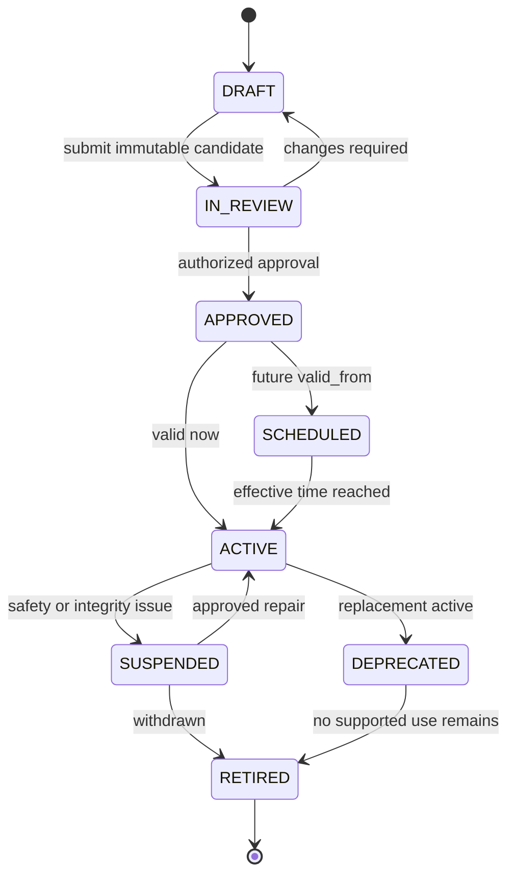

# Phase 1 Document Taxonomy Contract

| Field | Value |
|---|---|
| Document ID | `DIT-TAX-001` |
| Version | `0.1` |
| Status | `DRAFT — provider-neutral; product-owner and architecture approval required` |
| Product phase | Phase 1 — Personal and Family |
| Jurisdiction | Australia first; jurisdiction-neutral core |
| Primary architecture | `ARCH-SOL-001` rules `ARCH-P1-002`–`005`, `ARCH-P1-013`–`018`, `ARCH-P1-033`–`035`, `ARCH-P1-039`–`045` |
| Domain alignment | `ARCH-DOM-001` rules `DOM-P1-050`–`055`, `DOM-P1-057` |
| Primary decisions | `DEC-007`, `DEC-009`, `DEC-020`, `DEC-024` |
| Open decisions | `DEC-035`, `DEC-036` |
| Updated | 26 August 2026 |

## 1. Purpose and authority

This document defines the provider-neutral contract for versioned document taxonomy, supported-format profiles, classification aliases, applicability, sensitivity, and links from a document type to extraction, monitoring, evidence, source, and supersession configuration.

It refines these exact product requirements:

- `REQ-P1-DOC-006`, `REQ-P1-DOC-007`;
- `REQ-P1-ING-006`;
- `REQ-P1-MON-002`, `REQ-P1-MON-003`;
- `REQ-P1-HLT-001`;
- `REQ-P1-CFG-001`, `REQ-P1-CFG-002`, `REQ-P1-CFG-003`, `REQ-P1-CFG-004`; and
- `REQ-P1-TRUST-002`, `REQ-P1-TRUST-003`.

Feature traceability: `FEAT-P1-004`, `FEAT-P1-005`, `FEAT-P1-007`, `FEAT-P1-009`, `FEAT-P1-016`, `FEAT-P1-020`, `FEAT-P1-022`.

Use-case traceability: `UC-P1-002`, `UC-P1-003`, `UC-P1-006`, `UC-P1-008`, `UC-P1-012`, `UC-P1-013`, `UC-P1-018`; acceptance seeds `AC-UC-P1-002-03`, `AC-UC-P1-002-04`, `AC-UC-P1-008-01`, `AC-P1-ING-001`, `AC-P1-SEC-001`.

All RFC 2119 language remains draft until the PRD and this contract are approved. This file does not select the first public launch types or the final disposition of suspected clinical content.

## 2. Scope and non-goals

This contract covers:

- stable identity and immutable versioning for taxonomy releases and document-type profiles;
- navigation categories distinct from classification types;
- jurisdiction, issuer, subject, workspace, language, and effective-time applicability;
- localized labels, positive/negative aliases, and classification signals;
- default sensitivity and field/schema sensitivity linkage;
- supported-format validation, preview, extraction, and degraded behavior;
- references to extraction schemas, monitoring rules, trusted sources, expected-document profiles, dependency types, and supersession policy;
- clinical-content exclusion and the unresolved `DEC-036` branch; and
- syntactic, referential, semantic, security, and publication validation.

It does not:

- create the machine-readable reference-data files;
- select a classifier, OCR service, model, storage product, or cloud provider;
- make a classification result canonical truth;
- determine whether a legal, tax, financial, insurance, immigration, or medical rule applies;
- declare every type in the representable domain envelope enabled for public launch; or
- resolve `DEC-035` or `DEC-036`.

## 3. Taxonomy model

### 3.1 Contract objects

| Object | Stable identity and responsibility |
|---|---|
| `TaxonomyRelease` | Immutable, publishable set of compatible profile versions and category relationships. Identified by `taxonomy_release_id` and semantic `version`. |
| `CategoryDefinition` | Localized navigation/analytics grouping. It never substitutes for a document type and never grants access. |
| `DocumentTypeDefinition` | Stable semantic identity such as a kind of policy, licence, or statement. Its ID survives label and rule changes. |
| `DocumentTypeProfile` | Immutable version of classification, applicability, sensitivity, processing, and lifecycle configuration for one type. |
| `ClassificationAlias` | Locale-, jurisdiction-, issuer-, and channel-scoped positive or negative signal used by a classifier or reviewer. |
| `ApplicabilityPredicate` | Declarative constraints that decide whether a profile is eligible for consideration, not whether the document has conclusively been classified. |
| `SensitivityProfile` | Default privacy classification, field override references, handling constraints, and review escalation. It is not an access grant. |
| `SupportedFormatProfile` | Versioned validation, preview, extraction, OCR fallback, encryption, and unsupported/degraded behavior for detected media characteristics. |
| `SupersessionProfile` | Allowed version/replacement/amendment relationships and review/approval needs. Detailed semantics are owned by `DIT-VER-001`. |
| `LaunchProfile` | Explicit allow-list of document-type profile versions, schemas, requirement profiles, and governed sources enabled for a named release/jurisdiction. Its contents remain open under `DEC-035`. |

### 3.2 Identity and version fields

Every versioned taxonomy object MUST contain:

| Field | Contract |
|---|---|
| `id` | Globally stable repository identifier. It MUST NOT encode a mutable label, provider, storage key, jurisdiction-specific display term, or version. |
| `version` | Immutable semantic version or monotonically ordered contract version. Re-publishing changed content under the same version is forbidden. |
| `status` | One of the governed publication states in section 3.3. |
| `valid_from`, `valid_to` | Business/effective interval; `valid_to` is optional and exclusive when present. |
| `recorded_at` | Platform transaction timestamp for this immutable version. |
| `owner_id` | Accountable configuration owner, not an end-user document owner. |
| `change_summary` | Privacy-safe reason for the version. |
| `supersedes_version` | Prior version reference when applicable; absence does not permit in-place mutation. |
| `source_evidence_refs` | Required for consequential jurisdiction, applicability, or handling rules. |
| `review_policy_id`, `approval_record_id` | Required before consequential configuration can become active. |

### 3.3 Publication lifecycle



Activation MUST be atomic at the `TaxonomyRelease` level for every relationship declared required by the release. A profile may be syntactically valid but unavailable when one of its mandatory schemas, rules, sources, sensitivity definitions, or formats is not active.

## 4. Draft normative rules

### 4.1 Versioning and activation

- `DIT-TAX-P1-001` — A document type MUST have a stable `document_type_id` separate from every localized label, alias, profile version, classifier output, and provider identifier.
- `DIT-TAX-P1-002` — Published profile and taxonomy-release versions MUST be immutable. Corrections MUST create a new version with additive history and an explicit supersession link.
- `DIT-TAX-P1-003` — Taxonomy behavior MUST be loaded from validated, versioned reference data. Code MAY implement generic evaluators but MUST NOT hard-code launch document types, aliases, jurisdictions, rules, or sources.
- `DIT-TAX-P1-004` — Category membership is a many-to-many navigation relation and MUST NOT be treated as classification truth, sensitivity policy, retention policy, or authorization.
- `DIT-TAX-P1-005` — A profile MUST NOT activate until its required cross-references resolve to compatible active or scheduled versions in the same publication plan.

### 4.2 Applicability and aliases

- `DIT-TAX-P1-006` — Applicability MUST be an explicit predicate over permitted dimensions including jurisdiction, state/territory, issuer/authority, subject/resource type, workspace type, locale/language, effective interval, capture route, and launch profile. Omitted dimensions mean “not constrained,” not “verified applicable.”
- `DIT-TAX-P1-007` — A jurisdiction-specific profile MUST reference a jurisdiction definition and evidence for consequential applicability. Core type identity MUST remain jurisdiction-neutral under `DEC-020`.
- `DIT-TAX-P1-008` — Aliases MUST declare locale, normalized form, polarity, applicable jurisdiction/issuer/channel, provenance, and version. An alias match is only a classification signal.
- `DIT-TAX-P1-009` — Negative aliases and exclusion signals MUST be supported where a common term could route content into an unsafe or incorrect type, especially health-insurance versus clinical content.
- `DIT-TAX-P1-010` — Classification MUST return the selected profile version, ranked alternatives where permitted, evidence/signals, calibrated confidence, and review reasons. Unsupported or uncertain content MUST enter review or an explicit unsupported state rather than receiving a trusted type silently.

### 4.3 Sensitivity and clinical exclusion

- `DIT-TAX-P1-011` — Every profile MUST declare a default sensitivity reference and any required field-level sensitivity overrides. The most restrictive applicable handling rule wins unless an approved policy explicitly defines safe declassification.
- `DIT-TAX-P1-012` — Sensitivity metadata MUST control handling and policy inputs but MUST NOT itself grant a user, worker, model, or operator access.
- `DIT-TAX-P1-013` — Clinical reports, notes, diagnostic results, prescriptions, treatment records, and health-provider workflows are outside Phase 1 under `DEC-024`; health-insurance and general coverage documents remain representable.
- `DIT-TAX-P1-014` — A suspected clinical-content result MUST enter a non-ordinary policy-hold state before ordinary extraction, embeddings, graph, search, AI, monitoring, analytics, or user preview can begin.
- `DIT-TAX-P1-015` — While `DEC-036` is open, the contract MUST NOT choose reject-before-storage, quarantine-for-user-decision, or encrypted-original-only retention. It MUST preserve a `POLICY_DECISION_REQUIRED` outcome, block ordinary processing, support privacy-safe false-positive review, and avoid making a retention promise.

### 4.4 Processing, rule, and lifecycle links

- `DIT-TAX-P1-016` — Each enabled profile MUST reference an exact extraction-schema version or an explicit `NO_STRUCTURED_EXTRACTION` policy with a user-visible degraded outcome.
- `DIT-TAX-P1-017` — Each enabled profile MUST reference one or more supported-format profiles defining detected-media validation, preview, native extraction, OCR fallback, encrypted/corrupt handling, and unsupported behavior. File extension alone MUST NOT choose the path.
- `DIT-TAX-P1-018` — Monitoring, trusted-source, expected-document, dependency-type, fact-definition, workflow, and supersession references MUST be explicit and version-constrained. Their presence does not prove applicability or fulfilment.
- `DIT-TAX-P1-019` — A supersession profile MUST identify permitted relationships, required evidence, effective-date behavior, and review/approval policy. It MUST NOT silently infer logical identity or replacement from filename, alias, or content hash.
- `DIT-TAX-P1-020` — Inheritance between profiles MAY reduce duplication only when merge precedence is deterministic, provenance remains visible, field sensitivity cannot be weakened, and cycles are rejected.

### 4.5 Australia pack, launch selection, and change

- `DIT-TAX-P1-021` — The Australia pack MUST be loadable through the same neutral schema used by a synthetic second jurisdiction and MAY add Australian labels, states/territories, issuers, rules, and sources without changing core identifiers.
- `DIT-TAX-P1-022` — Until `DEC-035` is approved, representable domain types MUST default to unavailable for public-launch claims unless an explicit draft test profile enables them. No broad category list implies supported processing or monitoring coverage.
- `DIT-TAX-P1-023` — Publishing a new profile or launch release MUST validate, review, approve, effective-date, audit, and impact-assess the change. Reclassification or replay of existing documents MUST be separately planned and traceable; activation MUST NOT silently rewrite prior results.
- `DIT-TAX-P1-024` — Deprecation or retirement MUST preserve historical resolution of every stored profile/version reference and MUST define how new classification, reprocessing, monitoring, and user correction behave.
- `DIT-TAX-P1-025` — Examples in this document are non-activatable illustrations. Only approved machine-readable reference data can enable a document type or coverage claim.

## 5. Document-type profile contract

### 5.1 Required profile fields

| Group | Required fields |
|---|---|
| Identity | `document_type_id`, `profile_version`, `taxonomy_release_constraint`, `status` |
| Display | `canonical_name_key`, localized labels, descriptions, category references |
| Applicability | jurisdiction predicates, subject/resource types, issuers, languages/locales, effective interval, launch-profile constraints |
| Classification | positive/negative alias references, signal-policy reference, confidence-calibration reference, review routing, unsupported fallback |
| Handling | sensitivity profile, clinical-boundary class, minimum authorization capability, telemetry classification |
| Processing | supported-format profile references, extraction-schema reference, preprocessing policy, manual-record eligibility |
| Intelligence | fact-definition, dependency-type, monitoring-rule, trusted-source, requirement-profile, and workflow references |
| Lifecycle | logical-identity hints, supersession profile, expected review/expiry fields, archive/purge policy references |
| Governance | owner, source evidence, review policy, approval record, valid time, transaction time, change history |

### 5.2 Applicability evaluation result

An evaluator MUST return a structured result rather than a boolean alone:

| Field | Meaning |
|---|---|
| `profile_ref` | Exact document-type profile version evaluated. |
| `result` | `ELIGIBLE`, `INELIGIBLE`, `INDETERMINATE`, or `POLICY_BLOCKED`. |
| `matched_predicates` | Authorized, safe references to dimensions that matched. |
| `failed_predicates` | Safe reason codes; values are omitted when their disclosure is restricted. |
| `unknown_predicates` | Missing or stale inputs preventing a determination. |
| `policy_version` | Applicability evaluator and jurisdiction-pack version. |
| `evaluated_at` | Transaction time of the evaluation. |

`ELIGIBLE` means the profile may be considered by classification; it does not mean the document is correctly classified or that any linked rule applies to a subject.

## 6. Supported-format profile

The profile schema MUST distinguish detected characteristics from user-supplied hints.

| Concern | Required contract behavior |
|---|---|
| Detection | Record claimed extension/type separately from detected media type and structural signature. Mismatch routes to policy, not automatic trust. |
| Validation | Define zero-byte, truncation, corruption, decompression, password/encryption, macro/active-content, page/sheet/slide, and configured size/complexity outcomes without embedding values in core code. |
| Preview | Declare whether safe preview is permitted, which derived representation is used, and behavior when preview generation fails. |
| Text path | Declare native extraction eligibility and OCR/layout fallback; neither provider nor model is fixed here. |
| Manual record | Declare whether a no-binary manual record is allowed and which evidence limitations must be shown. |
| Unsupported/degraded | Provide stable reason code, allowed retry/conversion/manual path, and whether original preservation is permitted by policy. |
| Security | Require malware/safety clearance before content-bearing preview, parsing, OCR, embedding, graph, or AI access. |

## 7. Illustrative non-activatable profile

This YAML is a schema-shape example only. It deliberately does not claim inclusion in the `DEC-035` launch pack.

```yaml
example_only: true
document_type_id: "doctype.coverage.health_insurance_policy"
profile_version: "0.1.0-draft"
status: DRAFT
labels:
  en-AU: "Health insurance policy"
categories:
  - "category.insurance"
applicability:
  jurisdictions:
    - "jurisdiction.AU"
  workspace_types:
    - PERSONAL
    - FAMILY
classification:
  alias_refs:
    - "alias.health_insurance_policy.en-AU.v1"
  negative_alias_refs:
    - "alias.clinical_report.en-AU.v1"
  calibration_ref: "calibration.document_classification.default.v1"
  low_confidence_route: REVIEW_REQUIRED
handling:
  sensitivity_profile_ref: "sensitivity.insurance_sensitive.v1"
  clinical_boundary: ALLOWED_COVERAGE_NOT_CLINICAL
processing:
  format_profile_refs:
    - "format.pdf.safe_document.v1"
  extraction_schema_ref: "extract.coverage_policy.v1"
intelligence:
  monitoring_rule_refs: []
  trusted_source_refs: []
  requirement_profile_refs: []
lifecycle:
  supersession_profile_ref: "supersession.policy_document.v1"
governance:
  owner_id: "config-owner-placeholder"
  source_evidence_refs: []
  valid_from: "2026-08-26"
```

An activation validator MUST reject this example because `example_only` is true, the version is draft, approval fields are absent, and the launch/source decisions remain unresolved.

## 8. Validation gates

### 8.1 Syntactic validation

- schema version is known and supported;
- IDs, versions, locales, date/time values, enums, and predicate shapes are valid;
- required fields are present and unknown security-relevant fields are rejected;
- localized labels do not replace stable identifiers; and
- examples marked `example_only` cannot enter a publication bundle.

### 8.2 Referential validation

- every category, alias, jurisdiction, sensitivity, format, extraction, fact, dependency, monitoring, source, requirement, workflow, and supersession reference resolves to an allowed version;
- no active profile depends on a retired or incompatible required record;
- reference-version constraints are deterministic and cannot float silently to an unreviewed major version; and
- historical references remain resolvable after deprecation.

### 8.3 Semantic and safety validation

- effective intervals are valid and conflicting active versions are rejected unless the release defines deterministic, reviewed coexistence;
- inheritance is acyclic and cannot weaken sensitivity or remove mandatory clinical handling;
- every enabled format has explicit validation, safety, preview, extraction/manual, and failure behavior;
- every consequential rule/source link declares jurisdiction, applicability, evidence, effective dates, review requirements, and owner;
- profiles within the clinical exclusion class cannot reference ordinary extraction, graph, search, AI, monitoring, or analytics capabilities;
- health-insurance/general-coverage profiles include negative clinical signals and safety fixtures;
- release claims are bounded to the explicit `LaunchProfile`; and
- cross-workspace or restricted profile metadata cannot be exposed through classification alternatives, counts, errors, or analytics.

### 8.4 Publication and replay validation

Before activation, the publication process MUST produce:

1. immutable bundle hash and dependency manifest;
2. validation evidence and approver identity;
3. impact inventory for active documents, findings, monitors, and derived results;
4. replay/reclassification plan with idempotency and rollback or forward-repair behavior;
5. privacy and telemetry review;
6. test results for launch types, unsupported types, clinical boundary, jurisdiction predicates, aliases, and cross-reference failures; and
7. user-visible change/coverage implications where applicable.

## 9. Failure and degraded behavior

| Failure | Required behavior |
|---|---|
| Taxonomy unavailable | New classification stops or enters retryable policy-blocked state; existing records retain exact prior references and are not silently retyped. |
| Referenced schema/rule/source missing | Profile is unavailable; processing reports the missing dependency without falling back to a semantically different profile. |
| Unknown type | Preserve eligible original under ingestion policy and return `UNSUPPORTED` or `REVIEW_REQUIRED`; do not choose a broad category as type. |
| Ambiguous types | Present authorized ranked alternatives/evidence for review; no hidden profile or restricted subject metadata is exposed. |
| Jurisdiction unknown | Return `INDETERMINATE`; do not apply an Australian profile merely because the service is Australia-first. |
| Unsafe alias collision | Route to review or policy hold; clinical exclusion wins over convenience classification. |
| Profile withdrawn | Stop new selection and configured downstream use; retain historical resolution and initiate governed impact/replay. |
| Publication partially fails | Keep the prior release active, record failure, and use forward repair; never expose a mixed unvalidated release as active. |

## 10. Security, privacy, audit, and telemetry

- Classification input, filenames, alias matches, extracted snippets, and document text are sensitive content and MUST NOT appear in ordinary logs or analytics.
- Audit MUST record safe IDs for taxonomy release, profile, alias/signal policy, applicability result, classifier/calibration, reviewer decision, before/after classification reference, actor/service, reason, time, and correlation.
- Provider adapters receive only the content and configuration needed for the capability and cannot activate profiles or make authoritative applicability decisions.
- Authorization applies to profile results, alternative candidates, subject/resource bindings, sensitivity labels, review queues, error messages, and reclassification reports.
- Metrics MAY record pseudonymous document/workspace ID, profile/version, route, decision class, confidence band, review result, and synthetic marker where approved; they MUST NOT record document text or sensitive values.

Relevant provisional measures are `MET-P1-011`, `MET-P1-018`, `MET-P1-020`, and `MET-P1-021`. Their targets remain provisional until approved.

## 11. Rule traceability

| Rule IDs | Requirement links | Feature links | Use-case links |
|---|---|---|---|
| `DIT-TAX-P1-001`–`DIT-TAX-P1-005` | `REQ-P1-CFG-001`, `REQ-P1-CFG-004`, `REQ-P1-ING-006` | `FEAT-P1-007`, `FEAT-P1-009`, `FEAT-P1-022` | `UC-P1-002`, `UC-P1-018` |
| `DIT-TAX-P1-006`–`DIT-TAX-P1-010` | `REQ-P1-ING-006`, `REQ-P1-CFG-002`, `REQ-P1-CFG-003` | `FEAT-P1-009`, `FEAT-P1-022` | `UC-P1-002`, `UC-P1-006`, `UC-P1-008` |
| `DIT-TAX-P1-011`–`DIT-TAX-P1-015` | `REQ-P1-DOC-007`, `REQ-P1-TRUST-002`, `REQ-P1-TRUST-003` | `FEAT-P1-005`, `FEAT-P1-011` | `UC-P1-002`, `UC-P1-012`, `UC-P1-013` |
| `DIT-TAX-P1-016`–`DIT-TAX-P1-020` | `REQ-P1-DOC-006`, `REQ-P1-MON-002`, `REQ-P1-MON-003`, `REQ-P1-HLT-001`, `REQ-P1-CFG-001` | `FEAT-P1-004`, `FEAT-P1-016`, `FEAT-P1-020` | `UC-P1-002`, `UC-P1-003`, `UC-P1-006`, `UC-P1-008` |
| `DIT-TAX-P1-021`–`DIT-TAX-P1-025` | `REQ-P1-CFG-002`, `REQ-P1-CFG-003`, `REQ-P1-CFG-004` | `FEAT-P1-022` | `UC-P1-006`, `UC-P1-018` |

## 12. Definition of ready for this contract

This contract is not implementation-ready until:

- the PRD and `DEC-030` slice mapping are approved;
- `DEC-035` selects the initial document types, schemas, requirement profiles, and Australian sources;
- `DEC-036` selects the safe suspected-clinical disposition and false-positive path;
- machine-readable schemas and initial reference data validate against this contract;
- authorization, audit, ingestion, extraction, versioning, API/event, UX, and test specifications use the same IDs and states;
- provider adapters have conformance tests rather than provider-specific exceptions in core taxonomy; and
- synthetic fixtures prove classification accuracy, ambiguous/unsupported behavior, clinical containment, no-leak review, version publication, rollback/forward repair, and deterministic replay.
