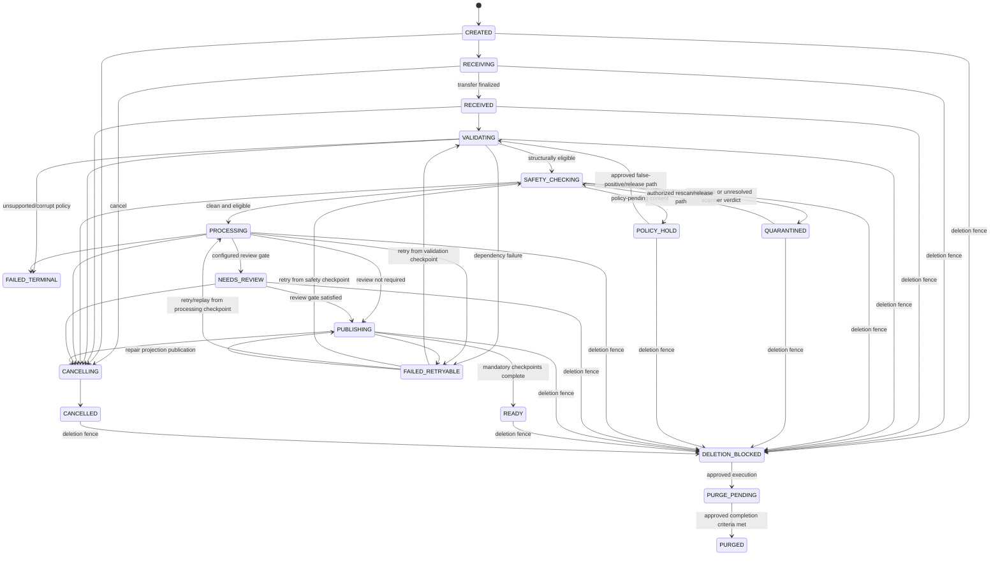
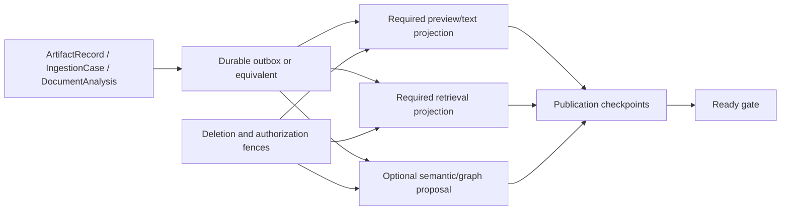

# Phase 1 Ingestion and Processing Contract

| Field | Value |
|---|---|
| Document ID | `DIT-ING-001` |
| Version | `0.1` |
| Status | `DRAFT — provider-neutral; product-owner and architecture approval required` |
| Product phase | Phase 1 — Personal and Family |
| Primary architecture | `ARCH-SOL-001` rules `ARCH-P1-003`–`005`, `ARCH-P1-013`–`016`, `ARCH-P1-019`–`032`, `ARCH-P1-039`–`045` |
| Domain alignment | `ARCH-DOM-001` rules `DOM-P1-019`–`025`, `DOM-P1-048`–`055`, `DOM-P1-057` |
| Open decisions | `DEC-031`, `DEC-035`, `DEC-036`, `DEC-039`, `DEC-040` |
| Updated | 26 August 2026 |

## 1. Purpose and authority

This document defines the provider-neutral ingestion workflow from accepted capture through immutable intake, validation, safety isolation, extraction/classification, review routing, projection publication, readiness, cancellation, deletion interaction, retry, replay, and repair.

It refines these exact requirements:

- `REQ-P1-DOC-001`, `REQ-P1-DOC-002`, `REQ-P1-DOC-004`, `REQ-P1-DOC-006`, `REQ-P1-DOC-007`;
- `REQ-P1-ING-001`, `REQ-P1-ING-002`, `REQ-P1-ING-003`, `REQ-P1-ING-004`, `REQ-P1-ING-005`, `REQ-P1-ING-006`, `REQ-P1-ING-007`, `REQ-P1-ING-008`, `REQ-P1-ING-009`;
- `REQ-P1-AI-006`, `REQ-P1-AI-007`;
- `REQ-P1-TRUST-002`, `REQ-P1-TRUST-003`, `REQ-P1-TRUST-004`, `REQ-P1-TRUST-007`, `REQ-P1-TRUST-009`; and
- `REQ-P1-CFG-001`.

Feature traceability: `FEAT-P1-003`, `FEAT-P1-004`, `FEAT-P1-005`, `FEAT-P1-006`, `FEAT-P1-009`, `FEAT-P1-014`, `FEAT-P1-026`, `FEAT-P1-029`.

Use-case traceability: `UC-P1-002`, `UC-P1-003`, `UC-P1-004`, `UC-P1-012`, `UC-P1-013`, `UC-P1-014`; acceptance scenarios `AC-UC-P1-002-01`–`AC-UC-P1-002-05`, `AC-UC-P1-003-02`, `AC-UC-P1-012-02`, `AC-UC-P1-012-03`, `AC-UC-P1-013-02`, and umbrella `AC-P1-ING-001`, `AC-P1-SEC-001`, `AC-P1-DEL-001`.

The logical components named here are ownership and port boundaries, not required deployment units. This contract does not select queue, workflow, database, object-store, scanner, OCR, model, search, vector, or graph products.

## 2. Ownership and records

Consistent with `ARCH-SOL-001` and `ARCH-DOM-001`, ingestion orchestration owns `IngestionCase` acquisition and workflow state; `ArtifactRecord` owns immutable byte identity/integrity/isolation; the quarantine/content-policy boundary controls restricted verdict processing; evidence/interpretation owns `DocumentAnalysis` extraction/classification generations; `LogicalDocument` owns document/version links; and each projection owns only rebuildable derived state.

| Record | Authority and mutability |
|---|---|
| `AcquisitionAttempt` | Immutable attempt identity and route/provenance plus additive outcomes. Every submission attempt is preserved even when bytes duplicate another attempt. |
| `IngestionCase` | Revisioned workflow aggregate with one logical write owner, explicit current state, cancellation/deletion fences, required stages, and degradation flags. Product/API wording MAY call this an ingestion job, but that label does not create another aggregate. |
| `ArtifactRecord` | Put-once artifact ID, hash algorithm/value, byte size, detected media characteristics, placement, integrity/isolation state, and preservation time. Bytes are immutable. |
| `SafetyAssessment` | Restricted child record/value holding validation, malware, unsupported-policy, and suspected-clinical verdict history. `IngestionCase` owns workflow state and `ArtifactRecord` owns integrity/isolation; this is not a separate aggregate or ordinary document view. |
| `StageRun` | Immutable attempt for a named processing contract/version and input generation. Later retry/replay appends another run. |
| `DocumentAnalysis` | Immutable versioned extraction/classification/result generation owned by evidence/interpretation. Preview/render derivatives identify their authoritative source generation; activation for a purpose is a separate governed reference. |
| `PublicationCheckpoint` | Required projection target, source revision/generation, acknowledgement, watermark, failure, and repair status. |
| `IngestionEventRecord` | Versioned, minimized event/outbox/inbox identity, causation, correlation, aggregate revision, and processing outcome. |
| `DeletionCase` | Authoritative deletion scope, fence/tombstone, and purge/residual acknowledgement owner. Every stage and projection consumes its fence state but cannot remove it unilaterally. |

Content hashes, filenames, provider IDs, upload tokens, or external item IDs MUST NOT become canonical job, artifact, document, or version identities.

## 3. State model

### 3.1 Ingestion-case states

| State | Meaning | User-visible success claim allowed? |
|---|---|---|
| `CREATED` | Durable job exists with validated workspace context and idempotency identity; content may not yet be complete. | No |
| `RECEIVING` | Transfer/manual payload is in progress. | No |
| `RECEIVED` | Complete payload has been durably accepted for authoritative validation; safety is unknown. | No |
| `VALIDATING` | Media, structure, limits, integrity, and supported-policy checks are executing. | No |
| `SAFETY_CHECKING` | Malware/content-safety checks are executing in isolation. | No |
| `QUARANTINED` | Suspicious/malicious or scanner-unresolved content is isolated; ordinary access/processing is blocked. | No |
| `POLICY_HOLD` | Content is safely contained pending a product/policy decision, including suspected clinical content while `DEC-036` is open. | No |
| `PROCESSING` | Clean, policy-eligible content is undergoing configured preview, OCR/native extraction, classification, and evidence generation. | No |
| `NEEDS_REVIEW` | Mandatory review is required before the configured ready gate. This does not imply fact acceptance or fulfilment. | No |
| `PUBLISHING` | Eligible canonical links and required derived projections/checkpoints are being published. | No |
| `READY` | All configured mandatory gates and required publication checkpoints for this profile/generation have succeeded. Optional degradation flags may still be visible. | Yes, only as processing readiness |
| `FAILED_RETRYABLE` | Progress stopped on a classified retryable failure; last safe stage/checkpoint is retained. | No |
| `FAILED_TERMINAL` | No automatic retry is permitted for this contract/input; user or configuration change may create a new attempt. | No |
| `CANCELLING` | Durable cancellation intent exists; in-flight work is being stopped/reconciled. | No |
| `CANCELLED` | No later processing result may activate; preserved bytes follow the separately approved lifecycle/retention policy. | No |
| `DELETION_BLOCKED` | A deletion fence prevents reads, processing, projection, or activation while the deletion case is evaluated/executed. | No |
| `PURGE_PENDING` | Purge propagation is underway; final timing/coverage follows `DEC-039`. | No |
| `PURGED` | The job has no serviceable content/results under the approved purge contract; privacy-safe tombstone/audit may remain. | No |

`READY` MUST NOT mean every extracted field was accepted, a canonical fact was resolved, a requirement was fulfilled, an action was approved, or evidence was verified.

### 3.2 State diagram



### 3.3 Stage-run states

Every configured stage uses `PENDING`, `RUNNING`, `SUCCEEDED`, `FAILED_RETRYABLE`, `FAILED_TERMINAL`, `CANCELLED`, `SUPERSEDED`, or `BLOCKED`. `IngestionCase` state is derived from authoritative stage/checkpoint state; workers cannot set case success from provider text or queue acknowledgement.

### 3.4 Transition guards and side effects

| Transition | Mandatory guards | Durable effects before transition success |
|---|---|---|
| Create job | authenticated workload/user, explicit workspace, create permission, active capture/format profile, valid idempotency request | job/acquisition identity, request fingerprint, workspace, actor/grant, route, policy/config versions, audit/outbox |
| Finalize receipt | scoped transfer grant, complete byte stream or valid manual record, no cancellation/deletion fence | immutable acquisition completion; artifact preservation request and integrity input |
| Enter validation | immutable payload reference exists or manual profile explicitly permits no binary | stage run with contract/input version and attempt identity |
| Enter safety checking | validation eligibility succeeded, no fence, scanner/content-policy route approved | isolated scoped scanner request, consent/residency/purpose policy evidence |
| Enter processing | clean and policy-eligible verdict, no clinical/policy hold, current workload authorization | exact artifact/profile/schema inputs and new processing generation |
| Enter review | profile/policy threshold or user correction requires review | review case with authorized evidence references and safe reason codes |
| Enter publishing | mandatory processing/review gates succeeded, current document-link decision valid | immutable result generation, exact source/provenance, publication plan |
| Enter ready | all mandatory publication checkpoints and audit requirements succeeded, current deletion/authorization checks pass | ready transition plus source/projection revisions and degradation flags |
| Cancel | actor/workload authorized for cancellation; transition not already irreversibly purged | durable cancellation intent, worker stop/reconciliation requests, audit/outbox |
| Deletion block | authoritative deletion request/fence exists | immediate deny/fence state, cancellation/stop fan-out, purge-plan correlation |

## 4. Draft normative rules

### 4.1 Identity, acceptance, and immutable intake

- `DIT-ING-P1-001` — Every request, job, event, stage run, artifact, derived generation, and checkpoint MUST carry explicit validated workspace context and opaque stable identity.
- `DIT-ING-P1-002` — A synchronous capture success means only that the durable acquisition/job and required local audit/outbox evidence exist; it MUST NOT claim transfer, scan, extraction, indexing, or readiness completion.
- `DIT-ING-P1-003` — Complete accepted bytes MUST be preserved put-once with integrity/provenance before any operation can treat them as an original. Normalization, rotation, thumbnailing, OCR, or repair output is derived and MUST NOT replace them.
- `DIT-ING-P1-004` — Claimed filename, extension, MIME type, document instructions, and client metadata are untrusted. Detected characteristics and validation evidence MUST be recorded separately.
- `DIT-ING-P1-005` — Manual records with no binary MAY bypass byte safety stages only when the active type/format profile explicitly permits them; their lack of source-binary evidence MUST remain visible.

### 4.2 Safety and content policy

- `DIT-ING-P1-006` — Validation and malware/content-safety clearance MUST precede content-bearing preview, download, parsing, OCR, embedding, graph, search, AI, monitoring, and ordinary review access.
- `DIT-ING-P1-007` — Scanner timeout, unavailability, indeterminate verdict, or integrity mismatch MUST keep content isolated; availability MUST NOT be improved by bypassing safety controls.
- `DIT-ING-P1-008` — Quarantine release, rescan, rejection, or deletion MUST be an authorized, audited policy transition using restricted safety evidence; ordinary document-read permission is insufficient.
- `DIT-ING-P1-009` — Suspected clinical content MUST enter `POLICY_HOLD` and remain unavailable to ordinary extraction/indexing/graph/search/AI. While `DEC-036` is open, no retention/disposition branch is silently selected.
- `DIT-ING-P1-010` — Processing adapters MUST receive only the minimum authorized content for one registered purpose, capability, workspace, artifact/version, and time-bounded job; document/model text cannot expand scope.

### 4.3 Idempotency, duplicates, and event ordering

- `DIT-ING-P1-011` — Capture creation MUST accept a client idempotency key scoped to actor/grant, workspace, operation, and configured retention window. The service MUST bind it to a canonical request fingerprint.
- `DIT-ING-P1-012` — Reuse of an idempotency key with the same fingerprint returns the existing acquisition/job; reuse with a materially different fingerprint returns a conflict without revealing another actor's request.
- `DIT-ING-P1-013` — Exact-hash duplicate detection MUST preserve every acquisition attempt and MUST NOT decide logical-document identity, version identity, supersession, or fulfilment.
- `DIT-ING-P1-014` — Cross-workspace duplicate optimization, if later approved, MUST be cryptographically and authorization isolated and MUST NOT expose whether matching bytes exist elsewhere. It is never a user-visible identity rule.
- `DIT-ING-P1-015` — A stage execution key MUST include job, stage contract/version, immutable input generation, configuration/schema version, and replay generation so duplicate delivery converges on one logical attempt/effect.
- `DIT-ING-P1-016` — Every event MUST include stable `event_id`, event contract version, workspace, aggregate ID/revision, occurred/recorded time, causation, correlation, producer, attempt, and privacy classification; content payload is minimized.
- `DIT-ING-P1-017` — Handlers MUST reject or reconcile stale aggregate revisions and tolerate duplicate, delayed, and out-of-order events. State progression and fences are monotonic; exactly-once transport MUST NOT be assumed.
- `DIT-ING-P1-018` — A canonical transition and its required event publication MUST be atomic through a durable outbox or provider-neutral equivalent.

### 4.4 Retry, replay, cancellation, and deletion races

- `DIT-ING-P1-019` — Failures MUST be classified as retryable dependency, terminal input/contract, policy-blocked, review-required, cancelled, deletion-blocked, or unknown external outcome. The class and safe recovery route are visible.
- `DIT-ING-P1-020` — Retry/backoff/attempt limits MUST be versioned configuration, bounded, observable, and safe for provider rate limits; exhaustion enters a visible state or operator-controlled dead-letter/repair path.
- `DIT-ING-P1-021` — Replay under a new parser, schema, prompt, model, or processing policy MUST create a new stage run and `DocumentAnalysis` generation with exact prior linkage. It MUST NOT mutate or silently reactivate an earlier generation.
- `DIT-ING-P1-022` — Cancellation MUST first record durable intent. Each worker/adaptor MUST check current job revision, cancellation, authorization, and deletion fence before reading content and before committing output or effect.
- `DIT-ING-P1-023` — A deletion request MUST create or reference an authoritative fence before asynchronous purge. The fence takes precedence over ready, retry, replay, reindex, restore, and late provider results.
- `DIT-ING-P1-024` — Late results after cancellation, deletion, superseding replay, or access revocation MAY be retained only as restricted failure/reconciliation evidence where policy permits; they MUST NOT activate or resurrect user-visible derivatives.
- `DIT-ING-P1-025` — Concurrent logical-document/version-link decisions MUST use the document aggregate's revision/concurrency contract. Ingestion MUST route ambiguity to review rather than overwrite a later document decision.

### 4.5 Provenance and derived-store consistency

- `DIT-ING-P1-026` — Every stage run and `DocumentAnalysis`/derived result MUST retain artifact/version, acquisition, input/result generation, profile/schema/config, processor/adapter/model/prompt/tool, policy/authorization, residency route, times, attempt, confidence/review, error, causation, correlation, and actor/workload references appropriate to the stage.
- `DIT-ING-P1-027` — Provider output is untrusted until schema, evidence-anchor, workspace, policy, and safety validation succeeds. Queue/provider acknowledgement is not processing success.
- `DIT-ING-P1-028` — Search, vector, graph, preview, comparison, readiness, cache, and analytics records are derived projections and MUST retain source revision/generation, transform version, build time, policy reference, freshness watermark, and deletion state.
- `DIT-ING-P1-029` — The active publication plan MUST declare mandatory and optional projections. `READY` requires every mandatory checkpoint; optional failure adds explicit degradation/coverage flags and MUST NOT be hidden.
- `DIT-ING-P1-030` — Derived reads MUST apply current authorization and deletion fences. A projection unable to prove acceptable workspace, generation, policy, deletion, or freshness state MUST omit, fail closed, use an approved canonical fallback, or state incompleteness.
- `DIT-ING-P1-031` — Projection rebuild MUST create a new generation from retained authoritative records and versioned transforms, validate integrity/authorization/deletion conformance, switch safely, and prevent old generations from remaining serviceable.

### 4.6 Audit, observability, and state semantics

- `DIT-ING-P1-032` — Every security- or consequence-relevant transition MUST create privacy-safe audit evidence. If required audit durability fails, the transition fails or remains explicitly incomplete.
- `DIT-ING-P1-033` — Ordinary logs, metrics, traces, analytics, errors, and screenshots MUST exclude raw bytes, filenames where sensitive, document text/images, extracted values, prompts/answers, evidence passages, tokens, signed URLs, and malware payloads.
- `DIT-ING-P1-034` — Failure, quarantine, policy hold, review, projection lag, partial publication, cancellation, deletion, and repair MUST be explicit machine-readable and user-safe states; last-known success MUST NOT masquerade as current success.
- `DIT-ING-P1-035` — Receipt, original preservation, extraction, field review, canonical fact resolution, requirement fulfilment, action approval, action execution, evidence verification, and closure MUST remain distinct decisions and metrics.

## 5. Idempotency and deduplication contract

### 5.1 Request fingerprint

The canonical fingerprint MUST be computed from safe normalized request semantics, not raw sensitive values in ordinary telemetry. It includes:

- workspace and actor/grant scope;
- capture operation and route;
- declared destination subject/resource references when authorized;
- expected transfer/manual-record contract version;
- capture profile/configuration version; and
- content-transfer identity once available, without making hash the job ID.

The fingerprint itself is protected metadata. Error responses must not become an oracle for another actor's upload.

### 5.2 Duplicate outcomes

| Condition | Required outcome |
|---|---|
| Same idempotency key, same fingerprint | Return the existing job/current truthful state; no new artifact, task, event, or side effect. |
| Same key, different fingerprint | Privacy-safe conflict; caller must use a new key after reviewing the changed request. |
| Different acquisitions, identical bytes | Preserve both acquisitions; propose authorized duplicate/version choices; do not merge automatically. |
| Replayed event | Return prior handler outcome or reconcile to current monotonic state. |
| Provider retry with unknown outcome | Reconcile by the stable provider command/run identity before repeating work. |
| Reprocessing with new version | Create a new explicit generation; this is not a duplicate even when the source artifact is unchanged. |

## 6. Cancellation, deletion, and concurrency matrix

| Race | Precedence and required result |
|---|---|
| Cancel before transfer completes | Record cancellation, revoke transfer, clean incomplete staging under policy, retain safe acquisition audit, and never claim an original exists. |
| Cancel after original preservation | Stop later work and reconcile; do not mutate/delete the original implicitly. Archive/trash/purge follows the document/deletion policy. |
| Cancel while scanner/provider runs | Revoke scoped work where possible; late result cannot advance state. Restricted outcome may be kept only for reconciliation/security evidence. |
| Delete during any ingestion state | Deletion fence wins. Block new reads/stages/publication, cancel/reconcile work, and hand residuals to the deletion case. |
| Retry after deletion fence | Reject as deletion-blocked; do not recreate job, projection, task, or artifact access. |
| Reprocessing generation B finishes before A | Active-generation policy and expected revision decide; late A cannot overwrite B. Both histories remain. |
| Access revoked during processing | Work may continue only where retention/purpose policy permits, but result disclosure, review task, preview, citation, notification, and action reauthorize and cannot reach the revoked actor. |
| Logical version changed during publishing | Expected document revision fails; route the result to reconciliation/review and do not attach to the newer version silently. |
| Purge and projection update race | Fence rejects or removes the update; projection acknowledgement cannot make content serviceable. |
| Restore and purge race | Restore is rejected once the approved irreversible boundary/fence state applies; support/backup paths cannot bypass it. |

## 7. Async event and job envelope

Exact external API/event names belong in `05-api`; the following is the minimum semantic envelope.

```json
{
  "event_id": "opaque-event-id",
  "event_type": "illustrative.ingestion.stage_changed",
  "event_version": "1.0",
  "workspace_id": "opaque-workspace-id",
  "aggregate_type": "ingestion_case",
  "aggregate_id": "opaque-job-id",
  "aggregate_revision": 12,
  "occurred_at": "2026-08-26T01:02:03Z",
  "recorded_at": "2026-08-26T01:02:03Z",
  "causation_id": "opaque-command-or-event-id",
  "correlation_id": "opaque-workflow-id",
  "attempt": 2,
  "privacy_classification": "CONTROL_METADATA",
  "payload": {
    "from_state": "PROCESSING",
    "to_state": "FAILED_RETRYABLE",
    "reason_code": "PROCESSOR_TIMEOUT",
    "input_generation": "opaque-generation-id"
  }
}
```

Payloads MUST use opaque references and safe reason codes. Artifact bytes, evidence text, field values, unrestricted URLs, credentials, and model prompts/output do not belong in general workflow events.

## 8. Provenance envelope

| Provenance class | Minimum fields |
|---|---|
| Acquisition | actor/workload, workspace, capture route, client/device class, acquisition time, external source identity if conditional connector, consent/purpose, idempotency correlation |
| Artifact | artifact ID, hash algorithm/value, byte size, detected media type/structure, placement/residency class, immutable preservation time |
| Safety | validator/scanner/content-policy capability and version, verdict, restricted evidence reference, start/end, timeout/error class, release policy/decision |
| Processing | ingestion case/stage/run/`DocumentAnalysis` generation, exact artifact and profile/schema/config inputs, processor/adapter/model/prompt/tool versions, policy route, times, attempt, structured-output validation |
| Review | reviewer actor/grant, accessible evidence references, prior/new result reference, reason, policy, time; no copied value in ordinary audit |
| Publication | target projection, source revision/generation, transform/schema version, checkpoint, watermark, failure/repair, deletion-fence revision |
| Lifecycle | logical document/version proposal and decision, expected aggregate revision, supersession/activation reference, cancellation/deletion state |

## 9. Derived-store publication and repair



The processing profile, not this diagram, decides which projections are mandatory. Publication is eventually convergent, but current authorization and deletion fences are synchronous safety inputs. Repair MUST be safe without raw-content logging and must preserve the original failed event/run and the repair generation.

## 10. Failure and degraded behavior

| Failure | Required state/behavior | Prohibited behavior |
|---|---|---|
| Transfer interruption | `RECEIVING` with resumable or explicitly restartable path; incomplete staging remains inaccessible. | Create an accepted original from partial bytes. |
| Artifact integrity mismatch | Isolation plus security incident/evidence; stop all ordinary processing. | Rehash changed bytes and silently accept. |
| Unsupported/corrupt/encrypted input | Configured review/conversion/manual or `FAILED_TERMINAL`; preserve only as policy permits. | Fabricate extraction or choose another format by extension. |
| Scanner unavailable | `QUARANTINED` or retryable isolated state. | Skip scanning. |
| Clinical-policy uncertainty | `POLICY_HOLD`; ordinary paths blocked. | Classify as allowed insurance or invent `DEC-036` retention. |
| OCR/parser/model timeout | `FAILED_RETRYABLE` or `NEEDS_REVIEW`; original and prior generation retained. | Empty output represented as successful extraction. |
| Invalid structured output/evidence anchor | Reject generation and retry/review. | Store unvalidated provider output as trusted fields. |
| Event outage | Canonical state plus durable unpublished outbox/backlog and visible health. | Commit a transition whose required trigger cannot be recovered. |
| Duplicate/out-of-order event | Deduplicate/reconcile using IDs and revisions. | Repeat versions, notifications, or projections. |
| Required projection unavailable | Remain `PUBLISHING`/retryable or explicit bounded degraded state if profile permits. | Mark fully ready with missing mandatory coverage. |
| Authorization unavailable | Fail protected result/review/artifact access closed. | Reuse stale broad allows. |
| Audit unavailable | Block or leave protected transition explicitly incomplete. | Complete security/consequence transition unaudited. |
| Residency route unavailable | Block/withhold external processing or request approved consent where future policy permits. | Use an unapproved processor/location. |
| Purge dependency failure | Keep fence and pending/partial deletion state; retry and deny access. | Remove fence or claim full purge. |

## 11. Security, audit, and telemetry

- Intake and quarantine are separate trust zones. Quarantined content cannot be reached through ordinary repository, preview, extraction, search, graph, AI, export, or support interfaces.
- Worker identities are distinct and least-privileged; each stage request is workspace-, artifact-, capability-, purpose-, operation-, and time-scoped.
- Authorization is checked at job creation, each stage read, review-task creation/access, document-link decision, publication, result disclosure, signed artifact redemption, retry/replay, and action/deletion interaction.
- Audit records safe references for state change, actor/workload, policy/configuration, source/target, result, reason, attempt, provider/capability version, and correlation without copying content.
- Telemetry uses registered content-free schemas with pseudonymous workspace/job, state/reason, duration/size buckets, version, retry count, projection lag, and health. It excludes raw filenames where sensitive and all document/evidence content.

Relevant provisional measures: `MET-P1-001`, `MET-P1-002`, `MET-P1-003`, `MET-P1-010`, `MET-P1-011`, `MET-P1-018`, `MET-P1-019`, `MET-P1-020`, `MET-P1-021`.

## 12. Rule traceability

| Rule IDs | Requirement links | Feature links | Use-case links |
|---|---|---|---|
| `DIT-ING-P1-001`–`DIT-ING-P1-005` | `REQ-P1-DOC-001`, `REQ-P1-DOC-002`, `REQ-P1-DOC-006`, `REQ-P1-ING-001`, `REQ-P1-ING-002`, `REQ-P1-ING-004` | `FEAT-P1-003`, `FEAT-P1-004` | `UC-P1-002`, `UC-P1-003` |
| `DIT-ING-P1-006`–`DIT-ING-P1-010` | `REQ-P1-DOC-004`, `REQ-P1-DOC-007`, `REQ-P1-ING-003`, `REQ-P1-TRUST-002`, `REQ-P1-TRUST-009` | `FEAT-P1-005`, `FEAT-P1-006` | `UC-P1-002`, `UC-P1-012`, `UC-P1-013` |
| `DIT-ING-P1-011`–`DIT-ING-P1-018` | `REQ-P1-ING-002`, `REQ-P1-ING-004`, `REQ-P1-ING-009`, `REQ-P1-TRUST-004` | `FEAT-P1-004`, `FEAT-P1-026` | `UC-P1-002`, `UC-P1-014` |
| `DIT-ING-P1-019`–`DIT-ING-P1-025` | `REQ-P1-ING-002`, `REQ-P1-ING-004`, `REQ-P1-ING-008`, `REQ-P1-TRUST-007` | `FEAT-P1-004`, `FEAT-P1-009`, `FEAT-P1-029` | `UC-P1-002`, `UC-P1-003`, `UC-P1-012` |
| `DIT-ING-P1-026`–`DIT-ING-P1-031` | `REQ-P1-ING-005`, `REQ-P1-ING-006`, `REQ-P1-ING-008`, `REQ-P1-AI-006`, `REQ-P1-AI-007`, `REQ-P1-TRUST-002` | `FEAT-P1-009`, `FEAT-P1-014` | `UC-P1-002`, `UC-P1-004`, `UC-P1-013` |
| `DIT-ING-P1-032`–`DIT-ING-P1-035` | `REQ-P1-ING-007`, `REQ-P1-TRUST-003`, `REQ-P1-TRUST-004`, `REQ-P1-TRUST-007` | `FEAT-P1-006`, `FEAT-P1-009`, `FEAT-P1-029` | `UC-P1-002`, `UC-P1-012`, `UC-P1-013` |

## 13. Validation and test obligations

Before implementation readiness, fixtures and contract tests MUST cover:

1. every state and permitted/forbidden transition, including monotonic revision checks;
2. repeated submission, same/different idempotency fingerprints, identical bytes with distinct logical contexts, and cross-workspace no-oracle behavior;
3. zero-byte, truncated, corrupt, encrypted, type-mismatch, active-content, over-limit, and unsupported profiles selected under `DEC-035`;
4. malicious, scanner-timeout/unavailable, integrity-mismatch, clinical fixture, and clinical false-positive containment selected under `DEC-036`;
5. native extraction/OCR/model timeout, invalid schema, missing anchor, low confidence, manual correction, and versioned reprocessing;
6. duplicate, delayed, out-of-order, missing, and dead-letter events; outbox backlog and deterministic replay;
7. cancellation at every stage, deletion fence at every stage, late provider result, late projection event, restore/purge race, and access revocation mid-flow;
8. mandatory/optional projection outage, stale watermark, rebuild generation, deletion conformance, and no false `READY` claim;
9. workspace/resource/field authorization, quarantine isolation, signed artifact access, worker scope, and operator no-content access;
10. telemetry/log/error scanning for prohibited content and complete privacy-safe audit correlation; and
11. provider adapter conformance, residency blocking under `DEC-040`, retry/unknown outcome, cancellation, deletion acknowledgement, and replacement without changing core records.

No test may use real personal documents, production credentials, or uncontrolled external providers.
