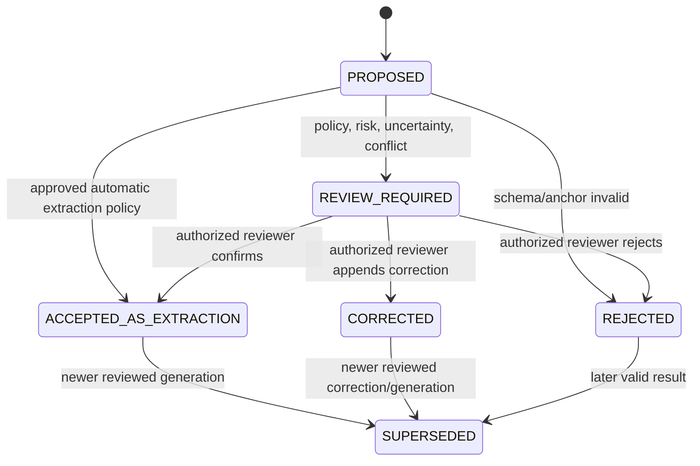

# Phase 1 Extraction and Evidence Contract

| Field | Value |
|---|---|
| Document ID | `DIT-EXT-001` |
| Version | `0.1` |
| Status | `DRAFT — provider-neutral; product-owner and architecture approval required` |
| Product phase | Phase 1 — Personal and Family |
| Primary architecture | `ARCH-SOL-001` rules `ARCH-P1-002`–`005`, `ARCH-P1-013`–`018`, `ARCH-P1-024`–`030`, `ARCH-P1-033`–`035`, `ARCH-P1-039`–`045` |
| Domain alignment | `ARCH-DOM-001` rules `DOM-P1-019`–`025`, `DOM-P1-048`–`055`, `DOM-P1-057` |
| Open decisions | `DEC-035`, `DEC-036`, `DEC-040` |
| Updated | 26 August 2026 |

## 1. Purpose and authority

This contract defines extraction schemas, typed structured output, evidence anchors, processor/model provenance, confidence calibration, review and correction, reprocessing generations, security, and safe failure behavior. It is provider-neutral and treats every OCR/model/parser result as untrusted proposed interpretation until validated and reviewed under the applicable contract.

It refines these exact requirements:

- `REQ-P1-ING-005`, `REQ-P1-ING-006`, `REQ-P1-ING-007`, `REQ-P1-ING-008`;
- `REQ-P1-FCT-001`, `REQ-P1-FCT-003`, `REQ-P1-FCT-004`, `REQ-P1-FCT-005`, `REQ-P1-FCT-006`;
- `REQ-P1-SRCH-002`, `REQ-P1-SRCH-004`, `REQ-P1-SRCH-005`;
- `REQ-P1-AI-001`, `REQ-P1-AI-003`, `REQ-P1-AI-004`, `REQ-P1-AI-005`, `REQ-P1-AI-006`, `REQ-P1-AI-007`;
- `REQ-P1-TRUST-002`, `REQ-P1-TRUST-003`, `REQ-P1-TRUST-004`, `REQ-P1-TRUST-009`; and
- `REQ-P1-CFG-001`, `REQ-P1-CFG-002`.

Feature traceability: `FEAT-P1-009`, `FEAT-P1-010`, `FEAT-P1-011`, `FEAT-P1-013`, `FEAT-P1-014`.

Use-case traceability: `UC-P1-002`, `UC-P1-003`, `UC-P1-004`, `UC-P1-005`, `UC-P1-007`, `UC-P1-008`, `UC-P1-013`; acceptance scenarios `AC-UC-P1-002-03`, `AC-UC-P1-003-03`, `AC-UC-P1-004-02`, `AC-UC-P1-004-03`, `AC-UC-P1-005-01`, `AC-UC-P1-005-04`, `AC-UC-P1-013-01`, and umbrella `AC-P1-RAG-001`, `AC-P1-AI-001`, `AC-P1-SEC-001`.

This contract does not select the initial launch schemas under `DEC-035`, approve clinical processing under `DEC-036`, or approve a provider/residency route under `DEC-040`.

## 2. Boundary and terminology

| Term | Meaning |
|---|---|
| `ExtractionSchema` | Immutable versioned contract describing fields, types, cardinality, validation, evidence, sensitivity, calibration, and review policy for a document-type profile. |
| `FieldDefinition` | Stable semantic field identity within a schema family. Labels and JSON paths may evolve without recycling the field ID. |
| `ExtractionRun` | One provider-neutral capability execution over exact immutable inputs and configuration versions. It corresponds to an ingestion `StageRun`. |
| `DocumentAnalysis` | Versioned domain aggregate binding one or more immutable analysis runs/outputs to exact document-version inputs, schemas, capability provenance, review decisions, and supersession lineage. Extraction uses `analysis_kind=EXTRACTION`. |
| `ExtractionResultSet` | Immutable validated structured output contained by one extraction `DocumentAnalysis`, including field proposals, anchors, validation issues, confidence, and provenance. It is not a separate aggregate. |
| `FieldResult` | One proposed, corrected, accepted-as-extraction, rejected, or superseded value for a field and occurrence index. |
| `EvidenceAnchor` | Stable resolver contract pointing to exact immutable document evidence and a precise visual/text/structural location. |
| `ReviewDecision` | Additive human/policy decision over a result; it does not mutate the original provider output. |
| `DerivedOccurrenceProposal` | Proposed fact/entity/obligation occurrence referencing accepted-as-extraction field results. It is not a canonical fact or fulfilled requirement. |
| `ActiveInterpretationReference` | Revisioned pointer from a document version to the result generation selected for a named downstream purpose. Selection is separate from generation creation. |

The evidence and interpretation capability logically owns `DocumentAnalysis`, extraction results, and review state. `ArtifactRecord` owns immutable artifact bytes and integrity/isolation; `LogicalDocument` owns logical document/version identity and lifecycle; `CanonicalFact` owns fact resolution; `RequirementCase` owns fulfilment; and approval remains a separate workflow.

## 3. Extraction schema model

### 3.1 Schema identity and lifecycle

Every schema contains:

| Field | Contract |
|---|---|
| `schema_id` | Stable semantic identifier independent of provider, model, JSON Schema file path, document label, and version. |
| `schema_version` | Immutable semantic/contract version. Changed field semantics require a new version. |
| `document_type_profile_refs` | Exact compatible profile constraints; no schema applies merely from category membership. |
| `jurisdiction_applicability` | Neutral predicates and exact jurisdiction-pack references where relevant. |
| `field_definitions` | Ordered or keyed definitions with stable field IDs and deterministic paths. |
| `output_contract_ref` | Versioned machine-readable structured-output schema. |
| `calibration_policy_refs` | Per-capability/field calibration versions and confidence bands. |
| `review_policy_ref` | Risk, sensitivity, confidence, conflict, and mandatory-review routing. |
| `security_profile_ref` | Field sensitivity, adapter payload, retention, residency, telemetry, and authorization requirements. |
| `governance` | Owner, evidence, valid time, recorded time, approval, change history, prior-version linkage. |

Schema publication follows the governed configuration lifecycle defined by `DIT-TAX-001`. An activated schema version is immutable; correction creates a new version and a replay/impact plan.

### 3.2 Field definition

| Field property | Required meaning |
|---|---|
| `field_id` | Stable semantic identity; never inferred from localized label or provider name. |
| `path` | Deterministic structured-output path unique in the schema version. |
| `type_ref` | Scalar or composite type in section 4. |
| `cardinality` | `0..1`, `1..1`, `0..N`, or `1..N`; arrays preserve occurrence identity/order when meaningful. |
| `requiredness_class` | Distinguishes required for valid output shape, expected for review, and required for a later business rule. It cannot make missing evidence appear extracted. |
| `normalization_policy` | Locale/jurisdiction-aware canonical representation and preservation of source form. |
| `validation_rules` | Syntactic, semantic, cross-field, checksum, enumeration, date/range, and evidence-anchor rules. |
| `evidence_policy` | Minimum anchors, permitted anchor types, multi-anchor behavior, quote/region checks, and support granularity. |
| `sensitivity_ref` | Field-level handling policy; schema inheritance cannot weaken it. |
| `confidence_policy_ref` | Calibration and review thresholds for this capability/field/document-type slice. |
| `review_policy_ref` | Mandatory review conditions and permitted reviewer actions. |
| `downstream_mapping_refs` | Proposed fact/entity/obligation mappings; never direct canonical writes. |

## 4. Type system and cardinality

### 4.1 Scalar types

| Type | Canonical representation and constraints |
|---|---|
| `text` | Unicode string with declared normalization; source form preserved in protected result. |
| `boolean` | JSON boolean; ambiguous yes/no text is not coerced without a declared mapping. |
| `integer` | Arbitrary-range integer or string representation if platform limits require; no floating coercion. |
| `decimal` | Canonical base-10 string plus declared scale/precision policy; binary float MUST NOT be the authoritative value. |
| `money` | Object containing decimal-string `amount`, currency code, and optional source currency text; currency is never inferred silently from `$`. |
| `percentage` | Decimal-string value with explicit fraction/percent unit. |
| `local_date` | ISO 8601 calendar date without fabricated time or timezone. |
| `date_time` | ISO 8601 timestamp with explicit offset or a declared `offset_unknown` state. |
| `year_month` | `YYYY-MM`; no day is invented. |
| `duration` | ISO 8601 duration plus uncertainty where source granularity is incomplete. |
| `enum` / `code` | Stable code from a versioned code set; source label preserved separately. |
| `identifier` | Structured identifier with scheme/issuer/country and protected value. It is not a platform resource ID. |
| `uri` | Validated URI classified by sensitivity and scheme; never fetched solely because it appeared in content. |

### 4.2 Composite types

Schemas MAY compose versioned types such as `person_name`, `organization_name`, `postal_address`, `contact_point`, `party`, `period`, `monetary_amount`, `policy_reference`, `property_reference`, `vehicle_reference`, `obligation_proposal`, and `document_reference`. Composite components retain their own anchors, confidence, sensitivity, and missing/uncertain state when the evidence differs.

### 4.3 Presence semantics

The output contract MUST distinguish:

- field absent because no supported value was found;
- explicit source value meaning none/not applicable;
- present but unreadable or ambiguous;
- withheld because policy/authorization prevented processing;
- invalid provider output;
- extracted empty string where the schema explicitly permits it; and
- redacted display of a protected stored value.

`null`, missing, empty, unsupported, restricted, and not-applicable MUST NOT be interchangeable.

## 5. Evidence anchor contract

### 5.1 Required anchor envelope

Every source-derived material field or claim MUST have at least one validated anchor containing:

| Field | Meaning |
|---|---|
| `evidence_anchor_id` | Stable opaque anchor identity. |
| `workspace_id` | Explicit validated workspace scope. |
| `artifact_id` | Exact immutable source artifact. |
| `document_version_id` | Exact logical version when assigned; anchor remains resolvable by artifact if version linkage is later reviewed. |
| `source_representation_id` | Exact page-render, normalized-text, cell-grid, slide, or structural representation and version. |
| `anchor_type` | `TEXT_SPAN`, `PAGE_REGION`, `POLYGON`, `TABLE_CELL`, `SHEET_RANGE`, `SLIDE_REGION`, `STRUCTURAL_NODE`, or another approved versioned type. |
| `locator` | Type-specific location in section 5.2. |
| `source_digest` | Hash of the relevant immutable representation or protected quoted segment for integrity verification. |
| `support_role` | `DIRECT`, `CONTEXT`, `QUALIFIER`, `CONTRADICTORY`, or another approved evidence role. |
| `created_by_run_id` | Exact processor/reviewer run that created the anchor. |
| `sensitivity_ref` | Handling/access policy for the anchor and any protected quote. |

### 5.2 Locator rules

| Locator | Contract |
|---|---|
| Page | Store zero-based `page_index` for machine identity and optional source `page_label` for display. Page count/index is bound to the exact representation version. |
| Text span | Store `start`, exclusive `end`, declared `offset_unit` (`UNICODE_CODE_POINT` or `UTF8_BYTE`), normalized-text representation ID/version, normalization policy, and optional protected quote hash. |
| Region/polygon | Use a declared coordinate space. The default neutral form is normalized `[0,1]` coordinates with top-left origin after declared display rotation; original dimensions, rotation, crop/media box, and transform version remain available. |
| Table cell | Store table/grid representation, row/column identity, spans, header relationship where available, and page/region fallback. |
| Sheet range | Store workbook artifact/version, sheet stable identity/name at extraction time, A1 or declared range convention, cell/formula/value mode, and representation version. |
| Slide/shape | Store slide index/label, shape identity where stable, region/polygon, and reading-order/representation version. |
| Structural node | Store parser representation/version and deterministic path/node identity plus page/region or text fallback where available. |

Anchor resolvers MUST reauthorize the document version, artifact, field, region/quote, and requested purpose when an anchor is opened. A valid anchor can become inaccessible after revocation or deletion without becoming fabricated.

### 5.3 Multiple and contradictory anchors

- One value MAY require several anchors, for example an amount plus its qualifier or a clause continued across pages.
- A result MUST distinguish direct support from context or contradiction.
- Combining anchors MUST preserve their individual evidence roles; it MUST NOT concatenate protected text into ordinary metadata.
- A field without the minimum required anchor cannot be promoted as a supported extraction or material citation.

## 6. Processor, model, and transformation provenance

Every `ExtractionRun`, owning `DocumentAnalysis`, and `ExtractionResultSet` MUST record, as applicable:

- registered capability ID/version;
- adapter ID/version and opaque provider/model/processor identifier;
- OCR/layout/native-parser, preprocessing, render, and normalized-text versions;
- document-type profile, extraction schema, structured-output schema, taxonomy, jurisdiction pack, code sets, calibration, and review policy versions;
- model, prompt/template, tool, and decoding/configuration versions without placing secrets in the record;
- exact input artifact, document version, page/range selection, prior generation, and input digest;
- actor/workload, workspace, purpose, authorization/policy decision reference, consent, residency route, retention/data-processing class;
- start/end/recorded times, attempt, causation/correlation, cost/usage class, timeout/cancellation, and provider error category; and
- output validation result, confidence/calibration, review route, and result-generation identity.

Provider output MUST NOT be treated as provenance for itself; the platform records the request, adapter, validation, and evidence resolution independently.

## 7. Draft normative rules

### 7.1 Schema and field rules

- `DIT-EXT-P1-001` — Extraction schemas and field definitions MUST have stable IDs and immutable versions independent of provider output names, prompts, document labels, and code paths.
- `DIT-EXT-P1-002` — An extraction run MUST bind one exact document-type profile and extraction-schema version selected through the governed taxonomy contract.
- `DIT-EXT-P1-003` — Field type, cardinality, presence semantics, normalization, validation, sensitivity, evidence, confidence, and review policy MUST be explicit and machine-validatable.
- `DIT-EXT-P1-004` — Required output shape MUST NOT be used to fabricate a value. Missing required evidence produces a validation/review issue, not a guessed default.
- `DIT-EXT-P1-005` — Locale/jurisdiction normalization MUST preserve the protected source form and declare transformations; ambiguous dates, currencies, decimal separators, identifiers, and timezones remain uncertain.
- `DIT-EXT-P1-006` — Composite and repeated fields MUST preserve stable occurrence identity, ordering where meaningful, component-level anchors, and independent confidence/sensitivity.
- `DIT-EXT-P1-007` — Activated schemas MUST pass syntactic, referential, semantic, security, compatibility, example, and replay-impact validation before use.

### 7.2 Evidence rules

- `DIT-EXT-P1-008` — Every source-derived material field, entity/fact/obligation proposal, comparison interpretation, and surfaced material claim MUST reference at least one stable authorized evidence anchor at the granularity asserted.
- `DIT-EXT-P1-009` — An anchor MUST resolve to the exact immutable artifact and source representation; document version, page/span/coordinates or structural location, representation version, and integrity digest MUST be explicit where applicable.
- `DIT-EXT-P1-010` — Text offset unit, coordinate space, origin, scale, rotation, and transformation version MUST be declared; provider-native coordinates cannot enter the neutral contract without conversion metadata.
- `DIT-EXT-P1-011` — Multiple, contextual, qualifying, and contradictory anchors MUST retain separate evidence roles and MUST NOT be collapsed into an unsupported single quote or confidence score.
- `DIT-EXT-P1-012` — Anchor creation and access MUST enforce workspace, resource, version, field/region, purpose, current grant/policy, deletion fence, and residency/processing policy.
- `DIT-EXT-P1-013` — If an anchor cannot be validated, resolved, or authorized, the associated field/claim MUST be unsupported, restricted, stale, or unavailable rather than presented with a fabricated citation.

### 7.3 Structured output and provider validation

- `DIT-EXT-P1-014` — Provider/parser/model output MUST validate against a versioned structured-output contract before it is stored in a `DocumentAnalysis` result generation or used by a downstream capability.
- `DIT-EXT-P1-015` — Output validation MUST verify workspace/input generation, schema/version, field IDs/paths, types/cardinality, anchors, provenance, confidence/calibration, allowed reason codes, size/complexity, and prohibited instruction/action content.
- `DIT-EXT-P1-016` — Provider text, document instructions, metadata, source links, and generated tool requests are untrusted data and MUST NOT change schema, authorization, tool scope, evidence, or action authority.
- `DIT-EXT-P1-017` — Protected raw/source form MAY be retained for review when policy permits, but ordinary events, logs, metrics, errors, and analytics MUST use safe references and reason codes rather than values or evidence text.
- `DIT-EXT-P1-018` — Entity, fact, dependency, obligation, date, or action outputs are proposals only. They MUST pass their owning capability's validation and resolution workflow before becoming canonical or consequential state.

### 7.4 Confidence, calibration, and review

- `DIT-EXT-P1-019` — Confidence MUST be calibrated for the capability, schema/field, document type, language/jurisdiction, and applicable evaluation slice. A single global uncalibrated score is forbidden.
- `DIT-EXT-P1-020` — A result MAY retain provider raw score, but user/workflow decisions MUST use the approved calibration ID/version, calibrated value/band, validation state, evidence quality, and review reasons.
- `DIT-EXT-P1-021` — Confidence is not evidence, authority, applicability, accuracy proof, or authorization. High confidence cannot bypass mandatory review or make OCR/model output canonical truth.
- `DIT-EXT-P1-022` — Review routing MUST consider field sensitivity/criticality, calibrated confidence, conflicts, missing/weak anchors, schema violations, document/type uncertainty, policy-selected risk, and downstream consequence.
- `DIT-EXT-P1-023` — Review states MUST distinguish `PROPOSED`, `REVIEW_REQUIRED`, `ACCEPTED_AS_EXTRACTION`, `CORRECTED`, `REJECTED`, and `SUPERSEDED`. Accepting extraction does not accept a fact or fulfil a requirement.
- `DIT-EXT-P1-024` — A review decision MUST record reviewer authority, exact result/anchor set, decision, reason, policy/version, transaction time, and safe audit correlation; material input change invalidates stale review.

### 7.5 Correction, reprocessing, and generations

- `DIT-EXT-P1-025` — Manual correction MUST append a new `FieldResult`/review decision linked to the prior result. Provider output and prior human decisions MUST NOT be mutated.
- `DIT-EXT-P1-026` — A correction anchored to document evidence MUST retain selected/added anchors. A value supplied without source-document evidence MUST be labelled a manual assertion occurrence and cannot be cited as document-extracted evidence.
- `DIT-EXT-P1-027` — Reprocessing under any changed parser, schema, taxonomy, preprocessing, prompt, model, calibration, or policy version MUST create a new immutable run and `DocumentAnalysis` result generation with exact lineage.
- `DIT-EXT-P1-028` — Prior generations remain reconstructable subject to retention/deletion. Selecting an active generation for a purpose uses an expected document/version revision and MUST NOT allow a late older result to overwrite a newer selection.
- `DIT-EXT-P1-029` — Reprocessing differences MUST be reviewable at field, anchor, classification, validation, confidence, and downstream-proposal level; absence in a new run does not silently delete earlier evidence/history.

### 7.6 Security, failure, and deletion

- `DIT-EXT-P1-030` — Authorization applies independently to schema/profile metadata, result existence, field value, anchor, quote/region, confidence, conflict, review action, derived proposal, comparison, and export.
- `DIT-EXT-P1-031` — Adapters MUST receive the minimum scoped pages/regions/fields/content required for one registered capability and an approved purpose, consent, retention, and residency route; unsupported routing is blocked or withheld.
- `DIT-EXT-P1-032` — Extraction and evidence telemetry MUST exclude raw filenames where sensitive, document text/images, field values, queries, prompts/answers, quotes, unrestricted URLs, and credentials.
- `DIT-EXT-P1-033` — Timeout, refusal, invalid schema, missing anchor, provider unavailability, cost limit, unsupported type, partial page failure, or cancellation MUST produce explicit retry/review/degraded state and MUST NOT fabricate success or an empty authoritative result.
- `DIT-EXT-P1-034` — Partial extraction MUST declare page/region/field coverage, failures, truncation, and uncertainty. A successful subset MUST NOT imply the whole document was processed.
- `DIT-EXT-P1-035` — Deletion fences, revocation, quarantine, and policy holds MUST be checked before processing, result activation, anchor resolution, reprocessing, projection, and export; late results cannot resurrect protected content.

## 8. Confidence and review flow



No state in this diagram means `FACT_ACCEPTED`, `REQUIREMENT_FULFILLED`, `ACTION_APPROVED`, or `EVIDENCE_VERIFIED`; those are owned elsewhere.

### 8.1 Calibration record

| Field | Meaning |
|---|---|
| `calibration_id`, `version` | Immutable calibration contract used for routing/evaluation. |
| `capability_id`, `schema_id`, `field_id` | Scope; wildcards require evidence that aggregation is valid. |
| `document_type_profile`, `locale`, `jurisdiction`, `quality_slice` | Evaluation population constraints. |
| `method` | Provider-neutral method descriptor and evaluation dataset/version. |
| `bands` | Named calibrated intervals and meaning; boundaries are exact and non-overlapping. |
| `review_thresholds` | Policy references, not hard-coded global values. |
| `effective_time`, `recorded_time`, `owner`, `approval` | Governance and reconstruction. |

## 9. Structured output contract and example

### 9.1 Minimum result-set envelope

```json
{
  "document_analysis_id": "opaque-document-analysis-id",
  "analysis_kind": "EXTRACTION",
  "result_set_id": "opaque-result-generation-id",
  "workspace_id": "opaque-workspace-id",
  "artifact_id": "opaque-immutable-artifact-id",
  "document_version_id": "opaque-document-version-id",
  "input_generation": "opaque-processing-generation-id",
  "document_type_profile": {
    "id": "doctype.coverage.generic_policy",
    "version": "0.1.0-draft"
  },
  "extraction_schema": {
    "id": "extract.coverage_policy",
    "version": "0.1.0-draft"
  },
  "run": {
    "capability_id": "capability.document_extract",
    "capability_version": "1.0",
    "adapter_id": "provider-neutral-adapter-ref",
    "adapter_version": "1.0",
    "processor_model_ref": "opaque-provider-model-ref",
    "calibration_ref": "calibration.coverage_policy.v1",
    "started_at": "2026-08-26T01:02:03Z",
    "completed_at": "2026-08-26T01:02:05Z"
  },
  "fields": [
    {
      "field_result_id": "opaque-field-result-id",
      "field_id": "coverage.policy_number",
      "occurrence_id": "opaque-occurrence-id",
      "value": {
        "type": "identifier",
        "scheme": "synthetic-policy-number",
        "protected_value": "SYNTHETIC-0001"
      },
      "source_form_ref": "protected-source-form-id",
      "anchors": [
        {
          "evidence_anchor_id": "opaque-anchor-id",
          "artifact_id": "opaque-immutable-artifact-id",
          "document_version_id": "opaque-document-version-id",
          "source_representation_id": "opaque-page-render-v1",
          "anchor_type": "PAGE_REGION",
          "locator": {
            "page_index": 0,
            "coordinate_space": {
              "unit": "NORMALIZED_0_1",
              "origin": "TOP_LEFT",
              "rotation_degrees": 0
            },
            "polygon": [[0.10, 0.12], [0.42, 0.12], [0.42, 0.17], [0.10, 0.17]]
          },
          "source_digest": "sha256:illustrative-only",
          "support_role": "DIRECT"
        }
      ],
      "confidence": {
        "provider_raw_score": 0.97,
        "calibrated_probability": 0.91,
        "band": "HIGH",
        "calibration_ref": "calibration.coverage_policy.v1"
      },
      "review_state": "REVIEW_REQUIRED",
      "review_reasons": ["POLICY_SELECTED_REVIEW"]
    }
  ],
  "coverage": {
    "pages_expected": 3,
    "pages_processed": 3,
    "truncated": false,
    "failures": []
  },
  "validation": {
    "output_schema_valid": true,
    "anchor_resolution_valid": true,
    "issues": []
  },
  "example_only": true
}
```

The example is synthetic and non-activatable. Real protected values are never stored in ordinary logs or analytics, and `provider_raw_score` alone cannot route or approve the field.

## 10. Validation gates

### 10.1 Schema validation

- stable IDs and immutable version metadata are valid;
- every field path/type/cardinality/code set/normalization/validation/sensitivity/evidence/calibration/review reference resolves;
- inheritance/recursion is bounded and acyclic;
- examples validate and are marked non-activatable;
- a schema cannot weaken the document-type sensitivity or clinical policy;
- provider-specific field names exist only in adapter mappings, not core semantic IDs; and
- compatibility classification identifies additive, review-impacting, replay-required, or breaking change.

### 10.2 Result validation

- workspace, artifact, document version, input generation, schema/profile, and run identities match the authorized request;
- fields are known, correctly typed, within cardinality/complexity limits, and free of undeclared keys;
- source form/normalization and missing/null/restricted semantics are valid;
- required anchors resolve with correct representation, index/range/coordinates, integrity, support role, and current policy;
- confidence references the exact approved calibration and lies within valid ranges/bands;
- review state/reasons are allowed by policy;
- page/region/field coverage and partial failures are complete; and
- output contains no command, approval, grant, arbitrary URL fetch, or schema mutation disguised as data.

### 10.3 Review and activation validation

- reviewer has current field/result/anchor/action authority;
- the review binds the exact result generation and anchor set;
- correction value and evidence/manual-assertion classification are explicit;
- stale review after reprocessing, document-version change, access revocation, or policy change is rejected/rerouted;
- active interpretation selection uses expected aggregate revision; and
- downstream fact/entity/obligation proposals retain exact accepted-as-extraction result and anchor lineage.

## 11. Failure and degraded behavior

| Failure | Required behavior |
|---|---|
| Schema unavailable/incompatible | Stop result generation or route to explicit unsupported/review state; do not select a nearby schema silently. |
| Provider timeout/unavailable/cost limit | Preserve original/prior generation; record retryable or explicit degraded state; deterministic/manual paths remain available where approved. |
| Invalid structured output | Reject the generation, retain restricted validation evidence, retry/fallback only under contract. |
| Missing/invalid anchor | Field/claim remains unsupported or review-required; no citation is manufactured. |
| Partial page failure | Persist coverage and successful proposals only with explicit incompleteness; do not claim document-wide extraction. |
| Low/uncalibrated confidence | Route to review or unsupported; do not map raw score to a universal label. |
| Conflicting fields/anchors | Preserve each proposal/evidence role and open conflict/review; do not average values. |
| Manual correction without source anchor | Record manual assertion and reviewer provenance; do not present as extracted/cited document evidence. |
| Authorization revoked | Stop result/anchor disclosure and reauthorize queued review/projection/export; retained processing follows approved purpose/retention policy. |
| Quarantine/policy hold/deletion | Block processing and activation; late output cannot escape isolation or fence. |
| Comparison cannot establish change | Return `INDETERMINATE` with exact source versions/coverage; never claim unchanged. |

## 12. Security, privacy, audit, and telemetry

- Extraction content is restricted workspace data. Adapters and workers have no ambient browse access and no authority to create facts, fulfil requirements, approve actions, or follow document instructions.
- Field, result, anchor, quote/region, review task, confidence, conflict, comparison, and derived proposal may each require a distinct authorization decision.
- Anchor rendering MUST minimize surrounding content and apply redaction; a small authorized region cannot be used to fetch an entire restricted page without policy.
- Ordinary audit records safe IDs for artifact/version, run/result/field/anchor, schema/profile/calibration, reviewer decision, policy, failure, and correlation. Protected values/quotes remain in controlled evidence stores.
- Telemetry may include pseudonymous workspace/document, type/schema/field ID, confidence band, review route/outcome, coverage, latency/cost/failure class, and synthetic marker under approved schemas. It excludes content and sensitive values.

Relevant provisional metrics are `MET-P1-003`, `MET-P1-010`, `MET-P1-011`, `MET-P1-012`, `MET-P1-018`, `MET-P1-020`, `MET-P1-021`, and `MET-P1-022`.

## 13. Rule traceability

| Rule IDs | Requirement links | Feature links | Use-case links |
|---|---|---|---|
| `DIT-EXT-P1-001`–`DIT-EXT-P1-007` | `REQ-P1-ING-005`, `REQ-P1-ING-006`, `REQ-P1-CFG-001`, `REQ-P1-CFG-002` | `FEAT-P1-007`, `FEAT-P1-009` | `UC-P1-002`, `UC-P1-018` |
| `DIT-EXT-P1-008`–`DIT-EXT-P1-013` | `REQ-P1-ING-005`, `REQ-P1-FCT-006`, `REQ-P1-SRCH-002`, `REQ-P1-SRCH-004` | `FEAT-P1-009`, `FEAT-P1-011`, `FEAT-P1-013` | `UC-P1-002`, `UC-P1-004`, `UC-P1-005`, `UC-P1-013` |
| `DIT-EXT-P1-014`–`DIT-EXT-P1-018` | `REQ-P1-AI-001`, `REQ-P1-AI-003`, `REQ-P1-AI-005`, `REQ-P1-AI-006`, `REQ-P1-AI-007` | `FEAT-P1-014` | `UC-P1-002`, `UC-P1-004`, `UC-P1-005`, `UC-P1-007` |
| `DIT-EXT-P1-019`–`DIT-EXT-P1-024` | `REQ-P1-ING-007`, `REQ-P1-AI-004`, `REQ-P1-FCT-003`, `REQ-P1-FCT-004` | `FEAT-P1-009`, `FEAT-P1-010`, `FEAT-P1-014` | `UC-P1-002`, `UC-P1-004`, `UC-P1-008` |
| `DIT-EXT-P1-025`–`DIT-EXT-P1-029` | `REQ-P1-ING-008`, `REQ-P1-FCT-001`, `REQ-P1-FCT-003`, `REQ-P1-SRCH-005` | `FEAT-P1-009`, `FEAT-P1-010`, `FEAT-P1-013` | `UC-P1-002`, `UC-P1-003`, `UC-P1-004`, `UC-P1-005` |
| `DIT-EXT-P1-030`–`DIT-EXT-P1-035` | `REQ-P1-FCT-006`, `REQ-P1-TRUST-002`, `REQ-P1-TRUST-003`, `REQ-P1-TRUST-004`, `REQ-P1-TRUST-009` | `FEAT-P1-006`, `FEAT-P1-011`, `FEAT-P1-014` | `UC-P1-002`, `UC-P1-005`, `UC-P1-013` |

## 14. Validation and test obligations

Tests and synthetic fixtures MUST cover:

1. every scalar/composite type, cardinality, missing/null/restricted/not-applicable state, normalization ambiguity, code-set version, and cross-field rule;
2. text spans using both declared units, regions/polygons under rotation/crop, page labels/indexes, tables, sheets, slides, structural nodes, multiple/qualifying/contradictory anchors, and resolver integrity failure;
3. schema/provider unknown fields, wrong types, excessive arrays/depth, invalid coordinates/offsets, wrong workspace/artifact/generation, missing provenance, embedded instructions, and prohibited action output;
4. provider/parser/model versions, timeouts, invalid output, partial page failure, retry/fallback, cancellation, cost limit, and replacement adapter conformance;
5. calibrated thresholds by field/document/evaluation slice, low/high confidence, miscalibration detection, mandatory review, and proof that high confidence cannot bypass review;
6. confirm, correct with source anchor, manual assertion without anchor, reject, supersede, stale review, concurrent review, and review after reprocessing;
7. reprocessing under changed parser/schema/prompt/model/calibration/policy, generation comparison, active-generation concurrency, rollback/forward repair, and prior-history preservation;
8. field/anchor/quote authorization, revocation, restricted-result existence, minimal surrounding context, cross-workspace denial, quarantine/clinical hold, deletion fence, and export filtering;
9. citation support at asserted granularity, inaccessible/revoked citation, comparison `INDETERMINATE`, and insufficient-evidence behavior; and
10. audit completeness and automated scanning proving no content, values, quotes, prompts, credentials, or signed URLs enter ordinary telemetry.

No launch extraction schema can be considered ready until `DEC-035` selects it and its document-type-specific gold fixtures, calibration, error analysis, privacy review, and acceptance thresholds are approved.
