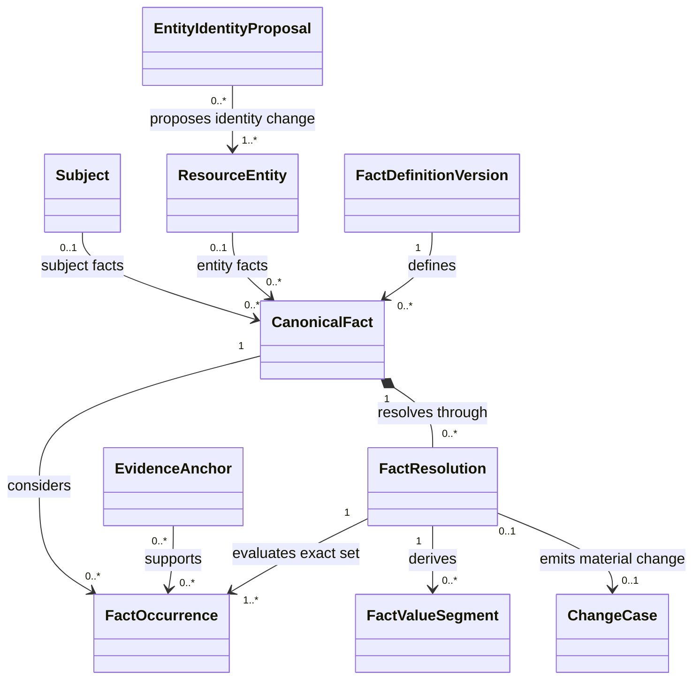
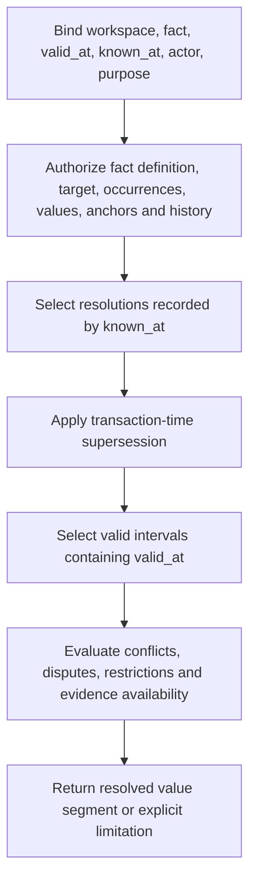
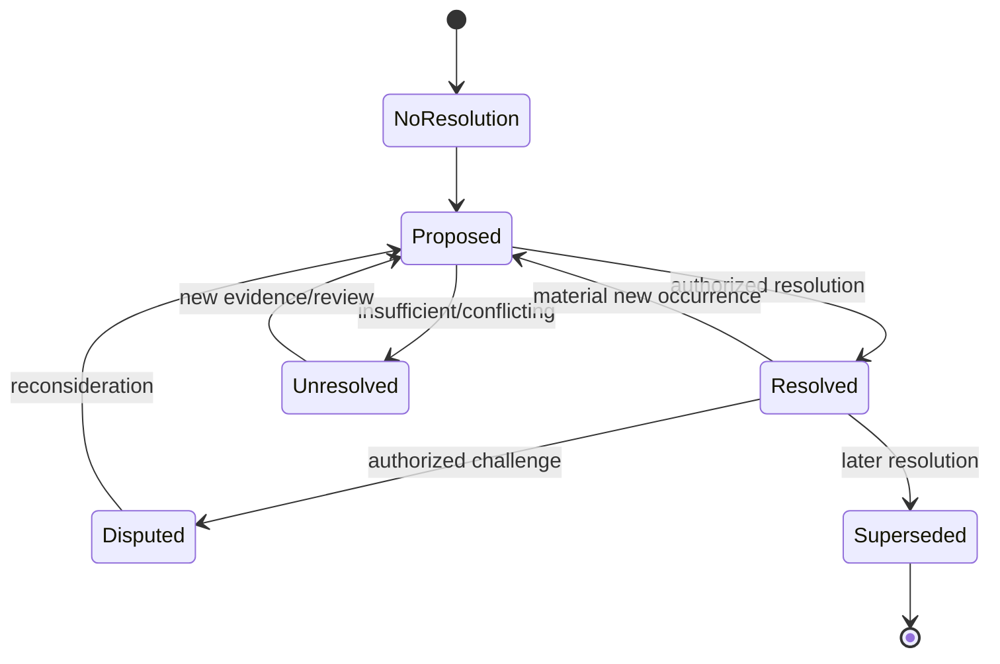

# Phase 1 Facts and Entities Contract

| Field | Value |
|---|---|
| Document ID | `DIT-FCT-001` |
| Version | `0.1` |
| Status | `DRAFT — provider-neutral; product-owner, architecture, security, and privacy approval required` |
| Product phase | Phase 1 — Personal and Family |
| Architecture alignment | `ARCH-SOL-001`; `ARCH-DOM-001` rules `DOM-P1-026`–`033`; `ARCH-DATA-001` rules `DATA-P1-011`–`029` |
| Security alignment | `SEC-ARCH-001`, `SEC-AUTH-001`, `SEC-PRIV-001`, `SEC-AUD-001` |
| Related DIT contracts | `DIT-TAX-001`, `DIT-ING-001`, `DIT-EXT-001`, `DIT-VER-001` |
| Decisions and gaps | `DEC-003`, `DEC-004`, `DEC-006`–`009`, `DEC-020`, `DEC-022`, `DEC-023`; `GAP-002`–`004`, `GAP-009` |
| Updated | 26 August 2026 |

## 1. Purpose and authority

This contract defines provider-neutral facts and household-resource entities: versioned fact definitions, immutable occurrences, append-only resolutions, bitemporal value segments, conflict/dispute behavior, entity identity and merge/split proposals, sensitive-field handling, change emission, and deletion-compatible provenance.

Exact product traceability:

- requirements: `REQ-P1-FCT-001`–`REQ-P1-FCT-006`, `REQ-P1-ING-005`, `REQ-P1-ING-007`, `REQ-P1-ING-008`, `REQ-P1-GPH-001`–`REQ-P1-GPH-004`, `REQ-P1-ACT-001`, `REQ-P1-ACT-005`, `REQ-P1-ACT-006`, `REQ-P1-AI-003`–`REQ-P1-AI-005`, `REQ-P1-TRUST-002`–`REQ-P1-TRUST-004`, and `REQ-P1-CFG-001`–`REQ-P1-CFG-004`;
- features: `FEAT-P1-009`, `FEAT-P1-010`, `FEAT-P1-011`, `FEAT-P1-012`, `FEAT-P1-018`, `FEAT-P1-019`, `FEAT-P1-022`;
- use cases: `UC-P1-003`, `UC-P1-004`, `UC-P1-005`, `UC-P1-007`, `UC-P1-012`, `UC-P1-013`, `UC-P1-018`; and
- acceptance: `AC-UC-P1-004-01`–`AC-UC-P1-004-04`, `AC-UC-P1-005-01`, `AC-UC-P1-007-01`, `AC-UC-P1-012-01`, `AC-UC-P1-013-01`–`AC-UC-P1-013-03`, `AC-P1-E2E-001`, `AC-P1-RAG-001`, `AC-P1-SEC-001`, and `AC-P1-AI-001`.

All RFC 2119 terms remain draft. This contract does not make model/OCR output canonical truth, determine a professional/legal conclusion, infer authority from family relationships, or choose a database, event store, entity-resolution product, or identifier provider.

## 2. Domain ownership and records

| Record | Authority and mutability |
|---|---|
| `FactDefinitionVersion` | Immutable global/reference configuration defining semantic identity, value schema, subject/entity kinds, cardinality, sensitivity, temporal precision, occurrence eligibility, resolution/conflict policy, and review/approval requirements. |
| `CanonicalFact` | Workspace aggregate with stable `FactId`, exact subject or `ResourceEntity`, definition family, opaque instance discriminator, aggregate revision, occurrence membership, resolution history, and conflict state. Its current value is derived, not overwritten. |
| `FactOccurrence` | Immutable assertion from a document/evidence anchor, manual statement, connector, event, or governed source, with asserted valid time, recorded time, source form, confidence/review, and provenance. |
| `FactResolution` | Append-only promotion, retention, correction, dispute, tolerance, or supersession decision with exact occurrence set, value/effect, valid interval, actor/workload, reason, evidence, policy/approval, and transaction time. |
| `FactValueSegment` | Rebuildable bitemporal conformed view derived from eligible resolutions, retaining source-resolution IDs and conflict/coverage state. It is not independent truth. |
| `ResourceEntity` | Stable workspace identity for property, vehicle, provider, policy, organisation, or another configured resource kind, independent of names and occurrences. |
| `EntityIdentityProposal` | Immutable candidate match/create/merge/split/correction assertion with evidence, score/calibration, method/version, policy, and review state. It cannot mutate entity identity by itself. |
| `ChangeCase` | Stable idempotent record for one material fact/entity transition. It is emitted only after the owning decision commits and does not claim downstream impact completion. |

Subjects and `ResourceEntity` records are distinct. A subject represents a person/entity described by household data and may have no login; an entity represents another configured resource. Neither display names nor source occurrences are identity.

## 3. Fact-definition contract

Every enabled `FactDefinitionVersion` declares:

| Group | Required fields |
|---|---|
| Identity | stable `fact_definition_id`, immutable version, semantic name, owner, publication/effective/supersession state |
| Target | allowed subject/entity kinds, workspace types, opaque instance-key rules, cardinality and uniqueness |
| Value | exact scalar/composite schema, normalization, code-set/currency/unit/locale rules, source-form preservation, missing/unknown/redacted semantics |
| Time | valid-time precision, interval/point semantics, timezone/calendar needs, uncertain-time representation, overlap policy |
| Occurrence | eligible source kinds, required evidence anchors, manual assertion policy, connector/source requirements, confidence/calibration/review |
| Resolution | allowed outcomes, minimum evidence, conflict/tolerance/dispute rules, authorized actions, approval/consequence class, material-change policy |
| Privacy | `P2-HOUSEHOLD`–`P4-RESTRICTED` class, field/anchor/disclosure policy, processor purpose/region, telemetry prohibition, deletion lineage |
| Governance | jurisdiction/applicability, source evidence, validation, review/approval, package version, change/impact/replay plan |

Definition publication follows `ConfigurationPackage`. A changed value meaning, target identity, temporal rule, sensitivity, or resolution policy creates a new immutable version and an explicit compatibility/replay plan; “latest” is never stored as historical evidence.

## 4. Occurrence and provenance contract

### 4.1 Occurrence envelope

Every `FactOccurrence` records:

- `WorkspaceId`, `FactOccurrenceId`, target subject/entity reference and exact `FactDefinitionVersion`;
- source kind and stable source identity: exact `EvidenceAnchor`, manual assertion, connector item/version, event, or `SourceObservation`;
- protected source form and normalized candidate value under the definition schema;
- asserted `valid_from`/`valid_to` or explicit unknown/uncertain/point-time representation;
- `occurred_at`, `observed_at` where applicable, and platform `recorded_at`;
- acquisition, artifact/document/analysis/parser/model/schema/tool/config versions and transformation lineage;
- confidence/calibration, evidence quality, review state, creator actor/workload, purpose/consent/region route, and privacy class;
- correction/supersession/dispute lineage between occurrences without mutation; and
- safe audit correlation, deletion generation, and accessibility state.

### 4.2 Occurrence source classes

| Source class | Required treatment |
|---|---|
| Document extraction | Exact `DocumentVersion`, `DocumentAnalysis`, field result, and `EvidenceAnchor`; accepting extraction does not resolve the fact. |
| Manual assertion | Actor, authority, asserted effective time, source-form/value, reason and optional supporting evidence; clearly labelled manual. |
| Connector occurrence | `Integration`, consent/purpose, provider namespace and external item/version, permission/revocation/retained-data state. |
| User/life event | Actor, event kind/version, occurred/effective-time evidence and verification state; event may initiate resolution but is not privileged truth. |
| Governed source | Exact immutable `SourceObservation`, parser/rule occurrence, declared authority/coverage and freshness context. |
| Derived inference | Registered capability, exact input occurrence/evidence set, model/tool/schema versions, calibration, review route; never self-approving. |

## 5. Bitemporal resolution

### 5.1 Resolution outcomes

| Outcome | Meaning |
|---|---|
| `ACCEPT_VALUE` | Accepts the stated value for an exact valid interval from a reviewed occurrence/evidence set. |
| `RETAIN_CURRENT` | Records that reviewed new evidence does not change the accepted segment; evidence remains. |
| `CORRECT_VALUE_OR_TIME` | Adds a new resolution correcting value or effective interval while retaining prior known-at history. |
| `DISPUTE` | Records an authorized challenge to a resolution/occurrence; does not delete or silently reverse it. |
| `TOLERATE_CONFLICT` | Intentionally keeps competing evidence unresolved for a declared interval/reason/policy. |
| `SUPERSEDE_RESOLUTION` | Replaces a prior decision in transaction time with explicit lineage and, where applicable, a different valid-time view. |
| `INSUFFICIENT` | Records that the exact reviewed evidence cannot support a resolution. |

### 5.2 Query algorithm

An eligible resolution is recorded no later than `known_at`, has not been superseded by another eligible decision known then, and applies to `valid_at`. Selection is never “newest upload wins.” Query output contains the exact definition, target, resolution and occurrence references, valid/transaction perspective, conflict/dispute state, evidence availability, authorization limitation, and reconstruction version.

### 5.3 Resolution states

The diagram describes a resolution view, not occurrence lifecycle. Occurrences remain immutable while retained.

## 6. Conflict and dispute model

Conflict dimensions remain separate:

- unequal candidate values for overlapping valid periods;
- incompatible subject/entity attribution;
- incompatible effective dates or temporal precision;
- contradictory source/evidence quality or authority;
- multiple resolutions applicable under the same known-at perspective;
- a disputed but not yet superseded decision;
- stale, deleted/unavailable, or inaccessible evidence; and
- schema/configuration incompatibility after reprocessing.

Conflict output distinguishes `UNRESOLVED`, `RESOLVED_WITH_PRESERVED_CONFLICT`, `DISPUTED`, `INTENTIONALLY_TOLERATED`, `RESTRICTED`, `INSUFFICIENT`, and `EVIDENCE_UNAVAILABLE`. Conflict existence is itself protected; minimal disclosure requires an explicit `SEC-AUTH-001` policy.

## 7. Entity identity and resolution

### 7.1 Identity rules

`ResourceEntity` identity is created by an explicit command under a configured entity-kind definition. Names, aliases, addresses, policy numbers, registrations, provider IDs, document mentions, vector similarity, and model output are occurrences/proposals—not the entity key.

| Proposal | Required outcome |
|---|---|
| `CREATE_NEW` | Create a new stable entity with exact evidence and reason; similarity to another entity remains visible. |
| `LINK_OCCURRENCE` | Attach an occurrence to an existing entity after endpoint, evidence, policy and concurrency validation. |
| `RENAME_OR_CORRECT_ATTRIBUTE` | Add a new attribute occurrence/resolution; stable entity ID and prior history remain. |
| `MERGE` | Create a reviewed identity decision and survivor/alias lineage without rewriting evidence; every affected fact/dependency/authorization/deletion reference is impact-assessed. |
| `SPLIT` | Create new explicit identities and re-attribution decisions for exact occurrences; prior mistaken view remains reconstructable. |
| `REJECT_MATCH` | Preserve candidate evidence and decision so the same unsupported merge is not repeatedly proposed without new input. |

Merge/split support is representational, not an unconditional end-user capability. The active entity-kind policy defines whether reversal, merge, or split is permitted and which approvals are required.

### 7.2 Resolution inputs

Entity candidates retain exact normalized and source forms, identifier schemes/issuers, temporal overlap, relationship context, evidence anchors, method/model/version, calibrated score, blocking/candidate-generation version, compared entity revisions, privacy class, and review reasons. Sensitive identifiers are never copied into ordinary telemetry or used as globally discoverable keys.

## 8. Draft normative rules

### 8.1 Definition, identity, and occurrences

- `DIT-FCT-P1-001` — Every canonical fact MUST use a stable `FactId` independent of its value and be scoped to one workspace, one subject or `ResourceEntity`, one fact-definition family, and a definition-governed opaque instance discriminator.
- `DIT-FCT-P1-002` — Fact and entity behavior MUST be driven by validated immutable definition versions; code MUST NOT hard-code launch facts, entity kinds, sensitivity, resolution, or jurisdiction rules.
- `DIT-FCT-P1-003` — `CanonicalFact`, `FactOccurrence`, `FactResolution`, `FactValueSegment`, `ResourceEntity`, evidence, document, connector, event, and governed-source identity MUST remain distinct.
- `DIT-FCT-P1-004` — A `FactOccurrence` MUST be immutable while retained and preserve exact source, value/schema, time, evidence, provenance, confidence/review, privacy, and supersession/correction lineage.
- `DIT-FCT-P1-005` — Correction of observed evidence MUST create a linked occurrence or resolution and MUST NOT rewrite source form, `recorded_at`, evidence anchors, processor provenance, or prior review.
- `DIT-FCT-P1-006` — Document, OCR, model, connector, manual, event, and governed-source outputs are occurrences/proposals only; repetition or high confidence cannot make them canonical truth.
- `DIT-FCT-P1-007` — Missing, unknown, uncertain, redacted, restricted, not-applicable, invalid, and explicit empty/none values MUST remain distinguishable under the fact-definition schema.

### 8.2 Bitemporal resolution and conflict

- `DIT-FCT-P1-008` — Promotion, retention, correction, dispute, tolerance, insufficiency, and supersession MUST be append-only `FactResolution` decisions over an exact occurrence set and expected aggregate revision.
- `DIT-FCT-P1-009` — Every resolution MUST retain actor/workload, authority/grant, reason code, evidence references, confidence, policy/configuration, approval where required, valid interval, recorded time, and supersession lineage.
- `DIT-FCT-P1-010` — Consequential fact interpretation MUST preserve valid/effective time separately from transaction/known time and use explicit half-open intervals or an approved point/uncertain-time type.
- `DIT-FCT-P1-011` — A retroactive correction MUST preserve what the platform previously knew; prior resolution and segment history cannot be overwritten to resemble current knowledge.
- `DIT-FCT-P1-012` — Current and historical queries MUST bind `valid_at` and `known_at` and return exact source resolution IDs, conflict/dispute state, evidence availability, policy/version and temporal perspective.
- `DIT-FCT-P1-013` — Overlapping, contradictory, stale, disputed, restricted, unavailable, and insufficient occurrences MUST remain represented; the system MUST NOT select a value merely to eliminate uncertainty.
- `DIT-FCT-P1-014` — Conflict states MUST distinguish unresolved, resolved-with-preserved-conflict, disputed, intentionally tolerated, restricted, insufficient, and evidence-unavailable outcomes.
- `DIT-FCT-P1-015` — Resolution policy MUST validate value schema, occurrence eligibility, temporal/cardinality constraints, evidence minimum, authority, review/approval, and current occurrence-set digest before commitment.
- `DIT-FCT-P1-016` — New material evidence after review or approval MUST invalidate or reroute the stale decision binding; it cannot be silently omitted from the resolution set.
- `DIT-FCT-P1-017` — `FactValueSegment` is a rebuildable projection of resolutions and MUST retain generation, source-resolution set, definition/policy version, build time, conflict state, deletion watermark, and coverage.

### 8.3 Entities and identity resolution

- `DIT-FCT-P1-018` — Subject and `ResourceEntity` identity MUST be independent of display names, aliases, source occurrences, content hashes, external identifiers, and model/vector similarity.
- `DIT-FCT-P1-019` — Entity create/link/rename/merge/split/reject decisions MUST be explicit, evidenced, policy-authorized, revision-guarded, additive, and privacy-safely audited.
- `DIT-FCT-P1-020` — An entity-resolution proposal MUST retain candidate-generation, normalization/matching method, model/rule/calibration versions, compared revisions, evidence, score/features by safe reference, uncertainty, and review state.
- `DIT-FCT-P1-021` — Entity merge MUST preserve source identities/history and explicit survivor/alias lineage; it MUST NOT repoint evidence, collapse unrelated entities, broaden authorization, or discard conflicting facts.
- `DIT-FCT-P1-022` — Entity split MUST identify exact re-attributed occurrences/relationships and preserve the prior known-at view; ambiguous attribution remains review-required.
- `DIT-FCT-P1-023` — Merge/split/correction MUST impact-assess dependent facts, documents, edges, findings, recommendations, grants, exports, and deletion lineage before consequential activation.
- `DIT-FCT-P1-024` — External IDs and sensitive identifiers MUST be namespaced, classified, protected, and treated as evidence; they cannot be global keys or cross-workspace match oracles.

### 8.4 Authorization, change, deletion, and audit

- `DIT-FCT-P1-025` — Current authorization MUST apply independently to definition metadata, subject/entity existence, fact existence, value, occurrence, evidence anchor, conflict existence, resolution history/action, entity proposal, dependency preview, export, and audit view.
- `DIT-FCT-P1-026` — Container, membership, family-administrator, relationship, task, or recommendation access MUST NOT imply sensitive fact/value/evidence or resolution authority.
- `DIT-FCT-P1-027` — `ALLOW`, `DENY`, `REDACT`, and `MINIMAL_DISCLOSURE` MUST follow `SEC-AUTH-001`; a restricted occurrence cannot influence disclosed output unless an approved policy defines safe routing without value/source/count leakage.
- `DIT-FCT-P1-028` — `P2-HOUSEHOLD`, `P3-SENSITIVE`, `P4-RESTRICTED`, and `P5-EXCLUDED` handling MUST follow `SEC-PRIV-001`; a lower-class container cannot downgrade a field or occurrence.
- `DIT-FCT-P1-029` — A material effective value, conflict, or entity-identity change MUST emit one stable idempotent `ChangeCase` with exact transition/evidence/revision; it MUST NOT claim impact analysis completed.
- `DIT-FCT-P1-030` — Duplicate, late, reordered, or replayed occurrence/resolution events MUST converge without duplicate canonical transitions or loss of attempt/evidence history.
- `DIT-FCT-P1-031` — A deletion fence MUST block reads, new occurrences/resolutions, projection rebuild, entity merge/split, export, AI, support, and late-event recreation for the fenced target/generation.
- `DIT-FCT-P1-032` — Purging one occurrence MUST NOT rewrite another independently retained occurrence or prior decision; remaining views MUST state source unavailable/tombstoned where policy permits without preserving deleted content.
- `DIT-FCT-P1-033` — Every consequential fact/entity request, decision, denial, conflict transition, approval invalidation, change emission, and deletion interaction MUST emit `SEC-AUD-001`-conformant evidence with safe references only.
- `DIT-FCT-P1-034` — Ordinary logs, metrics, traces, analytics, errors, screenshots, and fixtures MUST exclude raw fact values, identifiers, evidence passages, names, filenames, prompts/answers, unrestricted URLs, tokens, and merge features that reveal protected content.
- `DIT-FCT-P1-035` — Fact/entity processors MUST be purpose/capability-scoped, minimum-data, consent/region eligible, time-bounded, schema-bound, and prohibited from unapproved retention/training/reuse.

## 9. Authorization and privacy outcomes

| Condition | Required result |
|---|---|
| Actor may see fact but not one occurrence | Return only the policy-safe fact view; do not expose hidden occurrence count/source/conflict unless a named minimal-disclosure policy permits it. |
| Actor may review evidence but not resolve | Allow bounded review; omit resolution action and do not let UI/API state imply authority. |
| Actor may resolve but approval is required | Create proposal/pending decision only; no accepted segment or change event until bound approval is valid. |
| Restricted occurrence changes impact | Either suppress it or emit a policy-approved action signal with no subject/value/source/path disclosure. |
| Authorization revoked mid-review | Reject commit via current policy and occurrence-set/revision check; invalidate cached context and stale approval. |
| Evidence purged | Anchor/value becomes unavailable under policy; never expose tombstone as a value or silently choose competing evidence. |

## 10. Failure and degraded behavior

| Failure | Truthful behavior |
|---|---|
| Definition missing/incompatible | Reject occurrence/resolution or quarantine it from canonical use; never guess a nearby schema. |
| Invalid/uncertain temporal precision | Preserve uncertainty and route to review; do not fabricate day/time/timezone. |
| Conflicting occurrence | Keep both and open/update conflict; do not overwrite or use newest-by-default. |
| Resolver unavailable | Preserve occurrences and explicit pending/unavailable state; prior segment is historical, not silently current if material evidence awaits review. |
| Entity match service unavailable | Permit explicit safe create/manual review according to policy; never auto-merge from partial result. |
| Projection stale | Query authoritative resolutions or return stale/incomplete with watermark; do not present the segment as current. |
| Impact publication unavailable | Commit only with durable outbox/equivalent and show impact pending; never report assessment complete. |
| Deletion/revocation race | Fence/current authorization wins; reject late result and retain only allowed reconciliation evidence. |

## 11. Rule traceability

| Rule range | Requirements | Features/use cases | Security/data hooks |
|---|---|---|---|
| `DIT-FCT-P1-001`–`007` | `REQ-P1-FCT-001`, `005`, `REQ-P1-ING-005`, `008` | `FEAT-P1-009`, `010`; `UC-P1-004` | `DATA-P1-004`, `014`, `021`–`029`; `AUD-P1-012` |
| `DIT-FCT-P1-008`–`017` | `REQ-P1-FCT-002`–`004`, `REQ-P1-ACT-005`, `006` | `FEAT-P1-010`, `019`; `UC-P1-004`, `007` | `DOM-P1-027`–`030`; `AUTH-P1-013`; `AUD-P1-012`, `017` |
| `DIT-FCT-P1-018`–`024` | `REQ-P1-FCT-005`, `REQ-P1-GPH-001`, `REQ-P1-ACT-001` | `FEAT-P1-010`, `012`, `018`; `UC-P1-004`, `007` | `DATA-P1-004`, `006`, `031`, `038`; `PRIV-P1-019` |
| `DIT-FCT-P1-025`–`035` | `REQ-P1-FCT-006`, `REQ-P1-TRUST-002`–`004` | `FEAT-P1-011`; `UC-P1-005`, `012`, `013` | `AUTH-P1-007`, `010`, `019`–`025`, `034`–`035`; `PRIV-P1-004`, `011`, `017`, `020`; `AUD-P1-012`, `027` |

## 12. Validation and test obligations

Automated fixtures and retained evidence MUST prove:

1. occurrences from document, manual, connector, user-event, governed-source, and AI routes remain immutable and never become canonical without resolution;
2. valid-at/known-at queries reproduce original belief, backdated correction, overlapping conflict, later dispute, tolerated conflict, and supersession;
3. high-confidence OCR remains an occurrence without configured resolution/approval (`AC-UC-P1-004-02`);
4. concurrent resolutions bind the exact occurrence-set digest/revision and stale approval cannot commit;
5. conflict outputs preserve all evidence yet leak no restricted occurrence, subject, count, source, value, or relationship (`AC-UC-P1-004-03`);
6. definition/type/cardinality/time/evidence/authority/approval mutation and property tests fail invalid transitions;
7. rename, link, rejected match, merge, split, and reversal-capable policies preserve IDs, prior known-at history, dependency/evidence lineage, authorization, and deletion scope;
8. same external ID/name/value in two workspaces cannot match or leak existence;
9. a material fact/entity transition emits exactly one idempotent `ChangeCase`, including after replay and out-of-order delivery;
10. field/anchor/conflict/history/entity-proposal/current-policy tests cover API, search, graph, AI, notification, export, support, audit, cache, and timing/count surfaces;
11. projection rebuild reproduces segments from retained resolutions with matching source sets and deletion watermarks;
12. deleting an occurrence blocks resurrection and does not rewrite independent evidence or preserve content in tombstone/audit; and
13. telemetry/fixture canaries meet `MET-P1-018` and `MET-P1-021`, while bitemporal and change-flow branches of `AC-P1-E2E-001` pass.

## 13. Definition of ready

This contract remains DRAFT until fact/entity definition schemas, bitemporal query fixtures, resolution and entity-decision state machines, sensitive-field authorization matrices, audit schemas, deletion lineage, and deterministic change-event tests are approved. No launch fact/entity catalogue is activated by this document.
