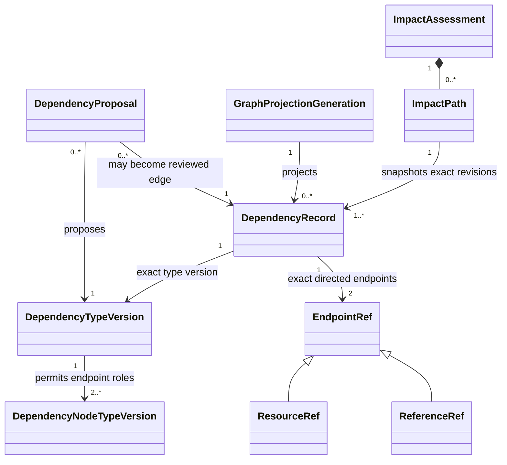
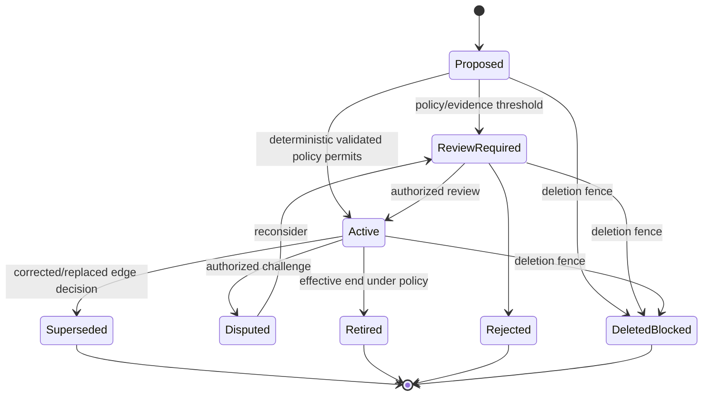
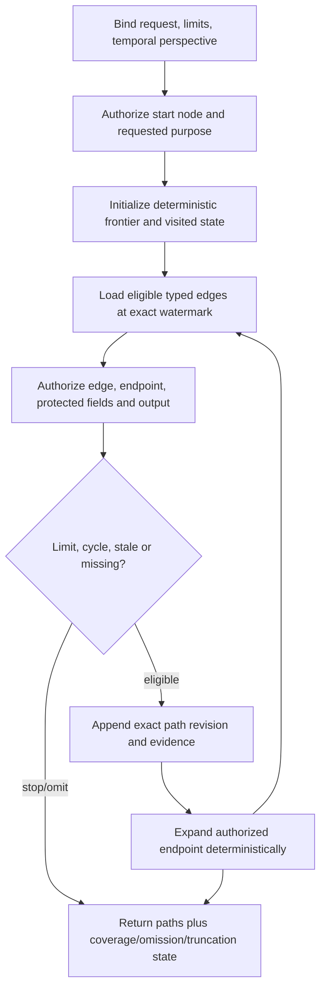

# Phase 1 Dependency Graph Contract

| Field | Value |
|---|---|
| Document ID | `DIT-GPH-001` |
| Version | `0.1` |
| Status | `DRAFT — provider-neutral; product-owner, architecture, security, and privacy approval required` |
| Product phase | Phase 1 — Personal and Family |
| Architecture alignment | `ARCH-SOL-001`; `ARCH-DOM-001` rules `DOM-P1-034`–`042`; `ARCH-DATA-001` rules `DATA-P1-025`–`031`, `DATA-P1-038`, `DATA-P1-042`–`050` |
| Security alignment | `SEC-ARCH-001`, `SEC-AUTH-001`, `SEC-PRIV-001`, `SEC-AUD-001`, `SEC-THR-001` |
| Related DIT contracts | `DIT-EXT-001`, `DIT-FCT-001`, `DIT-VER-001` |
| Decisions and gaps | `DEC-003`, `DEC-006`–`009`, `DEC-020`, `DEC-022`, `DEC-023`; `GAP-002`, `GAP-003`, `GAP-006`, `GAP-009` |
| Updated | 26 August 2026 |

## 1. Purpose and authority

This contract defines the provider-neutral authoritative dependency model and its rebuildable graph projection: governed node/edge catalogues, endpoint and cardinality rules, provenance/review/versioning, valid and transaction time, traversal limits, current authorization, minimal disclosure, impact-path snapshots, deletion, and rebuild behavior.

Exact product traceability:

- requirements: `REQ-P1-GPH-001`–`REQ-P1-GPH-005`, `REQ-P1-FCT-005`, `REQ-P1-FCT-006`, `REQ-P1-SRCH-003`, `REQ-P1-SRCH-004`, `REQ-P1-MON-001`, `REQ-P1-MON-006`, `REQ-P1-MON-007`, `REQ-P1-ACT-001`–`REQ-P1-ACT-004`, `REQ-P1-TRUST-002`–`REQ-P1-TRUST-004`, and `REQ-P1-CFG-001`–`REQ-P1-CFG-004`;
- features: `FEAT-P1-010`–`FEAT-P1-012`, `FEAT-P1-013`, `FEAT-P1-016`, `FEAT-P1-018`, `FEAT-P1-022`, `FEAT-P1-023`;
- use cases: `UC-P1-004`, `UC-P1-005`, `UC-P1-006`, `UC-P1-007`, `UC-P1-008`, `UC-P1-013`, `UC-P1-018`; and
- acceptance: `AC-UC-P1-004-03`, `AC-UC-P1-005-01`, `AC-UC-P1-005-02`, `AC-UC-P1-006-05`, `AC-UC-P1-007-01`, `AC-UC-P1-007-04`, `AC-UC-P1-008-04`, `AC-UC-P1-013-01`–`AC-UC-P1-013-03`, `AC-P1-E2E-001`, `AC-P1-RAG-001`, and `AC-P1-SEC-001`.

All RFC 2119 terms remain draft. The word “graph” describes semantics and access paths, not a graph database selection. This contract does not assert that every real-world dependency is known, authorize cross-household edges, turn vector similarity into an active dependency, or make traversal a legal/compliance conclusion.

## 2. Authority boundary

| Object | Authority and mutability |
|---|---|
| `DependencyNodeTypeVersion` | Immutable configuration defining an eligible resource/reference kind, allowed identifiers, sensitivity/disclosure defaults, traversal behavior, and compatible endpoint roles. |
| `DependencyTypeVersion` | Immutable configuration defining directed semantics, permitted endpoint kinds/roles, cardinality/uniqueness, validity, provenance, confidence/review, traversal, disclosure, supersession, and deletion rules. |
| `DependencyRecord` | Authoritative workspace-scoped typed edge aggregate with stable identity, exact endpoints/revisions, provenance/evidence, review state, valid/transaction time, sensitivity, and supersession. |
| `ResourceRef` | Exact same-workspace resource kind, `WorkspaceId`, resource ID, optional required generation/revision and protected-field scope. |
| `ReferenceRef` | Exact approved global reference kind, stable ID and immutable version; contains no household identifier or personalized result. |
| `DependencyProposal` | Immutable derived/manual candidate with method/model/rule versions, evidence, confidence/calibration and review routing. It is not active truth. |
| `GraphProjectionGeneration` | Rebuildable representation of retained `DependencyRecord` and authorized node metadata, with transform/schema, source/deletion/policy watermarks, coverage, validation and repair state. |
| `ImpactPath` | Immutable assessment-time snapshot of exact authorized endpoint and edge revisions, evidence, traversal limits, omissions and projection watermark. It belongs to an `ImpactAssessment`, not graph truth. |

`DependencyRecord` is authoritative. A graph store, adjacency index, cache, search relation, vector index, visualization, or model context is a projection and cannot create, activate, mutate, or delete an edge.



## 3. Node and edge catalogue contract

### 3.1 Node-type definition

Every `DependencyNodeTypeVersion` declares stable ID/version, scope class (`WORKSPACE_RESOURCE` or approved `GLOBAL_REFERENCE`), compatible domain resource kinds, identity/generation requirements, permitted endpoint roles, default privacy class, field-level sub-resource support, lifecycle eligibility, deletion behavior, display/minimal-disclosure policy references, owner, jurisdiction/effective period, review/approval, and publication lineage.

A node type does not create another identity system. It constrains references to existing stable domain or reference-plane identities.

### 3.2 Edge-type definition

| Group | Required contract |
|---|---|
| Identity | stable `dependency_type_id`, immutable version, semantic name and owner |
| Direction | named `from_role`/`to_role`; whether inverse lookup is permitted and its distinct display semantics |
| Endpoints | permitted node-type versions and resource/reference scope combinations; no arbitrary kind/name/URL |
| Cardinality | minimum/maximum per source role, target role, pair, valid interval and optional semantic discriminator |
| Temporal | valid-time/transaction-time behavior, overlap rules, future/backdated policy and endpoint revision requirements |
| Provenance | minimum source/evidence anchors, derivation method, confidence/calibration and mandatory review |
| Lifecycle | proposal, activation, correction, dispute, supersession, retirement, deletion and conflict rules |
| Traversal | allowed direction/purpose, maximum configured depth/fan-out/cost class, cycle treatment and stale-edge policy |
| Privacy | edge/existence sensitivity, field dependencies, disclosure/minimal-disclosure policy and telemetry class |
| Governance | jurisdiction/applicability, configuration package, validation, approval, effective period and impact/replay plan |

### 3.3 Dependency record envelope

Every `DependencyRecord` contains:

- `WorkspaceId`, stable `DependencyId`, exact `DependencyTypeVersion`, aggregate revision and lifecycle state;
- directed `from` and `to` typed references, each with exact workspace/reference scope and configured endpoint revision/generation where material;
- optional semantic discriminator under the type definition, never a free-text natural key;
- valid interval, `recorded_at`, superseding transaction-time decision and uncertainty/precision;
- exact evidence/provenance, derivation method, creator actor/workload, capability/model/rule/schema versions, confidence/calibration and review;
- sensitivity/disclosure class, policy/purpose, deletion generation and authorization attributes;
- proposal/decision/rejection/dispute/supersession lineage and safe reason codes; and
- audit correlation and outbox/change identity for material activation/deactivation.

## 4. Edge lifecycle



Exact status IDs belong in reference data. An AI/deterministic rule may propose an edge, but only the type’s validated review/activation policy can create active authority.

## 5. Validation and cardinality

An activation decision validates in one consistent revision:

1. workspace/reference scope, endpoint existence, generation/revision and deletion/quarantine eligibility;
2. exact active node/edge type versions and configuration package;
3. direction, endpoint roles/kinds, semantic discriminator and self-edge policy;
4. source-role, target-role, pair and interval cardinalities against active/proposed competing edges;
5. valid/transaction intervals, overlapping constraints and endpoint effective state;
6. minimum evidence, provenance, confidence/calibration, review and approval;
7. sensitivity, purpose, current authorization and residency/processing policy;
8. cycle constraints for edge types that prohibit semantic cycles; and
9. expected aggregate/resource revisions plus durable audit/change publication.

Cardinality conflict does not justify deleting evidence or choosing the newest edge. It creates a rejected/proposed/conflicted result under the configured policy.

## 6. Traversal contract

### 6.1 Request envelope

Every traversal binds actor/workload, `WorkspaceId`, purpose/capability, authorized starting references, direction, allowed edge/node type versions, valid-at/known-at perspective, endpoint revision policy, maximum depth, per-node/overall fan-out, path/result/cost/time budgets, cycle policy, stale-edge policy, projection generation/watermark, authorization policy/epoch, and disclosure mode.

### 6.2 Deterministic traversal



Traversal ordering is deterministic for the same retained inputs/version/limits. A cycle is detected by configured node/edge/revision identity, recorded, and not expanded indefinitely. Depth, fan-out, result, cost, time, stale-edge and missing-data stops are separate coverage reasons.

### 6.3 Result states

| State | Meaning |
|---|---|
| `COMPLETE_WITHIN_DECLARED_SCOPE` | The authorized configured traversal scope completed without unreported limit/freshness gaps; not a claim about unknown real-world edges. |
| `PATHS_FOUND_INCOMPLETE` | One or more authorized paths found, but a declared limit, stale edge, missing data, projection gap or restricted branch prevents overall completeness. |
| `NO_PATH_WITHIN_DECLARED_SCOPE` | No eligible authorized path was found in the declared scope/versions; not “no real-world dependency.” |
| `RESTRICTED_OR_MINIMAL_DISCLOSURE` | Policy suppresses protected edge/path details or permits only a safe action signal. |
| `STALE` | Projection/source/edge freshness is outside policy; result is blocked or visibly bounded. |
| `UNAVAILABLE` | Required authoritative/projection/policy service is unavailable and no approved safe fallback exists. |

`ImpactPath` stores exact edge IDs/revisions, endpoint refs/revisions, direction, evidence refs, type versions, valid/known perspective, projection watermark, authorization/disclosure policy, cycles, omissions, limits, truncation and coverage. Later graph changes never rewrite it.

## 7. Authorization and minimal disclosure

`SEC-AUTH-001` is applied independently to start node, endpoint existence, edge existence/type/direction, protected endpoint field, evidence/provenance, path, result classification, count, score, visualization, explanation, cache and export. Embedded ACLs are filtering aids only; current output reauthorization is mandatory.

Minimal disclosure is a named policy, not generic redaction. It defines the recipient/purpose, safe action/category, forbidden subject/resource/value/source/edge/count/time attributes, expiry, acknowledgement/routing behavior and negative fixtures. If safety cannot be proved, suppress the branch/result and route to an authorized reviewer.

## 8. Draft normative rules

### 8.1 Catalogue and authoritative edges

- `DIT-GPH-P1-001` — Node and dependency types MUST have stable jurisdiction-neutral IDs and immutable versions; code MUST NOT hard-code launch types, endpoints, traversal limits, or disclosure behavior.
- `DIT-GPH-P1-002` — A node type MUST reference an existing stable domain resource kind or approved global reference kind; display names, raw URLs, vector neighbours, prompt text and unscoped external IDs are not nodes.
- `DIT-GPH-P1-003` — Every dependency type MUST declare direction, endpoint roles/kinds, cardinality/uniqueness, valid/transaction time, provenance/evidence, review, sensitivity, traversal, supersession and deletion semantics.
- `DIT-GPH-P1-004` — `DependencyRecord` is authoritative; graph/search/vector/cache/visualization representations are rebuildable projections and cannot create or activate edges.
- `DIT-GPH-P1-005` — Every workspace dependency MUST have one validated `WorkspaceId`; endpoints are same-workspace `ResourceRef` values or approved global `ReferenceRef` values, never another household workspace.
- `DIT-GPH-P1-006` — Every edge MUST retain stable identity, exact type version, directed endpoints/revisions, provenance/evidence, confidence/calibration/review, valid/transaction time, creator, sensitivity, policy and supersession lineage.
- `DIT-GPH-P1-007` — Equal endpoints do not imply duplicate identity; duplicate proposals reconcile under the exact type/version policy while preserving proposal/evidence history.

### 8.2 Validation, review, and temporal behavior

- `DIT-GPH-P1-008` — Activation MUST validate endpoint scope/kind/state/revision, direction, self-edge policy, cardinality, interval, cycle constraints, evidence, authority, review/approval, sensitivity and current aggregate revisions.
- `DIT-GPH-P1-009` — Untyped, invalid, unprovenanced, unreviewed-when-required, stale-approved or deletion-fenced proposals MUST NOT become active dependencies.
- `DIT-GPH-P1-010` — AI, extraction, rules and similarity services MAY propose dependencies but MUST NOT self-approve, change type semantics, infer authority, or write active projection state as truth.
- `DIT-GPH-P1-011` — Correction, dispute, effective-end and supersession MUST append decisions/records with transaction-time lineage; prior edge/history and impact paths remain reconstructable.
- `DIT-GPH-P1-012` — Edge valid time and platform transaction time MUST remain separate; historical traversal MUST bind `valid_at` and `known_at` rather than silently applying current edge state.
- `DIT-GPH-P1-013` — Cardinality or temporal conflict MUST remain proposed/rejected/conflicted under policy and MUST NOT be resolved by newest timestamp, highest model score or destructive overwrite.

### 8.3 Traversal and impact paths

- `DIT-GPH-P1-014` — Every traversal MUST bind exact workspace, actor/purpose, start scope, type versions, valid/known time, deterministic limits, projection generation/watermark, policy epoch and stale behavior.
- `DIT-GPH-P1-015` — Traversal MUST evaluate current authorization for every node, edge, protected field, evidence, derived path, explanation and output; indexing-time permission alone is insufficient.
- `DIT-GPH-P1-016` — Cycle detection, depth, per-node/overall fan-out, result, time, cost, stale-edge and missing-data limits MUST be bounded, deterministic, separately recorded and visible as safe coverage states.
- `DIT-GPH-P1-017` — “No path within declared scope,” “restricted path,” “stale/unavailable traversal,” and “complete within declared scope” MUST remain distinct and none may imply complete real-world coverage.
- `DIT-GPH-P1-018` — Every reported consequential impact MUST retain at least one immutable `ImpactPath` snapshot with exact edge/endpoint/type/evidence revisions and assessment-time coverage/authorization metadata.
- `DIT-GPH-P1-019` — An `ImpactPath` MUST record cycles, omissions, restrictions, stale/missing edges, truncation and projection watermark; later edge changes MUST NOT rewrite the prior explanation.
- `DIT-GPH-P1-020` — Duplicate/replayed traversal and change events MUST be idempotent by change/assessment/contract generation and MUST NOT duplicate recommendations or lose newly eligible paths.

### 8.4 Authorization, privacy, projection, and deletion

- `DIT-GPH-P1-021` — Edge/path existence, type, direction, count, length, score, layout, timing, citation and limitation text are protected and MUST follow `ALLOW`, `DENY`, `REDACT`, or named `MINIMAL_DISCLOSURE` policy.
- `DIT-GPH-P1-022` — Membership, resource/container access, or access to one endpoint MUST NOT imply access to an edge, other endpoint, path, evidence or inference.
- `DIT-GPH-P1-023` — A restricted branch MUST be omitted or represented only by an approved safe action signal; traversal MUST NOT leak subject, resource, value, source, snippet, edge, count, path shape or timing.
- `DIT-GPH-P1-024` — Graph processors/projections MUST carry workspace, source lineage, privacy/disclosure class, policy/config version or epoch, purpose/capability, deletion generation and freshness watermarks.
- `DIT-GPH-P1-025` — Projection rebuild MUST use retained authoritative records and versioned transforms, validate scope/references/cardinality/authorization/deletion, cut over by generation, and make unsafe retired generations inaccessible.
- `DIT-GPH-P1-026` — Projection lag or failure MUST yield authoritative fallback, stale/incomplete/unavailable state, or fail closed; last-known paths cannot masquerade as current.
- `DIT-GPH-P1-027` — A deletion fence MUST synchronously block edge reads/activation, traversal, projection rebuild, impact use, export, AI context, support and late-event recreation for the target/generation.
- `DIT-GPH-P1-028` — Purge/merge/split/supersession of an endpoint MUST reconcile affected dependencies and projections without repointing an edge to another identity or retaining protected content in tombstones.
- `DIT-GPH-P1-029` — Every proposal, activation, rejection, dispute, supersession, traversal limitation, impact-path use, authorization decision, rebuild and deletion interaction MUST produce `SEC-AUD-001`-conformant safe evidence.
- `DIT-GPH-P1-030` — Ordinary telemetry and fixtures MUST exclude raw node names, values, snippets, passages, hidden edge features, unrestricted URLs, prompts/answers, tokens and provider payloads.
- `DIT-GPH-P1-031` — External processors MUST receive only minimum authorized subgraphs/evidence for one approved purpose and eligible region/consent route; model/source instructions cannot expand traversal or action authority.
- `DIT-GPH-P1-032` — Catalogue/configuration publication MUST validate, review/approve, effective-date, audit, impact-assess and replay/repair affected active edges and findings without rewriting prior history.

## 9. Provider-neutral illustrative type

```yaml
example_only: true
dependency_type_id: dependency.affects_resource
version: 0.1.0-draft
status: DRAFT
direction:
  from_role: changed_source
  to_role: potentially_affected_resource
endpoints:
  from: [configured_document_version_or_fact_kind]
  to: [configured_household_resource_kind]
cardinality:
  per_pair: 0..N
provenance:
  evidence_required: true
  review_policy_ref: review.dependency.example
traversal:
  purposes: [impact_assessment]
  limit_profile_ref: traversal.example
privacy:
  disclosure_policy_ref: disclosure.dependency.example
```

The example activates no node/edge kind, rule, source or launch coverage.

## 10. Failure and degraded behavior

| Failure | Required outcome |
|---|---|
| Unknown type/version or endpoint | Reject/quarantine proposal; never coerce to a generic edge. |
| Missing provenance or mandatory review | Remain proposed/review-required; no active traversal. |
| Cardinality/cycle/interval conflict | Preserve proposals and explicit conflict/rejection reason. |
| Stale endpoint or projection | Exclude/block or return bounded stale/incomplete state with watermark. |
| Authorization service unavailable | Deny protected traversal or use approved safe non-content degradation. |
| Restricted branch | Suppress or apply named minimal disclosure; do not treat restriction as no dependency. |
| Depth/fan-out/time/cost exhausted | Terminate deterministically and report exact safe truncation/coverage. |
| Late edge after deletion/supersession | Fence/revision rejects activation; retain allowed reconciliation evidence only. |
| Rebuild validation failure | Keep prior still-policy-safe generation or make graph unavailable; never cut over partial unsafe state. |

## 11. Rule traceability

| Rule range | Requirements | Features/use cases | Security/data hooks |
|---|---|---|---|
| `DIT-GPH-P1-001`–`007` | `REQ-P1-GPH-001`, `REQ-P1-CFG-001`–`004` | `FEAT-P1-012`, `022`; `UC-P1-004`, `018` | `DOM-P1-034`–`035`; `DATA-P1-031`, `038`; `AUD-P1-013`, `022` |
| `DIT-GPH-P1-008`–`013` | `REQ-P1-GPH-001`, `REQ-P1-FCT-005` | `FEAT-P1-010`, `012`; `UC-P1-004` | `AUTH-P1-007`–`008`, `012`; `AUD-P1-013` |
| `DIT-GPH-P1-014`–`020` | `REQ-P1-GPH-002`–`005`, `REQ-P1-ACT-001`–`004` | `FEAT-P1-018`; `UC-P1-006`, `007` | `SEC-P1-019`, `029`; `THR-P1-005`, `006`, `026`, `030` |
| `DIT-GPH-P1-021`–`032` | `REQ-P1-FCT-006`, `REQ-P1-SRCH-003`–`004`, `REQ-P1-TRUST-002`–`004` | `FEAT-P1-011`, `013`, `023`; `UC-P1-005`, `008`, `013` | `AUTH-P1-008`–`011`, `019`–`025`, `034`; `PRIV-P1-004`, `011`, `020`; `AUD-P1-013`, `027` |

## 12. Validation and test obligations

Automated evidence MUST prove:

1. node/edge catalogue schemas reject unknown kinds, wrong direction, invalid endpoint versions, cross-workspace references, illegal self-edges, cardinality/interval conflicts, missing provenance and missing review;
2. AI/rule/extraction proposals cannot bypass active-edge validation or create projection truth;
3. valid-at/known-at traversal reproduces backdated and superseded edge history;
4. deterministic traversal terminates on self/multi-node cycles, depth, fan-out, result, cost and time limits and reports each separately (`AC-UC-P1-006-05`);
5. “no path,” “restricted,” “stale,” “incomplete” and “unavailable” never collapse into “no impact”;
6. every impact fixture retains an exact inspectable authorized path and separated coverage (`AC-UC-P1-007-01`);
7. negative tests hide edge existence, subject, values, count, length, layout, score, snippets, citations and timing across graph, search, AI, notification, export, audit and caches;
8. grant/policy revocation invalidates paths and queued traversals at execution; stale embedded ACLs cannot serve output;
9. minimal-disclosure fixtures expose only the exact approved action signal and remain safe under differencing;
10. projection rebuild/cutover reconciles identities, references, edges, source/deletion watermarks and negative authorization fixtures before service;
11. deletion, endpoint merge/split and late-event tests cannot resurrect, cross-link or silently repoint dependencies; and
12. `AC-P1-E2E-001`, `AC-P1-RAG-001`, `AC-P1-SEC-001`, `MET-P1-013`, `MET-P1-014`, `MET-P1-018`, and `MET-P1-021` evidence is retained.

## 13. Definition of ready

This contract remains DRAFT until node/edge reference schemas, type fixtures, temporal/cardinality validators, traversal conformance vectors, minimal-disclosure matrices, projection rebuild/deletion tests, and audit/event schemas are approved. No graph product or launch edge catalogue is selected here.
