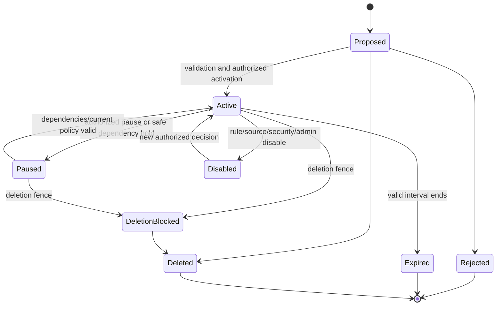
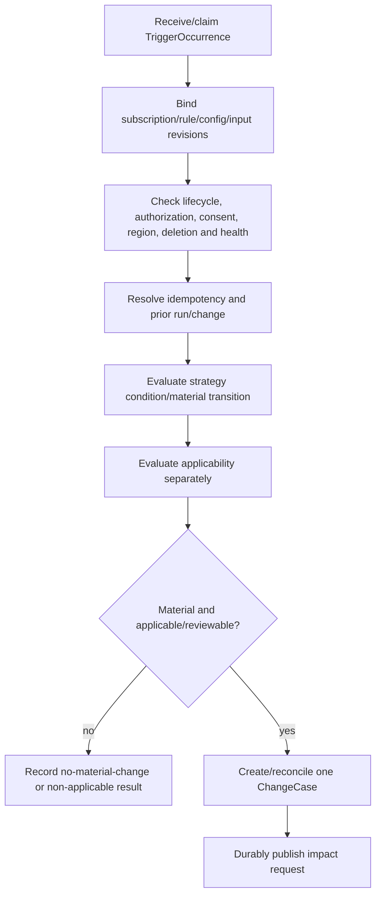

# Phase 1 Change Monitoring Contract

| Field | Value |
|---|---|
| Document ID | `DIT-MON-001` |
| Version | `0.1` |
| Status | `DRAFT — provider-neutral; product-owner, architecture, security, privacy, and source-governance approval required` |
| Product phase | Phase 1 — Personal and Family |
| Architecture alignment | `ARCH-SOL-001`; `ARCH-DOM-001` rules `DOM-P1-032`–`042`; `ARCH-DATA-001` rules `DATA-P1-011`–`020`, `DATA-P1-031`–`040` |
| Security alignment | `SEC-ARCH-001`, `SEC-AUTH-001`, `SEC-PRIV-001`, `SEC-AUD-001`, `SEC-THR-001` |
| Related DIT contracts | `DIT-TAX-001`, `DIT-ING-001`, `DIT-FCT-001`, `DIT-GPH-001`, `DIT-SRC-001`, `DIT-VER-001` |
| Open decisions | `DEC-030`, `DEC-035`, `DEC-040` |
| Primary gaps | `GAP-002`, `GAP-006` |
| Updated | 26 August 2026 |

## 1. Purpose and authority

This contract defines provider-neutral monitoring strategies, versioned monitoring rules, workspace subscriptions, schedules, trigger/run identities, idempotency/replay, source/document/fact/dependency change detection, applicability separation, change-case emission, health/coverage disclosure, and stale/degraded behavior.

Exact product traceability:

- requirements: `REQ-P1-MON-001`–`REQ-P1-MON-007`, `REQ-P1-FCT-002`–`REQ-P1-FCT-004`, `REQ-P1-GPH-001`, `REQ-P1-GPH-003`, `REQ-P1-GPH-005`, `REQ-P1-DOC-008`, `REQ-P1-ACT-001`, `REQ-P1-ACT-003`, `REQ-P1-ACT-004`, `REQ-P1-TRUST-002`–`REQ-P1-TRUST-004`, and `REQ-P1-CFG-001`–`REQ-P1-CFG-004`;
- features: `FEAT-P1-010`, `FEAT-P1-015`–`FEAT-P1-018`, `FEAT-P1-022`;
- use cases: `UC-P1-004`, `UC-P1-006`, `UC-P1-007`, `UC-P1-008`, `UC-P1-013`, `UC-P1-018`; and
- acceptance: `AC-UC-P1-004-01`, `AC-UC-P1-006-01`–`AC-UC-P1-006-05`, `AC-UC-P1-007-01`, `AC-UC-P1-007-04`, `AC-UC-P1-008-01`, `AC-UC-P1-013-01`–`AC-UC-P1-013-03`, `AC-P1-MON-001`, `AC-P1-E2E-001`, and `AC-P1-SEC-001`.

All RFC 2119 language remains draft. This contract does not enable a launch rule/source/profile, promise complete change detection, equate a trigger with applicability or impact, turn elapsed time into fulfilment, or select a scheduler, queue, workflow, event, database, graph, or source provider.

## 2. Ownership and records

| Record | Authority and mutability |
|---|---|
| `MonitoringRuleVersion` | Immutable configuration binding one trigger strategy, jurisdiction/context/applicability schema, exact source/fact/document/dependency definitions, material-change logic, review policy, and change identity contract. |
| `MonitoringSubscription` | Workspace aggregate binding owner, subject/resource scope, exact rule/config/source versions, schedule/context, lifecycle, cursor/watermark and dedup/replay state. |
| `TriggerOccurrence` | Immutable evidence that a configured date/period/event/source/dependency/document condition was offered for evaluation. It is not a change, applicability result, recommendation, or action. |
| `MonitoringRun` | Immutable/revisioned workflow execution binding subscription/rule, trigger, inputs, policy, attempts, output and failure/replay lineage. |
| `ApplicabilityEvaluation` | Immutable assessment-time result for an exact rule/publication, subject/resource/context, valid/known time, evidence, current health, policy and outcome. |
| `ChangeCase` | Stable idempotent material transition record with exact source before/after/evidence/revision. Monitoring may create it but cannot claim impact completion. |
| `SourceObservation` | Immutable source snapshot/no-change evidence supplied by `DIT-SRC-001`. |
| `SourceHealth` | Separate mutable retrieval/parser/freshness/coverage state supplied by `DIT-SRC-001`. |
| `ImpactAssessment` | Downstream owner of applicability/path/impact results. Monitoring cannot set its status. |

## 3. Trigger strategies

Each rule selects exactly one primary strategy; compound behavior is an explicit versioned composition, not hidden branching.

| Strategy | Trigger identity and evidence | Required safeguards |
|---|---|---|
| `DATE` | Exact source date/fact/field occurrence, temporal rule version, local timezone/calendar context and evaluated window occurrence. | Missing/uncertain date remains review/indeterminate; clock/timezone precision is not fabricated; elapsed time is not fulfilment. |
| `PERIODIC` | Schedule occurrence under exact cadence, timezone, calendar/DST policy and previous cursor. | Catch-up/missed-run/overlap policy explicit; duplicate ticks deduplicate; schedule cannot authorize content. |
| `USER_OR_LIFE_EVENT` | Stable event occurrence with actor, evidence, asserted occurred/effective time, confidence/review and source revision. | Event remains an occurrence; fact resolution/authority is separate. |
| `SOURCE_CHANGE` | Exact prior/current `SourceObservation`, parser/publication versions, coverage and material-change result. | Retrieval/parser/health failure is not no change; arbitrary web fallback prohibited. |
| `DEPENDENCY_CHANGE` | Exact `DependencyRecord` transition/type/endpoint revisions or bounded traversal result. | Cycles/stale edges/limits explicit; path completeness not assumed. |
| `DOCUMENT_VERSION` | Exact logical document/version/relationship transition and conformed-view/comparison evidence where configured. | Upload order/hash equality alone is not material change or supersession. |

An enabled strategy definition declares input kind/schema, trigger key derivation, temporal semantics, change comparator/materiality policy, dedup scope, replay behavior, applicability inputs, output contract, evidence, privacy/disclosure, review and failure policy.

## 4. Rule and subscription contract

### 4.1 Monitoring rule

Every `MonitoringRuleVersion` includes stable ID/version, strategy, jurisdiction/effective interval, compatible taxonomy/fact/dependency/source/requirement versions, subject/resource context schema, applicability predicate/policy, source authority/coverage/freshness minimum, evidence requirement, trigger and material-change algorithm versions, review thresholds, consequence class, change-key scheme, schedule/cadence where applicable, privacy/authorization policy, owner, source evidence, configuration package, approval, supersession and replay/impact plan.

While `DEC-035` is open, representable rules default launch-disabled unless an explicit draft test profile enables them.

### 4.2 Subscription

Every `MonitoringSubscription` includes:

- `WorkspaceId`, stable `SubscriptionId`, owner/creator, subject/resource scope and aggregate revision;
- exact `MonitoringRuleVersion`, `ConfigurationPackage`, source/definition versions and launch profile;
- active valid interval, timezone/calendar, schedule parameters, next evaluation and missed/catch-up behavior;
- purpose, current grant/authority, consent/region route and privacy/disclosure policy;
- strategy-specific cursor/watermark, last trigger/run/change IDs and dedup namespace;
- lifecycle state/reason, pause/disable/expiry/deletion references and review/renewal policy; and
- created/recorded times, audit correlation and change history.



## 5. Scheduling, run, and idempotency

### 5.1 Run flow



Every run binds trigger ID, subscription/rule revision, immutable input set/digest, valid/known perspective, strategy/algorithm/config versions, authorization/policy epoch, source/graph/document watermarks, replay generation and attempt. The logical execution key includes these fields. Duplicate delivery returns/reconciles the prior logical result while preserving attempt evidence.

### 5.2 Schedule semantics

- scheduled instants are stored as UTC plus source timezone/calendar and DST ambiguity/gap policy;
- cadence and look-ahead windows are versioned configuration, not code constants;
- `next_due_at` is control state, not proof the prior run occurred or succeeded;
- a lease/claim grants only work ownership, never content authority;
- overlapping, missed and catch-up ticks follow explicit strategy policy and bounded replay;
- clock skew, late source publication and uncertain dates remain representable; and
- pausing/disabling does not erase prior triggers, observations, applicability or changes.

## 6. Applicability separation

Applicability is evaluated after a candidate condition/material transition is understood and before impact/recommendation. It binds exact rule/publication, subject/resource/context, jurisdiction, valid/known time, source evidence/health/coverage, configuration and current policy.

| Outcome | Meaning |
|---|---|
| `APPLICABLE` | Required predicates are supported for the declared scope/time. It does not imply authority, impact, severity, urgency or required action. |
| `NON_APPLICABLE` | A supported predicate fails; rationale and evidence remain. No misleading required action is emitted. |
| `INDETERMINATE` | Missing, conflicting, stale or insufficient context prevents conclusion. |
| `REVIEW_REQUIRED` | Policy requires authorized review of protected/uncertain/consequential inputs. |
| `RESTRICTED` | Evaluation or disclosure is limited by current authorization; restriction is not non-applicability. |
| `UNAVAILABLE` | Required policy/source/evaluator is unavailable; last-known applicability is not silently current. |

Applicability, source authority, evidence strength, confidence, source health, severity and urgency are stored and displayed as separate dimensions.

## 7. Replay and change identity

A `ChangeCase` key is derived from safe stable semantics: workspace, material source kind/identity, exact before/after transition or point event, rule/strategy contract and semantic discriminator. It excludes raw values from ordinary identifiers/telemetry. Correction creates a superseding/reconciled change, not deletion of the prior change.

Replay modes include failure repair under the same contract, parser/algorithm/configuration replay, effective-time re-evaluation and authorization/deletion repair. Every replay declares scope, reason, source range/watermarks, old/new versions, generation, expected outcomes, idempotency and downstream reconciliation. It cannot silently rewrite prior applicability, impact, recommendation or audit history.

## 8. Draft normative rules

### 8.1 Strategies, rules, and subscriptions

- `DIT-MON-P1-001` — Date, periodic, user/life-event, source-change, dependency-change and document-version triggers MUST be distinct versioned strategies with explicit input, temporal, dedup, replay, evidence and failure semantics.
- `DIT-MON-P1-002` — Every monitoring rule MUST have stable ID and immutable version independent of scheduler, queue, source provider, code path and display label.
- `DIT-MON-P1-003` — Rules MUST declare jurisdiction, effective interval, document/fact/dependency/source/subject/resource applicability, source/coverage/freshness, review, change-key, privacy and owner configuration.
- `DIT-MON-P1-004` — Monitoring behavior MUST be published through validated, reviewed/approved, effective-dated, audited `ConfigurationPackage` versions; parsing or deployment alone cannot activate it.
- `DIT-MON-P1-005` — Until `DEC-035` is approved, rules/sources/profiles MUST remain launch-disabled except explicit draft fixtures and MUST NOT imply public coverage.
- `DIT-MON-P1-006` — Every `MonitoringSubscription` MUST bind one workspace, exact rule/config/source versions, owner/scope, schedule/context, purpose/consent/region, lifecycle and dedup/replay state.
- `DIT-MON-P1-007` — Activation, pause, resume, disable, expiry and deletion MUST be authorized revision-guarded additive transitions; membership or scheduler state alone cannot activate a subscription.

### 8.2 Scheduling, triggers, idempotency, and replay

- `DIT-MON-P1-008` — Every `TriggerOccurrence` and run MUST have stable identity, workspace/reference scope, strategy, exact input/rule/subscription revisions, occurred/recorded times, causation/correlation and privacy class.
- `DIT-MON-P1-009` — Date/periodic scheduling MUST preserve UTC instant, local timezone/calendar, DST/ambiguity policy, cadence/window version, missed/catch-up behavior and clock uncertainty.
- `DIT-MON-P1-010` — A schedule claim/lease or elapsed time MUST NOT authorize content, prove a source check, renew evidence, satisfy a requirement, create impact or close work.
- `DIT-MON-P1-011` — Logical run identity MUST include subscription/rule revision, trigger, immutable input generation/digest, strategy/config versions and replay generation so duplicate delivery converges on one result.
- `DIT-MON-P1-012` — Duplicate, delayed, reordered and concurrent triggers MUST preserve attempt evidence, reject/reconcile stale revisions and MUST NOT duplicate changes/recommendations or lose a newer eligible transition.
- `DIT-MON-P1-013` — Retry/backoff/attempt/circuit/cost limits MUST be bounded versioned policy; exhaustion becomes visible failed/degraded state and cannot bypass source/security controls.
- `DIT-MON-P1-014` — Replay MUST create a new run/evaluation generation with exact scope, reason, source/config versions and lineage; it MUST NOT rewrite prior observations, applicability, changes, impacts or findings.
- `DIT-MON-P1-015` — A canonical run transition and required event/audit publication MUST be durably coupled through an outbox or provider-neutral equivalent.

### 8.3 Strategy-specific truth

- `DIT-MON-P1-016` — A user/life event MUST retain actor, evidence, asserted occurred/effective time, confidence/review and remain an occurrence until its owning fact/event policy resolves it.
- `DIT-MON-P1-017` — Source-change evaluation MUST bind exact observations, parser/publication versions, coverage and current `SourceHealth`; retrieval/parser failure MUST NOT be interpreted as no change.
- `DIT-MON-P1-018` — Dependency monitoring MUST bind exact edge/path/projection revisions and report cycles, stale edges, missing data and limits; incomplete traversal MUST NOT imply complete impact coverage.
- `DIT-MON-P1-019` — Document-version monitoring MUST bind exact document/version/relationship/comparison/conformed-view evidence; upload order, filename or hash equality alone MUST NOT establish material change.
- `DIT-MON-P1-020` — Date monitoring MUST preserve source date evidence and temporal uncertainty; configured windows may create attention but cannot prove expiry, renewal, obligation or fulfilment beyond the rule/evidence.

### 8.4 Applicability, change, health, and coverage

- `DIT-MON-P1-021` — Applicability MUST be evaluated before impact and stored separately from source authority, evidence strength, confidence, source health, severity, urgency and action classification.
- `DIT-MON-P1-022` — Applicability MUST distinguish applicable, non-applicable, indeterminate, review-required, restricted and unavailable outcomes with exact rule/context/evidence/time/policy versions.
- `DIT-MON-P1-023` — Non-applicable outcomes MUST retain rationale/evidence and MUST NOT create a misleading required action; restricted or unavailable outcomes MUST NOT be relabelled non-applicable.
- `DIT-MON-P1-024` — A material eligible transition MUST create or reconcile one stable `ChangeCase` with exact source before/after/evidence/revision; monitoring MUST NOT claim downstream impact completion.
- `DIT-MON-P1-025` — Last success MUST NOT hide current source/parser/scheduler/graph/rule failure, stale state, disabled subscription, coverage loss or projection lag.
- `DIT-MON-P1-026` — Every monitoring presentation/export MUST disclose enabled strategy/rule/source coverage, freshness and known gaps and MUST NOT claim every authoritative change will be detected.

### 8.5 Authorization, privacy, deletion, and audit

- `DIT-MON-P1-027` — Current authorization MUST apply to subscription, trigger/event evidence, subject/resource context, rule applicability inputs, source observation, dependency/document version, change existence, counts, health alert and downstream output.
- `DIT-MON-P1-028` — Restricted monitoring impact MAY route only through a named `MINIMAL_DISCLOSURE` policy and MUST NOT expose subject, resource, value, source, document, edge/path, count, schedule or timing detail.
- `DIT-MON-P1-029` — Workers MUST resolve current actor/service capability, workspace, purpose, policy epoch, consent, region eligibility, quarantine and deletion fence at execution and before output/change commitment.
- `DIT-MON-P1-030` — A deletion fence, revocation, disabled source/rule or superseded input MUST block future processing/activation and late results; permitted reconciliation evidence cannot resurrect a subscription/change/derivative.
- `DIT-MON-P1-031` — Every subscription transition, trigger, run, retry/replay, observation/input, applicability, health/coverage limitation, change emission, authorization and deletion interaction MUST produce `SEC-AUD-001`-conformant safe evidence.
- `DIT-MON-P1-032` — Ordinary logs, metrics, traces, analytics, errors and fixtures MUST exclude raw household/source content, fact values, event text, filenames, evidence passages, prompts/answers, unrestricted URLs, tokens and hidden path data.
- `DIT-MON-P1-033` — External adapters MUST use minimum data for the registered purpose, approved destination/capability, consent and eligible region; source/document/model instructions cannot expand monitoring, publication, notification or action authority.
- `DIT-MON-P1-034` — Monitoring failure, stale, partial, restricted, indeterminate, disabled and replay states MUST be machine-readable and user-safe; prior success cannot masquerade as current completion.

## 9. Provider-neutral examples

```yaml
example_only: true
monitoring_rule_id: monitor.document_date_window.example
version: 0.1.0-draft
status: DRAFT
strategy: DATE
input_definition_ref: fact-definition.example-date.v1
applicability_policy_ref: applicability.example
temporal_policy_ref: temporal-window.example
change_key_contract_ref: change-key.example.v1
review_policy_ref: review.monitoring.example
launch_enabled: false
```

```json
{
  "example_only": true,
  "trigger_id": "opaque-trigger-id",
  "strategy": "SOURCE_CHANGE",
  "subscription_id": "opaque-subscription-id",
  "rule_version": "opaque-rule-version",
  "input_refs": ["opaque-prior-observation", "opaque-current-observation"],
  "replay_generation": 0,
  "occurred_at": "2026-08-26T01:02:03Z"
}
```

The examples enable no real rule, source, cadence, threshold or launch promise.

## 10. Failure and degraded behavior

| Failure | Required outcome |
|---|---|
| Scheduler/queue unavailable | Visible delayed/failed control state and bounded recovery; no fabricated run. |
| Missing/invalid rule or subscription | Reject/disable evaluation; do not choose “latest” or hard-coded fallback. |
| Source/parser stale or failed | Preserve last success as historical, show current failure and block/degrade consequence under policy. |
| Graph stale/cyclic/limited | Terminate and record exact incompleteness; never claim all dependencies evaluated. |
| Applicability data missing/conflicting | `INDETERMINATE` or `REVIEW_REQUIRED`, not applicable or required action. |
| Authorization/consent/region unavailable | Deny/block or safe unavailable state without existence disclosure. |
| Replay partially fails | Retain per-run state and retry idempotently; no overall-complete or duplicate change claim. |
| Impact service unavailable | Persist one change and durable pending request; do not mark impact complete. |
| Deletion/revocation race | Fence/current policy wins; reject late output and repair projections/caches. |

## 11. Rule traceability

| Rule range | Requirements | Features/use cases | Security/data hooks |
|---|---|---|---|
| `DIT-MON-P1-001`–`007` | `REQ-P1-MON-001`, `002`, `REQ-P1-CFG-001`–`004` | `FEAT-P1-016`, `022`; `UC-P1-006`, `018` | `DOM-P1-032`, `039`; `AUD-P1-015`, `022` |
| `DIT-MON-P1-008`–`015` | `REQ-P1-MON-001`, `REQ-P1-ACT-001`, `REQ-P1-TRUST-004` | `FEAT-P1-016`, `018`; `UC-P1-006`, `007` | `ARCH-P1-019`–`024`; `DATA-P1-033`–`040`; `THR-P1-011`, `026`, `027` |
| `DIT-MON-P1-016`–`020` | `REQ-P1-MON-001`, `004`, `005`, `REQ-P1-DOC-008`, `REQ-P1-GPH-005` | `FEAT-P1-015`–`018`; `UC-P1-006` | `DIT-SRC-001`, `DIT-GPH-001`, `DIT-VER-001`; `AUD-P1-015` |
| `DIT-MON-P1-021`–`026` | `REQ-P1-MON-005`–`007`, `REQ-P1-ACT-001`–`004` | `FEAT-P1-017`, `018`; `UC-P1-006`, `007`, `008` | `DOM-P1-040`–`042`; `THR-P1-030` |
| `DIT-MON-P1-027`–`034` | `REQ-P1-TRUST-002`–`004`, `REQ-P1-FCT-006`, `REQ-P1-GPH-004` | `FEAT-P1-011`, `023`; `UC-P1-013` | `AUTH-P1-008`–`011`, `019`–`025`, `029`, `034`; `PRIV-P1-001`, `004`, `008`, `020`; `AUD-P1-015`, `027` |

## 12. Validation and test obligations

Automated evidence MUST prove:

1. all six strategies have distinct deterministic trigger, temporal, dedup, state, failure and replay fixtures;
2. date rules handle uncertain dates, local timezone, DST gaps/overlaps, clock skew and window boundaries without invented precision;
3. periodic runs handle duplicate ticks, missed/catch-up/overlap, lease expiry, late/out-of-order delivery and bounded retry;
4. user events remain occurrences and cannot bypass fact resolution/approval (`AC-UC-P1-006-02`);
5. source failures/staleness are visible and repaired replay is deterministic (`AC-UC-P1-006-03`, `AC-P1-MON-001`);
6. graph cycle/depth/fan-out/stale-edge tests terminate and disclose incomplete coverage (`AC-UC-P1-006-05`);
7. document-version triggers bind exact relationship/comparison/conformed-view evidence and do not use upload order/hash as change;
8. applicability outcomes remain distinct and non-applicable rules never create misleading actions (`AC-UC-P1-006-04`);
9. repeated/replayed triggers create one `ChangeCase`, retain attempts and do not duplicate recommendations;
10. source/rule/config changes mid-run bind one version and create separately traceable replay under the next;
11. authorization, minimal-disclosure, current-policy, revocation, deletion and timing/count tests span subscriptions, runs, health, changes, caches and notifications; and
12. coverage/freshness UI/export and telemetry canaries meet `MET-P1-004`, `MET-P1-015`, `MET-P1-018`, `MET-P1-021` and the monitoring branch of `AC-P1-E2E-001`.

## 13. Definition of ready

This contract remains DRAFT until strategy/rule/subscription schemas, temporal/scheduling fixtures, source/graph/document adapters, applicability vectors, change-key and replay contracts, health/coverage UX, authorization/privacy matrices, and audit/event schemas are approved. No production launch rule or source is enabled here.
