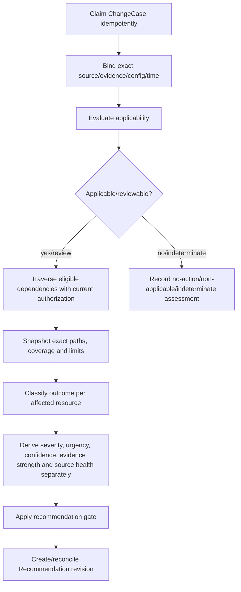
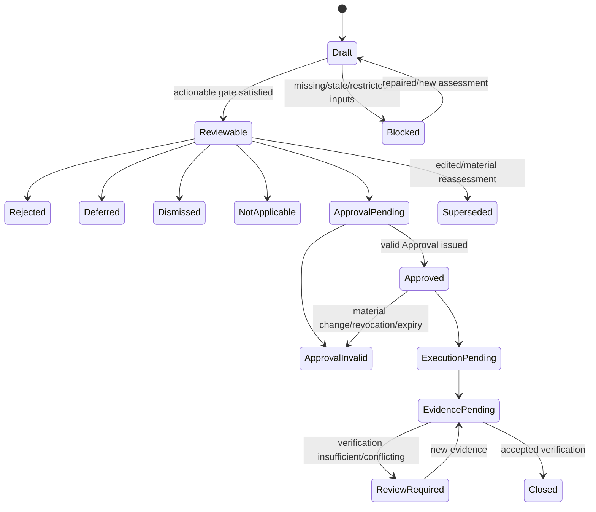
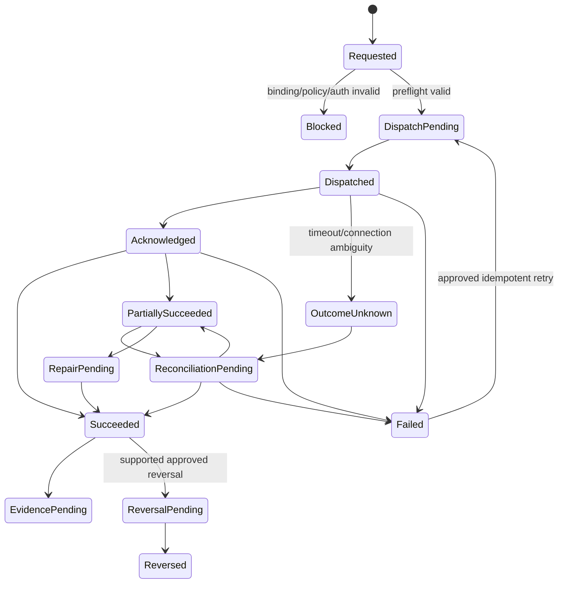

# Phase 1 Impact Analysis and Actions Contract

| Field | Value |
|---|---|
| Document ID | `DIT-IMP-001` |
| Version | `0.1` |
| Status | `DRAFT — provider-neutral; product-owner, architecture, security, privacy, and workflow approval required` |
| Product phase | Phase 1 — Personal and Family |
| Architecture alignment | `ARCH-SOL-001`; `ARCH-DOM-001` rules `DOM-P1-034`–`047`; `ARCH-DATA-001` rules `DATA-P1-031`–`040` |
| Security alignment | `SEC-ARCH-001`, `SEC-AUTH-001`, `SEC-PRIV-001`, `SEC-AUD-001`, `SEC-THR-001` |
| Related DIT contracts | `DIT-EXT-001`, `DIT-FCT-001`, `DIT-GPH-001`, `DIT-MON-001`, `DIT-SRC-001`, `DIT-VER-001` |
| Open decisions | `DEC-031`, `DEC-035`, `DEC-037`, `DEC-040` |
| Primary gaps | `GAP-003`–`GAP-006`, `GAP-009` |
| Updated | 26 August 2026 |

## 1. Purpose and authority

This contract defines provider-neutral impact assessment and consequential action semantics: stable changes, applicability-first evaluation, deterministic authorized dependency paths, explicit outcome classification, separated severity/urgency/confidence/evidence/source-health dimensions, recommendations and dispositions, approval bindings, internal/external execution, unknown/partial reconciliation, replacement/fulfilment evidence, verification and closure.

Exact product traceability:

- requirements: `REQ-P1-GPH-002`–`REQ-P1-GPH-005`, `REQ-P1-MON-005`–`REQ-P1-MON-007`, `REQ-P1-ACT-001`–`REQ-P1-ACT-008`, `REQ-P1-FCT-002`–`REQ-P1-FCT-004`, `REQ-P1-NTF-001`, `REQ-P1-NTF-002`, `REQ-P1-SHR-005`, `REQ-P1-AI-001`–`REQ-P1-AI-006`, `REQ-P1-TRUST-002`–`REQ-P1-TRUST-004`;
- features: `FEAT-P1-010`, `FEAT-P1-014`, `FEAT-P1-017`–`FEAT-P1-019`, `FEAT-P1-021`, `FEAT-P1-023`;
- use cases: `UC-P1-004`, `UC-P1-006`, `UC-P1-007`, `UC-P1-008`, `UC-P1-010`, `UC-P1-013`; and
- acceptance: `AC-UC-P1-004-01`, `AC-UC-P1-004-04`, `AC-UC-P1-006-03`–`AC-UC-P1-006-05`, `AC-UC-P1-007-01`–`AC-UC-P1-007-05`, `AC-UC-P1-008-02`, `AC-UC-P1-013-01`–`AC-UC-P1-013-03`, `AC-P1-E2E-001`, `AC-P1-AI-001`, `AC-P1-MON-001`, and `AC-P1-SEC-001`.

All RFC 2119 language remains draft. This contract does not authorize silent consequential changes, give a model approval/execution authority, promise an external connector under `DEC-031`, conflate notification with action, or select workflow, policy, queue, graph, model, or connector providers.

## 2. Aggregate and state ownership

| Record | Authority and mutability |
|---|---|
| `ChangeCase` | Stable idempotent record for one material fact/document/event/dependency/rule transition and its exact evidence/revision. |
| `ImpactAssessment` | Immutable/versioned assessment snapshot binding one change, applicability, exact authorized `ImpactPath` set, policies/configuration, separated dimensions, coverage and limitations. |
| `Recommendation` | Aggregate for proposed action/effect, evidence/path, uncertainty, consequence/approval class, revision and disposition history. It is not an execution. |
| `RecommendationDecision` | Additive `APPROVE_REQUEST`, `REJECT`, `EDIT`, `DEFER`, `DISMISS`, or `NOT_APPLICABLE` decision; only the configured approval route may create an `Approval`. |
| `Approval` | Immutable binding to exact recommendation/input/effect/target/policy revisions/digests, actor authority, issue/expiry, revocation and supersession. It is not a reusable grant. |
| `ActionExecution` | Aggregate for stable command/effect/idempotency identity, dispatch attempts, provider-neutral request/result, unknown/partial/reconciliation/repair/reversal and closure-evidence handoff. |
| `EvidenceSubmission` | Immutable submission of exact replacement/fulfilment evidence against declared criterion; upload or external receipt is not verification. |
| `EvidenceVerification` | Additive verifier decision over exact evidence, criterion/rule/version, outcome, confidence/reason and authority. |
| `RequirementCase` / recommendation workflow | Owns final fulfilment/closure transition after accepted verification. Execution cannot close it directly. |

```mermaid
flowchart LR
    C[ChangeCase]
    A[ImpactAssessment]
    R[Recommendation]
    D[RecommendationDecision]
    P[Approval]
    X[ActionExecution]
    S[EvidenceSubmission]
    V[EvidenceVerification]
    L[Requirement/recommendation closure]

    C --> A --> R --> D
    D -->|approval requested| P
    P -->|valid exact binding| X
    X -->|work result| S
    S --> V
    V -->|accepted by owning workflow| L
    D -->|reject/defer/dismiss/NA| R
```



No arrow grants access or guarantees the next state. Each owner evaluates its own rules and current authorization.

## 3. Change and assessment inputs

### 3.1 Change identity

Every `ChangeCase` includes stable `ChangeId`, workspace, change kind, exact source resource and before/after/event revision, evidence anchors/observations, occurred/valid/recorded time, materiality policy/version, configuration, actor/workload, source health where relevant, supersession/reconciliation lineage and idempotency key.

Supported input kinds include an accepted fact-resolution transition, document/version/effective/conformed transition, user/life event, active dependency transition, and governed rule publication/effective transition. A processing proposal or upload alone is not a material change unless its owning contract accepts that transition.

### 3.2 Assessment snapshot

Every `ImpactAssessment` binds:

- exact `ChangeCase` revision and evidence;
- applicability outcome, rule/publication/context, valid/known time and policy;
- graph type/projection versions, authorized `ImpactPath` snapshots and traversal limits;
- affected resource/subject exact revisions, current authorization and disclosure policy;
- scoring/classification policy versions and model/rule/tool provenance;
- source authority, freshness/health/coverage and evidence quality;
- outcome classification plus separately derived dimensions;
- missing/restricted/stale/cyclic/truncated/unknown coverage; and
- assessment revision/generation, prior linkage, created time and safe audit correlation.

## 4. Deterministic impact algorithm



For identical retained inputs, versions, authorization/disclosure context and declared limits, deterministic rule portions return the same classification/path set. Model-supported components remain versioned/calibrated derived outputs with explicit non-determinism/uncertainty and evaluation evidence.

### 4.1 Outcome classification

Every affected-item outcome uses exactly one primary class:

| Class | Meaning |
|---|---|
| `AUTOMATIC_TECHNICAL_UPDATE_POSSIBLE` | A bounded technical state transition may be representable, but execution still requires configured policy/approval and current authorization. “Possible” is not permission. |
| `USER_ACTION_REQUIRED` | A human must perform/review work or supply evidence; urgency/severity remain separate. |
| `EXTERNAL_NOTIFICATION_REQUIRED` | Policy/rule supports a notification requirement; message drafting, recipient authority, channel and sending approval remain separate. |
| `REVIEW_REQUIRED` | Applicability, path, evidence, conflict, consequence or policy requires authorized review before an actionable recommendation. |
| `NO_ACTION` | Within declared evidence/coverage, no configured action is recommended, with rationale. It is distinct from non-applicable, incomplete, restricted or unavailable. |

### 4.2 Separated dimensions

| Dimension | Required derivation |
|---|---|
| Applicability | Rule/context/valid-time predicates and evidence; evaluated before impact. |
| Severity | Magnitude/consequence class under exact policy; not a probability or deadline. |
| Urgency | Time sensitivity/due-window under exact rule/evidence/timezone; not impact size. |
| Confidence | Calibrated confidence in derived assessment/classification for the evaluated slice. |
| Evidence strength | Quality/directness/coverage/review of cited source/paths; not confidence or authority. |
| Source authority | Registry tier within exact manifest; not freshness or applicability. |
| Source health | Current retrieval/parser/freshness/coverage state; not rule authority or severity. |
| Coverage | Traversal/source/input completeness and truncation; not confidence or “no impact.” |

Each dimension retains its policy/model/input versions and explanation. Changing one cannot silently rewrite another.

## 5. Recommendation contract

Every consequential recommendation contains exact observed change/evidence, applicability, affected subject/resource, one or more authorized typed paths, outcome classification, separated dimensions, uncertainty/coverage/limitations, proposed action/effect/target, consequence and approval class, required evidence/closure criteria, current revision, owner/assignee option, due-date derivation where supported, and disposition history.

An actionable-state gate requires supported applicability or approved review state, exact evidence, at least one authorized path where the policy requires one, current source/graph health within policy, validated proposed effect, required review and no deletion/security block. Missing inputs keep it draft/review/blocked.



## 6. Approval binding

An `Approval` includes:

- approval ID, exact recommendation ID/revision and impact/change revisions;
- exact evidence/path/source/rule/configuration/policy revisions or immutable reviewed-input digest;
- target, operation, proposed effect and canonical effect digest;
- actor, authority/grant, authentication/step-up and separation-of-duties evidence;
- consequence/bulk/external class, quantity/scope and allowed execution adapter/capability;
- issue time, expiry, revocation, supersession and one-use/reuse policy (default non-reusable for a different effect);
- required pre-execution revalidation and completion-evidence criteria; and
- privacy-safe audit correlation.

A new occurrence, source/graph/config/policy change, target/effect edit, authority/grant loss, expiry, deletion/quarantine state or different quantity is material according to versioned policy and invalidates/reroutes approval. Model text, a similar prior approval, notification acknowledgement or membership cannot create/extend it.

## 7. Action execution and reconciliation

### 7.1 Execution state



Provider acceptance is not real-world completion. Exactly-once external effect is never assumed.

### 7.2 Command and adapter envelope

Each execution retains stable action/command IDs, idempotency and reconciliation identity, approval ID/binding digest, exact target/revision, operation/effect digest, adapter/capability version, minimum request fields by protected reference, purpose/consent/residency, issue/expiry, attempt/retry policy, external correlation/receipt, result/unknown/partial details, reconciliation checks, repair/reversal support, evidence requirement and audit correlation.

Retry uses the same logical effect identity when safe. If an adapter cannot prove idempotency or reconcile ambiguity, automatic retry is blocked and authorized review/repair is required.

## 8. Replacement evidence, verification, and closure

`EvidenceSubmission` binds exact evidence/artifact/document/version/source observation or permitted manual evidence to an exact requirement/recommendation criterion/version, submitter authority, claimed scope/effective time and submission time.

`EvidenceVerification` records verifier actor/workload and authority, exact submission/evidence anchors, criterion/rule/profile version, verification method/tool/schema, outcome (`VERIFIED`, `REJECTED`, `INSUFFICIENT`, `CONFLICTED`, `RESTRICTED`, `EXPIRED`), confidence/reason, decision time and audit correlation.

Closure is accepted only by the owning `RequirementCase` or recommendation workflow after configured verification succeeds and current policy permits it. Time elapsed, upload, extraction, task completion, notification delivery, action dispatch, external acknowledgement or even `ActionExecution.Succeeded` is not closure. Later contradictory evidence creates a new change/finding without rewriting prior closure history.

## 9. Draft normative rules

### 9.1 Change, applicability, paths, and assessment

- `DIT-IMP-P1-001` — Every material fact, document, event, dependency or governed-rule transition MUST have one stable idempotent `ChangeCase` with exact source transition/revision, evidence, valid/recorded time and reconciliation lineage.
- `DIT-IMP-P1-002` — An impact run MUST bind exact change, evidence, rule/configuration/policy, valid/known time, actor/purpose, graph/source generations and replay generation.
- `DIT-IMP-P1-003` — Applicability MUST be evaluated before impact and remain separate from authority, evidence strength, confidence, severity, urgency, source health and action classification.
- `DIT-IMP-P1-004` — Non-applicable, indeterminate, review-required, restricted and unavailable applicability outcomes MUST remain distinct; only supported/configured outcomes may proceed to actionable assessment.
- `DIT-IMP-P1-005` — Impact traversal MUST follow `DIT-GPH-001`, current authorization and deterministic cycle/depth/fan-out/result/cost/time/stale-edge policies.
- `DIT-IMP-P1-006` — Every reported consequential impact MUST retain at least one exact authorized `ImpactPath` where the assessment policy requires a path, plus coverage/truncation/restriction state.
- `DIT-IMP-P1-007` — “No action,” “no authorized path,” “incomplete,” “restricted,” “stale,” and “unavailable” MUST remain distinct and MUST NOT become a confident no-impact conclusion.
- `DIT-IMP-P1-008` — Duplicate/replayed changes MUST reconcile to the correct assessment generation and MUST NOT duplicate recommendations or lose newly applicable impacts.

### 9.2 Classification and dimensions

- `DIT-IMP-P1-009` — Each affected item MUST use exactly one primary outcome: automatic technical update possible, user action required, external notification required, review required, or no action.
- `DIT-IMP-P1-010` — `AUTOMATIC_TECHNICAL_UPDATE_POSSIBLE` is a capability classification only and MUST NOT bypass policy, current authorization, review, human approval or execution evidence.
- `DIT-IMP-P1-011` — Severity, urgency, confidence, evidence strength, source authority, source health, applicability and coverage MUST be separately stored, derived, versioned and explained.
- `DIT-IMP-P1-012` — Changing one dimension or its model/policy MUST NOT silently change another dimension, outcome class, approval requirement or historical assessment.
- `DIT-IMP-P1-013` — Confidence MUST be calibrated for the applicable capability/rule/resource/jurisdiction slice and MUST NOT be treated as evidence, authority, applicability or approval.
- `DIT-IMP-P1-014` — Source/graph/document/fact staleness, conflict, restriction and incompleteness MUST be reflected in explicit dimensions/gates rather than hidden by a composite score.

### 9.3 Recommendation and decisions

- `DIT-IMP-P1-015` — A recommendation MUST bind observed change, applicability, exact paths/evidence, affected resource, outcome, separated dimensions, uncertainty/coverage, proposed effect and approval/evidence requirements.
- `DIT-IMP-P1-016` — Missing required evidence, applicability, authorized path, current health, valid effect schema, review or approval policy MUST block actionable state and remain visible.
- `DIT-IMP-P1-017` — Reject, edit, defer, dismiss, not-applicable and approval-request decisions MUST remain distinct additive outcomes with actor, reason, policy, time and reversibility/escalation behavior.
- `DIT-IMP-P1-018` — Editing any material recommendation input/effect MUST create a new revision and re-evaluate applicability, paths, policy and approval rather than mutating the reviewed proposal.
- `DIT-IMP-P1-019` — Model-generated recommendations are derived proposals and MUST NOT self-approve, create authority, select hidden evidence or execute tools/actions.

### 9.4 Approval

- `DIT-IMP-P1-020` — Consequential document/fact/rule/bulk/external-notification/connector actions MUST pass current policy and configured human approval before execution.
- `DIT-IMP-P1-021` — Approval MUST bind exact recommendation/change/impact revisions, reviewed evidence/path/source/config/policy inputs or digest, target, operation/effect digest, actor/authority, consequence/quantity and expiry.
- `DIT-IMP-P1-022` — Approval authority, execution authority and verification/closure authority MUST remain separately configurable; membership or resource read is insufficient.
- `DIT-IMP-P1-023` — Material input/effect/target/policy/config/source/path/authority change, expiry, revocation, quarantine or deletion MUST invalidate or reroute approval before execution.
- `DIT-IMP-P1-024` — Approval MUST NOT be supplied, extended or generalized by model/document/source text, prior similar action, acknowledgement, consent, role or stale session state.
- `DIT-IMP-P1-025` — Bulk approval MUST bind exact bounded target/effect set or governed selection digest, per-item authorization and failure policy; it cannot authorize later-added items.

### 9.5 Execution, partial failure, and reconciliation

- `DIT-IMP-P1-026` — Every `ActionExecution` MUST have stable command/effect/idempotency identity, exact valid approval binding, target/revision, adapter/capability, attempts, truthful result and reconciliation lineage.
- `DIT-IMP-P1-027` — Immediately before dispatch and effect commitment, execution MUST reauthorize actor/service, target/action, approval, unchanged inputs/effect, purpose/consent/region, rate/volume and deletion/security state.
- `DIT-IMP-P1-028` — Provider acknowledgement or request submission MUST NOT prove external effect; requested, dispatched, acknowledged, unknown, partial, succeeded, failed and reconciled states remain distinct.
- `DIT-IMP-P1-029` — Exactly-once external effect MUST NOT be assumed. Retry uses bounded policy, stable effect identity and reconciliation; ambiguous non-idempotent effects require review rather than blind retry.
- `DIT-IMP-P1-030` — Partial success MUST identify each attempted sub-effect/result by safe reference, preserve successful effects, block false overall completion and expose supported retry/forward-repair/compensation/reversal options.
- `DIT-IMP-P1-031` — Timeout/unknown outcomes MUST enter reconciliation, retain external correlation/receipts and remain pending until resolved or explicitly abandoned under authorized policy.
- `DIT-IMP-P1-032` — Reversal or repair is a new bound action with its own authority, evidence, idempotency and result; it MUST NOT edit the original execution outcome.
- `DIT-IMP-P1-033` — Connector actions are available only for approved adapter/scope under `DEC-031`; an abstract command schema does not activate a connector.

### 9.6 Evidence, closure, authorization, and audit

- `DIT-IMP-P1-034` — Closure MUST require configured replacement/fulfilment evidence and an explicit `EvidenceVerification`; elapsed time, upload, extraction, task completion, delivery, dispatch, acknowledgement or execution success alone is insufficient.
- `DIT-IMP-P1-035` — Evidence submission, verification and owning workflow closure MUST retain exact criteria/rule/profile versions, evidence anchors, verifier authority, decision/confidence/reason, time and supersession/reopen history.
- `DIT-IMP-P1-036` — Failed, insufficient, conflicted, restricted or expired evidence MUST keep the action/requirement awaiting evidence/review and MUST NOT auto-renew or close it.
- `DIT-IMP-P1-037` — Current authorization MUST apply independently to impact existence, path/evidence, scoring dimensions, recommendation, disposition, approval, execution, verification, closure, task, notification and audit view.
- `DIT-IMP-P1-038` — Restricted impacts MAY use only a named minimal-disclosure route and MUST NOT reveal subject, resource, value, source, document, edge/path, count, score component, target or timing.
- `DIT-IMP-P1-039` — A deletion fence or revocation MUST block assessment use, approval, dispatch, retry, evidence access, closure and late-result activation; permitted reconciliation cannot resurrect content/effect authority.
- `DIT-IMP-P1-040` — Every request, assessment, limitation, recommendation/disposition, approval/invalidation, action attempt/result/reconciliation/repair, evidence submission/verification and closure MUST produce `SEC-AUD-001`-conformant safe evidence.
- `DIT-IMP-P1-041` — Ordinary logs, metrics, traces, analytics, errors, screenshots and fixtures MUST exclude raw change/evidence/value/draft/effect content, passages, hidden paths, prompts/answers, unrestricted URLs, tokens and provider payloads.
- `DIT-IMP-P1-042` — External/model processors MUST receive only the minimum authorized context for one capability/purpose under current consent/region/retention policy and cannot expand tools, targets, effect or authority.
- `DIT-IMP-P1-043` — State transitions and required audit/events MUST be durably coupled; no aggregate may claim another owner’s impact, approval, effect, verification or closure completed from an enqueue/request alone.
- `DIT-IMP-P1-044` — Failure, stale, conflict, restricted, invalid-approval, unknown, partial, repair, evidence-pending and verification-failed states MUST remain machine-readable, user-safe and recoverable without fabricated success.

## 10. Provider-neutral action example

```json
{
  "example_only": true,
  "action_execution_id": "opaque-action-id",
  "command_id": "opaque-stable-command-id",
  "approval_id": "opaque-approval-id",
  "approval_binding_digest": "sha256:illustrative-only",
  "target_ref": {
    "workspace_id": "opaque-workspace-id",
    "resource_kind": "configured-kind",
    "resource_id": "opaque-resource-id",
    "revision": 7
  },
  "operation": "configured.operation.example",
  "effect_digest": "sha256:illustrative-only",
  "adapter": {
    "capability_id": "provider-neutral-action-capability",
    "version": "1.0"
  },
  "idempotency_key": "opaque-effect-key",
  "status": "DISPATCH_PENDING"
}
```

The example authorizes no operation, target, connector or external processor.

## 11. Failure and degraded behavior

| Failure | Required outcome |
|---|---|
| Applicability uncertain/stale | Indeterminate/review/blocked; no required action assertion. |
| Graph incomplete/restricted | Preserve paths found and coverage; block or safely limit recommendation. |
| Recommendation missing evidence | Draft/blocked; cannot become actionable. |
| Approval expired/changed input/revoked actor | `ApprovalInvalid`; require new review/approval where permitted. |
| Adapter timeout | `OutcomeUnknown` and reconciliation; no blind retry or closure. |
| Partial batch/external result | Per-effect truth, no overall success; retry/repair/reversal under new policy/binding. |
| Notification delivery failure | Delivery state fails separately; recommendation/task truth remains. |
| Replacement evidence rejected | Evidence/review pending; no fulfilment, renewal or closure. |
| Audit durability failure | Consequential transition blocked or explicitly incomplete until reconciled. |
| Deletion/revocation mid-flow | Fence/current policy wins and late output cannot activate. |

## 12. Rule traceability

| Rule range | Requirements | Features/use cases | Security/data hooks |
|---|---|---|---|
| `DIT-IMP-P1-001`–`008` | `REQ-P1-ACT-001`, `REQ-P1-GPH-002`–`005`, `REQ-P1-MON-006`–`007` | `FEAT-P1-018`; `UC-P1-006`, `007` | `DOM-P1-040`–`042`; `DATA-P1-031`, `033`–`040`; `AUD-P1-013`, `016` |
| `DIT-IMP-P1-009`–`014` | `REQ-P1-ACT-002`–`004`, `REQ-P1-MON-005`–`007` | `FEAT-P1-017`, `018`; `UC-P1-007` | `THR-P1-030`; `AUD-P1-015`–`016` |
| `DIT-IMP-P1-015`–`019` | `REQ-P1-ACT-003`–`005`, `REQ-P1-AI-001`–`006` | `FEAT-P1-014`, `018`, `019`; `UC-P1-007` | `SEC-P1-020`–`021`, `024`; `AUD-P1-014`, `016` |
| `DIT-IMP-P1-020`–`025` | `REQ-P1-ACT-005`, `006` | `FEAT-P1-019`; `UC-P1-004`, `007` | `AUTH-P1-013`–`014`; `THR-P1-010`; `AUD-P1-017` |
| `DIT-IMP-P1-026`–`033` | `REQ-P1-ACT-007`, `REQ-P1-TRUST-009` | `FEAT-P1-019`; `UC-P1-007` | `DATA-P1-037`; `SEC-P1-022`, `024`; `AUD-P1-018`, `023` |
| `DIT-IMP-P1-034`–`044` | `REQ-P1-ACT-008`, `REQ-P1-TRUST-002`–`004`, `REQ-P1-SHR-005` | `FEAT-P1-019`, `021`, `023`; `UC-P1-007`, `008`, `010`, `013` | `AUTH-P1-011`–`015`, `019`–`025`, `029`, `034`–`035`; `PRIV-P1-004`, `008`, `011`, `020`; `AUD-P1-016`–`019`, `027` |

## 13. Validation and test obligations

Automated evidence MUST prove:

1. every supported change kind creates/reconciles one `ChangeCase` and replay does not duplicate or lose impacts;
2. applicability, path, classification and every separated dimension reproduce from exact inputs/versions and remain independently mutable only by new assessment;
3. cycles, depth/fan-out, stale source/edge, restricted branches and incomplete data produce truthful coverage, not no-impact;
4. every consequential impact has an exact authorized typed path and citation where policy requires it (`AC-UC-P1-007-01`);
5. all five primary classifications are distinct and automatic-possible cannot bypass approval;
6. recommendation actionable-state mutation tests reject missing applicability/evidence/path/health/review/effect schema;
7. reject/edit/defer/dismiss/not-applicable/approval-request remain distinct with additive history;
8. approval fails on changed target/draft/effect/input set, source/path/config/policy, expiry, revoked authority, wrong quantity and replay (`AC-UC-P1-007-02`, `AC-UC-P1-004-04`);
9. execution tests cover requested, dispatched, acknowledged, unknown, partial, succeeded, failed, retry, reconciliation, repair, compensation and reversal without duplicate external effect;
10. timeout/partial success remains truthful and closure waits for verification (`AC-UC-P1-007-03`);
11. replacement evidence accepted/rejected/insufficient/conflicting/restricted/expired cases prove upload/file presence is not fulfilment (`AC-UC-P1-007-05`);
12. stale source and mid-flow revocation block/reroute approval/execution (`AC-UC-P1-007-04`);
13. cross-workspace/field/path/count/score/effect/timing minimal-disclosure tests span UI/API/worker/AI/notification/export/audit/cache;
14. connector actions remain absent unless `DEC-031` closes and adapter conformance passes; and
15. `AC-P1-E2E-001`, `AC-P1-AI-001`, `MET-P1-007`, `MET-P1-008`, `MET-P1-013`, `MET-P1-014`, `MET-P1-017`, `MET-P1-018`, `MET-P1-021`, and `MET-P1-022` evidence is retained.

## 14. Definition of ready

This contract remains DRAFT until change/assessment/recommendation/approval/execution/evidence schemas, policy and state machines, graph/source adapters, dimension derivations, idempotency/reconciliation adapters, authorization/privacy matrices, audit/event contracts, and end-to-end partial-failure/closure tests are approved. It enables no connector or autonomous action.
