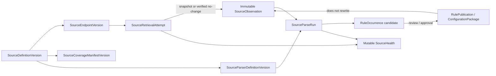
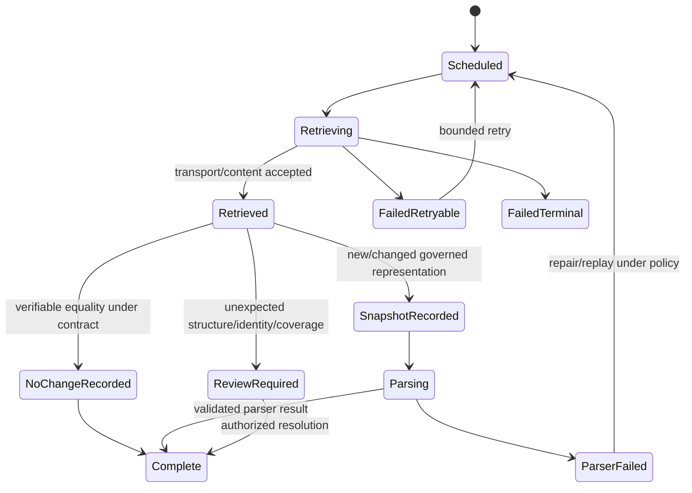

# Phase 1 Trusted Source Registry Contract

| Field | Value |
|---|---|
| Document ID | `DIT-SRC-001` |
| Version | `0.1` |
| Status | `DRAFT — provider-neutral; product-owner, source-governance, architecture, security, and privacy approval required` |
| Product phase | Phase 1 — Personal and Family |
| Architecture alignment | `ARCH-SOL-001`; `ARCH-DOM-001` rules `DOM-P1-026`–`033`, `DOM-P1-055`, `DOM-P1-057`; `ARCH-DATA-001` rules `DATA-P1-011`–`020`, `DATA-P1-025`, `DATA-P1-041`–`050` |
| Security alignment | `SEC-ARCH-001`, `SEC-AUTH-001`, `SEC-PRIV-001`, `SEC-AUD-001`, `SEC-THR-001` |
| Related DIT contracts | `DIT-TAX-001`, `DIT-EXT-001`, `DIT-FCT-001`, `DIT-GPH-001`, `DIT-VER-001` |
| Open decisions | `DEC-035`, `DEC-039`, `DEC-040` |
| Primary gap | `GAP-006` |
| Updated | 26 August 2026 |

## 1. Purpose and authority

This contract defines the provider-neutral registry and observation chain for governed external sources: authority tiers, endpoint governance, coverage manifests, retrieval attempts, immutable snapshots/no-change observations, parser versions/runs, freshness, mutable operational health, publication/replay, security, and explicit limits on authority.

Exact product traceability:

- requirements: `REQ-P1-MON-002`–`REQ-P1-MON-007`, `REQ-P1-SRCH-002`, `REQ-P1-SRCH-004`, `REQ-P1-ACT-003`, `REQ-P1-ACT-004`, `REQ-P1-TRUST-002`–`REQ-P1-TRUST-005`, `REQ-P1-TRUST-009`, and `REQ-P1-CFG-001`–`REQ-P1-CFG-004`;
- features: `FEAT-P1-013`, `FEAT-P1-016`–`FEAT-P1-018`, `FEAT-P1-022`;
- use cases: `UC-P1-005`, `UC-P1-006`, `UC-P1-007`, `UC-P1-008`, `UC-P1-013`, `UC-P1-018`; and
- acceptance: `AC-UC-P1-005-01`, `AC-UC-P1-006-03`, `AC-UC-P1-006-04`, `AC-UC-P1-007-04`, `AC-UC-P1-008-01`, `AC-UC-P1-013-01`–`AC-UC-P1-013-03`, `AC-P1-MON-001`, `AC-P1-RAG-001`, `AC-P1-E2E-001`, and `AC-P1-SEC-001`.

All RFC 2119 language remains draft. This document does not select the first Australian sources (`DEC-035`), declare that every authoritative change is monitored, make arbitrary web content authoritative, select an HTTP/browser/parser provider, approve a processing region (`DEC-040`), or turn parsing into rule publication.

## 2. Registry and evidence objects

| Object | Authority and mutability |
|---|---|
| `SourceDefinitionVersion` | Immutable governed definition with authority tier, jurisdiction, topics, official endpoint references, retrieval method, coverage, cadence/freshness ownership, parser compatibility, disclosure and governance. |
| `SourceEndpointVersion` | Immutable endpoint contract: exact destination identity, approved protocols/redirects, retrieval method, authentication if any, content/size constraints, localization and network policy. |
| `SourceCoverageManifestVersion` | Immutable positive and negative declaration of jurisdictions, topics, resource/document/rule kinds, publication series, temporal scope, known gaps and non-coverage. |
| `SourceParserDefinitionVersion` | Immutable parser/input/output schema, coverage expectations, semantic validation, failure policy, replay compatibility and maintainer/approval evidence. |
| `SourceRetrievalAttempt` | Immutable attempt record for request identity, endpoint/version, retrieval route, times, response/error classification, network/content-policy validation and correlation. It contains no unrestricted response content in ordinary metadata. |
| `SourceObservation` | Immutable snapshot or verifiable no-change evidence in global reference scope, or explicitly isolated workspace-personalized scope. It is never overwritten by later retrieval. |
| `SourceParseRun` | Immutable parser execution over one exact observation, retaining parser/tool/schema versions, output validation, coverage, failures and lineage. |
| `RuleOccurrence` | Immutable parsed/manual candidate linked to exact observation evidence. It is not an active consequential rule. |
| `SourceHealth` | Separate mutable operational/reference state: last attempt/success, freshness, coverage, failure/parser state, retry/disabled status. It does not overwrite observations or rule history. |
| `RulePublication` / `ConfigurationPackage` | Own governed activation/rejection/correction/effective dating of rule output. Registry/parsers cannot publish by themselves. |



## 3. Authority-tier contract

Authority tiers are configured, versioned claims about the source’s role within declared coverage—not guarantees of correctness, completeness, freshness, applicability, or legal effect.

| Conceptual tier | Permitted use |
|---|---|
| `OFFICIAL_PRIMARY` | Source is the issuing body or its authenticated publication system for the declared series/topic. Consequential use still needs exact evidence, freshness, publication and applicability. |
| `OFFICIAL_DELEGATED` | Source is explicitly delegated/recognized by the issuing authority for the declared material and period; delegation evidence is mandatory. |
| `GOVERNED_SECONDARY` | Curated secondary source may support discovery/corroboration or configured reviewed use; limitations and primary-source dependencies are explicit. |
| `GUIDANCE_ONLY` | May support clearly labelled non-authoritative guidance; cannot alone activate a consequential rule or required action. |
| `UNAPPROVED_OR_UNKNOWN` | Ineligible for governed authority. It may be retained only in an isolated research/proposal process and cannot enter production consequence paths. |

Exact tier IDs and allowed consequence classes belong in versioned reference data. A higher tier cannot bypass current source health, observation integrity, review/publication, jurisdiction/applicability, evidence, authorization, or `DEC-035` launch enablement.

## 4. Source definition and coverage

### 4.1 Mandatory definition fields

Every consequentially eligible `SourceDefinitionVersion` declares:

- stable source ID/version, official publisher/authority identity, accountable platform owner and independent reviewer;
- authority tier and evidence, jurisdiction/sub-jurisdiction, languages/locales and effective/publication period;
- exact topic, rule/resource/document kinds, publication series and consequence classes;
- `SourceCoverageManifestVersion`, known exclusions/gaps and user-facing disclosure text key;
- one or more exact `SourceEndpointVersion` records, retrieval method, cadence/trigger and acceptable freshness objective;
- expected content/media/structure/identifier/signature characteristics and snapshot/no-change proof method;
- compatible parser definitions, parser coverage, review/publication policy and replay requirements;
- security/privacy class, egress/destination policy, permitted region/processors, retention/deletion lineage and incident owner;
- health thresholds, retry/disable/escalation policy, change-detection strategy and monitoring owner; and
- configuration package, source evidence, validation, approval, effective time, supersession and repair/rollback history.

### 4.2 Coverage manifest

Coverage is positive and bounded. The manifest records included/excluded topics and publication series, jurisdiction and time range, retrieval frequency/trigger, expected identifiers, language/format, pagination/archive/history coverage, personalization status, known access limitations, parser-covered sections, maximum declared lag, upstream caveats and last governance review.

“No known gap” is not “complete.” UI, exports, health and impact outputs disclose the exact enabled manifest/version and any stale/disabled/partial state.

## 5. Retrieval, snapshot, and no-change evidence

### 5.1 Attempt flow



Every attempt has a stable idempotency/replay identity. A transport `304`, timestamp, provider statement, or equal parser output is not automatically adequate no-change evidence. The active method must bind exact prior/current endpoint identity, validators/digests/signatures or equivalent proof, covered representation and retrieval time.

### 5.2 Observation envelope

Every `SourceObservation` records:

- stable observation and exact source/endpoint/coverage versions;
- `SNAPSHOT` or `NO_CHANGE`, global-reference versus isolated personalized scope, and prior-observation linkage;
- retrieval attempt, observed/retrieved/recorded time, upstream publication/effective time when supported, and clock/timezone uncertainty;
- final canonical endpoint identity and redirect chain by protected/safe reference;
- immutable raw/normalized snapshot artifact references as policy permits, digest algorithm/value, media/structure/signature and integrity evidence;
- no-change method/proof and exact coverage when applicable;
- retrieval/transport/content-policy result, truncation/pagination/archive coverage and safe errors;
- security/privacy/residency/retention/deletion classification; and
- audit, causation, correlation and supersession/reconciliation lineage.

A failed retrieval creates an immutable `SourceRetrievalAttempt` and health update, not a fabricated no-change observation.

## 6. Parsing, publication, and replay

Every `SourceParseRun` binds one observation, parser definition/version, input/output schema versions, normalization/render/tool versions, jurisdiction/language, exact covered regions/items, start/end, capability/adapter, output digest, validation issues, confidence/review, and prior-run lineage.

Parser output passes syntactic, referential, semantic, evidence-anchor, jurisdiction/effective-time, coverage, security and change-diff validation. It can create `RuleOccurrence` proposals only. `RulePublication`/`ConfigurationPackage` separately records reviewer/approval, source evidence, applicability schema, effective/transaction time, decision and supersession.

Replay under a changed parser/schema/rule definition/configuration creates new immutable runs/candidates/publication decisions as required. It never mutates an observation, prior parse, prior published rule, prior applicability or prior finding.

## 7. Freshness and source health

### 7.1 Health dimensions

| Dimension | Meaning |
|---|---|
| Retrieval state | Last attempt outcome, failure class, retry/backoff/exhaustion and endpoint availability. |
| Last success | Time/observation of last accepted snapshot or no-change proof; shown separately from last attempt. |
| Freshness | Current policy evaluation against cadence/objective and observation/publication semantics; not a universal duration. |
| Parser state | Last parser attempt/success, schema compatibility, coverage loss, validation errors and replay/repair. |
| Coverage state | Active manifest, partial/unknown gaps, pagination/archive/language/section coverage and disabled topics. |
| Governance state | Definition/review/approval/owner/endpoint/parser/config current, expiring, suspended or retired. |
| Security state | Poisoning/identity/signature/content-policy/SSRF incident or endpoint isolation. |
| Overall consequence eligibility | Policy-derived result for a named use; never a replacement for the dimensions above. |

Conceptual states include `HEALTHY`, `DEGRADED`, `STALE`, `FAILED_RETRYING`, `FAILED_EXHAUSTED`, `PARSER_FAILED`, `COVERAGE_PARTIAL`, `SUSPENDED`, `DISABLED`, and `UNKNOWN`. Exact codes/thresholds are reference data. The last success remains visible but cannot hide a later failure or expired freshness.

## 8. Draft normative rules

### 8.1 Governance and authority

- `DIT-SRC-P1-001` — Every governed source MUST have a stable ID and immutable definition versions independent of URL, provider, label, parser and physical retrieval technology.
- `DIT-SRC-P1-002` — A source eligible for consequential use MUST declare authority tier/evidence, jurisdiction, topics, official endpoints, retrieval method, coverage, cadence/freshness owner, parser versions, review/publication policy, security/privacy, owner and change history.
- `DIT-SRC-P1-003` — Authority tier MUST be bounded by the exact coverage manifest and consequence policy; it MUST NOT imply correctness, completeness, freshness, applicability, user authority or legal effect.
- `DIT-SRC-P1-004` — Arbitrary web pages, search results, redirects, model citations, user URLs and unregistered endpoints MUST NOT substitute for a governed source or become consequential authority.
- `DIT-SRC-P1-005` — Until `DEC-035` is approved, representable sources/topics MUST remain launch-disabled unless explicitly enabled in a draft test profile; examples do not claim coverage.
- `DIT-SRC-P1-006` — Source/configuration publication MUST validate, review/approve, effective-date, audit, impact-assess, supersede and repair/replay through `ConfigurationPackage`; retrieval or parsing alone cannot activate it.

### 8.2 Endpoint, retrieval, and observations

- `DIT-SRC-P1-007` — Each endpoint version MUST restrict destination identity, protocols, ports, redirects, DNS/address classes, authentication, request method, content/media/size/structure and egress route; dynamic content cannot expand the allow-list.
- `DIT-SRC-P1-008` — Every retrieval attempt MUST have stable idempotency/replay identity, source/endpoint/coverage versions, route, request policy, times, response/error class, actor/workload and audit correlation.
- `DIT-SRC-P1-009` — Every accepted successful retrieval MUST create an immutable snapshot observation or a verifiable no-change observation; a failed retrieval MUST remain a failed attempt and MUST NOT be converted to no change.
- `DIT-SRC-P1-010` — Snapshot/no-change evidence MUST bind exact endpoint/source identity, observed representation/coverage, retrieval time, integrity digest/signature or approved validator proof, prior observation and acquisition route.
- `DIT-SRC-P1-011` — Transport status, upstream timestamp, equal parser output or absence of detected difference alone MUST NOT prove no change unless the versioned method explicitly validates the complete declared scope.
- `DIT-SRC-P1-012` — Redirect, DNS, certificate/identity, signature, media, unexpected size/structure, truncation, pagination/archive gap and content-policy failures MUST remain explicit and may require isolation/review.
- `DIT-SRC-P1-013` — Personalized/authenticated observations MUST be workspace-isolated and MUST NOT enter global reference scope, shared caches, global rules or cross-household comparison.

### 8.3 Parsing, publication, and replay

- `DIT-SRC-P1-014` — Every parser definition and run MUST retain stable version, exact observation/input, schemas/tools/transforms, covered regions/items, output digest, validation, confidence/review, times and supersession/replay lineage.
- `DIT-SRC-P1-015` — Parser/source content and embedded instructions are untrusted data and MUST NOT alter endpoint policy, authorization, tools, schema, publication, notification or action authority.
- `DIT-SRC-P1-016` — Parsed rule/content output MUST remain an immutable `RuleOccurrence` proposal until governed publication validates evidence, jurisdiction, applicability schema, effective/transaction time, review and approval.
- `DIT-SRC-P1-017` — A source observation, parse run, rule occurrence, rule publication, workspace applicability and recommendation MUST remain separate records and decisions.
- `DIT-SRC-P1-018` — Parser/schema/configuration repair MUST create new runs/results and deterministic replay linkage; prior observations, failures, publications, applicability and findings MUST NOT be overwritten.
- `DIT-SRC-P1-019` — Replay MUST be bounded, idempotent, source/observation/version scoped, ordered or safely reconciled and able to identify every affected publication/applicability/change/finding without duplicate consequence.

### 8.4 Freshness, coverage, security, and deletion

- `DIT-SRC-P1-020` — `SourceHealth` MUST remain separate from immutable `SourceObservation` and expose last attempt, last success, freshness, coverage, parser failure, retry history, stale/disabled/governance/security state.
- `DIT-SRC-P1-021` — Last-known successful content MUST NOT hide a later retrieval/parser failure, expired freshness, coverage loss, suspended endpoint or disabled source.
- `DIT-SRC-P1-022` — Consequential consumers MUST bind the exact observation/publication and evaluate current freshness, coverage and source health under their policy; unhealthy input blocks or visibly degrades rather than masquerading as current.
- `DIT-SRC-P1-023` — Coverage manifests MUST positively declare included and excluded scope, known gaps and review time; the product MUST NOT claim every authoritative change will be detected.
- `DIT-SRC-P1-024` — Source availability, authority, freshness, coverage, parser confidence, evidence strength, applicability, severity and urgency MUST remain separate values with separate derivations.
- `DIT-SRC-P1-025` — Source definitions, observations, parser outputs, health, coverage, rule candidates and citations MUST apply current authorization/disclosure policy; restricted existence/count/timing cannot leak through health or errors.
- `DIT-SRC-P1-026` — Retrieval/parser adapters MUST use `PUR-P1-004`, minimum data, approved destination/capability, consent where applicable, eligible region, time-bounded credentials and prohibited unapproved retention/training/reuse.
- `DIT-SRC-P1-027` — Unknown residency/processor eligibility under `DEC-040` MUST block the route or use an approved alternative; source authority is not a residency exception.
- `DIT-SRC-P1-028` — A deletion fence or source suspension MUST block retrieval use, parsing, replay, projection, AI context, export and late-result activation for affected personalized/retained content.
- `DIT-SRC-P1-029` — Source snapshot retention/purge, health retention, audit minimization and backup expiry MUST follow `SEC-PRIV-001` and `DeletionCase`; no duration is invented while `DEC-039` is open.
- `DIT-SRC-P1-030` — Every retrieval, observation, no-change proof, parser run/failure, health/coverage transition, publication/replay and security/deletion decision MUST produce `SEC-AUD-001`-conformant safe evidence.
- `DIT-SRC-P1-031` — Ordinary telemetry, audit core fields and fixtures MUST exclude raw response content, unrestricted URLs/query strings, credentials, personalized values, passages, parser payloads, prompts/answers and protected endpoint details.
- `DIT-SRC-P1-032` — Source, endpoint, parser and coverage failures MUST expose stable safe reason, affected declared scope, retry/escalation/disable/repair state and downstream consequence eligibility without claiming no change.

## 9. Provider-neutral example

```yaml
example_only: true
source_definition_id: source.au.example_official_series
version: 0.1.0-draft
status: DRAFT
authority:
  tier: OFFICIAL_PRIMARY
  evidence_refs: [example-authority-evidence]
jurisdictions: [jurisdiction.AU]
topics: [example-topic]
endpoint_refs: [source-endpoint.example.v1]
coverage_manifest_ref: source-coverage.example.v1
retrieval:
  method: provider-neutral-fetch
  cadence_policy_ref: source-cadence.example
parser_refs: [source-parser.example.v1]
freshness_policy_ref: source-freshness.example
publication_policy_ref: source-publication.example
launch_enabled: false
```

The example is synthetic and non-activatable; it makes no claim about a real source, endpoint, topic or cadence.

## 10. Failure and degraded behavior

| Failure | Required outcome |
|---|---|
| Registry metadata/approval missing | Source remains inactive for consequential use. |
| Endpoint identity/redirect/DNS/content-policy failure | Stop/isolate; record safe attempt and security/health state. |
| Retrieval timeout/rate limit/outage | Retry under bounded policy; show failed attempt and coverage/freshness consequence. |
| Unverifiable no-change | Record review/failure or full snapshot under policy; never assert no change. |
| Parser failure/schema drift | Preserve observation; mark parser/health failure and prevent candidate publication. |
| Partial page/archive/language coverage | Record exact gap and degrade eligibility; no completeness claim. |
| Stale observation | Bind historical use only or block/degrade current consequence under policy. |
| Publication failure | Prior publication remains historical/active only under its own validity; candidate is not active. |
| Replay partially fails | Preserve per-observation state, retry idempotently and do not report complete or duplicate findings. |
| Adapter/residency unavailable | Block or use approved alternative; do not route to arbitrary web/provider. |

## 11. Rule traceability

| Rule range | Requirements | Features/use cases | Security/data hooks |
|---|---|---|---|
| `DIT-SRC-P1-001`–`006` | `REQ-P1-MON-002`, `003`, `007`, `REQ-P1-CFG-001`–`004` | `FEAT-P1-016`, `017`, `022`; `UC-P1-006`, `018` | `DOM-P1-032`–`033`, `055`; `AUD-P1-015`, `022` |
| `DIT-SRC-P1-007`–`013` | `REQ-P1-MON-003`, `004`, `REQ-P1-TRUST-002`–`005` | `FEAT-P1-017`; `UC-P1-006`, `013` | `SEC-P1-023`; `THR-P1-017`, `024`, `027`; `PRIV-P1-001`, `027`–`028` |
| `DIT-SRC-P1-014`–`019` | `REQ-P1-MON-004`, `006`, `REQ-P1-CFG-004` | `FEAT-P1-016`–`018`; `UC-P1-006`, `007`, `018` | `DATA-P1-014`–`019`, `025`; `AUD-P1-015` |
| `DIT-SRC-P1-020`–`032` | `REQ-P1-MON-005`–`007`, `REQ-P1-TRUST-002`–`005`, `009` | `FEAT-P1-017`, `018`; `UC-P1-005`–`008`, `013` | `AUTH-P1-019`–`025`, `029`, `034`; `PRIV-P1-008`, `011`, `020`, `027`–`030`; `AUD-P1-015`, `027`, `029` |

## 12. Validation and test obligations

Automated evidence MUST prove:

1. registry validation rejects missing authority evidence, jurisdiction/topic/endpoint/coverage/cadence/parser/freshness/owner/review/security fields and dangling versions;
2. no source is launch-active while `DEC-035` remains unresolved except explicitly isolated draft fixtures;
3. SSRF, redirect, DNS rebinding, protocol/port, oversized content, decompression, media mismatch, authentication and poisoning cases fail safely;
4. every successful attempt creates a snapshot or valid no-change observation, and failures never become no change;
5. no-change proofs fail when representation, validators, coverage, pagination, parser-independent digest or endpoint identity is incomplete;
6. immutable observations reproduce exact source evidence after parser repair and multi-version replay;
7. parser output cannot publish itself, embedded instructions cannot alter policy/tools and schema/semantic/evidence validation rejects unsafe candidates;
8. last attempt failure/freshness expiry/parser failure remains visible alongside last success (`AC-UC-P1-006-03`, `AC-P1-MON-001`);
9. source outside jurisdiction/effective scope remains non-applicable with rationale (`AC-UC-P1-006-04`);
10. coverage/UI/export fixtures show enabled topics, manifest version, freshness and known gaps without completeness claims;
11. personalized source data never reaches global reference scope or cross-workspace cache/rule publication;
12. policy/consent/residency withdrawal blocks execution and late results cannot activate after deletion/suspension; and
13. audit/telemetry canaries, deterministic replay and stale-result suppression meet `MET-P1-015`, `MET-P1-018`, `MET-P1-021` and `MET-P1-022`.

## 13. Definition of ready

This contract remains DRAFT until source/endpoint/coverage/parser schemas, authority-tier policy, secure-retrieval controls, snapshot/no-change fixtures, health/freshness rules, publication/replay tests, privacy/residency matrices, and the `DEC-035` launch registry are approved. No arbitrary web fallback is permitted.
