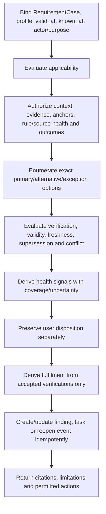
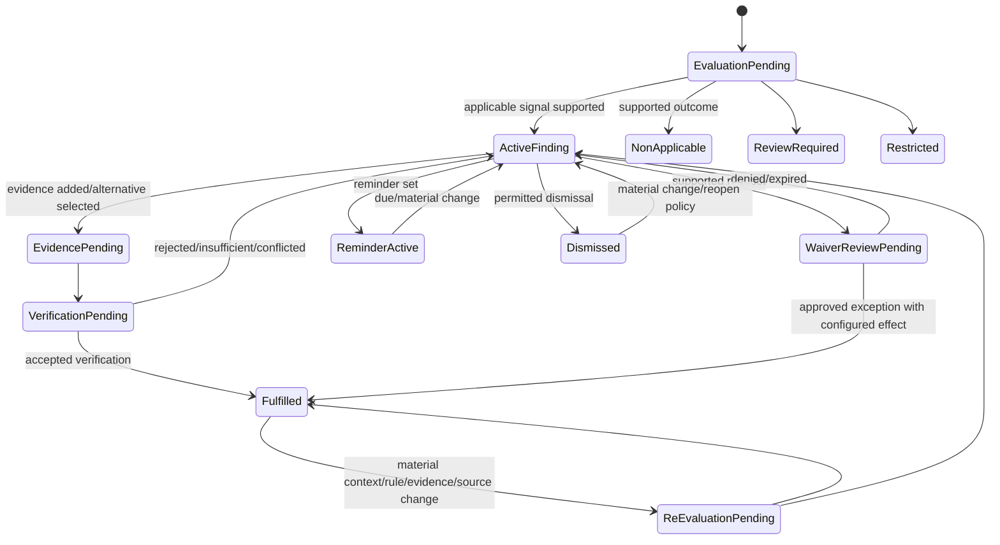

# Phase 1 Document Health and Expected Evidence Contract

| Field | Value |
|---|---|
| Document ID | `DIT-HLT-001` |
| Version | `0.1` |
| Status | `DRAFT — provider-neutral; product-owner, architecture, security, privacy, and jurisdiction/content review required` |
| Product phase | Phase 1 — Personal and Family |
| Architecture alignment | `ARCH-SOL-001`; `ARCH-DOM-001` rules `DOM-P1-038`–`047`, `DOM-P1-055`, `DOM-P1-057`; `ARCH-DATA-001` rules `DATA-P1-011`–`020`, `DATA-P1-025`–`040` |
| Security alignment | `SEC-ARCH-001`, `SEC-AUTH-001`, `SEC-PRIV-001`, `SEC-AUD-001`, `SEC-THR-001` |
| Related DIT contracts | `DIT-TAX-001`, `DIT-EXT-001`, `DIT-FCT-001`, `DIT-GPH-001`, `DIT-MON-001`, `DIT-IMP-001`, `DIT-SRC-001`, `DIT-VER-001` |
| Open decisions | `DEC-034`, `DEC-035`, `DEC-037` |
| Primary gaps | `GAP-001`, `GAP-004`, `GAP-005`, `GAP-008` |
| Updated | 26 August 2026 |

## 1. Purpose and authority

This contract defines provider-neutral expected-evidence and document-health behavior: versioned requirement profiles, applicability, expected primary and alternative evidence, exceptions/waivers, missing/stale/expired/superseded/contradictory findings, user dispositions, evidence submission/verification, fulfilment and reopen behavior, reminders, and the `DEC-034` fence on aggregate readiness/content-health scoring.

Exact product traceability:

- requirements: `REQ-P1-HLT-001`–`REQ-P1-HLT-005`, `REQ-P1-FCT-004`, `REQ-P1-FCT-006`, `REQ-P1-MON-002`, `REQ-P1-MON-005`–`REQ-P1-MON-007`, `REQ-P1-ACT-003`–`REQ-P1-ACT-006`, `REQ-P1-ACT-008`, `REQ-P1-NTF-001`, `REQ-P1-NTF-002`, `REQ-P1-TRUST-002`–`REQ-P1-TRUST-004`, and `REQ-P1-CFG-001`–`REQ-P1-CFG-004`;
- features: `FEAT-P1-016`–`FEAT-P1-020`, `FEAT-P1-021`, `FEAT-P1-022`, `FEAT-P1-023`, `FEAT-P1-028`;
- use cases: `UC-P1-006`, `UC-P1-007`, `UC-P1-008`, `UC-P1-010`, `UC-P1-013`, `UC-P1-018`; and
- acceptance: `AC-UC-P1-006-03`, `AC-UC-P1-006-04`, `AC-UC-P1-007-05`, `AC-UC-P1-008-01`–`AC-UC-P1-008-05`, `AC-UC-P1-013-01`–`AC-UC-P1-013-03`, `AC-P1-E2E-001`, `AC-P1-MON-001`, and `AC-P1-SEC-001`.

All RFC 2119 language remains draft. This contract does not provide legal, tax, financial, insurance, immigration, medical or compliance advice; guarantee document completeness or risk; make file presence/extraction fulfilment; activate a launch profile under `DEC-035`; or expose an aggregate score before `DEC-034` approval and validation.

## 2. Aggregate ownership and terminology

| Record | Authority and mutability |
|---|---|
| `RequirementProfileVersion` | Immutable configuration defining context, jurisdiction/applicability, expected evidence options, accepted alternatives, exception/waiver policy, validity/freshness, verification and reopen/closure criteria. |
| `RequirementCase` | Workspace aggregate owning one profile application to exact subject/resource/context, applicability history, current finding dimensions, dispositions, evidence submissions/verifications, fulfilment state and aggregate revision. |
| `HealthEvaluation` | Immutable evaluation generation binding profile/case, exact context/evidence/conformed views/source health/policy, finding signals, uncertainty, coverage and prior lineage. |
| `EvidenceOptionVersion` | Immutable primary/alternative evidence definition with accepted document/fact/source types, subject/resource match, validity, issuer/authority, evidence-anchor and verification rules. |
| `ExceptionOrWaiverRequest` | Additive request/review record under an explicitly supported profile rule. A request does not create an exception or fulfilment. |
| `EvidenceSubmission` | Immutable evidence/criterion linkage with submitter, exact version/anchors, claimed role and time. |
| `EvidenceVerification` | Additive verifier decision against exact profile/criterion/evidence versions, with outcome/confidence/reason/authority. |
| `Task` | Separate work aggregate for reminder/assignee/due/evidence requirement and state history. |
| `NotificationDelivery` | Separate channel attempt; delivery/acknowledgement does not change requirement truth. |
| `ReadinessProjection` | Optional rebuildable, authorization-scoped aggregate signal only if `DEC-034` is approved. It is never canonical truth or a compliance/risk guarantee. |

## 3. Requirement-profile contract

Every `RequirementProfileVersion` declares:

| Group | Required fields |
|---|---|
| Identity/governance | stable profile ID/version, owner, jurisdiction pack, source/rule evidence, review/approval, publication/effective/supersession/repair history |
| Context/applicability | allowed subject/resource/workspace/document types, required predicates, effective period, valid/known-time semantics, missing/restricted input behavior |
| Expected evidence | one or more named primary `EvidenceOptionVersion` records and whether each is required, optional or one-of a group |
| Alternatives | exact accepted alternative groups, equivalence/limitations, separate verification criteria and display semantics |
| Exceptions/waivers | supported types, authority/evidence, issue/expiry/review/revocation, effect on applicability/fulfilment and no-default behavior |
| Validity/health | issue/effective/expiry/supersession/stale/conflict criteria, source/issuer/subject match, conformed-view rules and freshness policy |
| Verification | criteria, verifier class, evidence anchor minimum, confidence/review, outcome and reopen/closure policy |
| User outcomes | allowed add/link evidence, alternative, not-applicable, exception/waiver request, dismiss, remind, escalation and reversibility rules |
| Privacy/security | field/evidence/finding/disclosure class, purpose, current authorization, minimal-disclosure, processor/region, telemetry and deletion lineage |

Profiles are jurisdiction-neutral in core identity. An Australia pack binds local rules/terms/sources through versioned configuration. No profile or evidence option is launch-enabled merely because this schema represents it.

## 4. Orthogonal case dimensions

A `RequirementCase` never collapses these dimensions into one “healthy” flag.

### 4.1 Applicability outcome

Use the `DIT-MON-001` outcomes exactly: `APPLICABLE`, `NON_APPLICABLE`, `INDETERMINATE`, `REVIEW_REQUIRED`, `RESTRICTED`, or `UNAVAILABLE`. Applicability precedes health and fulfilment.

### 4.2 Health-finding signals

| Signal | Required evidence and meaning |
|---|---|
| `MISSING` | Profile is applicable and no authorized verified option satisfies the declared evidence group. Restricted or unavailable evidence cannot be called missing. |
| `POTENTIALLY_EXPIRED` | Exact evidence/rule supports an expiry/end condition or uncertainty requiring review; elapsed time alone is insufficient unless the profile defines it. |
| `STALE` | Evidence/source/verification freshness is outside exact policy; last-known success remains historical. |
| `SUPERSEDED` | Explicit document/fact/rule/evidence relationship indicates a newer controlling candidate under the profile; prior evidence remains history. |
| `CONTRADICTORY` | Two or more authorized occurrences/versions/verifications conflict under the profile and remain unresolved. |
| `INSUFFICIENT` | Evidence exists but does not meet configured type, subject, issuer, period, anchor, review or verification criteria. |
| `RESTRICTED` | Current policy prevents evaluation/disclosure of necessary evidence or signal. It is not missing or healthy. |
| `SOURCE_OR_RULE_UNAVAILABLE` | Required rule/source/health/evaluator is unavailable or ineligible; no current conclusion is supported. |

Multiple signals may coexist. Each retains exact profile/rule/evidence/source versions, affected resource, valid/known time, confidence, coverage, limitation and resolution paths.

### 4.3 User disposition

| Disposition | Meaning |
|---|---|
| `NO_DISPOSITION` | No accepted user decision yet. |
| `EVIDENCE_ADDED` | Evidence was submitted/linked and awaits or has separate verification; not fulfilment. |
| `ALTERNATIVE_SELECTED` | A configured accepted alternative was selected; verification remains separate. |
| `WAIVER_REVIEW_REQUESTED` | Supported exception/waiver review requested; not granted or fulfilled. |
| `NOT_APPLICABLE_SELECTED` | Actor proposes/records non-applicability with reason under profile/policy; distinct from dismiss. |
| `DISMISSED` | Actor dismisses attention under permitted workflow; does not change applicability, evidence or fulfilment. |
| `REMINDER_SET` | Attention deferred to a separate `Task`; does not change applicability/evidence/fulfilment. |

An approved waiver/exception is a separate reviewed record, not just a user disposition.

### 4.4 Fulfilment state

| State | Meaning |
|---|---|
| `UNASSESSED` | No eligible complete verification run for current profile/context/evidence set. |
| `UNMET` | Applicable criteria evaluated and not satisfied. |
| `EVIDENCE_PENDING` | Submission exists but processing/review/verification is incomplete. |
| `VERIFICATION_REQUIRED` | Evidence is reviewable but configured verifier decision is required. |
| `FULFILLED_PRIMARY` | Exact verified primary evidence satisfies the current criteria. |
| `FULFILLED_ALTERNATIVE` | Exact verified configured alternative satisfies its criteria; primary evidence is not implied. |
| `FULFILLED_BY_APPROVED_EXCEPTION` | Exact approved exception/waiver satisfies the profile’s configured effect/period; not a claim the evidence exists. |
| `CONFLICTED` | Verification/evidence conflict prevents a settled fulfilment result. |
| `RESTRICTED` | Current authorization prevents evaluation/disclosure; not unmet. |
| `EXPIRED_OR_REOPENED` | Previously fulfilled state no longer meets current evidence/rule/context after a material supported change; prior history remains. |

## 5. Evaluation algorithm



The same retained inputs/versions/authorization context return the same deterministic rule result. Model-assisted explanation/classification remains a versioned derived result and cannot invent a requirement, evidence, exception, verification or outcome.

### 5.1 Evidence eligibility

Evidence is eligible only when exact configured option, subject/resource identity, issuer/authority, document/fact/source type, version/conformed status, effective/expiry interval, required fields/anchors, review state, source health/freshness, authorization and deletion state validate. File receipt, name/category match, extracted value, high confidence or a related document is insufficient.

### 5.2 Finding lifecycle



The lifecycle is a presentation/workflow view over the orthogonal dimensions. Exact status IDs belong in reference data.

## 6. Alternatives, exceptions, and user actions

- An alternative must be explicitly listed in the exact profile version, retain its own evidence/verification criteria, and display `FULFILLED_ALTERNATIVE` without implying the primary document exists.
- A waiver/exception must be supported by the profile, requested and reviewed by authorized actors, bind exact scope/rule/context/evidence, issue/expiry/revocation and effect, and never become a reusable blanket exception.
- `NOT_APPLICABLE_SELECTED` requires configured actor authority and reason; it is a disposition/resolution input, not proof that a governing rule is non-applicable unless the policy accepts it.
- `DISMISSED` affects attention only unless the profile expressly defines a different safe effect; it never means fulfilled or non-applicable.
- `REMINDER_SET` creates/updates a separate task with causal case, owner, due time and evidence need. Delivery/acknowledgement does not alter requirement truth.
- All outcomes are additive and reversible/reopenable only under explicit policy with history preserved.

## 7. Aggregate readiness/content-health score fence

While `DEC-034` is not approved:

- no aggregate numeric, letter, percentage, traffic-light, completion, compliance, risk, safety or “readiness” score is published;
- no API/export field, hidden sort rank, notification, analytics property or model answer implies such a score;
- individual authorized findings/signals and their evidence/limitations may be shown; and
- `ReadinessProjection` configuration remains inactive.

If `DEC-034` is approved, a separate versioned score contract must define authorized population, contributor definitions, inclusion/exclusion, missing/restricted behavior, weights/aggregation, uncertainty/coverage, calibration/validation, terminology, temporal/configuration versions, decomposition, audit, fairness/accessibility, privacy side-channel tests, change/replay and deletion. It must remain rebuildable, never canonical, and always state that it is not legal compliance, legal risk, completeness, safety or outcome guarantee.

Permission-aware aggregation must not permit differencing attacks. An actor sees only policy-approved contributors and a score computed under an approved authorization-equivalence/disclosure rule; access changes cannot reveal hidden item existence through deltas, denominator, rank, color or count.

## 8. Draft normative rules

### 8.1 Profiles and applicability

- `DIT-HLT-P1-001` — Every expected-evidence requirement MUST use a stable `RequirementProfileVersion` with context, jurisdiction, applicability, effective period, primary evidence, alternatives, exception/waiver, validity, verification, privacy and governance rules.
- `DIT-HLT-P1-002` — Profile and evidence-option versions MUST be immutable, configuration-driven and jurisdiction-neutral in identity; code MUST NOT hard-code launch documents, alternatives, waivers, thresholds or outcomes.
- `DIT-HLT-P1-003` — Consequential profile publication MUST validate, review/approve, effective-date, audit, impact-assess, supersede and replay/repair through `ConfigurationPackage`.
- `DIT-HLT-P1-004` — Until `DEC-035` is approved, representable profiles/evidence options/sources MUST remain launch-disabled except explicit draft fixtures and MUST NOT imply public coverage.
- `DIT-HLT-P1-005` — Every `RequirementCase` MUST bind one workspace, exact profile/application context, subject/resource, valid/known time, aggregate revision, current policy and additive evaluation/disposition/verification history.
- `DIT-HLT-P1-006` — Applicability MUST be evaluated before health/fulfilment using exactly `APPLICABLE`, `NON_APPLICABLE`, `INDETERMINATE`, `REVIEW_REQUIRED`, `RESTRICTED`, or `UNAVAILABLE` and must remain separate from source authority/health, evidence, confidence and outcome.

### 8.2 Health findings

- `DIT-HLT-P1-007` — Health evaluation MUST distinguish `MISSING`, `POTENTIALLY_EXPIRED`, `STALE`, `SUPERSEDED`, `CONTRADICTORY`, `INSUFFICIENT`, `RESTRICTED`, and `SOURCE_OR_RULE_UNAVAILABLE` signals; multiple signals MAY coexist.
- `DIT-HLT-P1-008` — `MISSING` requires supported applicability and an authorized complete evaluation of the declared evidence options; inaccessible, unavailable, stale or unevaluated evidence MUST NOT be called missing.
- `DIT-HLT-P1-009` — Expired/stale/superseded findings MUST bind exact evidence, rule/profile, valid/known time, source health and relationship/verification state; upload age or elapsed time alone is insufficient unless expressly defined.
- `DIT-HLT-P1-010` — Contradictory evidence and prior resolutions MUST remain preserved and cited; the service MUST NOT choose evidence or mark healthy merely to remove conflict.
- `DIT-HLT-P1-011` — Every finding MUST retain exact profile/rule/source/evidence references, affected resource, applicability, signal set, confidence, uncertainty, coverage, source health, permitted resolution paths and evaluation lineage.
- `DIT-HLT-P1-012` — Guidance without approved governing authority MUST be clearly labelled non-authoritative and MUST NOT be presented as a legal/compliance requirement or mandatory action.
- `DIT-HLT-P1-013` — Duplicate/replayed evaluations MUST reconcile one current case/finding generation without losing rule/evidence versions or duplicating tasks/recommendations.

### 8.3 Alternatives, dispositions, and fulfilment

- `DIT-HLT-P1-014` — Add evidence, select alternative, request waiver/review, mark not applicable, dismiss and remind later MUST remain distinct authorized actions with additive reason/time/policy history.
- `DIT-HLT-P1-015` — `EVIDENCE_ADDED`, `ALTERNATIVE_SELECTED`, `WAIVER_REVIEW_REQUESTED`, `NOT_APPLICABLE_SELECTED`, `DISMISSED`, and `REMINDER_SET` dispositions MUST NOT by themselves establish fulfilment.
- `DIT-HLT-P1-016` — An alternative can satisfy only when explicitly accepted by the exact profile and its own configured evidence verification succeeds; primary-document existence MUST NOT be implied.
- `DIT-HLT-P1-017` — An exception/waiver can affect fulfilment only through an authorized reviewed record binding exact profile/rule/context/scope/evidence, issue/expiry/revocation and configured effect.
- `DIT-HLT-P1-018` — Unsupported waiver/exception requests MAY remain review records but MUST NOT mark the requirement applicable/non-applicable, fulfilled or closed.
- `DIT-HLT-P1-019` — Not-applicable, dismissed, reminder, waiver, alternative and fulfilled outcomes MUST remain distinct and reversible/reopenable only under explicit policy.
- `DIT-HLT-P1-020` — Requirement fulfilment MUST use `UNASSESSED`, `UNMET`, `EVIDENCE_PENDING`, `VERIFICATION_REQUIRED`, `FULFILLED_PRIMARY`, `FULFILLED_ALTERNATIVE`, `FULFILLED_BY_APPROVED_EXCEPTION`, `CONFLICTED`, `RESTRICTED`, or `EXPIRED_OR_REOPENED` without collapsing their meanings.
- `DIT-HLT-P1-021` — File receipt, extraction, classification, field review, task completion, notification delivery, action dispatch/success or elapsed time MUST NOT establish fulfilment, renewal or closure.
- `DIT-HLT-P1-022` — Fulfilment/closure requires exact configured evidence and an authorized `EvidenceVerification`; failed/insufficient/conflicted/restricted/expired evidence keeps the case pending/reviewable.
- `DIT-HLT-P1-023` — Material rule/profile/context/source-health/evidence/version/verification change MUST create a new evaluation and may reopen/supersede the current view without rewriting prior fulfilment history.

### 8.4 Score fence, authorization, privacy, deletion, and audit

- `DIT-HLT-P1-024` — While `DEC-034` is unapproved, the product MUST omit every aggregate readiness/content-health/compliance/risk score and MAY show only authorized explainable individual findings/signals.
- `DIT-HLT-P1-025` — If approved later, a score MUST be a versioned rebuildable projection that is decomposable, permission-aware, temporally explicit, coverage/uncertainty-bearing and never a legal-compliance, risk, completeness, safety or outcome guarantee.
- `DIT-HLT-P1-026` — A score/contributor/count/denominator/rank/color/delta MUST NOT reveal restricted item, subject, evidence, finding or relationship existence; if safe decomposition cannot be produced, omit the aggregate.
- `DIT-HLT-P1-027` — Current authorization MUST apply independently to profile/rule, applicability context, case/finding existence, evidence/anchor, alternative, waiver/exception, disposition, verification/fulfilment, task/reminder, score contributor and audit view.
- `DIT-HLT-P1-028` — Membership/family administration, document access, task assignment or seeing an action signal MUST NOT imply authority to view evidence, satisfy/dismiss a finding, mark another subject not applicable, approve waiver or verify/close.
- `DIT-HLT-P1-029` — Restricted evidence MAY affect output only through a named minimal-disclosure policy and MUST NOT leak subject, resource, evidence/value/source, count, contributor, score arithmetic or timing.
- `DIT-HLT-P1-030` — Source/rule/graph/document/verification failure, stale state, conflict, restriction and incomplete coverage MUST remain visible and MUST NOT be hidden by last success or a healthier aggregate.
- `DIT-HLT-P1-031` — A deletion fence or revocation MUST block evidence evaluation, task/action use, score/rebuild, export, AI, support and late-event recreation; retained history uses safe unavailable/tombstoned references only.
- `DIT-HLT-P1-032` — Every profile/config publication, applicability/evaluation, finding/signal transition, disposition, waiver/exception, evidence submission/verification, fulfilment/reopen, task/reminder and score omission/result MUST produce `SEC-AUD-001`-conformant safe evidence.
- `DIT-HLT-P1-033` — Ordinary logs, metrics, traces, analytics, errors, screenshots and fixtures MUST exclude raw document/fact values, evidence passages, finding reasons with content, subject names, filenames, score contributors, prompts/answers, unrestricted URLs and tokens.
- `DIT-HLT-P1-034` — Model/processors MUST receive only minimum authorized context for one registered purpose/capability under current consent/region/retention policy and cannot invent authority, requirements, alternatives, waivers, verification or closure.
- `DIT-HLT-P1-035` — Task/reminder and `NotificationDelivery` state MUST remain separate from requirement truth; duplicate delivery, acknowledgement, snooze, channel failure or dismissal MUST NOT alter applicability/evidence/fulfilment.
- `DIT-HLT-P1-036` — Failure, guidance, stale, conflict, restricted, evidence-pending, verification-failed, waiver-pending, reminder, dismissed, non-applicable, fulfilled and reopened states MUST remain machine-readable and user-safe.

## 9. Provider-neutral profile example

```yaml
example_only: true
requirement_profile_id: requirement.expected_evidence.example
version: 0.1.0-draft
status: DRAFT
jurisdictions: [jurisdiction.AU]
applicability_policy_ref: applicability.requirement.example
primary_evidence_options:
  - evidence-option.primary.example.v1
accepted_alternative_groups:
  - any_of: [evidence-option.alternative-a.example.v1]
exception_policy_ref: exception.requirement.example
verification_policy_ref: verification.requirement.example
health_policy_ref: health.requirement.example
score_contribution:
  enabled: false
launch_enabled: false
```

The example activates no document type, requirement, source, threshold, alternative, waiver or score.

## 10. Failure and degraded behavior

| Failure | Required outcome |
|---|---|
| Profile/rule missing or inactive | No authoritative finding; optional guidance only when explicitly labelled and permitted. |
| Applicability missing/conflicting/restricted | Indeterminate/review/restricted; never missing or non-applicable by assumption. |
| Source stale/parser failed | Show/source policy block or degrade; last rule/evidence is historical, not current. |
| Evidence processing incomplete | `EVIDENCE_PENDING`; no fulfilment. |
| Alternative not configured | Reject as fulfilment option while preserving submission if policy permits. |
| Waiver unsupported/denied/expired | Keep unmet/reviewable as configured; never silently fulfil. |
| Verification unavailable/failed | `VERIFICATION_REQUIRED`/pending or explicit failed outcome. |
| Restricted evidence | Suppress or named minimal action; do not mark missing/healthy or leak count/score. |
| `DEC-034` unresolved or unsafe decomposition | Omit aggregate score; retain individual authorized findings. |
| Material change after fulfilment | Re-evaluate/reopen with history; do not erase prior verification. |
| Deletion/revocation race | Fence/current policy wins; reject late evaluation/task/score result. |

## 11. Rule traceability

| Rule range | Requirements | Features/use cases | Security/data hooks |
|---|---|---|---|
| `DIT-HLT-P1-001`–`006` | `REQ-P1-HLT-001`, `REQ-P1-MON-002`, `006`, `REQ-P1-CFG-001`–`004` | `FEAT-P1-016`, `020`, `022`; `UC-P1-006`, `008`, `018` | `DOM-P1-038`–`039`, `055`; `AUD-P1-015`, `022` |
| `DIT-HLT-P1-007`–`013` | `REQ-P1-HLT-003`, `REQ-P1-FCT-004`, `REQ-P1-MON-005`–`007` | `FEAT-P1-017`, `018`, `020`; `UC-P1-008` | `DIT-SRC-001`, `DIT-MON-001`; `THR-P1-030`; `AUD-P1-015`–`016` |
| `DIT-HLT-P1-014`–`023` | `REQ-P1-HLT-002`, `005`, `REQ-P1-ACT-008`, `REQ-P1-NTF-001`–`002` | `FEAT-P1-019`–`021`; `UC-P1-007`, `008`, `010` | `DOM-P1-039`, `043`–`047`; `AUD-P1-018`–`019` |
| `DIT-HLT-P1-024`–`026` | `REQ-P1-HLT-004` | `FEAT-P1-028`; `UC-P1-008` | `DEC-034`, `GAP-008`; `AUTH-P1-010`, `025`; `PRIV-P1-004` |
| `DIT-HLT-P1-027`–`036` | `REQ-P1-FCT-006`, `REQ-P1-TRUST-002`–`004`, `REQ-P1-SHR-005` | `FEAT-P1-011`, `023`; `UC-P1-008`, `013` | `AUTH-P1-007`, `010`–`015`, `019`–`025`, `034`; `PRIV-P1-004`, `011`, `020`; `AUD-P1-016`, `018`, `019`, `027` |

## 12. Validation and test obligations

Automated evidence MUST prove:

1. profile schemas reject missing context/jurisdiction/applicability/evidence/alternative/waiver/validity/verification/privacy/governance fields and dangling versions;
2. no launch profile/evidence option/source activates while `DEC-035` remains unresolved except explicit draft fixtures;
3. all six applicability outcomes remain distinct and restricted/unavailable evidence cannot be called missing/non-applicable;
4. missing, potentially expired, stale, superseded, contradictory, insufficient, restricted and source/rule-unavailable signals have exact evidence/time/coverage and may coexist;
5. file receipt, type/category match, extraction, high confidence, task completion, delivery and elapsed time cannot establish fulfilment;
6. primary, alternative and approved-exception fulfilment retain exact distinct evidence/verification and never imply another evidence option exists (`AC-UC-P1-008-02`);
7. add evidence, alternative, waiver request, not applicable, dismiss and remind produce distinct, policy-valid, auditable histories (`AC-UC-P1-008-03`);
8. insufficient/rejected/conflicting/restricted/expired verification keeps the case open (`AC-UC-P1-007-05`);
9. rule/context/source/evidence changes after fulfilment create re-evaluation/reopen without rewriting prior decisions;
10. restricted evidence cannot leak through findings, counts, tasks, notification text, score arithmetic/delta, search, AI, export or audit (`AC-UC-P1-008-04`);
11. while `DEC-034` remains unapproved, UI/API/export/search/notifications/AI/analytics contain no aggregate score or compliance/risk guarantee (`AC-UC-P1-008-05`);
12. any future approved score passes decomposition, authorization-equivalence/differencing, access-change, missing-data, uncertainty, temporal, replay and deletion tests before enablement;
13. duplicate/replay/effective-time tests reconcile one case/finding/task without lost profile/evidence history; and
14. `AC-P1-E2E-001`, `AC-P1-MON-001`, `AC-P1-SEC-001`, `MET-P1-004`, `MET-P1-007`, `MET-P1-008`, `MET-P1-015`, `MET-P1-018`, `MET-P1-021`, and `MET-P1-022` evidence is retained.

## 13. Definition of ready

This contract remains DRAFT until requirement-profile/evidence-option/waiver schemas, applicability and health golden fixtures, evidence-verification and reopen state machines, reminder integration, authorization/minimal-disclosure matrices, deletion/audit tests, and `DEC-035` launch profiles are approved. Aggregate scoring remains disabled unless `DEC-034` is approved with a separate validated score contract.
