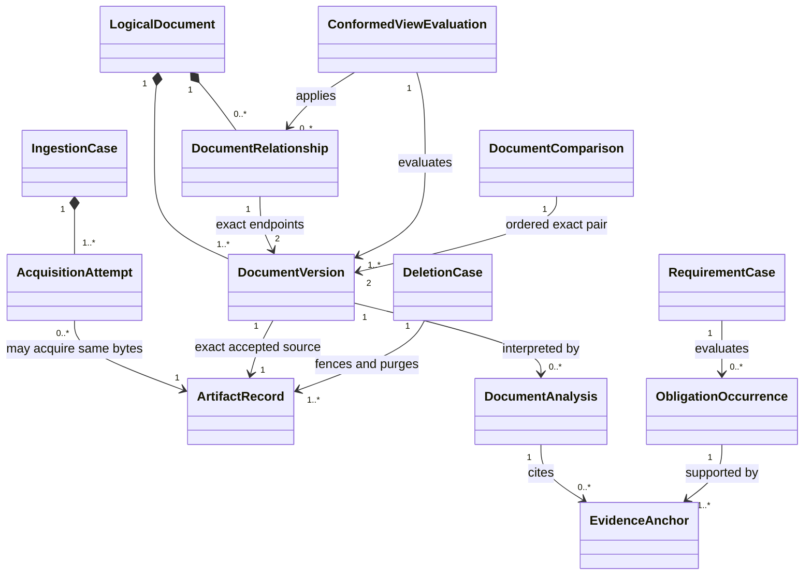
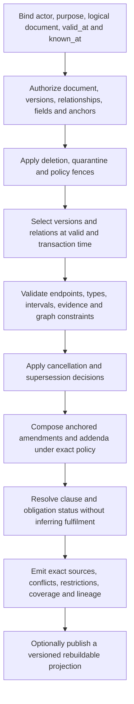
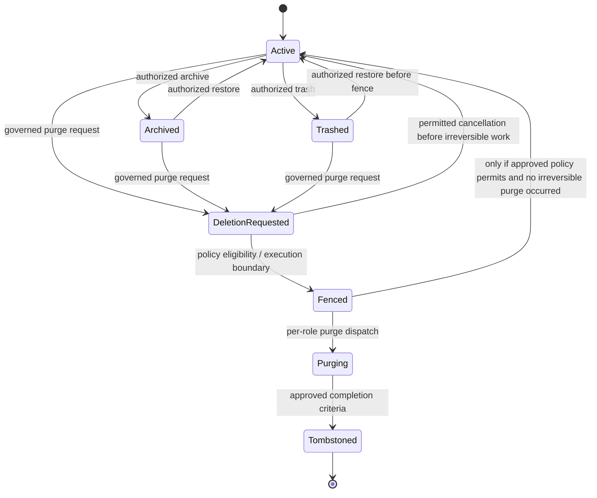

# Phase 1 Document Versioning and Conformed Views Contract

| Field | Value |
|---|---|
| Document ID | `DIT-VER-001` |
| Version | `0.1` |
| Status | `DRAFT — provider-neutral; product-owner and architecture approval required` |
| Product phase | Phase 1 — Personal and Family |
| Primary architecture | `ARCH-SOL-001` rules `ARCH-P1-002`–`005`, `ARCH-P1-013`–`018`, `ARCH-P1-024`–`030`, `ARCH-P1-033`–`035`, `ARCH-P1-039`–`045` |
| Domain alignment | `ARCH-DOM-001` rules `DOM-P1-019`–`025`, `DOM-P1-048`–`055`, `DOM-P1-057` |
| Open decisions | `DEC-033`, `DEC-035`, `DEC-039`, `DEC-040` |
| Updated | 26 August 2026 |

## 1. Purpose and authority

This document defines the provider-neutral Phase 1 contract for immutable source artifacts, logical documents and versions, explicit supersession/amendment/addendum/cancellation relationships, conformed effective-document views, reproducible comparisons, obligation linkage, archive/trash/restore/purge interaction, concurrency, and authorization.

It refines these exact product requirements:

- `REQ-P1-DOC-001`, `REQ-P1-DOC-002`, `REQ-P1-DOC-003`, `REQ-P1-DOC-004`, `REQ-P1-DOC-005`, `REQ-P1-DOC-008`;
- `REQ-P1-ING-004`, `REQ-P1-ING-005`, `REQ-P1-ING-007`, `REQ-P1-ING-008`;
- `REQ-P1-FCT-001`, `REQ-P1-FCT-003`, `REQ-P1-FCT-004`, `REQ-P1-FCT-006`;
- `REQ-P1-SRCH-002`, `REQ-P1-SRCH-003`, `REQ-P1-SRCH-004`, `REQ-P1-SRCH-005`;
- `REQ-P1-ACT-001`, `REQ-P1-ACT-005`, `REQ-P1-ACT-006`, `REQ-P1-ACT-007`, `REQ-P1-ACT-008`;
- `REQ-P1-TRUST-002`, `REQ-P1-TRUST-003`, `REQ-P1-TRUST-004`, `REQ-P1-TRUST-006`, `REQ-P1-TRUST-007`; and
- `REQ-P1-CFG-001`, `REQ-P1-CFG-002`, `REQ-P1-CFG-004`.

Feature traceability: `FEAT-P1-003`, `FEAT-P1-008`, `FEAT-P1-009`, `FEAT-P1-010`, `FEAT-P1-013`, `FEAT-P1-015`, `FEAT-P1-019`, `FEAT-P1-022`, `FEAT-P1-029`.

Use-case traceability: `UC-P1-002`, `UC-P1-003`, `UC-P1-004`, `UC-P1-005`, `UC-P1-007`, `UC-P1-011`, `UC-P1-012`, `UC-P1-013`, `UC-P1-018`; acceptance scenarios `AC-UC-P1-003-01`–`AC-UC-P1-003-04`, `AC-UC-P1-005-04`, `AC-UC-P1-007-02`, `AC-UC-P1-007-03`, `AC-UC-P1-007-05`, `AC-UC-P1-011-01`–`AC-UC-P1-011-04`, `AC-UC-P1-012-01`–`AC-UC-P1-012-05`, and umbrella `AC-P1-ING-001`, `AC-P1-RAG-001`, `AC-P1-DEL-001`, `AC-P1-SEC-001`.

All RFC 2119 language remains draft until the PRD and this contract are approved. This document does not determine legal effect, choose a storage/search/graph/model product, activate a launch document type, define the complete export envelope, or invent deletion and backup durations while the relevant decisions remain open.

## 2. Scope and non-goals

This contract covers:

- identity and immutability boundaries among acquisition attempts, source artifacts, logical documents, document versions, analyses, and evidence anchors;
- additive relationships and decisions for version, replacement, supersession, amendment, addendum, cancellation, effective status, archive, trash, restore, and deletion;
- deterministic valid-time and transaction-time conformed views with explicit conflicts, restrictions, coverage, and evidence;
- exact-version comparison and material-difference interpretation;
- evidence-bearing obligation occurrences and their relationship to requirement, action, verification, and closure workflows;
- authorization at document, version, artifact, field, anchor, relationship, comparison, count, and conformed-view levels; and
- races among ingestion, reprocessing, review, replacement, lifecycle change, export, revocation, and deletion.

It does not:

- make a content hash, filename, external item ID, or model judgement the identity of a logical document;
- overwrite an original, prior version, prior analysis, evidence anchor, relationship decision, or lifecycle history;
- infer the legally controlling instrument or interpret legal effect without an approved rule, evidence, and required review;
- make file presence, an extracted field, a conformed clause, an executed action, or elapsed time prove requirement fulfilment or closure;
- permit archive, trash, purge, export, support, backup restore, or reprocessing to bypass current authorization; or
- set `DEC-039` cooling-off, purge, backup-expiry, or audit-minimization values.

## 3. Domain boundary and identity model

### 3.1 Authoritative records and derived results

| Record | Authority and mutability |
|---|---|
| `AcquisitionAttempt` | Immutable capture attempt and provenance owned by `IngestionCase`. Duplicate bytes do not erase or merge attempts. |
| `ArtifactRecord` | Put-once bytes, content digest, detected media, acquisition provenance, integrity/isolation state, and placement reference. Content cannot be edited while retained. |
| `LogicalDocument` | Stable workspace-scoped identity and aggregate root owning version membership/order, document relationships, lifecycle decisions, archive/trash state, and concurrency revision. |
| `DocumentVersion` | Immutable member of one logical document, referencing exactly one accepted source artifact or a controlled generated-artifact path, exact creation provenance, version identity, and additive status/relationship history. |
| `DocumentAnalysis` | Immutable versioned interpretation run over exact inputs, including classification, extraction, comparison, or conformed-view derivation where the owning analysis contract permits. A new run never rewrites a version. |
| `EvidenceAnchor` | Immutable exact source-and-location reference. Its content may later be unavailable after revocation or purge, but it is never repointed. |
| `DocumentRelationship` | Immutable relationship assertion/decision owned inside `LogicalDocument`, with exact version endpoints, type version, effective/transaction time, evidence, actor/workload, review, and supersession lineage. |
| `ConformedViewEvaluation` | Immutable derived evaluation for declared inputs and temporal perspective. It is not a replacement artifact and does not alter its sources. |
| `DocumentComparison` | Immutable derived comparison of an ordered exact version pair, algorithm/policy versions, evidence, coverage, and uncertainty. |
| `ObligationOccurrence` | Immutable evidence-bearing proposal attached to exact clause/version anchors. It is not a canonical fact, applicable requirement, fulfilment decision, approval, or closure. |
| `RequirementCase` | Owns requirement-profile applicability, alternatives/exceptions, evidence submission/verification, and fulfilment state. |
| `DeletionCase` | Owns deletion scope, authoritative fence, per-data-role acknowledgements, residuals, tombstone, and policy-defined completion. |

`ConformedViewEvaluation`, `DocumentComparison`, and `ObligationOccurrence` are contract-level result/value records, not newly asserted aggregate roots. Physical persistence or service topology is outside this contract.

### 3.2 Identity relationships

The diagram shows semantic references, not authorization inheritance, database joins, storage co-location, or deployment units.

### 3.3 Stable identity and labels

| Value | Contract |
|---|---|
| `artifact_id` | Stable ID for one immutable byte sequence under its governed record. Digest equality is evidence of byte equality only. |
| `logical_document_id` | Stable workspace resource identity chosen through explicit creation/linking policy. It is never derived solely from bytes, filename, title, provider, or classifier output. |
| `document_version_id` | Stable immutable identity for one accepted version. A version label may be corrected by additive metadata history but cannot serve as the ID. |
| `display_version_label` | User-facing source or platform label such as “2026 renewal.” It may be duplicated, absent, ambiguous, or corrected and therefore is not identity. |
| `external_item_ref` | Provider-namespace and external item/version mapping. Revocation, rename, replacement, or deletion does not change platform identity. |
| `content_digest` | Algorithm/version plus digest. It supports integrity and duplicate detection, never logical identity, authorization, effective status, or fulfilment. |
| `aggregate_revision` | Concurrency value for an exact aggregate decision. It is separate from document version, artifact version, and event sequence. |

## 4. Relationship and effective-status contract

### 4.1 Relationship types

| Relationship | Directed meaning | Minimum additional contract |
|---|---|---|
| `SUPERSEDES` | The source version is proposed or decided to replace the target for an explicit scope/effective interval. | Scope, effective time, rationale, evidence, policy, review/approval, and conflict behavior. |
| `AMENDS` | The source changes one or more anchored provisions of the target while the target remains part of the evidence chain. | Exact affected anchors or declared whole-document scope, operation semantics, effective interval, and unresolved mapping behavior. |
| `ADDENDUM_TO` | The source adds evidence/provisions to the target without silently rewriting it. | Attachment scope, ordering/precedence rule where applicable, effective interval, evidence, and conflict policy. |
| `CANCELS` | The source or authorized lifecycle evidence asserts cancellation of the target or a declared scope from a stated effective time. | Cancellation scope, source authority/evidence, effective time, review/approval, and reinstatement/correction behavior. |

Relationship type IDs and versions are governed reference data. Additional types are not enabled merely because the schema can represent them.

### 4.2 Required relationship envelope

Every relationship assertion or decision contains:

- stable relationship ID and exact type-definition version;
- workspace and logical-document scope;
- exact directed `from_document_version_id` and `to_document_version_id` endpoints;
- assertion status and separate review/resolution status;
- valid/effective interval and transaction/recorded interval using half-open semantics where bounded;
- affected document, section, clause, schedule, field, or whole-document scope;
- exact evidence-anchor references and acquisition/source provenance;
- actor/workload, authority, policy, review and approval references where consequential;
- confidence and uncertainty where initially derived;
- supersedes/superseded-by relationship-decision lineage;
- safe rationale/reason codes, audit correlation, and aggregate revision; and
- configuration, taxonomy, schema, processor/model, and jurisdiction-pack versions used to propose or resolve it.

### 4.3 Relationship validation

A relationship cannot become resolved/active when:

- either endpoint is absent, deleted/fenced, from another workspace, inaccessible to the resolver, or not an allowed version kind;
- the relationship type, endpoint direction, cardinality, affected scope, or effective interval violates its type definition;
- required evidence, source authority, review, policy, or approval is missing or stale;
- it creates a forbidden cycle, overlapping controlling relation, impossible ordering, or unresolvable interval; or
- a stale aggregate revision would overwrite a newer decision.

Invalid input is rejected. Plausible but unresolved input remains proposed or conflicted; it is not coerced into a controlling relationship.

## 5. Conformed effective-document view

### 5.1 Evaluation request

Every request binds:

| Input | Required meaning |
|---|---|
| `workspace_id`, `logical_document_id` | Exact scope and document identity. |
| `valid_at` | Real-world/effective-time perspective. “Now” is resolved to an explicit timestamp. |
| `known_at` | Platform transaction-time perspective. “Latest known” is resolved to an explicit watermark. |
| `candidate_version_refs` | Exact authorized versions considered or deterministic query definition and resulting snapshot. |
| `relationship_revision_set` | Exact relationship decisions visible at `known_at`. |
| `taxonomy`, `relationship_type`, `conformance_policy`, `jurisdiction_pack` | Exact active versions used for evaluation. |
| `actor_context`, `purpose`, `authorization_policy_version` | Current access decision inputs, including minimal-disclosure behavior. |
| `deletion_fence_watermark` | Fence state checked for sources and derivatives. |
| `evaluation_contract_version` | Deterministic algorithm and output-schema version. |

### 5.2 Deterministic evaluation flow

The evaluator performs these steps without modifying any source:

1. Reauthorize the logical document, candidate versions, relationship existence, affected clauses/fields, evidence anchors, and requested purpose.
2. Apply authoritative deletion, quarantine, clinical-policy, residency, and processing restrictions before source retrieval.
3. Resolve the exact candidate and relationship set at both `valid_at` and `known_at`; acquisition time, publication time, effective time, and transaction time remain distinct.
4. Validate relationship direction, endpoints, type versions, scope, intervals, evidence, approval, supersession lineage, cycles, and conflicts.
5. Determine cancellation and supersession effects only from resolved relationships and applicable policy; absence of a relationship is not proof of continued effect.
6. Apply amendments and addenda only to their declared anchored scope and order. Unmapped, overlapping, contradictory, or inaccessible provisions remain explicit.
7. Derive clause and obligation occurrence status while keeping requirement applicability, fulfilment, action approval, execution, evidence verification, and closure in their owning workflows.
8. Return exact included/excluded/restricted source references, applied relationships, clause provenance, conflicts, uncertainty, coverage, evaluation versions, and temporal perspective.

### 5.3 Output states

| Outcome | Meaning |
|---|---|
| `RESOLVED` | The authorized declared scope has one deterministic supported view under the stated inputs. This is not a legal opinion. |
| `CONFLICTED` | Two or more supported relationships, provisions, dates, or scopes cannot be reconciled by the active policy. |
| `INCOMPLETE` | Required source, representation, mapping, relationship, configuration, processing, or coverage is absent, stale, failed, or truncated. |
| `RESTRICTED` | Current authorization or processing policy prevents evaluation or disclosure of some necessary source or relationship. It does not mean no source exists. |
| `UNAVAILABLE` | The evaluator, required authoritative store, or acceptable projection/fallback is unavailable. Last-known output is not silently current. |

A response MAY include more than one limitation dimension, for example a resolved authorized subset with incomplete overall coverage. `RESOLVED` is allowed only when the configured completeness predicate is met.

### 5.4 Conformed view output envelope

At minimum the output records:

- evaluation ID, contract version, workspace/logical-document ID, valid/known timestamps, actor-purpose policy reference, and generation time;
- exact candidate and included version IDs, artifact references, relationship IDs/revisions, configuration versions, and source watermarks;
- each conformed section/clause identity with source version and evidence anchors;
- applied cancellation/supersession/amendment/addendum decisions and ignored/proposed/conflicted relationships;
- conflict, restriction, unavailable, stale, missing, truncation, and coverage reason codes;
- obligation-occurrence proposals and their exact source/version/anchor lineage, without a fulfilment claim;
- source deletion/quarantine availability state without exposing restricted content; and
- output digest, processor provenance, supersession lineage, and privacy-safe audit correlation.

## 6. Document comparison

### 6.1 Comparison levels

| Level | Required behavior |
|---|---|
| Byte | Compare exact immutable artifact digests and sizes. Equality proves only byte equality. |
| Representation | Compare exact normalized text, layout, page, cell, slide, or structural representations and identify transform versions. |
| Structural | Align document/section/clause/field identities with declared coverage and unmatched regions. |
| Semantic/material | Interpret candidate meaning changes under a versioned policy/capability and cite evidence for every material assertion. |
| Conformed | Compare two explicit conformed-view evaluations with identical or visibly different temporal/configuration perspectives. |

### 6.2 Comparison output

Every comparison identifies ordered base and target `document_version_id`, exact artifacts and representations, algorithm/model/schema/materiality-policy versions, temporal perspective, authorization policy, coverage, matched/unmatched regions, insertions/deletions/changes, evidence anchors, confidence/calibration/review, and failure/limitation state.

Material interpretation outcomes are:

- `SUPPORTED_CHANGE` — the exact sources support the described change and anchors identify both sides as applicable;
- `SUPPORTED_NO_CHANGE_WITHIN_SCOPE` — the declared, successfully compared scope supports no change under the named algorithm/policy; this is never a whole-document claim when coverage is partial;
- `INDETERMINATE` — corruption, unsupported representation, alignment failure, ambiguity, conflict, restriction, deletion, timeout, stale data, or insufficient coverage prevents the conclusion; and
- `REVIEW_REQUIRED` — a supported candidate change needs configured human review before consequential use.

No failure or missing result may be rendered as “unchanged.” A model summary is derived interpretation, not source evidence or approval.

## 7. Lifecycle, deletion, and recovery

### 7.1 Availability state

These are conceptual states. Exact status IDs and transitions belong in governed reference data. `DEC-039` controls whether the conditional return from `Fenced` is permitted and all durations/completion promises.

### 7.2 Effective status is orthogonal

| Effective status | Meaning |
|---|---|
| `PROPOSED` | Evidence or a relationship proposes an effect but resolution is incomplete. |
| `EFFECTIVE` | Supported as effective for the declared valid/transaction-time perspective and scope. |
| `SUPERSEDED` | Replaced for an explicit scope and effective interval by a resolved relation. |
| `CANCELLED` | Cancelled for an explicit scope and effective interval by supported evidence/decision. |
| `EXPIRED` | Ended under explicit evidence/rule and time, not merely because a newer upload exists. |
| `CONFLICTED` | Competing supported status assertions remain unresolved. |
| `INDETERMINATE` | Required evidence, configuration, mapping, authority, or coverage is insufficient. |

A version can be archived yet historically effective, active yet superseded for a later interval, or trashed while still referenced by protected historical provenance. Availability, effective status, processing readiness, review, fact resolution, requirement fulfilment, and deletion are separate state dimensions.

### 7.3 Operation semantics

| Operation | Required consequence |
|---|---|
| Archive | Remove from ordinary active organization according to policy; retain source, history, references, and authorized historical access. |
| Trash | Mark recoverable unavailability under policy; do not mutate bytes or silently delete derivatives/history. |
| Restore | Reapply the allowed pre-fence availability state with current authorization and expected revision. It cannot bypass a deletion fence, retention exception, or another subject's access policy. |
| Deletion request | Create a stable idempotent `DeletionCase`, scope/rights evaluation, and user-visible policy-pending/cooling-off state. |
| Fence | Deny active and derived access/recreation synchronously before asynchronous physical convergence. |
| Purge | Remove or irreversibly make inaccessible every approved data-role copy/derivative, recording acknowledgements and residuals. |
| Tombstone | Preserve only the approved minimized identity/state needed to prevent resurrection and prove safe transition; never preserve raw content for convenience. |

## 8. Obligations, requirements, and closure

An obligation-like clause discovered in a document is an `ObligationOccurrence` proposal. It records exact document version, clause/section identity, evidence anchors, extracted or reviewed content, valid/effective interval if supported, parties/resources where authorized, processor/schema versions, confidence, review state, and supersession lineage.

A conformed obligation view MAY evaluate how explicit amendment, addendum, cancellation, or supersession relationships affect occurrences, subject to these boundaries:

- an amendment changes an obligation only for its declared anchored scope and effective interval;
- a cancellation or supersession does not erase historical occurrences or the view previously known at a transaction time;
- inaccessible or deleted evidence yields restricted/unavailable lineage, not a fabricated “no obligation” result;
- an unresolved relationship or conflicting clause keeps the obligation conflicted or indeterminate;
- a requirement profile and applicability evaluation remain separate from source occurrence extraction;
- file or clause presence does not establish fulfilment, exception, waiver, satisfaction, renewal, or closure;
- action execution does not establish fulfilment; configured replacement/fulfilment evidence and `EvidenceVerification` are required; and
- closing a `RequirementCase` or recommendation never rewrites the source document/version/occurrence history.

## 9. Draft normative rules

### 9.1 Identity and immutability

- `DIT-VER-P1-001` — `ArtifactRecord`, `LogicalDocument`, `DocumentVersion`, `DocumentAnalysis`, `EvidenceAnchor`, acquisition attempt, and external item/version identity MUST remain distinct and use stable opaque IDs.
- `DIT-VER-P1-002` — Every retained source artifact MUST be put-once; normalization, repair, redaction, rendering, OCR, comparison, and conformance output are derivatives and MUST NOT replace original bytes.
- `DIT-VER-P1-003` — A content digest proves byte equality only. It MUST NOT decide logical-document identity, version identity, effective status, supersession, authorization, applicability, fulfilment, or deletion scope.
- `DIT-VER-P1-004` — A `LogicalDocument` MUST own one or more immutable `DocumentVersion` records and its additive lifecycle/relationship history under one concurrency revision contract.
- `DIT-VER-P1-005` — Each accepted `DocumentVersion` MUST reference exactly one immutable source artifact, or a separately governed controlled-generated-artifact path, and exact creation/linking provenance.
- `DIT-VER-P1-006` — No correction, replacement, review, reprocessing, relationship decision, archive, trash, or effective-status change may mutate or repoint a prior version or evidence anchor.
- `DIT-VER-P1-007` — Display labels, filenames, extracted version numbers, provider IDs, aliases, and model classifications are evidence or metadata only and MUST NOT be platform identity.
- `DIT-VER-P1-008` — A `DocumentAnalysis` generation MUST bind exact document version, artifact, representations, schemas/configuration, processor/model, temporal perspective, and predecessor lineage; activation for a purpose is a separate revisioned decision.

### 9.2 Relationships and effective status

- `DIT-VER-P1-009` — Supersession, amendment, addendum, and cancellation MUST be explicit directed, versioned relationship decisions with exact version endpoints; upload order or content similarity cannot activate them.
- `DIT-VER-P1-010` — Every relationship MUST retain type version, affected scope, valid and transaction time, evidence, provenance, confidence/review, actor/workload, policy/approval, rationale, and supersession lineage appropriate to its consequence.
- `DIT-VER-P1-011` — Relationship endpoint, direction, cardinality, interval, scope, workspace, provenance, approval, and cycle constraints MUST validate before resolved activation.
- `DIT-VER-P1-012` — Ambiguous logical identity, replacement, effective date, scope, or relation MUST remain proposed, conflicted, or review-required instead of silently selecting a controlling version.
- `DIT-VER-P1-013` — A resolved supersession or cancellation changes effective interpretation only for its declared scope and interval; it MUST NOT delete, overwrite, or make the historical source cease to exist.
- `DIT-VER-P1-014` — Amendments and addenda MUST identify the exact affected clause/section/whole-document scope and composition rule. Unmapped or overlapping effects remain explicit conflicts or incomplete coverage.
- `DIT-VER-P1-015` — Effective status MUST be distinct from availability, processing, review, fact-resolution, requirement-fulfilment, approval, execution, verification, closure, and deletion state.
- `DIT-VER-P1-016` — A consequential relationship or effective-status change MUST apply current authorization, policy, configured review/approval, expected aggregate revision, and privacy-safe audit before commitment.
- `DIT-VER-P1-017` — Publishing a corrected relationship/status decision MUST append a new transaction-time decision that supersedes the prior decision; historical known-at answers MUST remain reproducible while retained.

### 9.3 Conformed views and obligations

- `DIT-VER-P1-018` — A conformed effective-document evaluation MUST bind explicit `valid_at` and `known_at`, exact source/relationship/configuration versions, authorization/purpose, deletion watermark, and evaluation-contract version.
- `DIT-VER-P1-019` — Conformance MUST be deterministic for the same retained inputs and contract versions and MUST return the exact included, excluded, restricted, conflicted, missing, stale, and unavailable source lineage.
- `DIT-VER-P1-020` — Every material conformed clause or obligation occurrence MUST cite the exact source document version and evidence anchors; composed text without source mapping cannot be presented as supported evidence.
- `DIT-VER-P1-021` — Conformance MUST distinguish `RESOLVED`, `CONFLICTED`, `INCOMPLETE`, `RESTRICTED`, and `UNAVAILABLE`; absence of accessible evidence or a failed evaluator MUST NOT mean no effective provision.
- `DIT-VER-P1-022` — A new source, relationship, configuration, model, review, or policy version MUST create a new evaluation generation; it MUST NOT rewrite a prior conformed result or silently update an approval bound to it.
- `DIT-VER-P1-023` — A conformed view is a derived interpretation, not a replacement artifact, canonical fact, legal determination, requirement-applicability decision, fulfilment state, approval, or closure.
- `DIT-VER-P1-024` — Obligation occurrences MUST remain separate from `RequirementCase` applicability/fulfilment, action execution, evidence verification, and closure; file or clause presence and elapsed time cannot satisfy or renew a requirement.
- `DIT-VER-P1-025` — Cached, search, graph, comparison, obligation, and conformed-view projections MUST retain source generations/watermarks and be rebuildable without changing authoritative identity, relationships, evidence, or deletion state.

### 9.4 Comparison

- `DIT-VER-P1-026` — A comparison MUST bind an ordered exact base/target version pair and exact artifact/representation, algorithm/model/schema, materiality-policy, authorization, and temporal versions.
- `DIT-VER-P1-027` — Byte, representation, structural, semantic/material, and conformed comparisons MUST remain distinguishable; equality or success at one level cannot establish another.
- `DIT-VER-P1-028` — Every material interpreted difference MUST cite evidence from the applicable source side or sides and expose confidence, calibration/review state, coverage, and uncertainty.
- `DIT-VER-P1-029` — Failure, unsupported content, restriction, deletion, ambiguity, alignment error, timeout, truncation, or incomplete coverage MUST yield `INDETERMINATE` or another explicit limitation and MUST NOT be reported as unchanged.
- `DIT-VER-P1-030` — Comparison access MUST independently authorize both versions, artifacts, representations, fields, anchors, relationship history, counts, summaries, and output; a denied side cannot be inferred through diff shape or timing.
- `DIT-VER-P1-031` — Recomparison under changed inputs or processing versions MUST append a new immutable comparison generation with prior linkage; late older output cannot replace the selected result.

### 9.5 Lifecycle, deletion, authorization, and races

- `DIT-VER-P1-032` — Archive, trash, restore, deletion request, fence, purge, backup residual, tombstone, effective status, and artifact retention MUST be separate governed states with explicit user-safe behavior.
- `DIT-VER-P1-033` — Archive and trash MUST NOT alter immutable source bytes, relationship/evidence history, unrelated occurrences, or previously recorded valid/transaction-time answers.
- `DIT-VER-P1-034` — Restore MUST require current authorization, permitted pre-fence state, expected aggregate revision, and deletion-policy clearance; it cannot resurrect content after an irreversible purge boundary.
- `DIT-VER-P1-035` — `DeletionCase` MUST own the authoritative fence and per-data-role purge/residual acknowledgements. The fence takes precedence over access, compare, conformance, export, restore, retry, replay, reindex, late provider results, and backup recovery.
- `DIT-VER-P1-036` — Purge coverage MUST include artifacts, version metadata as policy permits, analyses, anchors/content, previews, search/vector/graph projections, comparisons, conformed views, obligation derivatives, caches, conversations, exports, replicas, connectors, support copies, and backups under the approved policy.
- `DIT-VER-P1-037` — While `DEC-039` is open, no contract, UI, API, test, or example may promise a cooling-off duration, purge objective, backup expiry, retained-audit content, or overall completion deadline.
- `DIT-VER-P1-038` — Tombstones and retained audit MUST be minimized under approved policy and MUST NOT retain raw filename, document text/image, field value, evidence passage, content-bearing reason, unrestricted external ID, or secret merely for historical convenience.
- `DIT-VER-P1-039` — A late ingestion, extraction, comparison, conformance, projection, export, connector, or restore result after cancellation, supersession, revocation, or deletion MAY retain only permitted restricted reconciliation evidence and MUST NOT reactivate or resurrect content.
- `DIT-VER-P1-040` — Current authorization MUST apply independently to logical-document existence, version history, artifact access, field/anchor content, relationship existence, effective state, comparison, conformed clause, obligation, counts, export, lifecycle action, and audit view.
- `DIT-VER-P1-041` — Every version-link, relationship, effective-status, active-analysis, archive/trash/restore, export-snapshot, and deletion transition MUST use an expected aggregate/resource revision or equivalent concurrency guard; stale writes fail or reconcile without overwriting later truth.
- `DIT-VER-P1-042` — Security- and consequence-relevant transitions MUST emit durable privacy-safe audit evidence; ordinary logs, metrics, traces, analytics, errors, and screenshots MUST exclude raw content, values, passages, secrets, tokens, signed URLs, and protected relationship detail.

## 10. Concurrency and race contract

| Race | Required resolution |
|---|---|
| Two actors link the same acquisition to different logical documents | Use independent proposal/decision IDs and expected revisions; preserve acquisition evidence, accept at most the policy-valid link, and route ambiguity to review without destructive merge. |
| Replacement accepted while another actor archives/trashes | Recheck logical-document revision and authorization; apply only a valid serialized decision or require retry with refreshed state. |
| Two versions attempt to supersede the same scope/interval | Validate cardinality and overlap; keep both proposals, activate neither conflicting consequence until resolved unless policy defines a deterministic supported precedence. |
| Amendment arrives before its target | Preserve a pending unresolved relationship with bounded reconciliation; do not fabricate the target or publish a complete conformed view. |
| Cancellation and addendum share an effective time | Apply exact configured precedence only if evidence and relationship types support it; otherwise emit a cited conflict. |
| Reprocessing completes after a newer analysis was selected | Store the late generation if allowed, but expected-revision selection prevents it from replacing the newer active interpretation. |
| Comparison/conformance runs while a relationship changes | Bind a relationship revision snapshot. Publish that reproducible generation or restart; never mix revisions silently. |
| Authorization is revoked during read/compare/conformance/export | Reauthorize before each protected read and release. Omit, cancel, or fail safely and remove revoked evidence from continuing context/cache. |
| Trash restore races deletion fence | Fence wins. Restore can proceed only if `DeletionCase` and policy explicitly return an allowed pre-fence state before irreversible work. |
| Purge begins while processing/provider call is in flight | Fence before purge, revoke/stop future access where possible, reject late commits, and record only allowed reconciliation evidence. |
| Backup restore or projection rebuild sees purged source event | Consult tombstone/fence before recreation; suppress and audit the attempted resurrection. |
| Export freezes while a source is superseded or deleted | Manifest binds exact source/evaluation revision, but current authorization and fence still govern packaging and redemption; narrow, restart, or fail visibly. |

## 11. Authorization, privacy, and audit

Authorization is evaluated at request and consequence time against current identity/workload, membership/grant, purpose, workspace, resource, exact version, field/anchor, relationship, operation, time, policy/configuration, residency route, and deletion state. Containment, prior visibility, a signed URL, cached authorization, relationship membership, ownership of another version, or model context does not imply access.

Minimal-disclosure policy may allow a safe “review may be required” or “accessible evidence is incomplete” result. It cannot reveal hidden document existence, version count, filename, date, clause, relationship, value, snippet, page shape, comparison length, subject, or timing signal unless that disclosure is separately authorized.

Audit records contain safe IDs/references, actor/workload class, action, exact target/revision, authorization/policy decision, before/after state, relationship/evaluation/input digests, outcome/reason code, time, causation/correlation, and integrity evidence. Protected content remains in the owning controlled record, not ordinary audit or observability fields.

## 12. Failure and degraded behavior

| Condition | User-safe outcome | System obligation |
|---|---|---|
| Ambiguous logical identity or replacement | Review required; no silent merge/version link. | Preserve attempts/artifacts/proposals and exact reasons. |
| Missing target or unsupported relationship | Pending/unresolved or rejected. | Do not publish it as controlling; reconcile within bounded policy. |
| Conflicting effective dates or relations | Cited conflict; dependent conclusion blocked or limited. | Preserve all supported sources and temporal perspective. |
| Comparison cannot align or cover all content | `INDETERMINATE`/partial with exact coverage. | Never report failure as unchanged. |
| Conformance source or mapping missing | `INCOMPLETE`; identify safe missing class. | Keep prior generation historical, not silently current. |
| Restricted version/relationship | `RESTRICTED` safe limitation. | Exclude before processing/context where possible; do not leak existence. |
| Evaluator/projection unavailable or stale | `UNAVAILABLE` or visibly stale authorized fallback. | Identify source watermark and repair route. |
| Stale lifecycle or relationship write | Conflict/reload or safe reconciliation. | Do not overwrite a later revision or approval binding. |
| Deletion fence or quarantine | Content unavailable; status only as authorized. | Stop access/derivation and prevent resurrection. |
| Partial purge or backup residual | Deletion incomplete/pending at declared layer. | Retain fence, retry/reconcile, and report per-role state under policy. |

## 13. Rule traceability

| Rule range | Primary requirements | Primary features | Primary use cases |
|---|---|---|---|
| `DIT-VER-P1-001`–`DIT-VER-P1-008` | `REQ-P1-DOC-001`, `REQ-P1-DOC-002`, `REQ-P1-ING-004`, `REQ-P1-ING-005`, `REQ-P1-ING-008` | `FEAT-P1-003`, `FEAT-P1-008`, `FEAT-P1-009` | `UC-P1-002`, `UC-P1-003` |
| `DIT-VER-P1-009`–`DIT-VER-P1-017` | `REQ-P1-DOC-003`, `REQ-P1-DOC-008`, `REQ-P1-ACT-005`, `REQ-P1-ACT-006`, `REQ-P1-CFG-001`, `REQ-P1-CFG-002`, `REQ-P1-CFG-004` | `FEAT-P1-008`, `FEAT-P1-015`, `FEAT-P1-019`, `FEAT-P1-022` | `UC-P1-003`, `UC-P1-007`, `UC-P1-018` |
| `DIT-VER-P1-018`–`DIT-VER-P1-025` | `REQ-P1-DOC-008`, `REQ-P1-FCT-001`, `REQ-P1-FCT-003`, `REQ-P1-FCT-004`, `REQ-P1-ACT-008`, `REQ-P1-SRCH-002`, `REQ-P1-SRCH-004` | `FEAT-P1-010`, `FEAT-P1-013`, `FEAT-P1-015`, `FEAT-P1-019` | `UC-P1-003`, `UC-P1-004`, `UC-P1-005`, `UC-P1-007` |
| `DIT-VER-P1-026`–`DIT-VER-P1-031` | `REQ-P1-SRCH-002`, `REQ-P1-SRCH-003`, `REQ-P1-SRCH-004`, `REQ-P1-SRCH-005`, `REQ-P1-ING-008` | `FEAT-P1-009`, `FEAT-P1-013` | `UC-P1-003`, `UC-P1-005`, `UC-P1-013` |
| `DIT-VER-P1-032`–`DIT-VER-P1-039` | `REQ-P1-DOC-003`, `REQ-P1-TRUST-004`, `REQ-P1-TRUST-006`, `REQ-P1-TRUST-007`, `REQ-P1-ING-008` | `FEAT-P1-008`, `FEAT-P1-029` | `UC-P1-003`, `UC-P1-011`, `UC-P1-012` |
| `DIT-VER-P1-040`–`DIT-VER-P1-042` | `REQ-P1-DOC-004`, `REQ-P1-DOC-005`, `REQ-P1-FCT-006`, `REQ-P1-TRUST-002`, `REQ-P1-TRUST-003`, `REQ-P1-TRUST-004` | `FEAT-P1-003`, `FEAT-P1-008`, `FEAT-P1-013`, `FEAT-P1-029` | `UC-P1-003`, `UC-P1-005`, `UC-P1-011`, `UC-P1-012`, `UC-P1-013` |

## 14. Validation and test obligations

Before this contract is ready for implementation, automated contract/scenario evidence MUST prove:

1. identical bytes can remain separate logical documents and every acquisition attempt survives deduplication;
2. a replacement creates a new immutable version, both exact originals remain intact, and no label/hash/provider value becomes identity;
3. every version has one accepted source artifact and all analyses/anchors retain exact version/artifact/representation lineage;
4. each relationship type rejects wrong direction, endpoint, workspace, cardinality, scope, interval, cycle, missing evidence, missing approval, and stale revision;
5. ambiguous replacement and competing supersession proposals remain reviewable/conflicted rather than silently controlling;
6. valid-at/known-at fixtures reproduce past effective and past recorded views after backdated correction and relationship supersession;
7. amendment, addendum, cancellation, and supersession composition returns exact clause/version anchors and surfaces overlap, missing target, inaccessible target, and conflicting dates;
8. conformed-view results distinguish resolved, incomplete, conflicted, restricted, unavailable, stale, and partial-coverage states and never infer legal effect or fulfilment;
9. obligation occurrences remain separate from canonical facts, requirement applicability/fulfilment, approval, execution, verification, and closure;
10. byte, representation, structural, semantic, and conformed comparisons are separately reproducible and every material change has two-sided evidence where applicable;
11. corruption, unsupported format, alignment error, timeout, restriction, deletion, and partial coverage never produce an “unchanged” result;
12. concurrent version-link, relationship, selection, archive/trash/restore, export, and deletion writes cannot overwrite a later aggregate revision;
13. authorization denial/revocation protects every version, artifact, field, anchor, relationship, count, diff, conformed clause, cache, export item, and audit view without existence leakage;
14. archive and trash preserve immutable history, restore works only before the permitted fence boundary, and purge timing remains parameterized while `DEC-039` is open;
15. a deletion fence blocks compare, conformance, export, reprocessing, projection rebuild, late provider result, connector resync, support access, and backup restore before physical purge converges;
16. partial purge keeps the fence and truthful per-role residual state; tombstone/audit fixtures contain no prohibited content;
17. export manifests bind exact versions, source/evaluation revisions, checksums, authorization state, and declared envelope without claiming `DEC-033` completeness; and
18. replay under a new schema/model/policy creates new `DocumentAnalysis`, comparison, and conformed generations without rewriting history or preserving a stale approval.

## 15. Definition of ready for this contract

This draft can advance only when:

- product, architecture, security/privacy, document-intelligence, data, and testing owners approve the rule and state contracts;
- machine-readable document relationship/effective-status definitions and output schemas implement these IDs without hard-coded launch assumptions;
- `DIT-TAX-001`, `DIT-ING-001`, and `DIT-EXT-001` resolve every referenced identity, state, evidence, replay, and fence invariant consistently;
- conformed-view and comparison golden fixtures include multi-page amendments, addenda, cancellation/supersession conflicts, valid/transaction-time replay, restrictions, partial coverage, and deletion races;
- the reference-data validator checks relationship endpoints, direction, cardinality, cycles, intervals, evidence/review policy, cross-version compatibility, and open-decision defaults;
- security tests cover current authorization and non-disclosure across every direct and derived surface;
- deletion tests remain duration-parameterized and do not claim completion criteria until `DEC-039` is approved; and
- approval of this document is recorded without treating `DEC-033`, `DEC-035`, `DEC-039`, or `DEC-040` as resolved.
