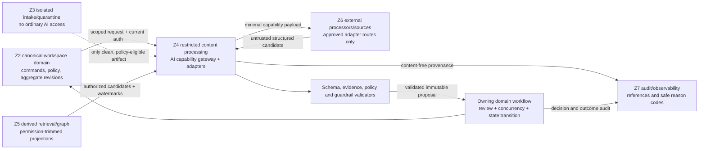

# Phase 1 AI Capability Architecture

| Field | Value |
|---|---|
| Document ID | `AI-CAP-001` |
| Version | `0.1` |
| Status | `DRAFT — provider-neutral; product-owner, architecture, security, and AI assurance approval required` |
| Product phase | Phase 1 — Personal and Family |
| Primary requirements | `REQ-P1-AI-001`–`REQ-P1-AI-007`, `REQ-P1-ING-005`–`REQ-P1-ING-008`, `REQ-P1-SRCH-001`–`REQ-P1-SRCH-005` |
| Architecture alignment | `ARCH-SOL-001`, `ARCH-DOM-001` |
| Security alignment | `SEC-ARCH-001`, `SEC-AUTH-001`, `SEC-PRIV-001`, `SEC-AUD-001`, `SEC-THR-001` |
| Document-intelligence alignment | `DIT-TAX-001`, `DIT-ING-001`, `DIT-EXT-001`, `DIT-FCT-001`, `DIT-GPH-001`, `DIT-MON-001`, `DIT-IMP-001`, `DIT-SRC-001`, `DIT-HLT-001`, `DIT-VER-001` |
| Open decisions | `DEC-031`, `DEC-034`, `DEC-035`, `DEC-036`, `DEC-039`, `DEC-040` |
| Updated | 26 August 2026 |

## 1. Purpose and boundary

This document defines the registered AI capabilities permitted in Phase 1 and their provider-neutral execution contract. It covers capability ownership, inputs, current authorization, tools, structured outputs, evidence, confidence and review, state-effect boundaries, retry/fallback, and content-free operational telemetry.

An AI capability is an untrusted interpretation component behind the logical **AI capability gateway**. It may create a versioned `DocumentAnalysis` or another immutable proposal owned by the relevant domain capability. It cannot grant access, make a fact canonical, resolve applicability, activate a dependency, approve or execute an action, fulfil a requirement, close a case, release quarantined content, or mutate an aggregate directly.

The named components are logical ownership and port boundaries, not required services or products. The contracts refine `UC-P1-002`, `UC-P1-003`, `UC-P1-004`, `UC-P1-005`, `UC-P1-006`, `UC-P1-007`, `UC-P1-008`, `UC-P1-009`, and `UC-P1-013`; umbrella acceptance is `AC-P1-AI-001`, `AC-P1-RAG-001`, `AC-P1-E2E-001`, and `AC-P1-SEC-001`.

## 2. Architecture and trust boundaries

The Australian residency realm overlays every zone and copy. No external adapter route is eligible merely because it is technically reachable. `DEC-040` must supply the approved data-class/processor/region matrix before Australian-residency claims or production external processing are enabled.

## 3. Common execution contract

Every run binds an immutable `capability_id` and version, exact workspace and input generations, actor/workload and purpose, authorization decision and policy epoch, configuration/schema/prompt/tool/calibration versions, deletion and quarantine state, residency route, limits, idempotency identity, and correlation. The gateway performs pre-dispatch and pre-commit checks; the owning domain workflow performs a separate consequence-time check.

The only permitted AI-to-domain path is:

1. read the minimum currently authorized inputs through registered tools;
2. return a versioned structured-output envelope;
3. validate schema, scope, evidence, provenance, guardrails, confidence, coverage, and proposed-effect type;
4. store the candidate as an immutable result generation where policy permits;
5. route it to deterministic validation, review, or an explicit degraded outcome; and
6. let the owning aggregate apply an authorized command with current revision and any required approval.

Provider acknowledgements, prose, confidence, tool requests, and model-produced action fields are never a successful domain transition.

## 4. Capability registry

### 4.1 Inputs, authorization, tools, outputs, and evidence

| ID / capability | Exact inputs and owning boundary | Current authorization | Allowed tools | Structured output and evidence |
|---|---|---|---|---|
| `AI-CAP-P1-001` Ingestion orchestrator | `IngestionCase`, clean/policy-eligible `ArtifactRecord`, active profile, exact stage/generation; **Ingestion orchestration** owns job state | Workspace, job, artifact/version, capability, purpose, processing class, fence and residency route at dispatch and commit | Stage-status read, safe media metadata, registered classifier/extractor calls, cancellation/fence check; no arbitrary fetch | Stage plan/result with exact stage contracts, dependencies, coverage and safe failure codes; cites artifact/profile/config references, not invented content evidence |
| `AI-CAP-P1-002` Classifier | Exact artifact representation, `TaxonomyRelease`, eligible `DocumentTypeProfile` set; **Evidence and interpretation capability** owns analysis | Workspace/artifact/representation plus candidate-profile disclosure and clinical policy | Authorized representation reader, taxonomy applicability evaluator, registered classifier adapter | Ranked profile proposals, signals/anchors, calibration and alternatives; every positive/negative material signal references an authorized anchor or deterministic metadata reference |
| `AI-CAP-P1-003` Extractor | Exact document version/artifact representation, profile and `ExtractionSchema`; **Evidence and interpretation capability** owns `DocumentAnalysis` | Workspace, version, page/region, schema/field, purpose, processor route, deletion/policy state | OCR/layout/native-parser adapters, evidence-anchor creator/resolver, schema validator | Typed `ExtractionResultSet` with field occurrence IDs, presence semantics, anchors, coverage, calibration and review reasons per `DIT-EXT-001` |
| `AI-CAP-P1-004` Subject resolver | Accepted extraction occurrences and authorized `ResourceEntity` candidates; **Fact and entity capability** owns resolution | Independent authorization for occurrence values, subject/resource existence and candidate disclosure | Entity-candidate search, deterministic normalization/comparison, anchor resolver | Ranked `CREATE_NEW`, `LINK_OCCURRENCE`, `RENAME_OR_CORRECT_ATTRIBUTE`, `MERGE`, `SPLIT`, or `REJECT_MATCH` proposals with reasons, conflicts and evidence per `DIT-FCT-001`; never asserts identity solely from name, relationship or similarity |
| `AI-CAP-P1-005` Document analyst | Exact `DocumentVersion`, selected analysis generations and governed taxonomy/rules; **Evidence and interpretation capability** owns analysis | Version, fields, anchors, relationships and requested analysis purpose | Authorized conformed-view reader, comparison tool, schema/rule evaluator | Document summary, clause/date/obligation/relationship proposals, limitations and citations; derived interpretation only, not legal effect or fulfilment |
| `AI-CAP-P1-006` Dependency builder | Authorized fact/entity/document/source occurrences and active edge-type definitions; **Dependency and impact capability** owns `DependencyRecord` | Independent endpoint, edge-type, edge-existence and evidence authorization | Candidate endpoint search, governed edge validator, cycle/depth check, anchor resolver | Typed edge proposals with endpoint revisions, direction, provenance, temporal scope, confidence and evidence; hidden endpoints are not exposed |
| `AI-CAP-P1-007` Change analyst | Ordered exact source/document/conformed generations and materiality policy; **Evidence/interpretation** or **Source registry and monitoring** owns result | Both sides, all compared fields/anchors and output disclosure authorized at current policy | Versioned diff/alignment, anchor resolver, source snapshot reader | `SUPPORTED_CHANGE`, `SUPPORTED_NO_CHANGE_WITHIN_SCOPE`, `INDETERMINATE`, or `REVIEW_REQUIRED`, with two-sided evidence and exact coverage |
| `AI-CAP-P1-008` Applicability analyst | Governed rule/source version, subject/resource facts, temporal and jurisdiction context; `RuleResolution`/`RequirementCase` owner decides | Rule visibility and every fact/edge/evidence input independently authorized; missing restricted input is not false | Deterministic rule evaluator, authorized fact/graph reader, source snapshot/anchor resolver | `APPLICABLE`, `NON_APPLICABLE`, `INDETERMINATE`, `REVIEW_REQUIRED`, `RESTRICTED`, or `UNAVAILABLE` proposal with predicates, evidence, unknowns and rule version per `DIT-MON-001` |
| `AI-CAP-P1-009` Impact analyst | Accepted change, authorized dependency subgraph, rule/applicability results and temporal perspective; **Dependency and impact capability** owns `ImpactAssessment` | Current authorization at every node/edge/path and at assembled output; path truncation is explicit | Bounded graph traversal, rule evaluator, source/fact/evidence readers | Impact proposal with exact `ImpactPath`, coverage and one primary `AUTOMATIC_TECHNICAL_UPDATE_POSSIBLE`, `USER_ACTION_REQUIRED`, `EXTERNAL_NOTIFICATION_REQUIRED`, `REVIEW_REQUIRED`, or `NO_ACTION` class; applicability, severity, urgency, confidence, evidence strength, source authority, source health and coverage remain separate per `DIT-IMP-001` |
| `AI-CAP-P1-010` Health analyst | Exact `RequirementProfileVersion`/`RequirementCase`, authorized facts/documents/evidence, `SourceHealth`, valid/known time; `RequirementCase` owns truth | Profile/case, subject/resource, evidence/anchor, alternative/exception, disposition, verification and source-health inputs authorized independently | Deterministic applicability/profile/evidence evaluator, document/fact/source readers, date calculator | `HealthEvaluation` proposal with exact applicability plus any `MISSING`, `POTENTIALLY_EXPIRED`, `STALE`, `SUPERSEDED`, `CONTRADICTORY`, `INSUFFICIENT`, `RESTRICTED`, or `SOURCE_OR_RULE_UNAVAILABLE` signals; disposition and fulfilment remain separate per `DIT-HLT-001` |
| `AI-CAP-P1-011` Recommendation generator | Accepted change/applicability/impact/health result, policy and permitted action catalogue; **Recommendation, approval, and action workflow** owns recommendation | All cited inputs plus recommendation visibility and target authorized; policy excludes unavailable action types | Evidence resolver, approved recommendation-template catalogue, deterministic dimension calculator | Recommendation proposal binding the exact impact class, separated `DIT-IMP-001` dimensions, evidence/paths, limitations, proposed effect and approval/evidence requirements; `APPROVE_REQUEST`, `REJECT`, `EDIT`, `DEFER`, `DISMISS`, and `NOT_APPLICABLE` remain human/policy decisions, never model authority |
| `AI-CAP-P1-012` Draft generator | Authorized recommendation, exact target/version, template and approved action schema; action workflow owns draft/effect | Draft target, fields, source evidence and action type authorized; consequential release requires separate bound approval | Governed templates, field mapper, preview/diff, effect-hash calculator; no direct external-effect tool | Proposed update/message/form/action payload with source mapping, unresolved fields, preview and effect hash; never submitted, published or sent by the model |
| `AI-CAP-P1-013` Verifier | Candidate output/effect, exact evidence and applicable schema/policy; owning workflow retains decision | Verifier receives no broader data than candidate capability; reauthorizes cited evidence and target | Schema/evidence resolver, deterministic policy/constraint checker, comparison tool | Independent validation findings, unsupported claims, policy violations, coverage and pass/review/fail recommendation; cannot approve its own upstream output |
| `AI-CAP-P1-014` Search assistant | User query held in protected request context, authorized hybrid retrieval snapshot and conversation state; **Search, comparison, and answer capability** owns result | Query purpose plus current resource/field/anchor/edge authorization at candidate, rerank, context, claim and citation release | Permission-trimmed hybrid retrieval, reranker, citation resolver/validator, bounded conversation reader | Cited answer with per-claim support and `SUPPORTED`, `CONFLICTING`, `STALE`, `INCOMPLETE`, `INSUFFICIENT`, `RESTRICTED`, or `UNAVAILABLE` state |

### 4.2 Confidence, review, effects, fallback, and telemetry

| ID | Confidence and mandatory review | Permitted / forbidden state effects | Retry, fallback, telemetry and cost |
|---|---|---|---|
| `AI-CAP-P1-001` | Deterministic stage eligibility dominates model score; ambiguity or policy hold blocks | May propose/run eligible registered stages; cannot set `READY`, release quarantine, select clinical disposition, or activate results | Bounded stage retry; deterministic plan/manual repair; emit versions, stage/reason, duration/usage buckets only |
| `AI-CAP-P1-002` | Per profile/language/quality calibration; low, close-ranked, clinical signal or unsupported type reviews/holds | May create classification generation; cannot set trusted type or bypass `POLICY_HOLD` | Retry alternate registered adapter only under same scope; reviewer/unsupported fallback; no text/aliases in telemetry |
| `AI-CAP-P1-003` | Per capability/schema/field/type/language slice; sensitive, missing-anchor, conflict or low calibration reviews | May create field proposals/anchors; cannot write canonical fact/entity/requirement/action | Parser/OCR/model fallback declared by profile; partial coverage explicit; field/schema IDs and cost buckets only |
| `AI-CAP-P1-004` | Entity-type-specific calibration; shared/sensitive/ambiguous candidate always reviews | May propose links/new entity; cannot merge subjects or create authority/grants | Deterministic exact-match/manual resolution fallback; candidate counts omitted when restricted |
| `AI-CAP-P1-005` | Claim-level confidence; consequential clause/date/relationship and conflict reviews | May create analysis generation; cannot decide controlling legal instrument, relation, fact or fulfilment | Deterministic extraction/conformed fallback or explicit incomplete result; claim/coverage counts only |
| `AI-CAP-P1-006` | Edge-type calibration; new high-impact, cross-subject, cycle-adjacent or weak-evidence edges review | May propose edges; cannot activate edge or infer access | Deterministic mapping/manual review fallback; bounded fan-out and cost; no hidden endpoint telemetry |
| `AI-CAP-P1-007` | Per comparison level/materiality slice; every high-impact or partial/ambiguous comparison reviews | May create comparison/change proposal; cannot mutate versions or call failure “unchanged” | Byte/structural fallback, then `INDETERMINATE`; coverage/latency/cost buckets |
| `AI-CAP-P1-008` | Calibrated only after deterministic predicate results; high-impact, exception, unknown or conflict reviews | May propose applicability; cannot make authoritative rule, requirement or legal decision | Deterministic evaluator is primary fallback; `INDETERMINATE`/`RESTRICTED`; rule/version and safe reason only |
| `AI-CAP-P1-009` | Path/target calibration; critical, truncated, cyclic, stale or conflicting paths review | May create `ImpactAssessment` proposal; cannot create approval, task or external action | Bounded deterministic traversal fallback; explicit partial graph; path length buckets, not node labels |
| `AI-CAP-P1-010` | Profile/signal calibration; potentially expired, insufficient, contradictory, restricted, unavailable or consequential evidence reviews | May propose `HealthEvaluation`; cannot set disposition, verify evidence, fulfil/close `RequirementCase`, or emit/imply an aggregate readiness score while `DEC-034` is open | Deterministic profile evaluation/manual evidence review; signal/coverage buckets only |
| `AI-CAP-P1-011` | Separate calibrated inputs, never opaque universal score; high-impact/low evidence mandatory review | May create recommendation draft; cannot approve, execute, notify or close | Template/manual recommendation or no recommendation; action class/cost only |
| `AI-CAP-P1-012` | Field/claim coverage; all consequential drafts reviewed and previewed | May store controlled draft proposal; cannot send, sign, submit, publish, change grant, or execute | Deterministic template/manual edit; timeout yields incomplete draft; no draft text in telemetry |
| `AI-CAP-P1-013` | Validator thresholds are rule-based plus evaluated model slice; disagreement routes review | May append validation result; cannot self-certify release or override domain policy | Deterministic validators required; independent adapter optional; finding codes/counts only |
| `AI-CAP-P1-014` | Claim-level support and answer-state calibration; high-risk, conflict, stale, restricted or insufficient evidence limits/refuses | May return ephemeral/stored protected answer result; cannot mutate domain state or turn chat text into a command | Retrieval-only result, narrower query suggestion or explicit limitation; latency/token/cost buckets, never query/answer text |

All numeric thresholds and cost ceilings are versioned configuration backed by evaluation evidence. No production threshold is implied by an example in this pack.

## 5. Draft normative rules

- `AI-CAP-P1-015` — Only an active, approved registry version may be invoked; unknown capability, adapter, schema, prompt, tool, calibration, or policy versions fail closed.
- `AI-CAP-P1-016` — Every run MUST bind one explicit workspace except approved non-household reference/configuration evaluation containing no personalized data, consistent with `ARCH-P1-003`, `DOM-P1-002`, and `AUTH-P1-001`.
- `AI-CAP-P1-017` — Authorization MUST be evaluated on current trusted inputs before each protected read/tool call and again before result activation, release, review, cache write, or proposed effect.
- `AI-CAP-P1-018` — Actor, subject, relationship, membership, role, model text, retrieved content, and prior visibility MUST NOT grant capability or resource authority.
- `AI-CAP-P1-019` — All model/adapter outputs are untrusted until versioned schema, evidence, scope, provenance, policy, safety, size, and prohibited-effect validation succeeds.
- `AI-CAP-P1-020` — A validated AI output remains a proposal; only its owning aggregate/capability may apply a separately authorized, revision-guarded state transition.
- `AI-CAP-P1-021` — Every material source-derived field or claim MUST cite exact authorized `EvidenceAnchor` or governed source-snapshot evidence at the asserted granularity.
- `AI-CAP-P1-022` — Confidence MUST be capability- and evaluation-slice-calibrated; confidence is not evidence, authority, correctness proof, applicability, or approval.
- `AI-CAP-P1-023` — Low confidence, weak/missing anchors, conflict, stale source, partial coverage, high impact, protected field, uncalibrated slice, or mandatory policy MUST route review, limitation, or refusal.
- `AI-CAP-P1-024` — Timeout, refusal, provider failure, invalid schema, missing evidence, budget exhaustion, cancellation, revocation, or dependency outage MUST produce an explicit degraded state and MUST NOT fabricate success or authoritative emptiness.
- `AI-CAP-P1-025` — Retries and fallbacks MUST remain within the original workspace, purpose, capability, content scope, residency route, budget, and idempotency identity and MUST create new attempt provenance without overwriting prior output.
- `AI-CAP-P1-026` — Ordinary logs, metrics, traces, analytics, audit fields, errors, and screenshots MUST exclude raw content, values, filenames where sensitive, passages, prompts, queries, answers, tool arguments/results, tokens, secrets, and unrestricted URLs, per `SEC-P1-017`, `PRIV-P1-020`, and `AUD-P1-027`.
- `AI-CAP-P1-027` — Each run MUST retain reconstructable safe provenance required by `AUD-P1-014`: capability/adapter/model, prompt/tool/schema, evidence refs, policy result, limitation/failure, correlation, usage/cost class, and exact input/output generations.
- `AI-CAP-P1-028` — Quarantine, suspected clinical `POLICY_HOLD`, deletion fence, revoked grant, expired purpose, residency ineligibility, and security suspension override ordinary execution and late-result activation.
- `AI-CAP-P1-029` — Capability adapters MUST be replaceable through conformance tests and MUST NOT retain, train on, reuse, or route content outside the approved processor contract (`SEC-P1-020`, `PRIV-P1-008`).
- `AI-CAP-P1-030` — Capability, prompt, tool, schema, calibration, guardrail, or provider changes MUST be immutable, reviewed, approved, evaluated, effective-dated, impact-assessed, auditable, rollback/forward-repairable, and generate new result versions where replayed.

## 6. Open-decision fences

| Decision | AI pack behavior while open |
|---|---|
| `DEC-031` | Connector content/tools are unavailable unless a separately approved connector profile and least-scope consent route exists. |
| `DEC-034` | No aggregate readiness/content-health/compliance/risk score, hidden rank, API/export field, notification, analytics property or model-answer implication is produced; only authorized individual findings/signals are available. |
| `DEC-035` | No document type, schema, source, capability slice, calibration, or metric is public-launch enabled merely because this registry can represent it. |
| `DEC-036` | Suspected clinical content remains `POLICY_HOLD`; ordinary AI, OCR, embeddings, RAG, graph, analytics, preview and notification are blocked, without choosing a retention outcome. |
| `DEC-039` | AI stores, caches, conversations, evaluation samples, adapter residuals and audit references carry deletion lineage; no duration or completion promise is invented. |
| `DEC-040` | External model/OCR/embedding/reranking routes and Australian-residency claims are blocked until the approved matrix makes the exact data class, processor, region, support, backup and DR route eligible. |

## 7. Conformance and negative tests

Each registered capability requires synthetic fixtures proving: cross-workspace and hidden-field denial; revocation between retrieval and release; quarantine/clinical/deletion blocking; prompt/tool injection containment; wrong schema/workspace/generation rejection; missing/forged anchors; uncalibrated and conflicting output review; prohibited domain mutation; stale approval and aggregate revision rejection; retry/idempotency and late-result safety; provider replacement; budget/timeout degradation; residency denial; and automated evidence that ordinary telemetry contains no raw content.

Stop-ship conditions and quantitative release gates are defined by `AI-EVAL-001`. Tool and output mechanics are defined by `AI-TOOL-001` and `AI-OUT-001`; search-specific behavior is defined by `AI-RAG-001`; policy enforcement is defined by `AI-GRD-001`.

## 8. Traceability

| Rule range | Primary trace |
|---|---|
| `AI-CAP-P1-001`–`AI-CAP-P1-014` | `REQ-P1-AI-001`–`007`, `REQ-P1-ING-005`–`008`, `REQ-P1-SRCH-001`–`005`, `DIT-EXT-P1-001`–`035`, `DIT-FCT-P1-001`–`035`, `DIT-GPH-P1-001`–`032`, `DIT-MON-P1-001`–`034`, `DIT-IMP-P1-001`–`044`, `DIT-SRC-P1-001`–`032`, `DIT-HLT-P1-001`–`036`, `DIT-VER-P1-018`–`031` |
| `AI-CAP-P1-015`–`AI-CAP-P1-020` | `ARCH-P1-003`–`012`, `024`, `033`; `AUTH-P1-001`–`011`, `020`–`024`; `DOM-P1-002`, `006`, `025`, `037`, `047` |
| `AI-CAP-P1-021`–`AI-CAP-P1-025` | `REQ-P1-AI-003`–`006`, `REQ-P1-SRCH-002`–`005`, `SEC-P1-020`–`021`, `THR-P1-015`, `030` |
| `AI-CAP-P1-026`–`AI-CAP-P1-030` | `REQ-P1-AI-007`, `REQ-P1-TRUST-003`–`005`, `AUD-P1-014`, `022`, `027`, `PRIV-P1-008`, `020`, `027`–`030` |

This draft is not implementation-ready until the referenced product, security, document-intelligence, output, tool, guardrail, evaluation, and open-decision contracts are approved and machine-readable registry entries plus conformance fixtures exist.
