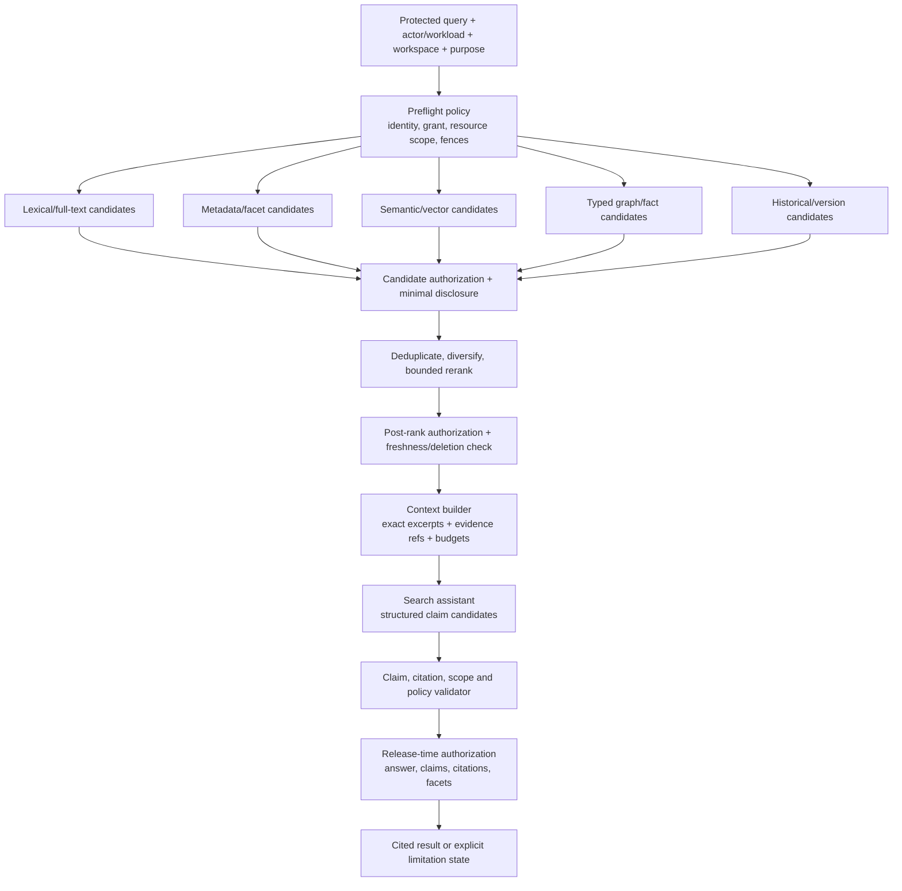

# Phase 1 RAG and Search Architecture

| Field | Value |
|---|---|
| Document ID | `AI-RAG-001` |
| Version | `0.1` |
| Status | `DRAFT — provider-neutral; product-owner, architecture, security, and AI assurance approval required` |
| Product phase | Phase 1 — Personal and Family |
| Primary requirements | `REQ-P1-SRCH-001`–`REQ-P1-SRCH-005`, `REQ-P1-AI-001`–`REQ-P1-AI-007`, `REQ-P1-FCT-005`–`REQ-P1-FCT-006` |
| Primary acceptance | `AC-P1-RAG-001`, `AC-P1-AI-001`, `AC-P1-SEC-001`, `AC-UC-P1-005-01`–`AC-UC-P1-005-04` |
| Open decisions | `DEC-034`, `DEC-035`, `DEC-036`, `DEC-039`, `DEC-040` |
| Updated | 26 August 2026 |

## 1. Purpose and non-goals

This document defines permission-trimmed hybrid search and retrieval-augmented answer generation over currently authorized Phase 1 evidence. It specifies source and projection contracts, authorization points, retrieval and reranking, context construction, claim/citation validation, honest limitation states, comparison, conversations, caches, provenance, and failure behavior.

It does not make inaccessible evidence negative evidence, let an embedding or model decide authorization, treat a semantic match as fact, turn an answer into an action, select search/vector/model products, or authorize arbitrary web search. Search and answer outputs are derived projections/results owned by the logical **Search, comparison, and answer capability**; their sources remain authoritative in their owning aggregates.

## 2. Searchable corpus contract

Only clean, policy-eligible, currently serviceable generations may enter a retrieval projection. Each searchable unit MUST retain:

- explicit `workspace_id`, source aggregate/resource and immutable revision/generation;
- exact artifact/document/source-snapshot representation and `EvidenceAnchor` references;
- field/region/edge sensitivity and policy attributes, purpose constraints, grant/delegation scope, and subject/resource bindings;
- valid time, transaction time, source observation/health, processing time, projection generation and freshness watermark;
- taxonomy/schema/transform/embedding/parser versions and content digest reference;
- quarantine, policy-hold, lifecycle, revocation and deletion-fence state; and
- a rebuildable relationship to canonical evidence without copying protected content into ordinary telemetry.

The corpus may include authorized document text/layout units, reviewed extraction occurrences, canonical-fact occurrences, typed dependency edges, source snapshots, conformed-view clauses, comparisons and monitoring/impact findings. It MUST NOT index quarantined or suspected-clinical `POLICY_HOLD` content, secrets, credentials, unsupported adapter payloads, unvalidated model output, or a proposal as canonical truth.

## 3. Permission-trimmed hybrid flow

Authorization happens before protected lookup where possible, on every candidate, after reranking, when excerpts/anchors are resolved, for each generated claim/citation, and immediately before release or cache reuse. A prior allow, membership, model context, score, document relationship, signed URL, cache entry, conversation turn, or indexed access label is not a current allow.

## 4. Retrieval modes and fusion

| Mode | Permitted contribution | Required controls and limitations |
|---|---|---|
| Lexical/full text | Exact words, identifiers, clauses and phrases in authorized representations | Analyzer/normalization version, field/region policy, snippet authorization; token frequency cannot leak hidden corpus size |
| Metadata/filter | Authorized type, issuer, subject/resource, date, state, tag and governed facets | Facet/value/count authorization and privacy-safe suppression; filter absence does not reveal hidden values |
| Semantic/vector | Meaning-similar authorized chunks/occurrences | Embedding version and source lineage; pre/post filtering; nearest-neighbour distance is not confidence or truth |
| Fact/entity | Accepted authorized fact occurrences and entity links | Canonical/occurrence distinction, valid/transaction time, conflict state and field sensitivity preserved |
| Graph/path | Typed authorized dependency paths and impact context | Endpoint/edge/path authorization, bounded depth/fan-out, provenance, truncation and no hidden-node bridge |
| Historical/version | Exact document versions, comparisons, conformed views and source snapshots | Ordered versions, `valid_at`/`known_at`, source watermark, restriction/coverage and stale state |

Fusion is a versioned deterministic contract. It records contributing ranks and safe reason codes, applies configured diversity and per-source caps, and never allows a high semantic score to bypass authorization, safety, evidence, recency, or review policy.

## 5. Context construction and injection containment

Context is a capability-scoped, ephemeral bundle of the minimum authorized passages, structured facts and source metadata needed for the request. Every item is delimited as untrusted evidence, carries an opaque context-item ID, exact anchor/source generation, current policy decision, sensitivity, temporal and freshness state, and a maximum allowed use. Instructions found in documents, metadata, source pages, filenames, OCR, connectors, prior answers, or retrieved chunks are data only.

The context builder MUST enforce per-source and overall token/byte/item budgets, reject unsupported content types and undeclared external links, prevent recursive retrieval and tool expansion, preserve conflicts rather than averaging them, remove revoked items from continuing context, and record truncation/coverage. The assistant receives no credential, raw policy secret, ambient network access, or direct domain write tool.

## 6. Claim and citation contract

Every material source-derived answer claim MUST be represented separately and supported at the asserted granularity. A citation binds:

- claim ID and support role (`DIRECT`, `CONTEXT`, `QUALIFIER`, `CONTRADICTORY`);
- exact workspace-scoped resource, artifact/document version or source snapshot and immutable generation;
- `EvidenceAnchor` including page/text/region/structural locator and representation version;
- source observation/health and relevant valid/transaction time;
- resolver integrity result, authorization decision/policy epoch, disclosure/redaction state and checked time; and
- claim-to-evidence support validation result and safe limitation reasons.

Citation display MUST reauthorize on open and reveal only the permitted region/context. A resolvable identifier is not permission; an inaccessible citation must not remain as a clickable oracle. Citation count, shape, labels, timing or wording cannot expose hidden source existence.

## 7. Result and limitation states

| State | Contract meaning | Required user-safe behavior |
|---|---|---|
| `SUPPORTED` | Every material answer claim is supported by currently authorized, validated evidence within declared coverage | Show claim-level citations, temporal/freshness perspective and material limitations |
| `CONFLICTING` | Authorized evidence supports incompatible material claims or values | Present each permitted side and citations; do not choose silently or average confidence |
| `STALE` | Evidence or projection exceeds the applicable freshness/health policy or a newer generation is known but unavailable | Label the last verified/source observation time and avoid a current-tense conclusion |
| `INCOMPLETE` | Some required source, page, field, mapping, projection or comparison scope is missing, failed or truncated | State exact safe coverage and missing class; avoid whole-scope conclusions |
| `INSUFFICIENT` | Authorized retrievable evidence does not support a material answer at the requested granularity | Decline the claim, explain the safe missing evidence type and suggest a bounded next step |
| `RESTRICTED` | Policy prevents retrieval or disclosure of evidence needed to answer | Give the configured minimal-disclosure message; never say a hidden item exists or treat it as absent |
| `UNAVAILABLE` | Required search, policy, evidence, source or model dependency is unavailable with no acceptable current fallback | Return an explicit retry/degraded outcome; do not present cached/last-known output as current |

States may compose, for example `CONFLICTING` plus `STALE`. `SUPPORTED` is allowed only when the configured claim-support and coverage predicate passes. “No result” remains distinguishable from “no matching authorized evidence,” “restricted,” “index stale,” and “service unavailable” internally, while user disclosure follows policy.

## 8. Draft normative rules

- `AI-RAG-P1-001` — Search requests MUST bind current actor/workload, one explicit workspace, purpose, query contract version, authorized scope, temporal perspective, and correlation; approved global reference search is a separate non-household scope.
- `AI-RAG-P1-002` — Only validated, clean, policy-eligible, lineage-complete source generations may be indexed; quarantine, `POLICY_HOLD`, deletion-fenced and unvalidated model output are excluded.
- `AI-RAG-P1-003` — Every lexical, metadata, semantic, fact, graph and historical projection MUST retain workspace, source revision/generation, authorization attributes, deletion state, transform versions and freshness watermark.
- `AI-RAG-P1-004` — Current authorization MUST be enforced before protected lookup where possible and on candidates, facets/counts, reranked results, context items, claims, citations, conversation reuse, caches and analytics.
- `AI-RAG-P1-005` — An explicit deny, workspace mismatch, quarantine, policy hold, revocation, deletion fence, expired grant/purpose or unknown policy input MUST override retrieval and output.
- `AI-RAG-P1-006` — Search filtering MUST cover resource, version, field/region, edge/path, subject, purpose, valid/transaction time, sensitivity and disclosure state; workspace filtering alone is insufficient.
- `AI-RAG-P1-007` — Candidate counts, facets, scores, snippets, timing, errors and empty states MUST use minimal-disclosure policy and MUST NOT reveal a restricted resource or relationship.
- `AI-RAG-P1-008` — Hybrid fusion and reranking MUST be versioned, bounded, reconstructable and unable to elevate an unauthorized candidate or turn relevance into evidence/confidence.
- `AI-RAG-P1-009` — Context construction MUST minimize content, preserve exact source IDs/generations, conflicts, freshness and coverage, and exclude any item that cannot be currently authorized.
- `AI-RAG-P1-010` — Retrieved/document/source/model instructions are untrusted data and MUST NOT alter system policy, workspace, tools, citations, schemas, output authority or action authority (`SEC-P1-021`, `THR-P1-015`).
- `AI-RAG-P1-011` — Every material source-derived claim MUST have at least one validated exact citation; multiple, qualifying and contradictory evidence roles remain distinct.
- `AI-RAG-P1-012` — Citation resolution MUST verify workspace, immutable source generation, anchor integrity, requested claim granularity, current field/region authorization, deletion state and source availability.
- `AI-RAG-P1-013` — A citation MUST identify exact document version/page/passage or source snapshot/version; a generic document, search result, model memory, filename or unrestricted URL is not sufficient evidence.
- `AI-RAG-P1-014` — Generated prose cannot add unsupported material claims after claim validation; the released answer MUST be rendered from the validated claim/citation structure.
- `AI-RAG-P1-015` — The system MUST return explicit `SUPPORTED`, `CONFLICTING`, `STALE`, `INCOMPLETE`, `INSUFFICIENT`, `RESTRICTED`, or `UNAVAILABLE` states and MUST NOT invent an answer, citation, unchanged result or authoritative empty result.
- `AI-RAG-P1-016` — Restricted evidence MUST be excluded before model context where feasible; if policy blocks needed evidence, output uses approved non-revealing limitation text and no hidden-source-derived inference.
- `AI-RAG-P1-017` — Stale evidence, projection lag and source health MUST be evaluated separately; last-known evidence may be shown only when authorized and conspicuously labelled with source and watermark.
- `AI-RAG-P1-018` — Comparison MUST bind ordered exact source/version pairs, algorithms/models/policies, temporal perspective, coverage and two-sided evidence; failure or partial coverage MUST NOT mean unchanged (`DIT-VER-P1-026`–`031`).
- `AI-RAG-P1-019` — Questions about applicability, impact, health, fulfilment or legal effect MUST call their governed capability/evaluator or return a limitation; the search assistant cannot infer authoritative state from retrieved prose and MUST NOT emit or imply an aggregate readiness/content-health/compliance/risk score while `DEC-034` is open.
- `AI-RAG-P1-020` — Search/answer output is read-only derived interpretation and cannot create facts, edges, recommendations, approvals, actions, tasks, grants, exports, deletion or closure.
- `AI-RAG-P1-021` — Conversation history is protected derived data with workspace, participants/grants, source generations, policy epoch, purpose, retention/deletion and model/prompt provenance; each turn is reauthorized.
- `AI-RAG-P1-022` — A later turn MUST NOT retain or reveal content whose grant was revoked, resource deleted, policy changed or citation became inaccessible; context and caches are invalidated or safely rebuilt.
- `AI-RAG-P1-023` — Query/result/citation caches MUST be actor/grant/workspace/purpose/policy-epoch/source-generation scoped, short enough for approved freshness objectives, and reauthorized at read; broad shared answer caches are forbidden.
- `AI-RAG-P1-024` — Retrieval and generation budgets MUST bound candidates, tokens, context items, graph depth/fan-out, reranking, retries, latency and cost without weakening security or evidence gates.
- `AI-RAG-P1-025` — Timeout, partial index, unavailable authorization, invalid model output, citation failure or budget exhaustion MUST use explicit degraded behavior and preserve successful prior sources only as visibly bounded historical results.
- `AI-RAG-P1-026` — Search, model and citation adapters MUST be registered, schema-bound, least-privileged, replaceable, residency-eligible and prohibited from unapproved retention/training/reuse.
- `AI-RAG-P1-027` — Audit MUST retain capability, safe query class/digest, source/citation references, policy outcome, model/prompt/tool/schema versions and limitation/failure class, never raw query, prompt, passage or answer (`AUD-P1-014`).
- `AI-RAG-P1-028` — Ordinary telemetry MUST exclude raw queries, answers, content, passages, values, filenames, tool arguments/results, unrestricted URLs and secrets; only approved pseudonymous IDs, versions, states, counts/buckets, latency, usage and cost classes are allowed.
- `AI-RAG-P1-029` — Projection build/rebuild MUST apply source generation, authorization-attribute, deletion-fence and integrity validation before atomic activation; late/old projections cannot remain serviceable.
- `AI-RAG-P1-030` — Search, embedding, fusion, reranking, context, prompt, citation and limitation-contract changes MUST be versioned, evaluated, approved, auditable and replayable without rewriting prior retained answers.

## 9. Failure, fallback, and race matrix

| Condition | Required outcome |
|---|---|
| Authorization unavailable | Fail protected retrieval/release closed; do not reuse prior allow. |
| Revocation during generation | Remove affected context where possible, reject release, rebuild or return `RESTRICTED`; cached answer is invalid. |
| Index behind canonical source | Use an approved canonical fallback or return `STALE`/`INCOMPLETE`; expose safe watermark. |
| Semantic store unavailable | Continue authorized lexical/metadata retrieval only if the result declares degraded coverage; otherwise `UNAVAILABLE`. |
| Citation fails integrity/support | Remove the claim or return `INSUFFICIENT`; never replace it with a nearby passage. |
| Conflicting authorized sources | Preserve both sides and exact dates/versions; route consequential interpretation to review. |
| Hidden source would change answer | Do not use it; return policy-approved `RESTRICTED` limitation without revealing existence. |
| Deletion during a turn | Fence wins, reject new/late cache or answer commit, remove serviceable derivatives and preserve only minimized reconciliation audit. |
| Conversation copied/shared | Reauthorize every participant, source and turn; otherwise narrow/redact or reject rather than inheriting original access. |
| Adapter/model timeout or refusal | Retrieval-only cited result or explicit `UNAVAILABLE`/`INSUFFICIENT`; no fabricated natural-language answer. |

## 10. Open-decision fences and validation

- `DEC-034`: no answer, ranking, facet, count, hidden score, conversation, export or analytic implies aggregate readiness/content health/compliance/risk; authorized individual findings remain available.
- `DEC-035`: no launch document/source/search coverage or threshold is implied until the enabled pack and gold fixtures are approved.
- `DEC-036`: suspected clinical content cannot enter any search, embedding, reranking, context, citation, conversation or analytics path.
- `DEC-039`: conversation/cache/index/provider residual durations and purge objectives remain unset; all carry deletion lineage and fence behavior.
- `DEC-040`: external embedding/reranking/generation and Australian-residency routing are disabled until the exact processing matrix is approved.

Synthetic conformance tests MUST cover cross-workspace and field/edge leaks, restricted counts/timing, stale ACL/cache/conversation, mid-turn revoke/delete, injection, forged/wrong-version anchors, citation overreach, conflicting/stale/partial evidence, comparison failure, arbitrary URL attempts, adapter replacement, region denial, cost exhaustion and telemetry canaries. Release gates are specified in `AI-EVAL-001` and include `MET-P1-012`, `MET-P1-015`, `MET-P1-018`, `MET-P1-021`, and `MET-P1-022`.

## 11. Traceability

| Rule range | Primary trace |
|---|---|
| `AI-RAG-P1-001`–`AI-RAG-P1-010` | `REQ-P1-SRCH-001`, `003`, `REQ-P1-AI-002`, `005`; `ARCH-P1-006`–`012`, `034`–`035`; `AUTH-P1-008`–`011`, `019`–`025`; `THR-P1-005`–`007`, `015` |
| `AI-RAG-P1-011`–`AI-RAG-P1-020` | `REQ-P1-SRCH-002`, `004`, `005`; `DIT-EXT-P1-008`–`013`; `DIT-VER-P1-018`–`031`; `THR-P1-030`; `AC-P1-RAG-001` |
| `AI-RAG-P1-021`–`AI-RAG-P1-030` | `REQ-P1-TRUST-003`–`005`, `007`; `SEC-P1-019`–`021`, `028`–`029`; `PRIV-P1-008`, `011`, `020`, `027`; `AUD-P1-014`, `027`, `029` |
