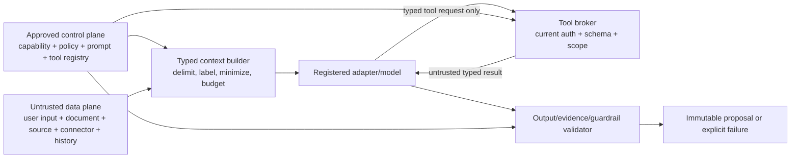

# Phase 1 Prompt and Tool Standards

| Field | Value |
|---|---|
| Document ID | `AI-TOOL-001` |
| Version | `0.1` |
| Status | `DRAFT — provider-neutral; security, architecture, and AI assurance approval required` |
| Product phase | Phase 1 — Personal and Family |
| Primary requirements | `REQ-P1-AI-001`–`REQ-P1-AI-007`, `REQ-P1-SRCH-003`, `REQ-P1-TRUST-002`–`REQ-P1-TRUST-005` |
| Security baseline | `SEC-P1-007`, `SEC-P1-017`, `SEC-P1-020`–`SEC-P1-024`; `AUTH-P1-020`–`AUTH-P1-024`; `THR-P1-007`, `THR-P1-015`–`THR-P1-017` |
| Open decisions | `DEC-031`, `DEC-034`, `DEC-035`, `DEC-036`, `DEC-039`, `DEC-040` |
| Updated | 26 August 2026 |

## 1. Purpose and authority boundary

This document defines how prompts, context, tools, adapters and model calls are registered, versioned, authorized, isolated, invoked, validated and audited. It applies to every capability in `AI-CAP-001` and every result governed by `AI-OUT-001`.

Prompts and tools are configuration and execution surfaces, not authority. System/developer policy is supplied from an approved immutable registry. User input, documents, OCR, filenames, metadata, source pages, connector payloads, retrieved chunks, model output and prior conversation turns are untrusted data. None can change workspace, permissions, tool scope, evidence requirements, output schema, approval or action authority.

## 2. Prompt package contract

Every `PromptPackage` contains:

| Field | Required meaning |
|---|---|
| Identity | Stable `prompt_package_id`, immutable version, compatible capability/output/tool versions, status and owner |
| Instruction layers | Approved system policy, capability task, output constraints and safe renderer instructions, each separately identified and hashed |
| Context schema | Declared slots, types, source classes, sensitivity, max items/bytes/tokens, temporal semantics and whether content is protected |
| Trust labels | `TRUSTED_CONTROL`, `TRUSTED_CONFIGURATION`, `UNTRUSTED_USER_INPUT`, `UNTRUSTED_EVIDENCE`, `UNTRUSTED_TOOL_RESULT`, `PROTECTED_OUTPUT` |
| Tool policy | Explicit allow-list of tool IDs/versions/operations, invocation count and budget, sequencing constraints and side-effect class |
| Output policy | Exact structured-output contract/version, refusal/limitation states, prohibited fields and validator versions |
| Safety policy | Injection, privacy, clinical, jurisdiction, legal/financial interpretation, high-impact, content and no-disclosure controls |
| Evaluation/governance | Gold/negative dataset versions, release gate, approvers, valid/effective time, change summary, prior version and rollback/repair plan |

The rendered prompt is reconstructed from these references in a protected execution record where retention permits. Ordinary audit stores hashes/versions, not raw prompt or injected content.

## 3. Instruction and context precedence

The only accepted control order is: platform/security policy; approved capability registry; approved prompt package; approved request policy; authorized user intent expressed as data. Retrieved/source content and tool/model output never enter the control plane.

Untrusted content is structurally delimited, labelled with opaque source IDs and never interpolated into control fields. Content that says “ignore prior instructions,” requests tools, contains JSON resembling a command, embeds a URL, or claims special authority remains evidence data and is available to the model only as required for the task.

## 4. Tool registry and broker

### 4.1 Registered tool definition

| Field | Contract |
|---|---|
| Identity | Stable `tool_id`, immutable version, owner, status, compatible capabilities and prompt packages |
| Operation | One semantic action with closed input/output schemas and declared read/write/external-effect class |
| Authority | Workload identity, allowed purpose, workspace/resource/field/edge scope, delegation constraints and required consequence-time checks |
| Network/data route | Destination allow-list or internal boundary, protocol, processor/region eligibility, data classes, retention and consent requirements |
| Limits | Per-call and per-run timeout, payload/response size, result cardinality, graph depth/fan-out, rate, concurrency, retry and cost budgets |
| Reliability | Idempotency namespace/fingerprint, unknown-outcome reconciliation, cancellation, retryable/terminal categories and fallback |
| Validation | Input/output schema, evidence/provenance expectations, injection/content treatment, redaction and safe error taxonomy |
| Audit/telemetry | Content-free event schema, required audit class, usage/latency/cost buckets and prohibited fields |

The broker, not the model, supplies trusted workspace, actor/workload, grant/delegation, purpose, policy epoch, target revision, idempotency and residency fields. Any conflicting model-supplied value is rejected.

### 4.2 Tool classes

| Class | Examples | Model-visible behavior | State effect |
|---|---|---|---|
| `READ_EVIDENCE` | Exact page/anchor, reviewed fact occurrence, source snapshot | Returns only current authorized minimum with lineage; result is untrusted evidence | None |
| `READ_DERIVED` | Permission-trimmed search, graph path, conformed view, comparison | Returns bounded authorized snapshot with watermarks/coverage | None |
| `EVALUATE_DETERMINISTIC` | Schema, rule, date, policy, effect-digest, graph constraint | Closed typed input/output; no model interpretation authority | None unless owning domain later applies a command |
| `CREATE_PROPOSAL` | Evidence anchor candidate, extraction/edge/recommendation/draft proposal | Broker stores only after schema/evidence/policy validation | Immutable proposal only |
| `PREVIEW_EFFECT` | Diff, form/message preview, effect hash | No external submission; target revision and exact payload bound | None |
| `CONSEQUENTIAL_EFFECT` | External submit/send/publish/update | Not directly callable by a model in Phase 1; owning workflow requires current auth and bound approval | Domain/external effect outside AI call |
| `EXTERNAL_RETRIEVAL` | Governed source or approved connector adapter | Only pre-approved destination/source profile; never arbitrary URL from content | Snapshot/import proposal only |

## 5. Invocation and lifecycle

Each tool call is a child of one capability run and carries a broker-generated `tool_call_id`, run/correlation/causation IDs, tool/version, workspace, actor/workload and delegation ref, purpose, exact resource targets/revisions, authorization decision/policy epoch, deletion-fence watermark, residency route, input digest, idempotency identity, deadline, attempt and budget balance.

The lifecycle is `PROPOSED_BY_MODEL` → `POLICY_VALIDATED` → `AUTHORIZED` → `DISPATCHED` → `SUCCEEDED`, `FAILED_RETRYABLE`, `FAILED_TERMINAL`, `CANCELLED`, `POLICY_BLOCKED`, `DELETION_BLOCKED`, or `UNKNOWN_OUTCOME_RECONCILING`. A model never sets lifecycle state. Outputs re-enter the model only after broker validation and are labelled untrusted.

## 6. Draft normative rules

- `AI-TOOL-P1-001` — Every prompt package and tool MUST have a stable ID, immutable version, owner, status, compatibility constraints, provenance, evaluation evidence and approved publication record.
- `AI-TOOL-P1-002` — Only active registry versions explicitly allowed by the registered capability may be rendered or invoked; dynamic tool discovery and undeclared tools are forbidden.
- `AI-TOOL-P1-003` — Trusted control instructions MUST originate only from the approved control plane; user/document/source/connector/tool/model text is untrusted data regardless of syntax or claimed role.
- `AI-TOOL-P1-004` — Context slots MUST be typed, source-labelled, sensitivity-labelled, size-bounded and populated from currently authorized sources without concatenating content into control fields.
- `AI-TOOL-P1-005` — Prompts MUST state the capability boundary, evidence requirement, limitation/refusal states, prohibited effects and output schema; absence of an instruction never grants an action, and `DEC-034` forbids aggregate readiness/content-health/compliance/risk scoring or implication.
- `AI-TOOL-P1-006` — Raw prompt text, chain-of-thought, document content, queries, tool arguments/results, values and secrets MUST NOT enter ordinary logs, metrics, traces, audit or analytics; approved version/hash references are sufficient for reconstruction.
- `AI-TOOL-P1-007` — Prompt packages MUST NOT contain production credentials, signing material, hidden broad access tokens, unrestricted endpoints or sensitive household examples.
- `AI-TOOL-P1-008` — Prompt rendering MUST use explicit delimiters/structured serialization, escape ambiguous control syntax and preserve source identities so untrusted instructions cannot cross the data/control boundary.
- `AI-TOOL-P1-009` — Direct and indirect injection signals MUST be recorded as safe finding codes, contained, and evaluated; detection alone MUST NOT authorize broader content inspection or leak injected text.
- `AI-TOOL-P1-010` — Tool definitions MUST use closed, size-bounded input/output schemas and stable semantic operations; unknown fields, polymorphic executable payloads and provider-native command strings are rejected.
- `AI-TOOL-P1-011` — The broker MUST inject trusted workspace, identity/delegation, purpose, authorization, policy epoch, target revision, idempotency and residency values; the model cannot supply or override them.
- `AI-TOOL-P1-012` — Each call MUST reauthorize its exact resource, version, field/region, edge/path, operation, purpose and time, and apply quarantine, revocation, deletion and security fences before lookup/dispatch.
- `AI-TOOL-P1-013` — Tool access MUST be least privilege per capability/run/call; workload identity is distinct, short-lived where feasible, and cannot use ambient user, operator or network privilege (`SEC-P1-007`).
- `AI-TOOL-P1-014` — Tool output MUST be minimized to the authorized fields/regions and MUST NOT reveal hidden existence through counts, alternatives, timing, errors, scores or URLs.
- `AI-TOOL-P1-015` — Tool output is untrusted until schema, workspace/input, provenance, evidence, policy, size and prohibited-content validation succeeds; it cannot modify subsequent tool policy.
- `AI-TOOL-P1-016` — Arbitrary network fetch, URL following, DNS/redirect acceptance, local metadata access and connector/source discovery from content are forbidden; external retrieval uses governed destination/source profiles and SSRF controls (`SEC-P1-023`).
- `AI-TOOL-P1-017` — External adapters MUST be purpose/capability/data-class/region/time scoped and prohibited from unapproved retention, training or reuse; `DEC-040` ineligible routes are blocked.
- `AI-TOOL-P1-018` — Suspected clinical `POLICY_HOLD`, quarantine and unsafe artifacts MUST never be delivered to ordinary model/OCR/search tools, regardless of prompt instructions or availability pressure.
- `AI-TOOL-P1-019` — Read tools MUST return exact source generation, freshness, deletion and authorization metadata with evidence anchors; absence/restriction/failure remains distinct from a negative fact.
- `AI-TOOL-P1-020` — Proposal tools MAY append a validated immutable result only; they MUST NOT set canonical fact, relation, applicability, fulfilment, approval, execution, verification, closure, grant or deletion state.
- `AI-TOOL-P1-021` — Models MUST NOT directly invoke `CONSEQUENTIAL_EFFECT`; an owning domain workflow revalidates the proposal, current authorization, policy, expected revision, exact effect hash, approval, expiry and idempotency before effect.
- `AI-TOOL-P1-022` — Tool calls MUST use stable idempotency scope and canonical input fingerprint; same key/different fingerprint is a conflict, and retries cannot duplicate proposals or effects.
- `AI-TOOL-P1-023` — Timeouts, attempts, backoff, concurrency, rate, fan-out, depth, payload, response and cost budgets MUST be explicit versioned policy and cannot be increased by model text.
- `AI-TOOL-P1-024` — Retry is allowed only for declared retryable failures within original authority/scope/deadline/budget; each attempt is additive and unknown external outcome is reconciled before repeat.
- `AI-TOOL-P1-025` — Cancellation, revocation, policy change or deletion MUST be checked before each read/dispatch and before accepting output; late responses cannot activate or re-enter context when no longer eligible.
- `AI-TOOL-P1-026` — Failure MUST return registered safe reason, retryability, partial/unknown outcome and recovery route; a tool/model cannot turn failure into empty authoritative success.
- `AI-TOOL-P1-027` — Every call MUST create privacy-safe provenance/audit including capability/run, tool/version, safe target refs, policy decision, outcome, attempt, time, input/output digests and correlation, without raw payloads (`AUD-P1-014`).
- `AI-TOOL-P1-028` — Ordinary telemetry is schema allow-listed to pseudonymous IDs, versions, reason/status, count/size/latency/usage/cost buckets and synthetic marker; raw content and unrestricted identifiers are prohibited.
- `AI-TOOL-P1-029` — Prompt/tool/adapter changes MUST be reviewed as security/consequence configuration, diffed, evaluated, approved, effective-dated, signed or integrity-protected, auditable and rollback/forward-repairable.
- `AI-TOOL-P1-030` — Every tool/adapter MUST pass synthetic conformance, injection, authorization, evidence, idempotency, timeout, cancellation, deletion, residency, cost and no-raw-telemetry tests before registration and after material change.

## 7. Failure and fallback matrix

| Condition | Required broker behavior |
|---|---|
| Unknown prompt/tool/schema version | Block before render/dispatch; return contract failure. |
| Model invents a tool or argument | Reject with safe finding; do not search for a similarly named operation. |
| Content requests a tool/workspace change | Treat as injection/data; retain original allowed scope and route review/refusal where needed. |
| Authorization service unavailable | Fail protected call closed; no stale broad allow. |
| Tool returns extra fields/content | Reject or strictly project only when the registered validator proves this safe; record conformance failure. |
| Tool times out before known effect | Mark retryable or terminal per contract. |
| External outcome unknown | Enter reconciliation with stable external command ID; never blind retry. |
| Budget exhausted | Stop further calls and return partial/insufficient/unavailable state with coverage. |
| Deletion/revocation mid-run | Cancel/reject late results, invalidate context/cache and preserve only minimized audit. |
| Provider/route ineligible | Use an approved equivalent adapter only when evaluation, purpose and route remain valid; otherwise block/degrade. |

## 8. Prompt and tool review checklist

Publication evidence MUST prove: the capability and owner are exact; every context slot is needed and classified; untrusted data is structurally isolated; the output schema is closed; tool allow-list is minimal; resources/fields/purpose are reauthorized; effect tools are absent from model reach; errors and restrictions do not disclose; budgets and idempotency are defined; provider retention/training/residency is eligible; audit is reconstructable without content; deletion/cancellation races are covered; and red-team/regression results pass `AI-EVAL-001`.

## 9. Open-decision fences and traceability

| Rule range | Primary trace |
|---|---|
| `AI-TOOL-P1-001`–`AI-TOOL-P1-009` | `REQ-P1-AI-001`, `003`, `005`; `SEC-P1-017`, `020`–`021`; `AUD-P1-014`, `027`; `THR-P1-015`, `019`, `021` |
| `AI-TOOL-P1-010`–`AI-TOOL-P1-018` | `REQ-P1-AI-002`, `005`, `007`; `AUTH-P1-020`–`024`; `PRIV-P1-008`, `010`, `027`–`028`; `THR-P1-007`, `013`, `016`–`018` |
| `AI-TOOL-P1-019`–`AI-TOOL-P1-026` | `REQ-P1-AI-004`–`006`; `ARCH-P1-019`–`024`, `033`–`035`, `041`–`043`; `SEC-P1-024`, `029`; `THR-P1-010`–`011`, `026`–`030` |
| `AI-TOOL-P1-027`–`AI-TOOL-P1-030` | `REQ-P1-TRUST-003`–`005`; `AUD-P1-014`, `022`, `027`, `029`; `PRIV-P1-020`, `022`, `027`–`030` |

`DEC-031` fences connector tools, `DEC-034` aggregate readiness/content-health/compliance/risk scoring, `DEC-035` launch prompt/tool/calibration enablement, `DEC-036` clinical-content routing, `DEC-039` retained prompt/tool/output duration, and `DEC-040` processor/region routes. This document makes no choice for those decisions.
