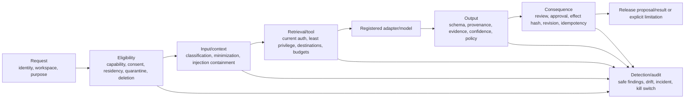

# Phase 1 AI Guardrails

| Field | Value |
|---|---|
| Document ID | `AI-GRD-001` |
| Version | `0.1` |
| Status | `DRAFT — provider-neutral; product, security, privacy, and AI assurance approval required` |
| Product phase | Phase 1 — Personal and Family |
| Primary requirements | `REQ-P1-AI-002`–`REQ-P1-AI-007`, `REQ-P1-SRCH-002`–`REQ-P1-SRCH-004`, `REQ-P1-TRUST-002`–`REQ-P1-TRUST-009` |
| Primary acceptance | `AC-P1-AI-001`, `AC-P1-RAG-001`, `AC-P1-E2E-001`, `AC-P1-SEC-001`, `AC-P1-DEL-001` |
| Threat alignment | `THR-P1-005`–`THR-P1-007`, `THR-P1-010`, `THR-P1-013`–`THR-P1-019`, `THR-P1-021`, `THR-P1-023`–`THR-P1-024`, `THR-P1-026`–`THR-P1-030` |
| Open decisions | `DEC-031`, `DEC-032`, `DEC-034`, `DEC-035`, `DEC-036`, `DEC-039`, `DEC-040` |
| Approved unavailable capability | `DEC-038` keeps account/workspace recovery and ownership transfer unavailable in Phase 1; AI cannot infer or create a bypass |
| Updated | 26 August 2026 |

## 1. Purpose and policy stance

This document defines mandatory preventive, detective and responsive controls for Phase 1 AI capabilities. Guardrails are enforceable policy and validation controls around the model, not prompt suggestions and not a claim that model behavior is intrinsically safe.

The default is deny, minimize and disclose limitations honestly. A guardrail cannot be disabled by user text, retrieved evidence, model/tool output, membership, relationship, provider setting, confidence or availability pressure. Unknown policy/version/input denies or routes to explicit review. Any proposed consequential effect remains inert until the owning domain workflow applies current authorization, evidence, policy, revision, bound approval and audit.

## 2. Enforcement pipeline

Each gate emits a registered safe outcome: `ALLOW_TO_NEXT_GATE`, `LIMIT`, `REVIEW_REQUIRED`, `REFUSE`, `POLICY_BLOCKED`, `DELETION_BLOCKED`, `FAILED_RETRYABLE`, or `FAILED_TERMINAL`. An earlier allow cannot override a later deny, and a model response never sets the gate outcome.

## 3. Guardrail domains

| Domain | Preventive control | Detective/response control |
|---|---|---|
| Authorization/non-disclosure | Current resource/field/edge/tool/output authorization and deny precedence | Cross-workspace canaries, differential count/timing tests, revoke-cache alarm, capability disable |
| Prompt injection | Trust-labelled context, no content-derived authority, closed tools/output | Injection corpus, tool-policy violation finding, quarantine result and suspend affected prompt/tool version |
| Evidence/faithfulness | Claim-first output, exact anchors, support validator, coverage/temporal state | Citation-support evaluation, unsupported-claim finding, release block and regression |
| Confidence/review | Slice calibration and versioned thresholds; high impact/unknown/conflict review | Calibration/drift monitoring, threshold breach, route to manual review/disable automation |
| Privacy/processing | Purpose minimization, consent/route policy, no provider training/reuse, no raw telemetry | Egress/telemetry canaries, processor conformance, incident containment/revocation |
| Clinical boundary | Suspected clinical `POLICY_HOLD`; no ordinary AI/OCR/RAG/graph | Synthetic clinical fixtures, cross-path containment alarm; preserve hold while `DEC-036` open |
| Source/connector | Governed sources/destinations, snapshots, health and applicability separation | Poisoning/redirect/parser drift detection, suspend source/profile and impact-assess outputs |
| Consequential action | Model has no effect tool; typed proposal, preview, bound approval and current revision | Changed-input/effect-hash/replay detection, reconcile partial external outcome |
| Availability/cost | Bounded size/time/token/fan-out/retry/cost, backpressure and circuit breakers | Budget/latency/error drift, safe degradation, adapter/capability circuit open |
| Deletion/revocation | Fence at input/tool/commit/release/cache/rebuild | Late-result/resurrection canary; reject, purge derivative and audit attempt |

## 4. Human review and approval policy

Human review is mandatory when configured for sensitivity/criticality, a material claim lacks strong evidence, calibration is absent/out-of-slice, confidence is below the approved slice threshold, candidate results are close/conflicting, coverage is partial/stale, a new high-impact dependency/applicability/impact result is proposed, a source is unhealthy, a clinical boundary signal exists, a protected subject/resource match is ambiguous, or a consequential draft/action is involved.

Reviewers see only evidence they are currently authorized to access. The review binds exact result generation, claims/anchors, policy/calibration versions, target revision and effect digest. Model-generated explanations are aids, not review evidence. Material input, prompt/tool/model/schema/policy, target, access or effect change invalidates the review. Approval remains a distinct `Approval` aggregate/record and is never inferred from review, silence, prior approval, ownership or high confidence.

## 5. User-facing behavior

The system MUST:

- distinguish evidence, interpretation, suggestion, review and confirmed domain state;
- identify source versions, temporal/freshness perspective and meaningful coverage limits;
- show conflict rather than collapse it, and say when evidence is insufficient, restricted or unavailable;
- avoid legal, medical, tax, financial, insurance or immigration certainty beyond supported approved rule/evidence contracts;
- avoid claiming a source is current merely because retrieval succeeded;
- avoid claiming a requirement is fulfilled, an action succeeded or a case is closed without its owning verified state; and
- use policy-approved minimal-disclosure wording so a restriction does not expose hidden resource existence.

## 6. Draft normative rules

- `AI-GRD-P1-001` — Guardrails MUST be independent policy/validator controls at request, context, retrieval/tool, output and consequence gates; prompt compliance alone is insufficient.
- `AI-GRD-P1-002` — Default deny applies to unknown capability, prompt, tool, schema, model, calibration, source, rule, policy, processor route or security-relevant input.
- `AI-GRD-P1-003` — Explicit deny, workspace mismatch, quarantine, clinical hold, revoked/expired grant, deletion fence, security suspension and ineligible residency route override every ordinary allow.
- `AI-GRD-P1-004` — Membership, family/caregiver/adviser relationship, owner/admin label, prior visibility, confidence, model text and retrieved context MUST NOT grant resource, field, tool or action authority.
- `AI-GRD-P1-005` — Current authorization and minimal disclosure MUST be enforced for input existence, fields/anchors, candidates, counts/facets, graph paths, context, tool calls, claims/citations, outputs, conversations, caches and audit views.
- `AI-GRD-P1-006` — User/document/source/metadata/connector/tool/model instructions are untrusted and cannot modify trusted instructions, workspace, authorization, tools, evidence, citations, schemas, approval or effects.
- `AI-GRD-P1-007` — Prompt/tool injection detection MUST contain the attempted influence, block prohibited calls/effects, retain safe finding codes and route high-risk uncertainty to review/refusal.
- `AI-GRD-P1-008` — Injection strings MUST NOT be copied into ordinary logs/audit/analytics, re-used as training data, or displayed beyond authorized protected review.
- `AI-GRD-P1-009` — Every material source-derived field or claim MUST have exact currently authorized evidence at the asserted granularity; missing/invalid evidence removes the claim or yields explicit insufficiency/review.
- `AI-GRD-P1-010` — Citation validation MUST check immutable source/version, anchor integrity, support role, claim entailment/support, temporal perspective, source health, authorization and deletion state.
- `AI-GRD-P1-011` — Conflicting, qualifying and contradictory evidence MUST remain visible as distinct roles; the system cannot choose by model preference or average incompatible values.
- `AI-GRD-P1-012` — Stale, partial, failed, restricted and unavailable inputs MUST produce explicit limitations and MUST NOT be represented as current, complete, absent, unchanged or successful.
- `AI-GRD-P1-013` — Confidence MUST be calibrated to capability and evaluation slice and can never substitute for evidence, authorization, applicability, fact acceptance, approval or correctness.
- `AI-GRD-P1-014` — Uncalibrated, out-of-distribution, low-confidence, conflicting, weak-evidence, high-impact and mandatory-policy outputs MUST route to review, limitation or refusal.
- `AI-GRD-P1-015` — Source-derived applicability, impact, expected-document health and recommendations MUST preserve rule/source/graph/evidence provenance and their separate authoritative domain states; while `DEC-034` is open no aggregate readiness/content-health/compliance/risk score, rank, answer or analytic implication is allowed.
- `AI-GRD-P1-016` — The system MUST NOT present AI interpretation as legal advice, medical advice, authoritative government guidance, guaranteed eligibility, controlling document status or verified compliance without an approved specialized contract and evidence/review policy.
- `AI-GRD-P1-017` — Suspected clinical content MUST remain `POLICY_HOLD` outside ordinary OCR, AI, embeddings, search, graph, analytics, preview and notifications; no `DEC-036` retention/disposition branch is inferred.
- `AI-GRD-P1-018` — Sensitive/minor/managed-dependant data MUST be minimized and processed only for approved purpose/authority; relationship labels and another household member's consent do not substitute.
- `AI-GRD-P1-019` — External processors MUST receive the minimum approved data for capability/purpose/region/time and be prohibited from unapproved retention, training or reuse; ineligible `DEC-040` routes are blocked.
- `AI-GRD-P1-020` — Ordinary telemetry, audit, errors and safety findings MUST exclude raw content, evidence passages, values, prompts, queries, answers, filenames, tool payloads, unrestricted URLs, tokens and secrets.
- `AI-GRD-P1-021` — Governed source retrieval MUST use approved destinations/protocols, snapshots, parser versions, health and applicability controls; arbitrary web content cannot become authority or silently update rules.
- `AI-GRD-P1-022` — Connector use is blocked unless an approved `DEC-031` profile provides purpose-limited consent, least scope, source/version identity, revocation, sync and deletion semantics.
- `AI-GRD-P1-023` — A model may produce only typed inert proposals; it cannot make facts canonical, resolve edges/applicability, verify evidence, fulfil requirements, approve/execute actions, grant access, export, delete or close.
- `AI-GRD-P1-024` — Consequential effects require the owning workflow, current authorization, policy, exact reviewed input/effect hash, unexpired/unrevoked approval, target revision, idempotency, limits and reconciliation (`SEC-P1-024`).
- `AI-GRD-P1-025` — Draft text/form/update output MUST remain visibly a draft with protected payload, source mapping, unresolved fields, preview and no direct send/submit/publish/sign capability.
- `AI-GRD-P1-026` — Automated emergency/incapacity/death content release is prohibited while `DEC-032` remains open; an AI assessment cannot trigger release or create authority.
- `AI-GRD-P1-027` — Account recovery/ownership transfer MUST NOT use AI inference or expose resources/grants under the approved Phase 1 `DEC-038` unavailability fence.
- `AI-GRD-P1-028` — Deletion/revocation/cancellation MUST be checked before processing, every protected tool read, result commit, review, release, cache use, replay and rebuild; late outputs cannot resurrect content.
- `AI-GRD-P1-029` — Time, size, token, candidate, graph fan-out/depth, tool-call, retry, rate, concurrency and cost limits MUST be versioned and enforced outside the model without weakening safety controls.
- `AI-GRD-P1-030` — Provider/model/tool refusal, timeout, invalid output, dependency failure, cost exhaustion or unknown external outcome MUST yield explicit degraded/reconciliation behavior and never fabricated success.
- `AI-GRD-P1-031` — Guardrail findings, denials, review routes, overrides if any, approvals, effect attempts and incidents MUST be privacy-safe, immutable and reconstructable through audit; required audit failure blocks or leaves consequence pending.
- `AI-GRD-P1-032` — No user, support or operator has an unlogged prompt/guardrail bypass; Phase 1 has no universal break-glass content role (`SEC-P1-025`–`026`).
- `AI-GRD-P1-033` — Guardrail/policy/config changes require separate proposer/reviewer/approver where consequential, versioning, effective date, evaluation, impact analysis, integrity protection, audit and rollback/forward repair.
- `AI-GRD-P1-034` — Red-team and abuse fixtures MUST be synthetic, access-controlled, versioned and cover direct/indirect injection, authorization inference, evidence tampering, provider/connector/source poisoning, action bypass, deletion and cost abuse.
- `AI-GRD-P1-035` — Any stop-ship event in `AI-EVAL-001` MUST disable or prevent release of the affected capability/version/route until root cause, impact, remediation, regression evidence and accountable approval are complete.

## 7. Red-team and abuse-case matrix

| Attack/abuse | Expected safe outcome | Evidence required |
|---|---|---|
| Document says to ignore policy and call a tool | Treat as evidence text; no scope/tool change; safe injection finding | Tool trace proves only registry calls; output schema and audit refs |
| User requests another workspace/resource by guessed ID | Deny before lookup/output; no count/timing/existence signal | Cross-workspace differential and ID-swap tests |
| Hidden field would change the answer | Exclude it; safe `RESTRICTED` limitation without deriving from hidden value | Claim/context inspection and minimal-disclosure comparison |
| Forged citation or nearby unrelated passage | Reject claim or return `INSUFFICIENT`; no manufactured citation | Anchor integrity and claim-support validation |
| Stale source says a requirement changed | Mark stale/indeterminate, show last observation and block consequence | Source-health/watermark and action-gate evidence |
| Model emits an approval or executable JSON command | Reject prohibited effect; retain inert proposal at most | Closed-schema and domain-mutation negative test |
| Changed target after human approval | Invalidate approval/effect hash; require refreshed review | Revision/hash/replay audit trail |
| Suspected clinical false positive/positive | Keep contained `POLICY_HOLD`; only approved restricted review route | All ordinary route denial tests; `MET-P1-020` |
| Provider retains or routes content cross-border | Block adapter/route, raise privacy/security control finding | Processor/egress/region conformance evidence |
| Revocation/deletion during long generation | Reject release/late commit and invalidate cache/context | Fence/policy epoch race test |
| Prompt causes recursive search/tool fan-out | Enforce depth/count/cost limits and return explicit partial/degraded state | Budget and circuit-breaker metrics without content |
| Telemetry error includes query/passage/value | Block/drop unsafe field, raise zero-tolerance incident and regression | Continuous canary scan; `MET-P1-021` |

## 8. Detection, response, and release controls

Guardrail detections use severity, capability/version, safe finding code, affected run/result refs, policy version, containment state, owner, response objective, evaluation/regression linkage and closure evidence. They do not copy the triggering content into ordinary incident tools. High-severity authorization, privacy, deletion, action or fabricated-evidence failures immediately block release or disable the affected route; availability/cost degradation may use an approved narrower deterministic fallback when all security and evidence gates still pass.

## 9. Decision fences and traceability

| Rule range | Primary trace |
|---|---|
| `AI-GRD-P1-001`–`AI-GRD-P1-008` | `REQ-P1-AI-002`, `005`; `AUTH-P1-003`–`005`, `020`; `SEC-P1-020`–`021`; `THR-P1-005`–`007`, `015` |
| `AI-GRD-P1-009`–`AI-GRD-P1-016` | `REQ-P1-AI-003`–`004`, `REQ-P1-SRCH-002`–`004`; `DIT-EXT-P1-008`–`024`; `DIT-VER-P1-018`–`031`; `THR-P1-030` |
| `AI-GRD-P1-017`–`AI-GRD-P1-022` | `REQ-P1-DOC-007`, `REQ-P1-ING-009`, `REQ-P1-TRUST-003`, `005`, `009`; `PRIV-P1-008`–`010`, `020`, `027`–`028`; `THR-P1-013`, `016`–`019`, `024` |
| `AI-GRD-P1-023`–`AI-GRD-P1-030` | `REQ-P1-ACT-001`–`008`, `REQ-P1-AI-006`; `SEC-P1-024`, `029`; `AUD-P1-016`–`018`; `THR-P1-010`–`011`, `023`, `026`–`027` |
| `AI-GRD-P1-031`–`AI-GRD-P1-035` | `REQ-P1-TRUST-004`; `AUD-P1-001`–`005`, `014`, `022`, `027`, `030`; `SEC-P1-025`–`026`; `THR-P1-019`–`021`, `028` |

Open-decision behavior is deliberately conservative: no continuity release (`DEC-032`), no aggregate readiness/content-health/compliance/risk scoring (`DEC-034`), no clinical disposition assumption (`DEC-036`), no deletion duration (`DEC-039`), and no external processor/residency route (`DEC-040`). Separately, approved `DEC-038` prohibits recovery inference or ownership-transfer success in Phase 1. `DEC-035` must approve launch slices and `DEC-031` connector profiles before their guardrail evidence can be considered production-ready.
