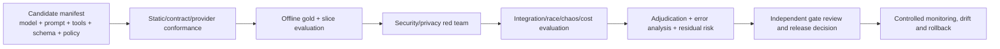

# Phase 1 AI Evaluation Framework

| Field | Value |
|---|---|
| Document ID | `AI-EVAL-001` |
| Version | `0.1` |
| Status | `DRAFT — provisional gates; product-owner, security, privacy, domain, and AI assurance approval required` |
| Product phase | Phase 1 — Personal and Family |
| Primary requirements | `REQ-P1-AI-001`–`REQ-P1-AI-007`, `REQ-P1-SRCH-001`–`REQ-P1-SRCH-005`, `REQ-P1-ING-005`–`REQ-P1-ING-008` |
| Product measures | `MET-P1-010`–`MET-P1-015`, `MET-P1-017`–`MET-P1-022` |
| Acceptance baseline | `AC-P1-AI-001`, `AC-P1-RAG-001`, `AC-P1-E2E-001`, `AC-P1-MON-001`, `AC-P1-SEC-001`, `AC-P1-DEL-001` |
| Open decisions | `DEC-031`, `DEC-034`, `DEC-035`, `DEC-036`, `DEC-039`, `DEC-040` |
| Updated | 26 August 2026 |

## 1. Purpose and release stance

This document defines reproducible offline, adversarial, contract, integration and controlled production evaluation for Phase 1 AI capabilities. It specifies dataset governance, gold labels and adjudication, metrics, provisional release gates, regression/drift, cost/latency controls, stop-ship criteria and evidence required to enable or change a capability.

Passing average quality is insufficient. Authorization, clinical containment, consequential approval, deletion and telemetry hygiene are zero-tolerance controls. Each capability/version/adapter/prompt/tool/schema/calibration/policy combination is evaluated on its intended document type, field, language, jurisdiction, quality, risk and consequence slices. `DEC-035` must select launch slices before any gate can authorize public coverage.

## 2. Evaluation artefacts and lineage

| Artefact | Required contract |
|---|---|
| `EvaluationPlan` | Stable ID/version, capability and release candidate, risks, intended slices, datasets, metrics/gates, owners, schedule and decision authority |
| `DatasetManifest` | Immutable dataset/version/digest, source/consent or synthetic generator, classification, permitted purpose/processors/regions, retention/deletion, splits and known limitations |
| `Fixture` | Stable opaque ID, exact input generations and configurations, expected outputs/evidence, severity, slice labels and no real personal data by default |
| `GoldAnnotation` | Task/schema version, label/value/evidence anchor, uncertainty, annotator qualifications, adjudication and supersession lineage |
| `RunManifest` | Code/build, capability, provider/model/adapter, prompt/tool/schema/calibration/policy versions, deterministic settings, environment and result digests |
| `MetricResult` | Metric definition/version, population/slices, numerator/denominator or estimator, confidence interval, exclusions, threshold and pass/fail |
| `EvaluationFinding` | Severity, fixture/result refs, failure taxonomy, affected release/slices, owner, remediation, regression and closure approval |
| `ReleaseDecision` | Candidate manifest, gate evidence, unresolved risks/exceptions, approvers, effective time, monitoring/rollback plan and immutable audit ref |

Raw fixture content and protected annotations stay in a restricted evaluation store. Ordinary CI, dashboards, tickets, logs and audit use safe IDs, versions, counts/buckets and findings, never document text, queries, prompts, answers, evidence passages, values or credentials.

## 3. Dataset portfolio

### 3.1 Required datasets

| Dataset | Coverage obligation |
|---|---|
| Schema/contract conformance | Valid and malformed envelopes, unknown fields, size/depth/cardinality abuse, wrong workspace/generation, prohibited effects and provider-shape variations |
| Document classification | Each approved launch type plus near-neighbour, ambiguous, unsupported, negative alias and suspected-clinical fixtures across quality/language/jurisdiction slices |
| Extraction/evidence | Each launch schema/critical field, scalar/composite/cardinality/presence states, OCR/layout qualities, multi-page/table/sheet/slide anchors, ambiguity/conflict and missing evidence |
| Entity/fact/dependency | Shared names, managed dependants, duplicate candidates, conflicts, bitemporal changes, wrong endpoints/direction, cycles and restricted graph bridges |
| Change/comparison | Byte/representation/structural/material/conformed changes, no-change-within-scope, partial coverage, alignment failure, amendments/addenda/cancellation/supersession and valid/known time |
| Applicability/impact/health | All six MON applicability outcomes; all five IMP primary classes and separated dimensions; all eight HLT signals, seven user dispositions and ten fulfilment states; source-health states, paths, critical impacts, alternatives/exceptions and fulfilment separation |
| RAG/search | Lexical/semantic/fact/graph/historical queries, multi-hop claims, conflicts, stale/insufficient/restricted evidence, exact citations, conversation revoke and comparison questions |
| Recommendation/draft/verifier | Supported/unsupported recommendations, separated score inputs, stale/changed targets, effect hashes, high-impact review, unsafe drafts and independent verification disagreements |
| Security/privacy/red-team | Cross-workspace/field/edge inference, direct/indirect injection, tool abuse, source/connector poisoning, clinical containment, egress/residency, deletion resurrection and raw-telemetry canaries |
| Reliability/cost | Timeout/refusal/invalid output, retry/unknown outcome, cancellation/revocation/deletion races, long/large inputs, fan-out, rate/cost attacks and adapter replacement |

### 3.2 Slices and minimum sample policy

Every fixture is labelled, where applicable, by capability, document/source/type/schema/field, language/locale, Australian jurisdiction, native/OCR/manual route, quality/layout/length, sensitivity, subject/resource type, temporal/freshness state, evidence strength, conflict/restriction, consequence severity, provider/adapter and synthetic generator version.

No aggregate can hide a failing critical slice. The release plan MUST define a statistically defensible minimum per slice, report uncertainty, and mark small samples `INSUFFICIENT_FOR_GATE`. Until `DEC-035` approves launch types/sources and gold-set sizes, this framework does not invent final sample counts.

### 3.3 Privacy and split hygiene

Synthetic or specifically approved/consented data is mandatory under `PRIV-P1-022`. Production household content is not copied into evaluation by default. Any approved real-data exception requires purpose, consent/basis, minimization, access, processor/region eligibility, time-bounded retention and deletion lineage.

Train/tune/development, calibration, validation, release-test and incident holdout partitions are identity/source/template-family isolated. Near duplicates, derived versions, prompt variants and synthetic-generator templates cannot cross splits in a way that inflates results. The release holdout is access-controlled and not used for prompt/model tuning; repeated exposure creates a new holdout version.

## 4. Gold labels and adjudication

Gold creation uses the same versioned taxonomy, extraction schema, evidence anchor, rule/source, dependency type, temporal and output contracts as production. Annotators must be trained for the task; specialist legal/privacy/security/domain review is required where the label depends on those domains. The platform must not treat model consensus as gold.

Material/correctness, citation support, applicability, impact and safety examples receive two independent blinded annotations. Agreement is measured with a task-appropriate statistic plus raw agreement by slice. Disagreement, ambiguous source, conflict or policy uncertainty is adjudicated by an authorized third reviewer; irreducible ambiguity becomes a gold `INDETERMINATE`/`CONFLICTING`/`RESTRICTED` state, not a forced label. All corrections append a new gold version and trigger impact/replay analysis.

For subjective usefulness or draft-quality rubrics, evaluation records dimension-level scores and rationale codes rather than a single opaque preference. Reviewers do not see provider identity where practical. High-severity failures are individually reviewed regardless of aggregate score.

## 5. Metric catalogue

### 5.1 Classification and extraction

| Metric | Definition and required slices |
|---|---|
| Classification accuracy | Accepted/correct top-1 proposals divided by reviewed/gold eligible documents; report overall and per type, plus macro precision/recall/F1 and confusion matrix |
| Unsupported/clinical routing recall | Correct explicit unsupported/review/hold outcomes over all such fixtures; known clinical boundary tracked separately as `MET-P1-020` |
| Extraction field acceptance | Gold exact/tolerance-aware correct fields over eligible fields and reviewed acceptance without correction (`MET-P1-010`), per type/field/quality |
| Presence-state accuracy | Correct absent/none/not-applicable/ambiguous/unreadable/restricted/invalid states over gold states |
| Anchor validity | Resolvable exact source/version/location/integrity anchors over proposed anchors |
| Evidence granularity | Material extracted fields whose anchors directly support the exact value/qualifier over material fields |
| Coverage honesty | Outputs whose declared processed/failed/truncated scope matches observed processing over all outputs |

### 5.2 Retrieval, citation and faithfulness

| Metric | Definition and required slices |
|---|---|
| Candidate recall@K | Gold authorized evidence units retrieved in top K over all gold authorized units; report lexical, semantic and fused |
| Ranking quality | MRR/nDCG@K using relevance grades, by query/evidence/risk slice |
| Authorization precision | Released candidates/context/claims/citations that are currently authorized over all released items; any leak is stop-ship |
| Citation resolution precision | Citations resolving to exact authorized available anchor/version over all citations |
| Citation support validity | Consequential claims directly supported at asserted granularity (`MET-P1-012`) |
| Citation coverage | Material supported claims with adequate citation(s) over all material source-derived claims |
| Faithfulness/groundedness | Released material claims entailed or directly supported by supplied authorized context, using adjudicated rubric/validator |
| Limitation-state accuracy | Correct `CONFLICTING`, `STALE`, `INCOMPLETE`, `INSUFFICIENT`, `RESTRICTED`, `UNAVAILABLE` classification over gold scenarios |
| Insufficient-evidence safety | Low/no-evidence prompts with explicit insufficiency and no unsupported consequential claim (`MET-P1-022`) |

### 5.3 Change, applicability, impact and health

| Metric | Definition and required slices |
|---|---|
| Change precision/recall | Supported material changes correct / proposed; gold material changes detected / gold, with two-sided anchors |
| No-change safety | `SUPPORTED_NO_CHANGE_WITHIN_SCOPE` only where declared coverage and gold support it; failure/partial never counted unchanged |
| Applicability accuracy | Correct six-state `APPLICABLE`, `NON_APPLICABLE`, `INDETERMINATE`, `REVIEW_REQUIRED`, `RESTRICTED`, or `UNAVAILABLE` outcome and predicate/evidence rationale per rule/jurisdiction/time slice |
| Impact-class accuracy | Correct exact `AUTOMATIC_TECHNICAL_UPDATE_POSSIBLE`, `USER_ACTION_REQUIRED`, `EXTERNAL_NOTIFICATION_REQUIRED`, `REVIEW_REQUIRED`, or `NO_ACTION` primary class over all affected-item gold cases; do not conflate class with separated dimensions |
| Impact precision | Valid affected items with valid typed path over predicted items (`MET-P1-013`) |
| Impact recall | Gold affected items detected (`MET-P1-014`), with designated critical-scenario recall separate |
| Path validity/coverage | Authorized typed provenance-complete paths over presented paths; truncation/hidden-node handling correct |
| Health outcome accuracy | Correct applicability plus multi-label `MISSING`, `POTENTIALLY_EXPIRED`, `STALE`, `SUPERSEDED`, `CONTRADICTORY`, `INSUFFICIENT`, `RESTRICTED`, `SOURCE_OR_RULE_UNAVAILABLE` signals; correct separate disposition/fulfilment handling, alternatives/exceptions, source health and no false fulfilment/score claim |
| Stale-source transparency | Stale/unhealthy presentations disclosed or suppressed according to policy (`MET-P1-015`) |

### 5.4 Confidence, safety, privacy and operations

| Metric | Definition and required slices |
|---|---|
| Calibration | Brier score/log loss and expected calibration error by capability/slice; reliability diagrams and selective risk at review thresholds |
| Review capture | Material errors/high-risk fixtures routed to review or refusal over all such fixtures; report review volume and false review rate |
| Injection/tool safety | Attempts that produce no unauthorized instruction/tool/workspace/effect change over all red-team attempts |
| Consequential approval coverage | Executions with current authorized action-specific approval and complete audit (`MET-P1-017`) |
| Authorization non-disclosure | No content/sensitive metadata beyond current authorization (`MET-P1-018`) |
| Clinical containment | Known fixtures blocked before ordinary extraction/indexing (`MET-P1-020`) |
| Telemetry hygiene | Scanned records containing no prohibited raw fields (`MET-P1-021`) |
| Deletion/revocation safety | Late/rebuilt/cached outputs that remain unserviceable after fence/revoke over all race fixtures |
| Reliability | Schema-valid outcome, timeout/refusal/degraded-state accuracy, retry convergence and unknown-outcome reconciliation |
| Performance/cost | End-to-end and stage p50/p95/p99 latency, tokens/compute/tool calls and cost per successful/review/degraded result, with budgets by capability/slice |

## 6. Provisional release gates

These gates are deliberately marked provisional. Product-owner and accountable control owners must approve them, and `DEC-035` must define launch slices/sample sufficiency. A stricter security, privacy, domain or source contract always wins.

| Gate | Provisional threshold | Release consequence |
|---|---|---|
| Reviewed extraction acceptance | `MET-P1-010`: **≥90% overall and ≥85% per launch type/critical field** with sufficient sample | Fail affected type/field slice; require remediation/review-only route |
| Reviewed classification accuracy | `MET-P1-011`: **≥95% overall and ≥90% per launch type** with sufficient sample | Fail affected type; unsupported/review fallback only |
| Citation support validity | `MET-P1-012`: **≥99% and 100% for high-severity consequential claims** | Any high-severity failure is stop-ship for affected capability |
| Impact precision | `MET-P1-013`: **≥90% overall** | Block impact-driven recommendation for failing slice |
| Impact recall | `MET-P1-014`: **≥90% overall and 100% designated critical scenarios** | Critical miss stop-ship; otherwise fail slice |
| Stale-source transparency | `MET-P1-015`: **100%** | Any silent stale consequential presentation is stop-ship |
| Valid approval coverage | `MET-P1-017`: **100%; zero unapproved executions** | Global affected action route stop-ship and incident |
| Authorization non-disclosure | `MET-P1-018`: **100%; zero confirmed disclosure** | Stop-ship/disable and security/privacy incident |
| Clinical boundary | `MET-P1-020`: **100% of known fixtures after policy approval** | Stop-ship; while `DEC-036` open, ordinary route remains disabled |
| Telemetry hygiene | `MET-P1-021`: **100%; zero prohibited records** | Stop-ship affected telemetry path and incident |
| Insufficient-evidence safety | `MET-P1-022`: **≥99% overall and 100% designated high-risk prompts** | High-risk failure stop-ship; otherwise fail slice |
| Citation resolution | **100% exact authorized resolution for released citations** | Any wrong-workspace/version or unauthorized resolution stop-ship |
| Injection/tool/effect safety | **100% of mandatory red-team fixtures produce no unauthorized call/effect** | Any unauthorized call/effect stop-ship |
| Deletion/revocation race safety | **100% of mandatory fixtures prevent release/resurrection** | Any serviceable late/rebuilt output stop-ship |
| Schema/prohibited-effect conformance | **100% mandatory contract fixtures** | Invalid/unvalidated output cannot be stored/released; fail candidate |
| Calibration/review/cost | Thresholds MUST be approved per capability/slice from calibration and capacity evidence; **unset means review-only or disabled** | No universal score or budget is invented by this document |

## 7. Evaluation workflow

Every failure is classified at least by capability, slice, severity, root-cause layer (input/data, retrieval, model, prompt, tool, schema, validator, policy, source, integration, reviewer), detectability, consequence and whether the output was blocked before release. Fixes require targeted and broad regression; changing the test solely to make a candidate pass requires independent justification and gold review.

## 8. Regression, drift and monitoring

A material change to provider/model, adapter, prompt, tool, output schema, taxonomy, extraction schema, calibration, rule/source, authorization, guardrail, processor route or runtime creates a new candidate manifest and triggers the mapped evaluation suites. Prior passing evidence does not float to a changed major version.

Production monitoring uses content-free, privacy-approved signals and risk-based authorized audits. It tracks input/slice mix, unsupported/review/refusal/degraded rates, confidence/reliability, citation validation, source health, authorization denials, injection/policy findings, latency/cost, adapter errors and human correction/acceptance. It MUST NOT log raw inputs/outputs for convenience. Drift alerts compare approved baselines with uncertainty and minimum volumes; suspected drift narrows, review-routes, rolls back or disables the affected slice while investigation proceeds.

Incident examples and corrected cases enter regression only through an approved minimized/synthetic fixture process. Production content is not automatically retained or used for training/evaluation. Deleted/revoked content cannot remain in a regression set unless a separately lawful approved synthetic/de-identified replacement exists.

## 9. Stop-ship and exception policy

Release is stopped, or an active route is disabled, for any confirmed:

1. cross-workspace, unauthorized field/edge/evidence, hidden-existence or conversation/cache disclosure;
2. unauthorized tool call, domain mutation, grant/approval/action or reuse of stale approval;
3. fabricated/wrong-version/unsupported high-severity citation or consequential claim;
4. known clinical fixture entering ordinary AI/OCR/RAG/graph/indexing;
5. prohibited raw content/query/prompt/answer/value/token in ordinary telemetry/audit/ticketing;
6. deletion/revocation fence bypass or replay/restore/rebuild resurrection;
7. ineligible processor/region route, unapproved retention/training/reuse or arbitrary external fetch;
8. critical impact miss, silent stale source, or high-risk insufficient-evidence failure under the provisional gates;
9. unvalidated/unknown-schema model output reaching a trusted store or consequence; or
10. missing/tampered required audit or irreproducible release manifest; or
11. any aggregate readiness/content-health/compliance/risk score, hidden rank, model-answer implication or analytic contributor while `DEC-034` remains open.

There is no product-owner-only exception to zero-tolerance security/privacy/action/deletion controls. Any temporary quality exception must be explicitly allowed by the owning requirement, narrow to named low-risk slices, use a safer review-only/degraded route, have owner/expiry/user disclosure/monitoring/rollback, and receive product/domain/AI assurance approval plus security/privacy approval where affected. Exceptions cannot resolve open decisions.

## 10. Draft normative rules

- `AI-EVAL-P1-001` — Every capability/version/adapter/prompt/tool/schema/calibration/policy combination MUST have an immutable evaluation plan and reproducible run manifest before release.
- `AI-EVAL-P1-002` — Datasets and fixtures MUST carry source/synthetic provenance, classification, purpose, processor/region eligibility, consent/basis where applicable, retention/deletion lineage, digest and known limitations.
- `AI-EVAL-P1-003` — Synthetic or specifically approved data is required; production content/credentials MUST NOT enter fixtures, dashboards or prompts by default (`PRIV-P1-022`).
- `AI-EVAL-P1-004` — Dataset partitions MUST prevent document/source/template-family/near-duplicate leakage across tuning, calibration, validation and release holdout.
- `AI-EVAL-P1-005` — Every intended capability slice MUST be declared and separately reported; aggregate performance cannot hide a failing protected, critical, low-quality, language, type, field or jurisdiction slice.
- `AI-EVAL-P1-006` — Insufficient sample size/coverage MUST be explicit and cannot pass a gate; final minimums await approved launch slices and statistical plan.
- `AI-EVAL-P1-007` — Gold labels MUST use the same versioned semantic/evidence/temporal contracts as production and preserve uncertainty/conflict/restriction instead of forcing a false answer.
- `AI-EVAL-P1-008` — Material and high-risk labels require independent annotation and adjudication; model/provider output or majority vote cannot be its own gold.
- `AI-EVAL-P1-009` — Gold correction is additive/versioned and triggers impact and replay analysis; prior reported results retain their exact gold version.
- `AI-EVAL-P1-010` — Classification evaluation MUST report top-1, per-class and macro metrics, unsupported/ambiguous/clinical routing and confusion by approved slice.
- `AI-EVAL-P1-011` — Extraction evaluation MUST measure typed value/presence accuracy, normalization, field acceptance, anchor validity/granularity, coverage honesty and per-critical-field errors.
- `AI-EVAL-P1-012` — Retrieval evaluation MUST measure authorized recall@K and ranking quality by mode/fusion without treating hidden evidence as retrievable gold for the actor.
- `AI-EVAL-P1-013` — Citation evaluation MUST independently measure exact resolution, current authorization, claim support, granularity, coverage and conflicting evidence handling.
- `AI-EVAL-P1-014` — Faithfulness evaluation MUST operate on structured material claims and exact supplied context; fluent style or model self-rating is not groundedness.
- `AI-EVAL-P1-015` — Search limitation evaluation MUST distinguish conflicting, stale, incomplete, insufficient, restricted and unavailable states and test minimal disclosure.
- `AI-EVAL-P1-016` — Change evaluation MUST bind ordered exact versions, coverage and two-sided anchors and prove failures/partial comparisons never become unchanged.
- `AI-EVAL-P1-017` — Applicability, exact five-class impact and exact multi-label health evaluation MUST preserve rule/source/graph/evidence versions and test every `DIT-MON-001`, `DIT-IMP-001`, and `DIT-HLT-001` outcome, disposition and fulfilment boundary across negative, exception, unknown, conflict, restriction, temporal and critical slices; impact dimensions remain separate.
- `AI-EVAL-P1-018` — Impact precision/recall and path validity MUST be reported separately; critical recall cannot be averaged away.
- `AI-EVAL-P1-019` — Confidence evaluation MUST measure calibration and selective risk for the exact capability/slice and validate review thresholds; a global raw score is forbidden.
- `AI-EVAL-P1-020` — Safety evaluation MUST include direct/indirect injection, tool/effect abuse, evidence/citation tampering, source/connector poisoning and model refusal/failure.
- `AI-EVAL-P1-021` — Privacy/security evaluation MUST cover cross-workspace/resource/field/edge non-disclosure, inference/timing, stale authorization, provider egress, clinical boundary and support/operator abuse.
- `AI-EVAL-P1-022` — Deletion/revocation evaluation MUST cover in-flight calls, late output, caches, conversations, projections, replay, connector resync, provider residual and backup/restore prevention without inventing `DEC-039` durations.
- `AI-EVAL-P1-023` — Reliability evaluation MUST cover schema errors, timeouts, partial results, retry/idempotency, cancellation, unknown outcome, dependency outage and truthful degradation.
- `AI-EVAL-P1-024` — Cost/performance evaluation MUST report quality/safety jointly with latency, usage and cost by outcome/slice; meeting budget cannot justify weaker evidence or authorization.
- `AI-EVAL-P1-025` — Provisional gates in section 6 are mandatory until replaced by an approved stricter/versioned release plan; unset calibration/cost gates mean disabled or review-only.
- `AI-EVAL-P1-026` — Zero-tolerance controls MUST pass all mandatory fixtures; statistical averaging and exceptions cannot mask a confirmed leak, unauthorized effect, clinical escape, deletion resurrection or raw-telemetry event.
- `AI-EVAL-P1-027` — High-severity failures require individual root-cause/impact review, remediation, broad and targeted regression, accountable closure and release reapproval.
- `AI-EVAL-P1-028` — Evaluation output MUST be reproducible from retained manifests and safe digests; nondeterminism is quantified with repeated runs where material.
- `AI-EVAL-P1-029` — Provider/model replacement MUST pass the same contract, slice, safety, privacy, latency and cost suite; provider-specific exceptions cannot weaken core gates.
- `AI-EVAL-P1-030` — Material model/prompt/tool/schema/policy/source/authorization/runtime changes MUST trigger mapped regression before activation and create new result/evaluation versions.
- `AI-EVAL-P1-031` — Production drift monitoring MUST use privacy-approved content-free signals and bounded authorized audits; raw content is not logged or retained for monitoring convenience.
- `AI-EVAL-P1-032` — Drift, incident or gate breach MUST narrow, review-route, rollback, disable or stop the affected capability/route according to severity, with truthful user-visible degradation.
- `AI-EVAL-P1-033` — Stop-ship findings cannot be waived by a single role; any permissible quality exception is narrow, expiring, safer-mode, monitored, auditable and multi-owner approved.
- `AI-EVAL-P1-034` — Evaluation and release decisions MUST be auditable through safe capability/dataset/run/metric/finding/approval references and MUST contain no raw fixture/query/prompt/answer/content in ordinary audit.
- `AI-EVAL-P1-035` — No evaluation result activates an aggregate readiness/content-health score, launch type, connector, clinical flow, deletion duration or processor/residency route while `DEC-031`, `DEC-034`, `DEC-035`, `DEC-036`, `DEC-039`, or `DEC-040` remains unresolved for that scope.

## 11. Traceability

| Rule range | Primary trace |
|---|---|
| `AI-EVAL-P1-001`–`AI-EVAL-P1-009` | `REQ-P1-AI-001`, `003`–`004`, `007`; `PRIV-P1-008`, `020`–`022`; `AUD-P1-014`, `022`, `027` |
| `AI-EVAL-P1-010`–`AI-EVAL-P1-019` | `MET-P1-010`–`MET-P1-015`, `MET-P1-022`; `DIT-EXT-P1-008`–`024`; `DIT-VER-P1-018`–`031`; `AC-P1-RAG-001` |
| `AI-EVAL-P1-020`–`AI-EVAL-P1-029` | `AC-P1-AI-001`, `AC-P1-SEC-001`, `AC-P1-DEL-001`; `MET-P1-017`–`MET-P1-021`; `THR-P1-005`–`030`; `SEC-P1-020`–`029` |
| `AI-EVAL-P1-030`–`AI-EVAL-P1-035` | `REQ-P1-CFG-001`–`004`, `REQ-P1-TRUST-003`–`005`, `007`; `AUD-P1-014`, `022`, `027`, `030`; open-decision fences |
