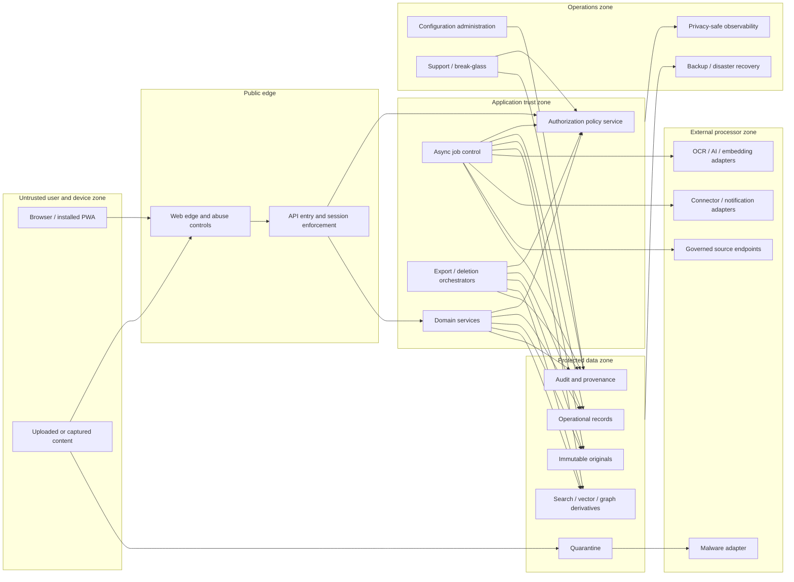

# Phase 1 Security Architecture

| Field | Value |
|---|---|
| Document ID | `SEC-ARCH-001` |
| Version | `0.1` |
| Status | `DRAFT — product-owner and security approval required` |
| Product phase | Phase 1 — Personal and Family |
| Jurisdiction | Australia first; jurisdiction-neutral core |
| Updated | 26 August 2026 |
| Companion contracts | `ARCH-SOL-001`, `ARCH-DOM-001`, `SEC-AUTH-001`, `SEC-PRIV-001`, `SEC-AUD-001`, `SEC-THR-001` |

## 1. Authority and scope

This document defines provider-neutral security boundaries and minimum controls for the draft Phase 1 product. It refines `REQ-P1-TRUST-001`–`REQ-P1-TRUST-009` and the security invariants embedded throughout `PROD-PRD-001` and `PROD-UC-001`. It does not approve the draft PRD, select a provider, close an open decision, or open the implementation gate.

It is reconciled with `ARCH-SOL-001` rules `ARCH-P1-001`–`ARCH-P1-045` and `ARCH-DOM-001` rules `DOM-P1-001`–`DOM-P1-057`. Architecture/domain documents own logical component and aggregate boundaries; this pack owns their security, authorization, privacy, audit, and threat-control detail. No unresolved conflict was found at version `0.1`.

The security architecture covers the responsive web/PWA, APIs, asynchronous workers, immutable artifact storage, operational records, search/vector/graph derivatives, AI/OCR/malware/notification adapters, trusted-source and user connectors, exports, backups, observability, support, and administration. Phase 2 enterprise controls remain reserved; their absence must not weaken Phase 1 isolation.

Normative priorities are:

1. `DEC-003`, `DEC-006`, `DEC-008`, and `DEC-022`: workspace/resource isolation, evidence-bound approval, current authorization, and multi-tenant separation.
2. `DEC-005`: immutable originals and controlled lifecycle.
3. `DEC-007`, `DEC-009`, and `DEC-020`: governed configuration, vendor-neutral controls, and an Australia-first jurisdiction pack.
4. Explicit fences for `DEC-032`, `DEC-036`, `DEC-038`, `DEC-039`, and `DEC-040` in section 10.

## 2. Security objectives

| Objective | Required outcome | Primary traceability |
|---|---|---|
| Confidentiality | No content, sensitive metadata, existence, relationship, or derivative is disclosed outside current authorization. | `REQ-P1-WS-004`, `REQ-P1-TRUST-002`, `AC-P1-SEC-001`, `UC-P1-013` |
| Integrity | Originals, evidence, facts, rules, approvals, actions, configuration, and audit history cannot be silently altered or substituted. | `REQ-P1-DOC-001`, `REQ-P1-FCT-003`, `REQ-P1-ACT-006`, `MET-P1-019` |
| Availability with honesty | Security dependencies fail closed or visibly degrade; unavailable controls never become bypasses. | `REQ-P1-AI-006`, `REQ-P1-MON-005`, `OUT-P1-007` |
| Tenant isolation | Identity, storage, query, job, cache, export, backup, support, and operations paths carry validated workspace scope. | `DEC-022`, `REQ-P1-TRUST-001`–`002` |
| Least privilege | Humans, services, adapters, and operators receive only the scoped capability, data, purpose, and duration needed. | `REQ-P1-WS-005`, `REQ-P1-AI-002`, `REQ-P1-SHR-001` |
| Evidence and non-repudiation | Consequential state can be reconstructed from privacy-safe, tamper-evident records. | `REQ-P1-TRUST-004`, `REQ-P1-ACT-005`–`008` |
| Privacy and residency | Processing, retention, export, deletion, backup, and location match declared policy and consent. | `REQ-P1-TRUST-005`–`009`, `UC-P1-011`, `UC-P1-012` |

## 3. Security domains and trust boundaries

Every arrow crossing a subgraph boundary is authenticated, authorized, encrypted, schema-validated, rate-limited as appropriate, correlated, and auditable. No external processor is implicitly trusted merely because it is managed or contractually approved.

### 3.1 Boundary catalogue

| Boundary | Key risks | Mandatory control owner |
|---|---|---|
| Device → edge | Credential theft, CSRF, XSS, upload abuse, device persistence, traffic interception | Web/API security contract |
| Edge → application | Tenant spoofing, confused deputy, malformed payload, replay | Identity/session and API contracts |
| Service/worker → data | Cross-workspace query, over-broad service identity, stale policy, derivative leakage | Authorization and data-access contracts |
| Intake/quarantine → processors | Malware, parser exploit, clinical content, prompt injection | Ingestion and adapter security contracts |
| Application → external processor | Data exfiltration, cross-border processing, retention/training, credential theft | Privacy/residency and adapter contracts |
| Application → derived stores | Stale grants, deletion resurrection, embedding/graph inference | Authorization freshness and lineage contracts |
| Operations/support → production | Insider abuse, standing access, untracked mutation | Privileged-access and audit contracts |
| Primary data → backup/DR | Residency breach, undeleted copies, insecure restore | Backup, deletion, and residency contracts |

### 3.2 Architecture and domain alignment

| Security diagram grouping | `ARCH-SOL-001` trust zone / exact logical components | Principal aggregates/data roles protected |
|---|---|---|
| Untrusted user/device | `Z0`; Responsive web/PWA client | No aggregate authority; resumable transfer state only |
| Public edge | `Z1`; Edge and application API; Identity and session boundary | Identity reference/session assurance, never workspace truth |
| Application trust zone | `Z2`; Workspace/subject/membership, Authorization, Sharing/grant, Document lifecycle, Fact/entity, Recommendation/approval/action, Task/notification, Configuration publication | `Workspace`, `AccessGrant`, `LogicalDocument`, `CanonicalFact`, `Recommendation`, `Approval`, `ActionExecution`, `Task`, `ConfigurationPackage` |
| Isolated intake | `Z3`; Ingestion orchestration; Quarantine and content-policy boundary | `ArtifactRecord`, `IngestionCase` |
| Restricted processing/intelligence | `Z4`; Evidence/interpretation, AI capability gateway, Source registry/monitoring, Dependency/impact | `DocumentAnalysis`, `SourceObservation`, `SourceHealth`, `RuleResolution`, `DependencyRecord`, `ImpactAssessment` |
| Derived retrieval | `Z5`; Search/comparison/answer plus full-text/vector/graph/cache projections | Rebuildable projections under `ARCH-P1-027`–`ARCH-P1-030`; never independent aggregates |
| External processors | `Z6`; provider-neutral malware/document/AI/source/connector/channel ports | `Integration/consent` references and `ActionExecution`; no provider-owned platform truth |
| Operations | `Z7`; Audit, Observability, Export/deletion coordinator, Durable workflow/event runtime, support/configuration operations | Audit stream, `ExportCase`, `DeletionCase`, deletion fence/tombstone, event/outbox roles |

The Australian residency realm overlays `Z0`–`Z7` as defined by `ARCH-P1-014`; it is not a single store or region. Workspace records follow `DOM-P1-002`; only explicitly global non-household reference/configuration records may use reference/platform scope under `DOM-P1-006`.

## 4. Security control catalogue

IDs are stable. Each rule requires an owning implementation contract, automated evidence, and an explicit exception process.

| Rule ID | Draft normative rule | Primary traceability | Minimum verification hook |
|---|---|---|---|
| `SEC-P1-001` | Every household request and job MUST carry a validated actor/service identity, workspace context, purpose/capability, correlation ID, and policy version or freshness proof. Explicit global reference/configuration operations carry a validated platform/reference scope and MUST contain no household identifier or personalized content. | `ARCH-P1-003`, `DOM-P1-002`, `DOM-P1-006`, `REQ-P1-TRUST-002` | Reject missing, forged, mismatched, replayed, and household-data-in-global-scope context. |
| `SEC-P1-002` | Cross-workspace access MUST be denied before content retrieval; data-access APIs MUST require workspace predicates/partitions that cannot be supplied only by untrusted clients. | `DEC-022`, `AC-P1-SEC-001` | Two-workspace isolation suite across every store. |
| `SEC-P1-003` | Human and service authentication MUST use modern, phishing-resistant mechanisms where supported, rate limits, credential-stuffing defenses, and step-up authentication for high-impact operations. | `REQ-P1-TRUST-001`, `UC-P1-011`, `UC-P1-012` | Login, step-up, brute-force, replay, and downgrade tests. |
| `SEC-P1-004` | Sessions MUST be short-lived or continuously bounded, securely transported/stored, rotated after privilege changes, revocable by user/security events, and bound to current authorization. | `REQ-P1-TRUST-001`–`002`, `UC-P1-009` | Theft, fixation, expiry, logout, revocation-race tests. |
| `SEC-P1-005` | MFA enrolment, use, reset, and recovery MUST NOT provide a weaker ownership or private-resource path; final recovery design is blocked by `DEC-038`. | `REQ-P1-TRUST-008`, `JRN-P1-010` | No fallback bypass while decision is open. |
| `SEC-P1-006` | Authorization MUST follow `SEC-AUTH-001`, including resource/field/edge/retrieval/inference/action/export/audit checks and deny precedence. | `REQ-P1-TRUST-002`, `MET-P1-018` | Policy conformance and negative matrices. |
| `SEC-P1-007` | Service identities MUST be workload-specific, non-human, least-privileged, short-lived where feasible, non-exportable, and unable to become a user through payload claims. | `REQ-P1-AI-002`, `UC-P1-013` | Confused-deputy and credential-scope tests. |
| `SEC-P1-008` | Data in transit MUST use authenticated encryption; internal transport MUST not rely on network location alone for trust. | `REQ-P1-TRUST-001` | Protocol/configuration and downgrade tests. |
| `SEC-P1-009` | Originals, records, indexes, caches, exports, backups, audit, and secrets MUST be encrypted at rest under separable key domains and lifecycle policies. | `REQ-P1-TRUST-001`, `005`, `007` | Key-domain, restore, rotation, and access tests. |
| `SEC-P1-010` | Key administration MUST separate use, management, recovery, rotation, and destruction duties; key identifiers/versions MUST be auditable without logging key material. | `REQ-P1-TRUST-001`, `004` | Rotation/disable/recovery evidence and dual-control tests. |
| `SEC-P1-011` | Secrets MUST use an approved secret store, scoped identities, rotation, revocation, scanning, and zero ordinary-log exposure; source control and static configuration MUST contain no production secret. | `REQ-P1-TRUST-003` | Secret scanning and canary credential revocation drills. |
| `SEC-P1-012` | Accepted originals MUST be immutable and integrity-checked from acquisition hash through retrieval, reprocessing, export, backup, and restore. | `REQ-P1-DOC-001`, `MET-P1-019`, `UC-P1-003` | Mutation attempt and scheduled integrity verification. |
| `SEC-P1-013` | Uploads MUST remain non-public and non-processable until server-side validation and malware policy complete; scanner timeout/unavailability MUST remain contained. | `REQ-P1-ING-002`–`004`, `AC-P1-ING-001` | Malicious, polyglot, timeout, bypass, and race fixtures. |
| `SEC-P1-014` | Quarantined content MUST be isolated from preview, download, parsers, AI, indexes, graph, notifications, and ordinary support; release/delete requires distinct authority and audit. | `REQ-P1-ING-003`, `UC-P1-002` | Route-by-route quarantine denial tests. |
| `SEC-P1-015` | Artifact and export access MUST use short-lived, audience/actor/request/workspace/version-scoped grants, reauthorized on redemption, never permanent public URLs. | `REQ-P1-DOC-004`, `REQ-P1-SHR-002`, `REQ-P1-TRUST-006` | Expired, revoked, guessed, wrong-workspace/version tests. |
| `SEC-P1-016` | Browser/PWA controls MUST constrain XSS, CSRF, clickjacking, injection, unsafe MIME rendering, service-worker scope, local persistence, clipboard/download leakage, and device loss. | `DEC-021`, `REQ-P1-DOC-004`, `AC-P1-A11Y-001` | Browser security headers, storage, offline, and malicious preview tests. |
| `SEC-P1-017` | Raw documents, evidence passages, queries, generated answers, sensitive values, filenames, tokens, and unrestricted URLs MUST NOT enter ordinary logs, traces, metrics, analytics, errors, screenshots, or fixtures. | `REQ-P1-TRUST-003`, `MET-P1-021` | Continuous schema allow-listing and content canary scanning. |
| `SEC-P1-018` | Audit/provenance MUST follow `SEC-AUD-001`; required audit failure MUST block or leave the consequential operation explicitly incomplete. | `REQ-P1-TRUST-004`, `MET-P1-017` | Audit outage and reconciliation tests. |
| `SEC-P1-019` | Search/vector/graph/caches/conversations MUST store lineage, workspace scope, source authorization attributes, deletion state, and freshness; current policy is rechecked before output. | `REQ-P1-GPH-002`, `REQ-P1-SRCH-003`, `UC-P1-013` | Revocation, stale-index, deletion, and cache tests. |
| `SEC-P1-020` | AI/OCR/reranking/embedding adapters MUST be capability-scoped, schema-bound, evidence-bound, injection-resistant, and prohibited from training/retaining/reusing content except under an approved explicit processing contract. | `REQ-P1-AI-001`–`007`, `AC-P1-AI-001` | Adapter conformance, injection, egress, retention, and schema tests. |
| `SEC-P1-021` | Model, document, source-page, metadata, and connector instructions MUST be treated as untrusted data and cannot alter policy, workspace, tool, citation, or action authority. | `REQ-P1-AI-002`, `005`, `AC-UC-P1-005-03` | Indirect/direct prompt-injection corpus. |
| `SEC-P1-022` | Connectors MUST use purpose-limited consent, least scopes, protected tokens, source/version identity, revocation, sync/deletion semantics, and provider-neutral conformance. | `REQ-P1-ING-009`, `REQ-P1-TRUST-009`, `GAP-007` | Token theft, disconnect, replay, permission drift, deletion tests. |
| `SEC-P1-023` | Governed-source retrieval MUST restrict destinations/protocols, resist SSRF and content poisoning, preserve snapshots, and separate retrieval/parser output from rule publication. | `REQ-P1-MON-003`–`006`, `AC-P1-MON-001` | SSRF, redirect, DNS, oversized content, parser tamper tests. |
| `SEC-P1-024` | Consequential and bulk actions MUST pass current authorization, policy, bound approval, input/effect hash, expiry, idempotency, rate/volume limits, and result reconciliation. | `REQ-P1-ACT-005`–`008`, `GAP-009`, `MET-P1-017` | Bypass, changed-input, partial success, replay tests. |
| `SEC-P1-025` | Support and operators MUST have no standing raw-content access; privileged configuration and exceptional access require separate identity, strong authentication, approval, bounded scope/time, user/incident purpose, and enhanced audit. | `REQ-P1-TRUST-001`–`004`, `UC-P1-013` | Insider, dormant grant, approval bypass, session recording tests. |
| `SEC-P1-026` | Emergency/break-glass access MUST NOT exist in Phase 1 until its policy, scope, notification, review, revocation, retention, and tests are explicitly approved; it is distinct from user continuity under `DEC-032`. | `JRN-P1-010`, `UC-P1-016` | Confirm no hidden universal support role. |
| `SEC-P1-027` | Export and deletion orchestrators MUST reauthorize at request, enumeration/execution, and delivery/verification; temporary outputs and late events cannot bypass revocation or purge. | `REQ-P1-TRUST-006`–`007`, `UC-P1-011`, `UC-P1-012` | Mid-job revocation and resurrection tests. |
| `SEC-P1-028` | The Australian residency option MUST be enforceable from a versioned data-class/processor/region matrix across primary, derived, telemetry, support, adapter, export, backup, and DR paths; final matrix awaits `DEC-040`. | `REQ-P1-TRUST-005`, `DEC-022` | Placement, egress, restore, failover, adapter denial tests. |
| `SEC-P1-029` | Dependency failure, abuse, and resource exhaustion MUST have quotas, bounded fan-out/depth/time/size, backpressure, circuit breaking, retry budgets, and truthful state without weakening security controls. | `REQ-P1-GPH-005`, `REQ-P1-AI-006`, `OUT-P1-007` | DoS, decompression bomb, queue flood, retry storm tests. |
| `SEC-P1-030` | Build and deployment MUST verify provenance, dependencies, signed/approved artifacts, configuration compatibility, vulnerability gates, rollback/forward repair, and separation of duties. | `DEC-009`, `CODEX.md` testing/DoD | SBOM/provenance, dependency, tamper, rollback drills. |

## 5. Identity, session, and device baseline

The identity provider remains deferred. Its adapter MUST support stable internal identity mapping, verified contact-factor state, strong/step-up authentication, MFA lifecycle, session inventory, token/session revocation, risk/security events, and tenant-safe error handling. External provider subject identifiers are evidence for authentication, not core resource identities.

| Operation | Minimum draft assurance | Additional rule |
|---|---|---|
| Ordinary authenticated read | Valid non-revoked session and current authorization | Sensitive views may require recent authentication by policy. |
| Grant creation/change | Recent strong authentication and delegation authority | Preview exact effective access; audit grant version. |
| Consequential approval/action | Current strong session plus action-specific authority and bound approval | Reauthorize immediately before execution. |
| Export | Step-up authentication plus explicit export authority | Reauthorize package release/redemption. |
| Purge/account/workspace deletion | Step-up authentication plus exact destructive authority and decision-dependent approval/cooling-off | `DEC-039` blocks final timing. |
| MFA/recovery change | Existing strong factor or the future `DEC-038` recovery ceremony | No email/support-only bypass is assumed. |

Session state MUST contain opaque identifiers, not authorization truth that remains valid after policy/grant changes. Device remembrance is a revocable convenience, not independent authority. The PWA MUST not persist raw document content, tokens, evidence, or generated answers offline unless a separately approved offline threat model and decision authorize it.

## 6. Encryption, keys, and secrets

The architecture remains implementation-neutral but MUST define these separations before deployment:

- transport keys/certificates;
- session/signing keys;
- primary record encryption;
- immutable artifact encryption;
- quarantine encryption;
- derived search/vector/graph/cache encryption;
- export-package encryption;
- audit integrity/encryption;
- backup/DR encryption; and
- connector/provider credentials.

Key identifiers, workspace/region policy, version, status, creation/rotation/disable/destruction time, and authorized usage MUST be recorded. Raw key material MUST not enter application data, source code, logs, exports, or ordinary backups. A provider-specific key hierarchy, customer-managed keys, or per-workspace key model requires an ADR and must satisfy deletion, recovery, performance, and residency contracts.

## 7. Content and artifact security

Upload processing uses an explicit untrusted-intake boundary. File extension and client MIME are hints only. Size, media, structure, active content, encryption/password state, archive recursion, decompression ratio, and parser eligibility are server-validated. Preview/rendering uses a sandboxed, least-privileged path and safe content disposition.

The clinical-record exclusion is a supported-content policy, not a reason to inspect or log more content. While `DEC-036` is open, suspected clinical content MUST remain outside ordinary extraction, embedding, graph, search, AI, monitoring, and analytics; the architecture cannot promise whether the original is rejected, quarantined for decision, or retained encrypted/unprocessed.

## 8. External processing and egress

Every external adapter contract MUST declare:

- processor/capability and approved purpose;
- exact data classes and fields transmitted;
- workspace/residency eligibility and region;
- transport, credential, isolation, retention, deletion, training/reuse, subcontractor, and incident terms;
- request/response schemas, content/size limits, idempotency, timeout, retry, and failure semantics;
- authorization and consent inputs;
- provenance returned, including model/parser/tool/version;
- egress allow-list and network restrictions; and
- conformance, privacy, deletion, and failover tests.

If the adapter cannot prove eligibility under current policy, processing is blocked or visibly routed to an approved alternative/manual path. Provider availability never authorizes cross-border or expanded-purpose processing.

## 9. Operations, support, and incident boundaries

Administrative control planes are separate from household product access. Configuration publishers, security operators, support users, source maintainers, and deployment services use separate roles and identities; no shared privileged accounts are permitted. Production access is time-bounded, attributable, reviewed, and minimized. Restricted security evidence is segregated from ordinary telemetry.

Security incidents require containment without destructive loss of provenance. Response actions—session/token revocation, connector disablement, key rotation, source disablement, adapter isolation, deployment rollback, or workspace protection—are auditable and reversible/forward-repairable where appropriate. User notification and regulatory reporting obligations require jurisdiction-specific review; this draft does not invent legal thresholds.

## 10. Open-decision fences

| Decision | Security fence while unresolved | Exit evidence required |
|---|---|---|
| `DEC-032` — emergency/incapacity/after-death release | No automated release or hidden continuity override. Ordinary scoped grants and curated exports remain separate. | Approved trigger evidence, delay, challenge, consent, notification, revocation, jurisdiction, false-trigger, audit, and abuse-case tests. |
| `DEC-036` — suspected clinical content | Prevent ordinary extraction/index/AI/graph/search/analytics; do not promise reject, retain, export, or deletion treatment beyond safe containment. | Approved handling state machine, false-positive review, retention/export/deletion copy, and safety fixtures. |
| `DEC-038` — recovery assurance | No support/email/family-role shortcut; no ownership or private-resource transfer through an unspecified recovery path. | Approved factor/identity evidence, delays/challenges, key implications, private-resource rules, support scope, abuse tests. |
| `DEC-039` — deletion timing/audit | Define coverage/states but no invented cooling-off, active purge, backup expiry, or audit-minimization duration. | Approved lifecycle values, retention exceptions, backup/restore enforcement, deletion proof, user copy, and recovery tests. |
| `DEC-040` — residency envelope | No adapter, support path, analytics stream, backup, or DR failover is assumed eligible for the Australian option. | Approved data-class/processor matrix, cross-border exception/consent rules, automated placement/egress/restore tests. |

## 11. Security verification gates

Before a slice can pass readiness or release review:

1. Every `SEC-P1-*`, `AUTH-P1-*`, `PRIV-P1-*`, and `AUD-P1-*` rule in scope has an owner, implementation mapping, automated test, and retained evidence.
2. `THR-P1-*` threats are mitigated or explicitly accepted by the named risk owner; no critical/high unknown or expired acceptance remains.
3. `AC-P1-SEC-001`, `AC-P1-AI-001`, `AC-P1-ING-001`, `AC-P1-DEL-001`, `AC-UC-P1-009-03`, `AC-UC-P1-011-02`, `AC-UC-P1-012-03`, and `AC-UC-P1-013-01`–`04` pass.
4. Negative tests cover cross-workspace IDs, field/edge side channels, stale caches/indexes, revoked conversations/grants, wrong actor/version signed access, worker replay, support access, external processor egress, and deletion resurrection.
5. `MET-P1-017`–`MET-P1-021` evidence meets its approved zero-tolerance gate.
6. Secret, dependency, container/artifact, infrastructure, API, browser, and telemetry scans pass with approved severities and false-positive review.
7. Restore, key rotation/revocation, session mass revocation, connector disablement, source-parser failure, audit outage, and provider-failover exercises preserve isolation and truthful state.
8. No raw content or sensitive value is observed in ordinary telemetry, test reports, screenshots, fixtures, or error payloads.

## 12. Required downstream contracts

This architecture is not sufficient by itself. Implementation additionally requires accepted architecture/data ADRs, API/event security schemes, authorization reference data, lifecycle schemas, privacy processing/residency/retention matrices, audit schemas, key/secret runbooks, secure-development and supply-chain controls, environment/IaC policies, incident response, backup/DR, observability redaction, penetration testing, and security test specifications with exact IDs.
