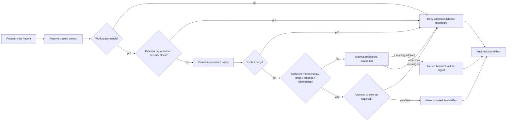

# Phase 1 Authorization Model

| Field | Value |
|---|---|
| Document ID | `SEC-AUTH-001` |
| Version | `0.1` |
| Status | `DRAFT — product-owner, architecture, and security approval required` |
| Updated | 26 August 2026 |
| Applies to | Every human, service, worker, adapter, support, configuration, and data access path |

## 1. Purpose and authority

This contract defines the provider-neutral authorization semantics required by `DEC-003`, `DEC-006`, `DEC-008`, `DEC-022`, `REQ-P1-WS-001`–`REQ-P1-WS-007`, and `REQ-P1-TRUST-001`–`REQ-P1-TRUST-009`. Roles and personas are not authority by themselves. Authorization uses `Identity → Membership → Workspace → Resource`, plus explicit grants, policy, relationship/consent evidence, current state, and action context.

The model aligns with `ARCH-P1-003`, `ARCH-P1-006`–`ARCH-P1-012`, `ARCH-P1-024`, `ARCH-P1-028`–`ARCH-P1-031`, and `DOM-P1-001`–`DOM-P1-018`, `DOM-P1-036`, `DOM-P1-044`, `DOM-P1-049`–`DOM-P1-050`. Aggregate associations never imply authorization.

No API, worker, store, search index, graph, AI context, cache, notification, export, audit view, support tool, or connector may implement a weaker local interpretation. Policy engines/providers remain replaceable behind this decision contract.

## 2. Authorization model

### 2.1 Core objects

| Object | Meaning | Must not be conflated with |
|---|---|---|
| Identity | Authenticated human/account principal | Subject, membership, workspace owner, or resource owner |
| Service principal | Authenticated workload/capability principal | User identity or ambient platform administrator |
| Membership | Identity participation in one workspace with policy attributes | Blanket content visibility |
| Subject | Person/entity described by facts/evidence, possibly without login | Identity or membership |
| Workspace | Primary tenant/resource scope for Phase 1 policy evaluation | Identity-provider tenant alone |
| Resource | Stable workspace-scoped protected object | A UI view or storage row only |
| Field | Protected sub-resource/value/evidence anchor | Automatically visible because its container is visible |
| Edge | Typed relationship/dependency with its own provenance and policy | Public proof that linked resources exist |
| Grant | Explicit actor→scope→action/purpose/time delegation | Role, relationship, or reusable consent |
| Approval | Bound authorization for a reviewed consequential effect | General grant or future model autonomy |

## 3. Policy inputs and decision record

### 3.1 Trusted inputs

| Input class | Minimum fields |
|---|---|
| Actor | Identity/service ID, authentication method/strength/time, session/device state, membership IDs, actor risk/security state |
| Workspace | Stable ID, type, status, jurisdiction/residency policy, tenant boundary, configuration version |
| Resource | ID, workspace, type, owner/subject links, sensitivity/classification, lifecycle/deletion/quarantine state, version |
| Field/edge | Definition/type, sensitivity, source/target, provenance, validity, inherited/explicit policy attributes |
| Action | Stable operation ID, read/write/resolve/approve/execute/export/delete/admin class, consequence/risk, requested effect and quantity |
| Purpose | Approved purpose ID, requested use, channel/processor, consent or contract reference, expiry |
| Grant/relationship | Issuer, recipient, exact scope, actions, purpose, start/expiry/revocation, relationship basis/effective period, delegation rules |
| Environment | Current time, region, service/capability, API/worker/channel, policy/data freshness, incident/degraded state |
| Approval | Reviewed-input/effect hash, actor, policy, target, issue/expiry, revocation, material-change state |

Client assertions, filenames, model text, document instructions, connector metadata, URLs, queue payload permissions, and cached role names are untrusted until resolved against authoritative current state.

### 3.2 Decision output

Every policy evaluation returns:

- `ALLOW`, `DENY`, `REDACT`, or `MINIMAL_DISCLOSURE`;
- bounded workspace/resource/field/edge/action/effect scope;
- policy and reference-data versions;
- reason code safe for the caller and a protected diagnostic reference;
- obligations such as step-up, approval, consent, redaction, rate limit, watermark, review, or reauthorization time;
- decision time/expiry and freshness inputs; and
- correlation/audit reference.

An `ALLOW` without explicit bounded fields/actions is invalid. A policy error, missing input, stale security state, or unknown type defaults to `DENY` or a documented safe degraded result.

## 4. Authorization rule catalogue

| Rule ID | Draft normative rule | Primary traceability | Negative-test hook |
|---|---|---|---|
| `AUTH-P1-001` | Every household protected operation MUST name one validated workspace; cross-workspace resource combinations are denied before lookup/output. Explicit global reference/configuration operations use a separate platform/reference scope containing no household or personalized data. | `ARCH-P1-003`, `DOM-P1-002`, `DOM-P1-006`, `DEC-022` | Swap workspace/resource IDs and inject household references into global-scope operations. |
| `AUTH-P1-002` | Membership MUST NOT imply access to every resource, field, edge, derivative, notification, export, audit item, or action. | `REQ-P1-WS-004`, `AC-P1-SEC-001` | Family-admin private-resource matrix. |
| `AUTH-P1-003` | Policy is deny-by-default; unknown resource/action/policy/schema versions and missing attributes deny. | `REQ-P1-WS-005`, `REQ-P1-CFG-001` | Fuzz unknown/missing attributes. |
| `AUTH-P1-004` | An explicit applicable deny overrides role, membership, relationship, owner/admin label, grant, consent, or inferred access. | `REQ-P1-TRUST-002` | Conflicting allow/deny policy tests. |
| `AUTH-P1-005` | Quarantine, purge/deletion block, security suspension, expired/revoked grant, and workspace mismatch precede ordinary allow evaluation. | `REQ-P1-ING-003`, `REQ-P1-TRUST-007` | Attempt every route during each blocked state. |
| `AUTH-P1-006` | Actor and subject remain separate; acting for a managed dependant requires effective policy/authority evidence, not relationship label alone. | `REQ-P1-WS-003`, `007` | Caregiver without current authority. |
| `AUTH-P1-007` | Resource access and each sensitive field/evidence anchor require current policy; container read is not field read. | `REQ-P1-FCT-006` | Restricted field in readable document. |
| `AUTH-P1-008` | Each graph edge and traversal output is authorized independently; inaccessible nodes/edges cannot leak existence via paths/counts/layout. | `REQ-P1-GPH-002`, `004` | Hidden node/edge and path-length probes. |
| `AUTH-P1-009` | Search candidate retrieval, filters, facets, counts, snippets, reranking, model context, answer, citation, and conversation state each enforce current policy. | `REQ-P1-SRCH-003`, `004` | Stale index/conversation follow-up suite. |
| `AUTH-P1-010` | Inference cannot reveal a protected fact or existence not independently authorized, even if computed from authorized inputs. | `DEC-008`, `UC-P1-013` | Aggregation/differencing/inference attacks. |
| `AUTH-P1-011` | Seeing a recommendation/task does not imply access to all underlying evidence; minimal disclosure requires a named policy. | `REQ-P1-SHR-005` | Impact-exists privacy suite. |
| `AUTH-P1-012` | Create, read, edit, resolve, compare, supersede, share, approve, execute, verify, export, trash, restore, purge, and audit-read are separate actions. | `UC-P1-003`–`UC-P1-012` | Attempt each action with adjacent permission only. |
| `AUTH-P1-013` | Consequential action requires current actor/action authority, configured policy, exact bound approval, unchanged inputs/effect, and expiry validity. | `REQ-P1-ACT-005`–`007` | Stale/changed-input/revoked actor tests. |
| `AUTH-P1-014` | Approval authority, execution authority, and verification/closure authority are separable and configurable. | `REQ-P1-ACT-005`–`008` | One-role end-to-end self-approval test. |
| `AUTH-P1-015` | Export and deletion are distinct high-impact authorities; ordinary read, ownership, or family administration does not grant either. | `REQ-P1-SHR-003`, `REQ-P1-TRUST-006`–`007` | Read-only export/purge attempts. |
| `AUTH-P1-016` | Grants specify exact issuer, recipient, workspace/resources/fields/actions, purpose, start/expiry, onward-delegation, export, and revocation semantics. | `REQ-P1-SHR-001` | Missing/over-broad grant attributes. |
| `AUTH-P1-017` | Grant issuer MUST possess current delegation authority for every delegated scope/action and cannot delegate more than policy permits. | `UC-P1-009` | Mixed-authority share selection. |
| `AUTH-P1-018` | Guest links are capabilities with bounded audience/scope/time/use/rate, separate revocation, non-enumerability, and current-policy redemption. | `REQ-P1-SHR-002` | Guess/reuse/expiry/wrong audience. |
| `AUTH-P1-019` | Grant revocation/expiry propagates to sessions, signed access, caches, conversations, jobs, notifications, exports, connectors, and actions within a defined objective; uncertain components fail closed. | `AC-UC-P1-009-03`, `MET-P1-018` | Mid-flow revocation suite. |
| `AUTH-P1-020` | Service principals receive named capability, workspace/data scope, tool/action set, purpose, and duration; payload or model text cannot elevate them. | `REQ-P1-AI-002`, `AC-P1-AI-001` | Confused deputy/prompt injection. |
| `AUTH-P1-021` | Workers MUST resolve current policy at execution and cannot rely solely on enqueue-time authorization. | `REQ-P1-TRUST-002` | Revoke between enqueue/execute. |
| `AUTH-P1-022` | Derived stores carry source/workspace/policy/lineage versions, but embedded attributes are only filtering aids; output reauthorization is mandatory. | `REQ-P1-GPH-002`, `REQ-P1-SRCH-003` | Stale embedded ACL tests. |
| `AUTH-P1-023` | Cache keys include workspace, actor/grant or policy-equivalent scope, purpose, resource/field version, and policy epoch; shared caches cannot cross authorization equivalence classes. | `UC-P1-013` | Cache-key collision and revocation tests. |
| `AUTH-P1-024` | Policy/grant/security changes increment or invalidate an authorization epoch consumed by caches, indexes, conversations, and jobs; freshness SLO is explicit and fail-closed. | `REQ-P1-TRUST-002` | Missed invalidation/partition tests. |
| `AUTH-P1-025` | Error, empty, count, timing, score, and limitation responses MUST use disclosure classes that do not confirm inaccessible existence. | `REQ-P1-GPH-004`, `REQ-P1-SRCH-004` | Enumeration and timing oracle tests. |
| `AUTH-P1-026` | Operator/support access follows separate privileged policy with no standing content read; ordinary household roles cannot be assumed by support. | `SEC-P1-025`, `AC-UC-P1-013-04` | Support impersonation/browse tests. |
| `AUTH-P1-027` | Break-glass is disabled until explicitly approved; any future route requires separate identity, strong auth, incident/user purpose, approval, scope/time, notification/review, and enhanced audit. | `SEC-P1-026` | Assert no universal emergency role. |
| `AUTH-P1-028` | Configuration publication and security administration require separate privileged actions, review/approval, effective dating, and audit; configuration cannot grant hidden standing content access. | `REQ-P1-CFG-004` | Self-publish and config injection tests. |
| `AUTH-P1-029` | Connector and processor access requires current purpose/consent/residency eligibility in addition to resource access. | `REQ-P1-TRUST-005`, `009` | Withdraw consent/change residency mid-job. |
| `AUTH-P1-030` | Audit records are workspace-scoped and sensitivity-filtered; audit-read cannot reveal content/targets the viewer is not permitted to learn. | `REQ-P1-TRUST-004`, `UC-P1-019` | Audit side-channel suite. |
| `AUTH-P1-031` | Quarantine release, clinical-content decision, malware override, and destructive remediation are separate privileged actions with dual/review controls defined by specialist policy. | `DEC-024`, `DEC-036` | Ordinary owner/admin override attempts. |
| `AUTH-P1-032` | Recovery cannot change identity, ownership, factors, keys, or private-resource authority until `DEC-038` defines the approved ceremony; no support-only bypass. | `REQ-P1-TRUST-008` | Account takeover/recovery abuse suite. |
| `AUTH-P1-033` | Automated continuity release remains denied while `DEC-032` is open; ordinary grants cannot be reinterpreted as incapacity/death authority. | `REQ-P1-SHR-004` | False continuity trigger. |
| `AUTH-P1-034` | Deleted/purge-blocked resources remain denied to replay, restore, support, connector resync, AI, and index repair; tombstone/state checks precede recreation. | `AC-P1-DEL-001`, `AC-UC-P1-012-03` | Resurrection suite. |
| `AUTH-P1-035` | Authorization decisions and effects MUST produce privacy-safe audit evidence with policy/input references; raw protected values are not decision-log attributes. | `REQ-P1-TRUST-003`–`004` | Telemetry content scanning. |

## 5. Decision precedence

The following precedence is mandatory; a lower row cannot override a higher row:

1. Workspace/tenant mismatch, invalid actor/service identity, deleted/purged workspace, or security suspension → `DENY`.
2. Resource quarantine, purge/deletion block, explicit security/legal/policy deny, revoked/expired grant or session → `DENY`.
3. Unsupported/unknown resource, field, edge, action, policy, configuration, or stale security input → `DENY` or explicitly unavailable without disclosure.
4. Missing purpose, consent, residency eligibility, relationship/authority evidence, step-up, or required approval → `DENY` with only safe remediation.
5. Applicable explicit resource/field/edge/action allow or grant → bounded `ALLOW`.
6. If ordinary allow is absent, an expressly configured impact-exists policy may return `MINIMAL_DISCLOSURE`; otherwise `DENY`.
7. Redaction obligations reduce output; they never create authority.

## 6. Authorization matrices

### 6.1 Resource and action matrix

`P` means policy evaluation is always required; no cell is a role-only allow.

| Actor context | Membership admin | Resource read | Sensitive field | Share/delegate | Resolve fact | Approve/execute | Export | Purge | Audit view |
|---|---:|---:|---:|---:|---:|---:|---:|---:|---:|
| Household owner | P | P | P | P | P | P | P | P | P |
| Family administrator | P | P | P | P | P | P | P | P | P |
| Adult member | P | P | P | P | P | P | P | P | P |
| Guest/adviser | No by default | P within grant | P within grant | No by default | P only if explicit | P only if explicit | No by default | No | P only for own/permitted activity |
| Managed dependant without identity | Not an actor | Not an actor | Not an actor | Not an actor | Not an actor | Not an actor | Not an actor | Not an actor | Not an actor |
| Workspace service | Capability policy | Capability policy | Capability policy | No unless named | Capability policy | Bound capability/approval | Export capability | Deletion capability | Append; read only if named |
| Support/operator | Privileged admin policy | No standing access | No standing access | No | No | No user action | No | No | Restricted operational audit only |

### 6.2 Surface enforcement matrix

| Surface | Before access | Before output/effect | Revocation/deletion behavior |
|---|---|---|---|
| API/list/detail | Workspace/resource/action | Field/redaction/error | Immediate current-policy denial |
| Artifact/preview | Resource/version/quarantine | Reauthorize signed grant | Token revoke/expiry; deletion block |
| Search | Store/query eligibility | Candidate/snippet/facet/count | Policy epoch invalidates; reauthorize |
| Graph | Start node/edge type | Every hop/path/aggregate | Invalidate paths; fail closed if stale |
| AI/RAG | Capability/tool/context | Claims/citations/action | Remove prior context; deny follow-up |
| Worker/event | Service capability/workspace | Current actor/resource/action policy | Reevaluate at execution; tombstone late work |
| Notification | Task/source/recipient/channel | Minimum permitted content | Cancel/redact pending delivery |
| Export | Request authority/scope | Every item/manifest/release | Cancel/narrow/fail; deny redemption |
| Audit view | Audit-read purpose/scope | Event fields/target existence | Reevaluate; preserve restricted audit |

## 7. Minimal disclosure

Minimal disclosure is not generic redaction. It is a versioned policy that specifies:

- who may receive the signal and for what purpose;
- the safe action/category text allowed;
- which subject/resource/value/source/edge/count/time attributes are forbidden;
- whether acknowledgement, routing, or escalation is allowed;
- expiry and revocation behaviour; and
- audit and negative-test fixtures.

Allowed examples may include “An authorized household action requires attention; contact the resource owner” only if the policy proves that even this statement does not reveal protected existence in context. If safety cannot be demonstrated, suppress the output and route to an authorized reviewer.

## 8. Policy freshness and propagation

Policy configuration, membership, grant, relationship authority, consent, approval, session risk, quarantine, and deletion changes publish a versioned invalidation/epoch event. Consumers must either prove they have observed at least that epoch or synchronously recheck current state. Network partition, cache outage, or event delay is not permission to serve stale authorization.

Each surface must define and test a revocation objective. The objective is a maximum convergence time, not an allowance to skip request-time checks. High-impact execution, export release, artifact redemption, citation navigation, and destructive operations always synchronously reauthorize.

## 9. Open-decision fences

- `DEC-032`: no automated emergency/incapacity/death grant or authority mapping.
- `DEC-036`: suspected clinical-content state never grants ordinary preview/processing; final user/reviewer authority awaits the handling decision.
- `DEC-038`: no recovery role, support override, factor bypass, ownership transfer, or private-resource reassignment is defined.
- `DEC-039`: destructive action types may be modelled, but cancellation windows, purge objectives, backup expiry, and audit minimization do not become authorization defaults.
- `DEC-040`: resource access alone does not authorize a processor/region; residency eligibility is an independent policy input.

## 10. Required tests and evidence

Authorization release evidence includes:

1. exhaustive policy-unit decision tables and mutation/property tests;
2. cross-workspace IDOR tests for every API, store, event, job, cache, search, graph, AI, export, and support surface;
3. field/edge/count/facet/timing/error/inference side-channel tests;
4. membership-versus-resource and family-admin negative tests;
5. grant issue/expiry/revoke, guest-link, onward delegation, and purpose tests;
6. policy epoch/stale cache/index/conversation/event partition tests;
7. bound approval, step-up, changed-input, replay, partial action, and bulk tests;
8. export/deletion mid-job revocation and late-event resurrection tests;
9. support/operator/configuration privilege-escalation tests; and
10. continuous zero-leak evidence for `MET-P1-018` and `MET-P1-021`.

The umbrella acceptance cases `AC-P1-SEC-001`, `AC-P1-AI-001`, `AC-UC-P1-001-04`, `AC-UC-P1-005-02`, `AC-UC-P1-007-04`, `AC-UC-P1-009-01`–`05`, `AC-UC-P1-011-02`, `AC-UC-P1-012-03`, and `AC-UC-P1-013-01`–`04` are mandatory seeds, not the complete suite.
