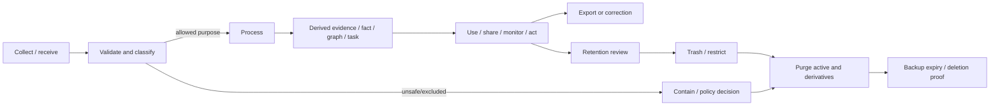

# Phase 1 Privacy and Data Governance

| Field | Value |
|---|---|
| Document ID | `SEC-PRIV-001` |
| Version | `0.1` |
| Status | `DRAFT — privacy/legal/product-owner approval required` |
| Jurisdiction | Australia first; jurisdiction-neutral control model |
| Updated | 26 August 2026 |

## 1. Purpose, authority, and legal boundary

This contract defines privacy-by-design and data-lifecycle behaviour for Phase 1. It implements the product constraints in `DEC-003`, `DEC-005`, `DEC-006`, `DEC-008`, `DEC-020`, `DEC-022`, `DEC-023`, and `DEC-024`, and refines `REQ-P1-TRUST-003`–`REQ-P1-TRUST-009`.

It aligns with the data roles and residency realm in `ARCH-P1-013`–`ARCH-P1-018`, `ARCH-P1-027`–`ARCH-P1-032`, the scope rules `DOM-P1-002`–`DOM-P1-006`, and the lifecycle aggregates `ExportCase` and `DeletionCase` under `DOM-P1-048`–`DOM-P1-054`.

This is not legal advice and does not assert that one privacy law or exemption applies to every workspace, processor, user, or data class. Before launch, qualified review must record applicable Australian and other jurisdictional obligations, effective dates, evidence, ownership, and review cadence. The core contracts remain jurisdiction-neutral while the Australia pack supplies approved notices, terms, sources, and rules.

## 2. Privacy principles

1. Collect and process the minimum data required for a declared product/security purpose.
2. Resource and field privacy is independent from workspace membership and family relationship.
3. Purpose, consent, relationship authority, and processor/residency eligibility are explicit and versioned.
4. Derived data, embeddings, graphs, prompts, outputs, caches, metrics, audit, and backups are governed data, not harmless exhaust.
5. Clinical records are excluded; health-insurance/general coverage remains in scope only under the approved supported-content profile.
6. Evidence and history are preserved only as required by approved product/retention policy; “immutable” does not mean exempt from governed purge.
7. Export, correction, restriction, revocation, and deletion must be understandable and must not harm another subject's rights or leak their data.
8. Privacy telemetry measures control outcomes without collecting raw household content.

## 3. Data classification

| Class | Examples | Default handling |
|---|---|---|
| `P0-PUBLIC` | Published product documentation; approved public source material | Integrity and provenance controls; no household linkage by default. |
| `P1-INTERNAL` | Non-sensitive service configuration, synthetic fixtures | Authorized workforce only; production separation. |
| `P2-HOUSEHOLD` | Document metadata, tasks, membership, ordinary household records | Workspace-scoped, encrypted, no ordinary public/support access. |
| `P3-SENSITIVE` | Identity, financial, tax, legal, immigration, insurance, relationship, contact, location, credential-like and protected fact/evidence data | Field-level controls, limited processing/telemetry, enhanced approval and monitoring. |
| `P4-RESTRICTED` | Raw document content, immutable originals, evidence passages, government identifiers, secrets/tokens, authentication/recovery data, encryption material, quarantine content, exceptionally sensitive relationship/estate data | Need-to-process only, strict purpose/processor/residency, no ordinary telemetry, strongest access/audit. |
| `P5-EXCLUDED` | Clinical/treatment records under `DEC-024` and prohibited content defined by policy | No ordinary extraction, graph, search, AI, analytics, or monitoring; final storage/recovery action fenced by `DEC-036`. |

Classification is attached to data definitions and may be raised by context. A lower-class container never downgrades a sensitive field. Filenames, URLs, graph edges, counts, and event reason text may themselves be sensitive.

## 4. Data lifecycle and purpose map



| Purpose ID | Purpose | Permitted categories | Prohibited shortcut |
|---|---|---|---|
| `PUR-P1-001` | Deliver requested workspace/document service | Minimum authorized product data | Secondary use without a new lawful/policy basis |
| `PUR-P1-002` | Secure and operate service | Security metadata and restricted evidence only when necessary | Standing support browse or raw-content observability |
| `PUR-P1-003` | Extract/classify/answer/assess with AI/OCR | Exact scoped content under adapter policy | Provider training/reuse or expanded processing by default |
| `PUR-P1-004` | Monitor governed sources and household events | Rule/source data and authorized context | Arbitrary web authority or hidden profiling |
| `PUR-P1-005` | Share/delegate/notify | Minimum scope/content/channel authorized by grant and preference | Relationship- or role-based oversharing |
| `PUR-P1-006` | Export/portability | Actor-authorized package classes | Treating ordinary read as bulk export authority |
| `PUR-P1-007` | Product quality and safety measurement | Pseudonymous allow-listed events; synthetic/evaluation data | Raw documents, values, queries, answers, or evidence in analytics |
| `PUR-P1-008` | Support/incident response | Minimum metadata; content only under future approved exceptional path | Impersonation or ownership transfer outside policy |

## 5. Privacy rule catalogue

| Rule ID | Draft normative rule | Primary traceability | Verification hook |
|---|---|---|---|
| `PRIV-P1-001` | Every data element and processing activity MUST have owner, class, declared purpose, source, subjects, scope (`WorkspaceId` or approved global reference/platform scope), processors, regions, retention state, and deletion lineage. Global scope cannot contain household identifiers or personalized content. | `ARCH-P1-013`, `DOM-P1-002`, `DOM-P1-006`, `REQ-P1-TRUST-005`, `009` | Processing inventory/schema and scope completeness. |
| `PRIV-P1-002` | Collection MUST be proportionate and optional data distinguished from required data; onboarding cannot require unnecessary household details or documents. | `OUT-P1-001`, `JRN-P1-001` | Data-minimization UX/API tests. |
| `PRIV-P1-003` | Membership, family relationship, caregiver status, administrator role, and adviser profession MUST NOT independently confer content, consent, export, or deletion authority. | `DEC-003`, `DEC-023`, `AUTH-P1-002` | Family/guest negative matrices. |
| `PRIV-P1-004` | Sensitive fields, evidence, existence, and derivatives MUST support resource/field/edge policy and privacy-safe minimal disclosure. | `REQ-P1-FCT-006`, `REQ-P1-SHR-005` | `AC-P1-SEC-001`. |
| `PRIV-P1-005` | User-facing notices MUST identify purpose, categories, key processors/processing type, retention/deletion consequence, residency/cross-border state, controls, and material limitations in plain language. | `REQ-P1-TRUST-009` | Notice/version/accessibility review. |
| `PRIV-P1-006` | Consent, where used, MUST be specific, informed, affirmative, versioned, attributable, withdrawable where applicable, and no broader than the linked purpose/processor/channel. | `REQ-P1-TRUST-009` | Consent issue/withdraw/replay tests. |
| `PRIV-P1-007` | Withdrawal MUST stop future covered processing within the defined objective and disclose approved retained-data effects; it cannot retroactively falsify completed audit/evidence. | `REQ-P1-ING-009`, `REQ-P1-TRUST-009` | Mid-job withdrawal and adapter revoke. |
| `PRIV-P1-008` | Processor access MUST be data-minimized, purpose/capability-scoped, region-eligible, time-bounded, logged, and contractually/technically prohibited from unapproved retention, training, or reuse. | `REQ-P1-AI-007`, `SEC-P1-020` | Adapter request/retention/egress tests. |
| `PRIV-P1-009` | Connector tokens and imported data MUST preserve consent, source/version identity, permissions where applicable, disconnect, deletion, and retained-data semantics. | `REQ-P1-ING-009`, `GAP-007` | Connector conformance suite. |
| `PRIV-P1-010` | P5 excluded clinical content MUST not enter ordinary processing; while `DEC-036` is open, no final storage/recovery promise is inferred. | `REQ-P1-DOC-007`, `MET-P1-020` | Synthetic clinical boundary fixtures. |
| `PRIV-P1-011` | Original, derived, fact, graph, conversation, notification, export, audit, cache, replica, and backup data MUST each have explicit lifecycle/lineage; deleting only the primary row is insufficient. | `REQ-P1-TRUST-007`, `UC-P1-012` | Per-class deletion coverage. |
| `PRIV-P1-012` | Archive, trash, account deletion, resource purge, retention exception, connector deletion, active-data completion, and backup expiry MUST remain distinct states. | `REQ-P1-TRUST-007`, `GAP-004` | State machine/UX wording tests. |
| `PRIV-P1-013` | Retention periods and triggers MUST be data-class/purpose/jurisdiction/state specific, versioned, reviewable, and never silently extended for product convenience or model training. | `DEC-039` | Retention rule and expired-data scans. |
| `PRIV-P1-014` | `DEC-039` blocks invented deletion cooling-off, active-purge, backup-expiry, and audit-minimization durations. | `AC-UC-P1-012-05` | Configuration rejects unset/invented production defaults. |
| `PRIV-P1-015` | Purge MUST make active data and content-bearing derivatives inaccessible, prevent replay/restore/resync resurrection, verify per-class completion, and disclose bounded residuals. | `AC-P1-DEL-001`, `AUTH-P1-034` | Deletion/resurrection/restore drills. |
| `PRIV-P1-016` | Immutable originals and provenance MUST remain unmodified while retained but are still subject to approved controlled purge; lineage must not become a hidden permanent copy. | `DEC-005`, `REQ-P1-DOC-001` | Integrity plus deletion tests. |
| `PRIV-P1-017` | Shared facts/evidence deletion MUST preserve only independently authorized/required records and must sever/redact deleted lineage without silently rewriting another subject's history. | `REQ-P1-FCT-001`, `UC-P1-012` | Multi-subject deletion scenarios. |
| `PRIV-P1-018` | Export MUST be separately authorized, documented, checksummed, machine-readable, bounded, and privacy-filtered; package completeness matches the declared `DEC-033` envelope. | `REQ-P1-TRUST-006`, `MET-P1-016` | Manifest/fidelity/cross-workspace tests. |
| `PRIV-P1-019` | Data access, correction, dispute, portability, restriction, and deletion requests MUST be attributable, identity-assured, scoped, tracked, and resolved under approved jurisdictional policy. | `REQ-P1-FCT-003`–`004`, `REQ-P1-TRUST-006`–`007` | Request workflow and identity tests. |
| `PRIV-P1-020` | Ordinary telemetry uses schema allow-lists and pseudonymous identifiers; raw content, passages, values, queries, answers, filenames, tokens, and unrestricted URLs are prohibited. | `REQ-P1-TRUST-003`, `MET-P1-021` | Continuous canary/content scanning. |
| `PRIV-P1-021` | Free-text feedback/analytics is off by default unless separately justified, noticed, minimized, classified, and protected; synthetic/de-identified evaluation is preferred. | `PROD-SCOPE-001` §12 | Analytics schema and UI tests. |
| `PRIV-P1-022` | Test, research, demos, support, screenshots, and evaluation MUST use synthetic or specifically approved/consented data and never production credentials. | `CODEX.md` testing requirements | Fixture and environment scans. |
| `PRIV-P1-023` | Data subjects without accounts remain stable subjects, not fabricated identities; relationship/authority evidence is effective-dated and future transition preserves provenance. | `REQ-P1-WS-003`, `007` | Managed-dependant lifecycle tests. |
| `PRIV-P1-024` | Automated emergency/incapacity/death release is prohibited while `DEC-032` is open; enrolment or relationship does not imply consent to release. | `REQ-P1-SHR-004`, `UC-P1-016` | False trigger/no-release test. |
| `PRIV-P1-025` | Recovery MUST NOT reveal or transfer private resources, consent, keys, ownership, or grants until `DEC-038` approves assurance/challenge rules. | `REQ-P1-TRUST-008` | Recovery takeover suite. |
| `PRIV-P1-026` | Support has no standing content access; exceptional processing, if approved later, is purpose/time/scope-limited, strongly authorized, auditable, reviewable, and disclosed where policy requires. | `SEC-P1-025`, `AUTH-P1-026` | Insider/support tests. |
| `PRIV-P1-027` | The Australian residency option MUST use an approved matrix covering every data class, processor, region, support path, analytics stream, backup, and DR route; `DEC-040` blocks assumptions. | `REQ-P1-TRUST-005`, `DEC-022` | Placement/egress/restore tests. |
| `PRIV-P1-028` | Residency exceptions/cross-border processing require an approved basis, disclosure/consent where applicable, technical enforcement, expiry/review, and alternate/blocking behaviour. | `REQ-P1-TRUST-009` | Ineligible adapter and expired exception tests. |
| `PRIV-P1-029` | Privacy incidents and access anomalies MUST be detected, contained, investigated, and recorded without copying raw content into ordinary incident telemetry; notification thresholds require legal review. | `MET-P1-018`, `021` | Incident drill and evidence segregation. |
| `PRIV-P1-030` | Privacy policy/configuration changes MUST be versioned, approved, effective-dated, impact-assessed, replayable/repairable, and communicated before materially different future processing. | `REQ-P1-CFG-002`, `004` | Config publication/rollback tests. |

## 6. Processing and consent register contract

Every active processing definition must contain:

```yaml
processing_definition:
  id: stable-id
  version: 1
  owner: accountable-role
  purpose_id: PUR-P1-003
  data_classes: [P3-SENSITIVE, P4-RESTRICTED]
  subjects: [workspace-member, managed-dependant]
  sources: [document-version]
  recipients_or_processors: [capability-adapter-id]
  permitted_regions: [policy-region-id]
  consent_or_basis: policy-reference
  retention_rule: retention-rule-id
  deletion_lineage_profile: lineage-profile-id
  security_profile: security-profile-id
  notice_version: notice-id
  effective_from: timestamp
  review_by: timestamp
  status: DRAFT
```

Missing mandatory attributes, expired review, ineligible region, withdrawn consent, or inactive security/deletion profile blocks activation or processing.

## 7. Australian residency matrix contract

The matrix is deliberately unpopulated until `DEC-040` is approved.

| Data/processing class | Primary region | Derived/index region | Processor region | Support access region | Backup/DR region | Cross-border exception/consent | Enforcement/test ID |
|---|---|---|---|---|---|---|---|
| Immutable originals | `OPEN` | N/A | `OPEN` for malware/OCR | `OPEN` | `OPEN` | `OPEN` | Required before launch |
| Operational/domain records | `OPEN` | `OPEN` | N/A or `OPEN` | `OPEN` | `OPEN` | `OPEN` | Required before launch |
| Search/vector/graph/cache | `OPEN` | `OPEN` | `OPEN` | `OPEN` | `OPEN` | `OPEN` | Required before launch |
| AI/OCR/reranking outputs | `OPEN` | `OPEN` | `OPEN` | `OPEN` | `OPEN` | `OPEN` | Required before adapter enablement |
| Audit/security evidence | `OPEN` | N/A | `OPEN` security services | `OPEN` | `OPEN` | `OPEN` | Required before launch |
| Ordinary telemetry/analytics | `OPEN` | N/A | `OPEN` | `OPEN` | `OPEN` | `OPEN` | Required before instrumentation |
| Exports/temp packages | `OPEN` | N/A | N/A | None by default | `OPEN` if backed up | `OPEN` | Required before export |

No `OPEN` row may be interpreted as globally permitted. The Australian option must fail placement/processor validation if the active matrix cannot prove eligibility.

## 8. Retention and deletion matrix contract

| Data class/state | Retention trigger | Active access during retention | Purge/expiry target | Audit treatment | Decision dependency |
|---|---|---|---|---|---|
| Immutable artifact/current version | Workspace/resource lifecycle | Authorized only | `OPEN` | Safe lifecycle references | `DEC-039` |
| Trash/cooling-off | Approved delete request | Restricted per policy | `OPEN` | Request/cancel evidence | `DEC-039` |
| Derived extraction/index/cache | Source lifecycle and lineage | Never after source access block | `OPEN` | Version/result refs only | `DEC-039` |
| Export package | Package creation/redemption | Requester only | `OPEN` | Manifest/status refs | `DEC-033`, `039` |
| Connector credentials/data | Consent/disconnect/source lifecycle | No future retrieval after revoke | `OPEN` | Consent/revoke refs | `DEC-031`, `039` |
| Audit/provenance | Event/risk/purpose | Restricted audit readers | `OPEN` minimized/redacted | Self | `DEC-039` |
| Backups/replicas | Backup generation and deletion tombstone | No ordinary access/restore bypass | `OPEN` | Deletion proof refs | `DEC-039`, `040` |

## 9. Export and deletion user guarantees

`UC-P1-011` and `UC-P1-012` control the workflows. Privacy copy and APIs must distinguish requested, accepted, cooling-off, restricted, active purge, partially failed, active-data complete, backup-expiry pending, and fully complete according to the approved lifecycle. They must disclose third-party/shared-resource limitations without exposing protected data and must not use dark patterns, vague “deactivate,” or total-erasure claims inconsistent with backups/audit.

## 10. Governance and evidence

Before beta:

1. data inventory, classification, processing register, notices, consent records, retention rules, deletion lineage, residency matrix, and processor register are complete and versioned;
2. privacy/security review approves every analytics/event property and external adapter field;
3. `MET-P1-016`, `MET-P1-018`, `MET-P1-020`, and `MET-P1-021` evidence is available;
4. `AC-P1-SEC-001`, `AC-P1-DEL-001`, `AC-UC-P1-008-04`, `AC-UC-P1-009-03`, `AC-UC-P1-011-01`–`05`, and `AC-UC-P1-012-01`–`05` pass;
5. purpose/consent withdrawal, data access/correction, export, deletion, backup expiry, support, incident, and cross-border exercises pass; and
6. `DEC-032`, `DEC-036`, `DEC-038`, `DEC-039`, and `DEC-040` remain visibly blocked or are closed with updated contracts/tests.
