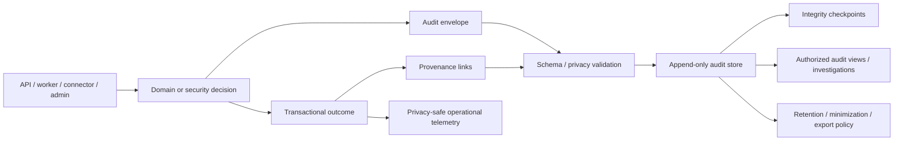

# Phase 1 Audit and Provenance

| Field | Value |
|---|---|
| Document ID | `SEC-AUD-001` |
| Version | `0.1` |
| Status | `DRAFT — security, privacy, architecture, and product-owner approval required` |
| Updated | 26 August 2026 |

## 1. Purpose and boundary

This contract defines how Phase 1 records security decisions, evidence lineage, consequential state transitions, and operational control outcomes so they are reconstructable without turning audit into a second ungoverned copy of household content.

It aligns with the Audit capability and `ARCH-P1-039`–`ARCH-P1-040`, the append-only data roles in `ARCH-P1-026`, and `DOM-P1-010`, `DOM-P1-028`, `DOM-P1-044`, `DOM-P1-049`–`DOM-P1-051`. Audit remains a control stream, not a household business aggregate.

It implements `DEC-004`–`DEC-006`, `DEC-008`, `REQ-P1-TRUST-003`–`REQ-P1-TRUST-004`, `GAP-002`–`GAP-004`, and `GAP-009`. Audit is distinct from ordinary logs, metrics, traces, analytics, source evidence, and domain history:

- **Audit** proves who/what requested, decided, changed, accessed, or attempted an action.
- **Provenance** links a derived or resolved result to exact evidence, configuration, models/tools, and decisions.
- **Domain history** is the authoritative additive fact/document/rule/workflow state.
- **Operational telemetry** supports health/performance and contains no raw household content.

Audit does not make an unauthorized operation valid, convert evidence into truth, or substitute for a domain transaction.

## 2. Architecture

Required audit records are written atomically with the protected outcome or through a durable transactional outbox/equivalent that makes absence detectable and repairable. A request accepted for later execution records request and outcome separately.

## 3. Canonical audit envelope

| Field | Required meaning | Privacy rule |
|---|---|---|
| `event_id` | Globally unique immutable event ID | Random/opaque; never derived from content |
| `event_type` / `schema_version` | Stable event definition and compatible schema | Allow-listed values |
| `occurred_at` / `recorded_at` | UTC occurrence and platform-recorded times | Never client time alone |
| `scope_kind` | `WORKSPACE`, `GLOBAL_REFERENCE`, or `PLATFORM_CONTROL` | Global/platform scope cannot contain household or personalized content |
| `workspace_id` | Validated tenant scope; mandatory for `WORKSPACE`, absent for approved global/platform events | Pseudonymous/opaque outside protected systems |
| `actor` | Human/service/connector/operator ID and actor class | No email/name in ordinary event fields |
| `authentication` | Method/strength/session/security-event references | No token, factor, or secret material |
| `action` | Stable requested/executed action ID | No free-text command |
| `target_refs` | Safe stable resource/field/edge/workflow/config references and versions | Do not copy titles, values, snippets, filenames |
| `purpose` | Approved purpose/capability and consent/grant references | Reference, not notice/free text |
| `authorization` | Decision ID, allow/deny/redact/minimal disclosure, policy/version, safe reason | Protected diagnostic details separated |
| `approval` | Approval ID, reviewed-input/effect hash, issue/expiry/revocation state | No raw draft/effect content |
| `state_transition` | Before/after stable state IDs and domain transaction/version | No content values unless separately encrypted/classified |
| `evidence_refs` | Exact authorized evidence/provenance IDs | References only; access rechecked on follow |
| `processing_refs` | Adapter/model/parser/prompt/tool/schema/config versions | No raw prompt/response |
| `outcome` | Success/denied/failed/partial/pending/reconciled plus safe code | No stack trace/raw provider response |
| `correlation` | Request/job/change/recommendation/action/export/deletion correlation and idempotency IDs | Opaque |
| `integrity` | Sequence/checkpoint/hash/signature reference | No secret/key material |
| `classification` | Audit sensitivity, retention rule, residency profile | Mandatory |

Free text is prohibited in the core envelope. If a user/operator reason is required, store a bounded reason code and, only when necessary, a separately classified/encrypted note with its own access, retention, redaction, and deletion policy.

## 4. Provenance chain

Every consequential claim or state must link, as applicable:

`Immutable artifact/source snapshot → version/page/passage anchor → processor/model/parser/tool/schema version → occurrence/derived result → review/resolution/applicability/impact → recommendation → bound approval → action attempt/result → replacement/fulfilment evidence → verification/closure`

Each link carries stable IDs, workspace, source and target versions, relationship type, validity/transaction time, actor/service, confidence/review state where relevant, and supersession. Following a link always reauthorizes the viewer; provenance existence is not public metadata.

## 5. Audit and provenance rule catalogue

| Rule ID | Draft normative rule | Traceability | Verification hook |
|---|---|---|---|
| `AUD-P1-001` | Security- and consequence-relevant requests, decisions, attempts, outcomes, denials, failures, partial states, and reconciliation MUST produce immutable audit events. | `REQ-P1-TRUST-004` | Event coverage matrix. |
| `AUD-P1-002` | Household audit events MUST be workspace-scoped. Approved global-reference/platform-control events MUST use explicit non-household scope. All events are schema-versioned, uniquely identified, time-stamped, actor/service-attributed, correlated, classified, and safe-provenance linked. | `ARCH-P1-003`, `DOM-P1-002`, `DOM-P1-006`, `REQ-P1-TRUST-004` | Schema/scope/required-field validation. |
| `AUD-P1-003` | Audit writes MUST be append-only to application actors; correction creates a superseding/correction event, never in-place mutation. | `DEC-004`–`006` | Mutation and correction tests. |
| `AUD-P1-004` | Integrity MUST be independently verifiable through immutable storage controls, sequencing/checkpoints, cryptographic hashes/signatures or equivalent provider-neutral evidence. | `REQ-P1-TRUST-004` | Tamper/gap/checkpoint verification. |
| `AUD-P1-005` | Required audit failure MUST block a consequential operation or leave it explicitly pending/incomplete until durable audit/outcome reconciliation. | `SEC-P1-018` | Audit-store outage and outbox replay. |
| `AUD-P1-006` | Audit ordering MUST preserve occurrence/recorded time and causal correlation; distributed reordering cannot rewrite sequence or claim a false total order. | `REQ-P1-ING-004` | Delayed/duplicate/out-of-order events. |
| `AUD-P1-007` | Duplicate/replayed requests MUST retain acquisition/attempt evidence while idempotent outcome references prevent duplicate effect. | `AC-P1-ING-001` | Retry/replay suite. |
| `AUD-P1-008` | Authorization decisions MUST record policy/version, trusted input references, decision/effect scope, obligations, and safe reason; protected values are excluded. | `AUTH-P1-035` | Policy replay and telemetry scan. |
| `AUD-P1-009` | Authentication, MFA/session lifecycle, step-up, revocation, suspicious access, and recovery attempts MUST be audited without credentials/factors/tokens. | `REQ-P1-TRUST-001`, `DEC-038` | Account takeover/recovery logs. |
| `AUD-P1-010` | Membership, subject/relationship authority, grants, guest links, consent, purpose, expiry, use, and revocation changes MUST be audited. | `REQ-P1-WS-002`, `REQ-P1-SHR-001`–`004` | Share/revoke chronology. |
| `AUD-P1-011` | Original receipt/hash, scan/quarantine, processing state, processor versions, review, reprocessing, version/supersession, signed access, and lifecycle changes MUST be audited. | `REQ-P1-DOC-001`–`004`, `REQ-P1-ING-002`–`008` | Ingestion/version reconstruction. |
| `AUD-P1-012` | Fact occurrence, conflict, resolution, correction, dispute, effective/transaction time, and supersession MUST retain provenance and resolution events. | `REQ-P1-FCT-001`–`004`, `GAP-002` | Bitemporal reconstruction. |
| `AUD-P1-013` | Graph edge creation/use/change, path truncation, provenance, review, and deletion MUST be traceable without exposing restricted path details in ordinary audit views. | `REQ-P1-GPH-001`–`005` | Impact path reconstruction/no-leak. |
| `AUD-P1-014` | Search/AI audit MUST record capability, evidence/citation references, policy outcome, model/prompt/tool/schema versions, limitation/failure class—not raw query, prompt, passage, or answer. | `REQ-P1-AI-001`–`006`, `MET-P1-012` | Citation reconstruction and content scan. |
| `AUD-P1-015` | Source retrieval/snapshot/parser/health/coverage/applicability/replay MUST retain exact versions, errors, and prior failure history. | `REQ-P1-MON-003`–`007` | `AC-P1-MON-001`. |
| `AUD-P1-016` | Recommendations MUST retain observed change, applicability, path/evidence refs, separated scoring inputs, state, and every disposition. | `REQ-P1-ACT-001`–`004` | `AC-P1-E2E-001` reconstruction. |
| `AUD-P1-017` | Approval MUST record actor, policy, exact reviewed-input/effect hash, target, issue/expiry/revocation, invalidation, and decision. | `REQ-P1-ACT-005`–`006`, `MET-P1-017` | Changed-input/stale approval. |
| `AUD-P1-018` | Action attempts/results/retries/partial success/reversal/reconciliation and replacement-evidence verification/closure MUST be separately recorded. | `REQ-P1-ACT-007`–`008` | External partial-success suite. |
| `AUD-P1-019` | Task, reminder, assignment, snooze, acknowledgement, notification attempt/delivery/failure, completion evidence, reopen, and dismissal MUST retain causality. | `REQ-P1-NTF-001`–`004` | Dedup/delivery/closure tests. |
| `AUD-P1-020` | Export request/scope/auth, manifest version/checksums, exclusions/errors, generation/release/redemption/expiry, and temporary deletion MUST be auditable without copying package content. | `REQ-P1-TRUST-006`, `MET-P1-016` | Export fidelity/revocation. |
| `AUD-P1-021` | Deletion plan/request/approval/cooling-off/cancel, per-class execution/verification/failure, exception, backup expiry, tombstone, and minimized audit treatment MUST be recorded. | `REQ-P1-TRUST-007`, `AC-P1-DEL-001` | Deletion proof/resurrection. |
| `AUD-P1-022` | Configuration, policy, role/permission, taxonomy, source, rule, workflow, AI capability, and deployment publication MUST record proposal/review/approval/effective/rollback/repair/impact. | `REQ-P1-CFG-001`–`004` | Unauthorized config/tamper. |
| `AUD-P1-023` | Connector token/consent/scope/sync/revoke/disconnect/deletion and external processor request/result MUST be auditable through references, not tokens/content. | `REQ-P1-ING-009`, `REQ-P1-TRUST-009` | Connector revoke/egress. |
| `AUD-P1-024` | Support/operator/privileged access, denied attempts, approvals, sessions, queries/actions, export/download, and review MUST receive enhanced immutable audit and anomaly detection. | `SEC-P1-025`, `AUTH-P1-026` | Insider/support tests. |
| `AUD-P1-025` | Ordinary users MUST see only authorized, privacy-safe audit views; audit entries cannot leak hidden resources, actors, values, relationship existence, or sensitive security details. | `AUTH-P1-030`, `UC-P1-019` | Audit-side-channel matrix. |
| `AUD-P1-026` | Audit access, search, export, investigation, retention exception, redaction, and deletion/minimization are themselves auditable. | `REQ-P1-TRUST-004`, `PRIV-P1-013` | Audit-of-audit tests. |
| `AUD-P1-027` | Raw content, evidence passages, query/answer/prompt text, sensitive values, filenames, unrestricted URLs, tokens, secrets, key material, and provider payloads MUST NOT enter ordinary audit fields. | `REQ-P1-TRUST-003`, `MET-P1-021` | Schema allow-list/content canaries. |
| `AUD-P1-028` | Audit retention/minimization MUST use a versioned class/purpose/risk/jurisdiction policy; `DEC-039` blocks invented durations and requires deletion-compatible evidence design. | `REQ-P1-TRUST-007` | Retention/minimization tests. |
| `AUD-P1-029` | Audit/residency placement, replication, backup, investigation, and export MUST follow the `DEC-040` matrix; security evidence is not a residency exemption. | `REQ-P1-TRUST-005` | Region/restore/support tests. |
| `AUD-P1-030` | Audit completeness, integrity gaps, sensitive-field violations, delayed writes, and privileged anomalies MUST generate control findings with owner, severity, response, and closure evidence. | `MET-P1-017`–`021` | Continuous audit-control dashboard. |

## 6. Event coverage matrix

| Domain | Required event classes | Critical evidence link |
|---|---|---|
| Identity/session | Login, MFA/step-up, session issue/rotate/revoke, security challenge, recovery attempt | Actor/session/security policy |
| Workspace/access | Create, membership/subject/relationship, policy decision, grant/link use/revoke | Workspace/resource/action/policy |
| Artifact/ingestion | Receive/hash, scan/quarantine, parse/extract/review/reprocess, version/access | Artifact/version/evidence anchor |
| Fact/graph/search | Occurrence/resolution/conflict, edge/path, query capability/citation/limitation | Source occurrence and policy |
| Monitor/impact | Snapshot/health/parser, applicability, assessment/path/recommendation | Snapshot/rule/change/path |
| Approval/action | Disposition, approval lifecycle, action attempt/result, evidence verification/closure | Bound input/effect and fulfilment evidence |
| Sharing/notification | Grant/link, task/reminder, delivery/acknowledge/snooze/reassign | Grant and causal recommendation |
| Export/deletion | Request/plan/manifest/release, purge/exception/backup expiry/proof | Scope/lineage/checksum/tombstone |
| Administration | Config/policy/source/parser/model/deployment, support/privileged access | Change/approval/deployment artifact |

## 7. Access and disclosure

Audit audiences are separately authorized:

- household actors may view only privacy-safe activity within their permitted resources/purposes;
- grant recipients may view their own access/use where policy permits, not household-wide activity;
- security/privacy investigators receive case-scoped access through privileged workflow;
- operators receive control health, not raw household content;
- external auditors or exports require explicit purpose, scope, minimization, residency, and third-party-rights review.

Denial reasons shown to end users must not confirm hidden resources. Protected diagnostic data is stored separately with stricter access and retention than ordinary audit views.

## 8. Integrity, availability, and reconciliation

The chosen implementation must support write-once/append-only permissions, independent integrity checkpoints, encrypted backup, region policy, gap detection, schema registry, replay/idempotency, time synchronization, and export verification. No specific ledger, database, or cloud immutability feature is selected.

Audit pipeline failure states are visible. Buffered records are encrypted, bounded, tenant-scoped, and replay-safe. If the audit record and domain outcome disagree, reconciliation creates an explicit incident/correction chain; it never edits prior evidence to make the records agree.

## 9. Retention, minimization, export, and deletion

Audit class and purpose determine retention. Security evidence may need different treatment from user activity or product provenance, but no duration is selected while `DEC-039` is open. When source content is purged, retained audit uses stable opaque references, safe state/reason codes, and integrity proof; it must not preserve raw content, sensitive values, titles, filenames, snippets, or reversible hashes that function as hidden copies.

Audit included in portability depends on `DEC-033`, viewer authority, third-party rights, security risk, and schema. The manifest declares included event classes and redactions. Audit backups and investigations remain subject to `DEC-040` residency.

## 10. Verification gates

Before release:

1. every critical workflow has an event coverage map and fixture that reconstructs success, denial, retry, failure, partial result, revocation, and repair;
2. schema validation rejects free-text/content-bearing fields and unknown events;
3. transaction/outbox, duplicate, ordering, audit outage, replay, gap, and reconciliation tests pass;
4. tamper, delete, reorder, checkpoint, restore, and privileged-access exercises prove integrity;
5. authorization tests prove audit views/export do not leak restricted existence;
6. telemetry/audit canary scans meet `MET-P1-021`; and
7. `AC-P1-E2E-001`, `AC-P1-ING-001`, `AC-P1-MON-001`, `AC-P1-DEL-001`, `AC-UC-P1-007-03`, and `AC-UC-P1-013-04` are reconstructable from domain state plus safe audit/provenance.

## 11. Open-decision audit fences

| Decision | Audit behavior while unresolved |
|---|---|
| `DEC-032` | Attempts, enrolment proposals, challenges, and denials may be audited, but no event type or status may imply that automated incapacity/death release is valid or completed. |
| `DEC-036` | Audit may record a privacy-safe suspected-clinical `PolicyPending` containment outcome; it must not encode a final reject/retain/export/delete decision or place clinical labels/values in ordinary fields. |
| `DEC-038` | Recovery attempts and denials are audited, but no unspecified success event may transfer identity, ownership, factors, keys, grants, or private-resource authority. |
| `DEC-039` | Audit event classes and minimization mechanisms are defined without invented retention duration or deletion-completion promise. |
| `DEC-040` | Audit placement, replication, support/investigation access, export, backup, and DR remain ineligible unless the approved residency matrix proves the route. |
