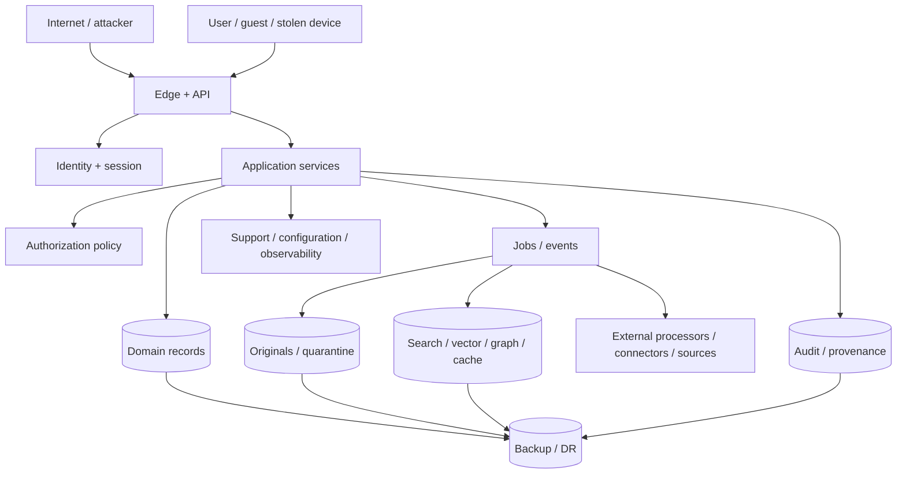

# Phase 1 Threat Model

| Field | Value |
|---|---|
| Document ID | `SEC-THR-001` |
| Version | `0.2` |
| Status | `APPROVED IMPLEMENTATION RISK BASELINE — production residuals require independent review` |
| Method | STRIDE plus privacy, AI, abuse-case, and availability analysis |
| Updated | 28 August 2026 |

## 1. Scope and method

This threat model covers the Phase 1 React web/PWA, Flutter iOS/Android clients, device key stores, customer-controlled cryptographic envelopes and local intelligence, APIs, identity/session boundary, domain services, workers/events, operational stores, encrypted immutable artifact/quarantine stores, encrypted search/vector/graph/caches, AI/OCR/malware/notification adapters, trusted-source and user connectors, exports, deletion, audit, support/administration, telemetry, backups, and disaster recovery.

Component and aggregate names follow `ARCH-SOL-001` and `ARCH-DOM-001`. The trust analysis covers architecture zones `Z0`–`Z7`, the overlaid Australian residency realm, canonical aggregate owners, rebuildable derived projections, `ExportCase`, `DeletionCase`, and its authoritative deletion fence/tombstone (`ARCH-P1-031`–`ARCH-P1-032`, `DOM-P1-048`–`DOM-P1-052`).

It is a living risk register, not proof of security. Each implementation slice must update assets, boundaries, attack paths, controls, evidence, and residual risk after architecture/API/provider choices. Threat IDs are stable and are never recycled.

### 1.1 Rating model

| Rating | Meaning |
|---|---|
| Likelihood `L/M/H` | Plausibility given reachability, attacker skill, prerequisites, and existing controls |
| Impact `L/M/H/C` | Harm to confidentiality, integrity, availability, safety, privacy, evidence, residency, or user control |
| Residual | Expected rating after listed draft controls; must be reassessed from test evidence |

Critical or high residual risks block release unless explicitly accepted by an authorized product/security/privacy owner with rationale, scope, expiry, monitoring, and remediation. Open product decisions are not risk acceptance.

## 2. Assets and adversaries

### 2.1 Critical assets

- identities, authentication factors, sessions, recovery and grant state;
- workspace boundaries, membership, relationship/authority evidence, resource/field/edge policies;
- immutable originals, quarantine, evidence anchors, facts/history, dependencies, rules/source snapshots;
- search/vector/graph/caches/conversations and other content-bearing derivatives;
- approvals, action commands/results, task/notification state, export packages, deletion tombstones;
- connector/provider credentials, cryptographic keys, secrets, configuration, deployment artifacts;
- audit/provenance integrity and privacy; and
- residency, retention, backup/restore, source health, availability, and user trust.

### 2.2 Adversaries and failure actors

- unauthenticated internet attacker, credential stuffer, bot, scraper, or denial-of-service actor;
- malicious/compromised household member, guest, adviser, caregiver, former member, or stolen device/session;
- malicious document/source content author using malware or prompt/parser injection;
- compromised connector, external processor, dependency, build pipeline, operator, or support account;
- curious/over-privileged insider or administrator;
- accidental user/operator/developer misconfiguration or cross-tenant bug;
- unreliable network, queue, parser, source, provider, clock, cache, backup, or restore process; and
- model hallucination, unsafe tool use, privacy inference, or corrupted evaluation/configuration.

## 3. Threat data flow

Trust boundaries and required controls are defined in `SEC-ARCH-001` section 3. The threat register below must be tested at every applicable arrow, not only the public API.

## 4. Threat register

| Threat ID | STRIDE / abuse | Threat and affected boundary/assets | Inherent | Required mitigations | Detection and test hook | Draft residual |
|---|---|---|---|---|---|---|
| `THR-P1-001` | Spoofing | Credential stuffing, phishing, factor theft, session fixation/replay, or stolen device impersonates a user. | H/C | `SEC-P1-003`–`005`, `AUTH-P1-001`, rate/risk controls, step-up for high impact | Login anomaly, factor/session events; brute-force, fixation, replay, revocation tests | M/H pending identity design |
| `THR-P1-002` | Spoofing / elevation | Weak recovery or support transfers identity/workspace/private resources to an attacker. | H/C | `SEC-P1-005`, `AUTH-P1-032`, `PRIV-P1-025`; no fallback under approved `DEC-038` | Recovery attempts/challenges; account-takeover abuse suite | H/C capability blocked by approved `DEC-038` |
| `THR-P1-003` | Elevation / disclosure | IDOR or missing tenant predicate accesses another workspace through API, store, job, cache, export, or backup tooling. | H/C | `SEC-P1-001`–`002`, `AUTH-P1-001`–`005`, mandatory workspace scope | Cross-workspace canaries; exhaustive ID/resource swapping | L/C if controls prove zero leak |
| `THR-P1-004` | Disclosure | Membership/admin/relationship is mistaken for blanket resource or sensitive-field access. | H/C | `AUTH-P1-002`, `006`–`007`, `PRIV-P1-003`–`004` | Family-admin/caregiver negative matrix; `AC-P1-SEC-001` | L/C |
| `THR-P1-005` | Disclosure / inference | Counts, facets, empty states, errors, timing, scores, graph paths, notifications, audit, or model wording reveal restricted existence. | H/C | `AUTH-P1-008`–`011`, `025`, `030`; `PRIV-P1-004` | Differential/timing/enumeration tests; `MET-P1-018` | M/C; ongoing inference risk |
| `THR-P1-006` | Disclosure | Stale ACLs in search/vector/graph/cache/conversation continue exposure after revoke/delete. | H/C | `AUTH-P1-019`, `021`–`024`, `034`; `SEC-P1-019` | Policy epoch lag, stale-cache/index/conversation tests | M/C until freshness objective proven |
| `THR-P1-007` | Elevation | Confused-deputy worker/service uses ambient privilege or trusts actor/workspace claims from queue/model payload. | H/C | `SEC-P1-001`, `007`; `AUTH-P1-020`–`021` | Service-capability and enqueue/revoke tests | L/H |
| `THR-P1-008` | Tampering | Original bytes/hash, version linkage, evidence anchors, fact/rule history, or derived provenance is mutated/substituted. | M/C | `SEC-P1-012`, `AUD-P1-003`–`004`, additive domain history | Integrity samples, mutation/substitution/restore tests; `MET-P1-019` | L/C |
| `THR-P1-009` | Tampering / repudiation | Audit events are omitted, altered, reordered, deleted, forged, or flooded to conceal an action. | M/C | `AUD-P1-001`–`008`, `030`; append-only, checkpoints, gap detection | Audit outage/tamper/reorder/replay/gap drills | L/C |
| `THR-P1-010` | Repudiation / elevation | Consequential action executes without valid bound approval or reuses approval after input/target/policy change. | H/C | `SEC-P1-024`, `AUTH-P1-013`–`014`, `AUD-P1-017`–`018` | Changed-input/expiry/revoke/replay; `MET-P1-017` | L/C |
| `THR-P1-011` | Tampering / availability | Duplicate/out-of-order events or retries create repeated document versions, grants, actions, notifications, exports, or deletion effects. | H/H | Idempotency, state/version checks; `AUD-P1-006`–`007`; `SEC-P1-029` | Event permutation/retry/partition/property tests | L/H |
| `THR-P1-012` | Disclosure / tampering | Malicious upload, polyglot, archive bomb, active content, parser exploit, or scanner bypass compromises systems/data. | H/C | `SEC-P1-013`–`016`, quarantine/sandbox/limits | Malware corpus, polyglot/decompression/parser fuzz, scanner outage | M/C; parser zero-days remain |
| `THR-P1-013` | Disclosure / safety | Suspected clinical record enters ordinary OCR, embeddings, graph, AI, analytics, search, or notification. | M/C | `SEC-P1-014`, `PRIV-P1-010`, block ordinary flow; `DEC-036` fence | Synthetic clinical fixtures; `MET-P1-020` | H/C until `DEC-036` closes |
| `THR-P1-014` | Disclosure | Signed artifact, guest, citation, or export URL is guessed, leaked, cached, reused, wrong-audience, wrong-version, or valid after revoke. | H/C | `SEC-P1-015`, `AUTH-P1-018`–`019`; reauthorize redemption | Token abuse, expiry/revoke/wrong scope, referrer/cache tests | L/C |
| `THR-P1-015` | Tampering / elevation | Direct or indirect prompt injection from document/source/metadata/connector changes system instructions, tools, workspace, citations, or actions. | H/C | `SEC-P1-020`–`021`, `AUTH-P1-020`, structured schemas/policy gates | Injection corpus; `AC-P1-AI-001`, `AC-UC-P1-005-03` | M/C; model robustness varies |
| `THR-P1-016` | Disclosure | AI/OCR/embedding/reranking provider retains, trains on, logs, cross-uses, or cross-border processes household content. | M/C | Default customer-device processing, `SEC-P1-020`, `SEC-P1-031`, deny server plaintext route | Network no-egress, field/region/retention conformance | L/C for default route when proved; H/C for any future cloud plaintext route |
| `THR-P1-017` | Tampering / disclosure | Trusted-source endpoint, DNS/redirect, parser, maintainer, or content is poisoned; arbitrary web content becomes authority. | M/C | `SEC-P1-023`, governed allow-list/snapshots/review/publication separation | SSRF/DNS/redirect/content diff/parser/config tests | M/H |
| `THR-P1-018` | Disclosure / elevation | Connector token theft, over-broad scope, permission drift, webhook spoof/replay, disconnect failure, or resync revives deleted data. | M/C | `SEC-P1-022`, `AUTH-P1-029`, `PRIV-P1-009`, signed/replay-safe callbacks | Token canary, scope/revoke/replay/resync/deletion suite | H/C until `DEC-031` connector choices |
| `THR-P1-019` | Disclosure | Raw content/values/query/prompt/answer/filename/token leaks into logs, metrics, traces, analytics, errors, screenshots, fixtures, or incident systems. | H/C | `SEC-P1-017`, `PRIV-P1-020`–`022`, `AUD-P1-027` | Continuous schema/content canaries; `MET-P1-021` | L/C with zero-tolerance monitoring |
| `THR-P1-020` | Elevation / disclosure | Insider/support/operator abuses standing access, impersonation, configuration, debug tooling, export, or audit search. | M/C | `SEC-P1-025`–`026`, `AUTH-P1-026`–`028`, `AUD-P1-024`–`026` | Privileged anomaly, dormant grant, fake incident, peer-approval tests | M/C; insider residual |
| `THR-P1-021` | Tampering / disclosure | Malicious/compromised configuration changes permissions, sources, prompts/tools, rules, workflows, retention, or residency. | M/C | `AUTH-P1-028`, `AUD-P1-022`, `PRIV-P1-030`; review/sign/effective date/rollback | Unauthorized/self-publish, schema, diff, rollback/replay tests | L/C |
| `THR-P1-022` | Disclosure / privacy | Export includes cross-workspace/private/third-party data, silently omits declared classes, leaks temp package, or survives revoke. | M/C | `SEC-P1-027`, `AUTH-P1-015`, `PRIV-P1-018`, `AUD-P1-020` | Manifest/checksum/cross-tenant/mid-job revoke; `MET-P1-016` | M/C until `DEC-033` closes |
| `THR-P1-023` | Disclosure / tampering | Purge misses derivatives/backups/connector copies or late replay/restore resurrects deleted content. | H/C | `AUTH-P1-034`, `SEC-P1-035`–`036`, `PRIV-P1-011`–`017`, deletion ledger and per-role acknowledgements | 30-day boundary, per-class deletion, late event, restore/resync drills; `AC-P1-DEL-001` | H/C until `DEC-053` controls are implemented and evidenced |
| `THR-P1-024` | Disclosure | Australian-residency data reaches ineligible processor, telemetry, support region, backup, or DR failover. | M/C | `SEC-P1-028`, `PRIV-P1-027`–`028`, `AUD-P1-029`, `ADR-ARCH-007` | Placement/egress/restore/failover/adapter denial | H/C until every `DEC-049` matrix row is verified |
| `THR-P1-025` | Elevation / privacy | False or malicious incapacity/death trigger releases protected content; family/support role is treated as authority. | M/C | `AUTH-P1-033`, `PRIV-P1-024`; no automated release | False-trigger tests, assert no route/role | H/C blocked by `DEC-032` |
| `THR-P1-026` | Availability | Upload/AI/search/graph/source/export/delete resource exhaustion, queue flood, fan-out cycle, retry storm, decompression bomb, or cost attack degrades service. | H/H | `SEC-P1-029`, quotas/limits/backpressure/circuit/retry budget | Load/chaos/cost, fan-out/cycle, archive bomb tests | M/H |
| `THR-P1-027` | Availability / integrity | Source/parser/model/identity/scanner/audit/key/region dependency fails and system bypasses control or presents stale success. | H/C | Fail closed/visible degradation; `SEC-P1-013`, `018`, `020`, `023`, `029` | Dependency outage/partition/clock/failover drills | M/C |
| `THR-P1-028` | Tampering / elevation | Vulnerable or compromised dependency, build runner, artifact, IaC, deployment credential, or update introduces backdoor. | M/C | `SEC-P1-030`, isolated builds, provenance/signing, SBOM, scanning, separation | Dependency/artifact signature/provenance/rollback exercises | M/C |
| `THR-P1-029` | Disclosure / tampering | Secret/key leakage, over-broad key permission, failed rotation, insecure backup, or destroyed key without recovery policy exposes or loses data. | M/C | `SEC-P1-009`–`011`, duty separation, scoped use, rotation/revocation | Secret scan/canary, key access/rotation/restore/destruction drills | M/C |
| `THR-P1-030` | Safety / integrity | Hallucinated, stale, conflicting, incomplete, or unsupported AI/monitor result is presented as verified/current or drives action. | H/C | Evidence/citation, applicability, source health, confidence/review, bound approval; `SEC-P1-020`, `024` | `AC-P1-RAG-001`, `AC-P1-MON-001`, `AC-P1-E2E-001`, `MET-P1-012`, `015`, `022` | M/C; model/source limits remain |
| `THR-P1-031` | Disclosure / availability | A compromised device, weakly protected recovery secret, or malicious authorized recipient obtains plaintext/key material or permanently loses the only recoverable vault key. | H/C | OS-protected keys, strong recovery KDF, explicit recovery verification, device/recovery inventory, revocation/rotation, customer warnings | Device theft/root/jailbreak, recovery guessing/loss, trusted-member abuse, key backup/restore tests | M/C; authorized-device compromise remains material |
| `THR-P1-032` | Disclosure / tampering | A malicious or compromised web/mobile release exfiltrates plaintext or keys before client encryption, defeating operator-blind storage despite secure servers. | M/C | Reproducible/signed builds, protected CI/signing, review separation, release provenance/transparency, CSP/dependency pinning, store signing, rapid revoke | Source-to-artifact verification, dependency/build tamper, malicious-release exercise | M/C; web-delivered code cannot provide the same independent binary trust as an already-installed verified app |
| `THR-P1-033` | Tampering / availability | React, Flutter, or server implementations disagree on envelope algorithms, canonicalization, key-wrap recipients, policy versions, or deletion state and corrupt, expose, or strand content. | M/C | One versioned language-neutral envelope contract, generated models, known-answer vectors, unknown-version fail closed, compatibility window | Cross-client/server crypto vectors, downgrade, migration, mixed-version, rollback tests | L/C after independent protocol review and parity evidence |
| `THR-P1-034` | Disclosure / tampering | Encrypted malicious content bypasses server scanning and exploits an authorized client parser or harms a recipient after sharing/export. | H/C | Pre-encryption client validation, strict supported types/limits, sandboxed parsers/renderers, no active-content execution, quarantine/unsupported state, optional future consented scanner | Polyglot/archive/parser fuzz, malicious share/export, scanner-absence tests | M/C; client parser zero-days remain |

## 5. Priority abuse cases

### 5.1 Cross-workspace and family-privacy exfiltration

**Attack:** An authenticated member/adviser swaps IDs, queries counts/facets, walks graph edges, prompts AI, reuses a citation/conversation, triggers notifications, or exports to discover a private resource or another workspace.

**Required defenses:** `AUTH-P1-001`–`012`, `AUTH-P1-019`–`025`, per-store tenant scope, output reauthorization, privacy-safe errors, policy epochs, minimal-disclosure policy, and no raw telemetry. **Tests:** `AC-P1-SEC-001`, `AC-UC-P1-005-02`, `AC-UC-P1-009-01`–`04`, `AC-UC-P1-013-01`–`03` across direct, cached, async, AI, audit, and timing surfaces.

### 5.2 Malicious document controls the assistant

**Attack:** A document or source page instructs the model to ignore policy, retrieve another member's data, reveal system prompts, fabricate authority/citations, or execute a connector action.

**Required defenses:** treat content as data; capability/tool allow-lists; retrieval/field checks before context; structured output validation; evidence validator; bound human approval; output/action policy; egress limits. **Tests:** `AC-P1-AI-001`, `AC-UC-P1-005-03` plus direct/indirect/encoded/multilingual/multi-turn injection corpora and tool-call mutation tests.

### 5.3 Approval replay and partial external action

**Attack/failure:** An attacker or race reuses an approval after a draft, recipient, account, policy, source, or grant changes; a timed-out provider action is retried and duplicates the real-world effect.

**Required defenses:** input/effect hashes, actor/target/policy/expiry binding, current reauthorization, idempotency keys, provider reconciliation, explicit partial state, reversal/repair, replacement-evidence closure. **Tests:** `AC-UC-P1-007-02`–`05`, `MET-P1-017`.

### 5.4 Deletion resurrection

**Attack/failure:** A delayed worker, stale index rebuild, connector resync, backup restore, support tool, or model cache recreates or serves purged content.

**Required defenses:** authoritative deletion state/tombstone, derivative lineage, execution-time check, restore gate, connector revoke/delete, replay rejection, per-class verification, 30-day server-clock deadline, key-envelope destruction, and reconciliation. **Tests:** `AC-P1-DEL-001`, `AC-UC-P1-012-01`–`05`. `DEC-053` closes the duration choice but not its implementation evidence.

### 5.5 Recovery, support, and continuity takeover

**Attack:** An attacker exploits email, family relationship, adviser status, death/incapacity claim, or support pressure to obtain identity, ownership, keys, export, or private resources.

**Required defense while open:** no unspecified recovery or automated continuity route, no universal support role, strong privileged separation, denial audit, user-owned ordinary grants/curated export only. `DEC-032` and `DEC-038` require dedicated ceremony threat-model updates before any route is enabled.

## 6. Privacy threat analysis

| Privacy threat | Example | Required controls |
|---|---|---|
| Linkability | Pseudonymous analytics IDs combine to reveal a household/person across contexts | Purpose-specific identifiers, minimized properties, retention and access separation |
| Detectability | Empty state/count/timing reveals a hidden document or relationship | `AUTH-P1-025`, response normalization, differential tests |
| Unawareness | User does not know content is sent to AI/OCR/cross-border processor | `PRIV-P1-005`–`008`, residency matrix, consent/notice |
| Non-compliance with declared policy | Retention/export/deletion/residency differs from user promise | Versioned policies, automation, audit, per-class verification |
| Inference | Readiness score, recommendation, or graph topology reveals protected facts | Permission-safe decomposition, minimal disclosure, `DEC-034` fence |

## 7. Risk treatment and verification workflow

For every `THR-P1-*` item, the implementation backlog must record:

1. exact affected architecture component/aggregate, API/event, data class, trust boundary, and use case;
2. implemented `SEC-*`, `AUTH-*`, `PRIV-*`, and `AUD-*` controls;
3. prevention, detection, response, recovery, and user-visible failure behaviour;
4. unit, contract, authorization, abuse, fuzz, integration, E2E, chaos, performance, penetration, and restore tests as applicable;
5. objective evidence and last test date;
6. residual likelihood/impact and named risk owner;
7. remediation or accepted-risk expiry; and
8. trigger for reassessment, including architecture/provider/configuration/model/source/jurisdiction changes or incident.

## 8. Release blockers and decision fences

- `DEC-032`: `THR-P1-025` remains blocking for automated continuity release.
- `DEC-036`: `THR-P1-013` remains blocking for a final suspected-clinical-content flow.
- `DEC-038`: `THR-P1-002` remains blocking for recovery/ownership transfer.
- `DEC-053`: `THR-P1-023` remains blocking until the 30-day cross-store lifecycle and non-resurrection evidence pass.
- `DEC-049`/`050`: `THR-P1-016`, `THR-P1-024`, and `THR-P1-031`–`034` remain blocking until Azure placement, client encryption, build integrity, recovery, cross-client protocol, and encrypted-file handling evidence pass.

No “provider standard,” inherited cloud control, contract clause, successful happy-path test, or absence of observed incidents closes a threat. Closure requires verified controls, detection/response evidence, and accepted residual risk.

## 9. Required security testing hooks

Minimum hooks include synthetic tenant canaries; actor/workspace/resource/field/edge/action mutation; policy epoch and revocation injection; fake signed URLs/tokens; malicious files and parser fuzzing; prompt/source injection; controlled connector callbacks; egress/region deny tests; sensitive telemetry canaries; audit gap/tamper injection; approval/action replay; deletion tombstone and restore/resync drills; dependency outage/partition; queue reorder/duplication; graph cycle/fan-out; quota/cost exhaustion; support/admin anomaly; build artifact tampering; and cryptographic key/secret rotation drills.

Penetration testing must include authenticated multi-tenant and family-role contexts, not only unauthenticated edge scanning. Findings map to `THR-P1-*`, affected requirements/use cases, severity, exploit evidence, fix, retest, and risk acceptance.
