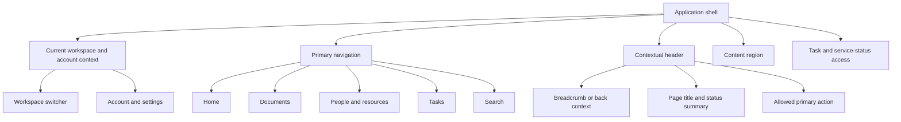

# Phase 1 Information Architecture

| Field | Value |
|---|---|
| Document ID | `UX-IA-001` |
| Version | `0.1` |
| Status | `DRAFT — product, design, accessibility, security, privacy, and architecture approval required` |
| Product phase | Phase 1 — Personal and Family |
| Primary outcomes | `OUT-P1-001`–`OUT-P1-007` |
| Primary features | `FEAT-P1-001`–`FEAT-P1-006`, `FEAT-P1-008`–`FEAT-P1-025`, `FEAT-P1-027`, `FEAT-P1-029`–`FEAT-P1-030` |
| Primary journeys | `JRN-P1-001`–`JRN-P1-010` |
| Approved boundaries | `DEC-032`, `DEC-034`, `DEC-036`–`DEC-040`, `DEC-044`, `DEC-047`, `DEC-049`–`DEC-053`, `DEC-055` |
| Updated | 30 August 2026 |

## 1. Purpose and boundary

This document defines the Phase 1 information architecture for the React public website and authenticated web/PWA plus the authenticated Flutter iOS/Android clients: public product/trust/legal entry, workspace context, global navigation, resource dossiers, screen hierarchy, route identity, disclosure behavior, responsive adaptation, and gated surfaces. React and Flutter use their own UI source code under `DEC-052`, but implement the same protected journey, state, evidence, authorization, and accessibility semantics. The public product, privacy, terms, contact, and browser account-entry routes are React-specific under `DEC-044`. This document does not select a router, component library, analytics product, or device-specific navigation implementation. Visual implementation follows the Doculyra identity approved by `DEC-047` while retaining semantic, accessible tokens.

The IA is an authorized projection of product state, not an authorization source. Identity, workspace, subject, membership, owner binding, relationship, grant, approval, and resource remain distinct under `WSP-P1-001`–`WSP-P1-032`. A hidden resource cannot be inferred from a route, tab, breadcrumb, count, facet, error, focus announcement, cached view, or timing difference (`AUTH-P1-008`–`AUTH-P1-011`, `AUTH-P1-025`, `NFR-P1-033`).

## 2. Mental model

Phase 1 uses five user-facing concepts:

| Concept | Plain-language meaning | Domain boundary |
|---|---|---|
| Workspace | The personal or family context currently in use | One explicit `WorkspaceId`; never inferred from the resource URL alone |
| Person or resource | The subject, property, vehicle, policy, provider, or other configured thing whose records are being understood | Stable `Subject` or `ResourceEntity`; a relationship is not authority |
| Document | A logical record with immutable source versions, evidence, processing, and lifecycle | `LogicalDocument`, `DocumentVersion`, `ArtifactRecord`, `DocumentAnalysis` remain distinct |
| Finding or work | A conflict, expected-evidence signal, impact, recommendation, task, approval, execution, or verification needing attention | Each owning aggregate/state remains separate; no aggregate readiness score |
| Evidence | The exact authorized page, span, region, source snapshot, occurrence, or rule supporting a claim | Citation/anchor access is reauthorized on open |

“Household” may be used in explanatory copy but MUST NOT imply that every participant sees every person or resource. “People & resources” is the navigation label; configured kinds are presented only when active and authorized. “Connections” is the plain-language label for dependency records and impact paths; a raw graph is an optional view of the same authorized data, not the primary mental model.

## 3. Responsive shell

| Viewport mode | Required shell behavior |
|---|---|
| Compact | One-column content; persistent or easily reached primary navigation with labelled destinations; current workspace remains discoverable; contextual actions use a labelled menu when space is insufficient; no essential action is icon-only. |
| Medium | Primary navigation may use a rail or header; dossiers may show a tab/section navigator plus one main content column. |
| Wide | Primary navigation may remain visible; a bounded secondary pane may show evidence, filters, or task context. No critical meaning depends on simultaneous panes. |

Viewport breakpoints are implementation tokens, not device names. The reflow acceptance boundary is 320 CSS px and 400% zoom under `NFR-P1-024`. The PWA does not imply offline content storage: `SEC-P1-016` forbids persisting raw documents, tokens, evidence, or answers offline without a separately approved threat model.

### 3.1 Public product, trust, legal, and account entry

The React public surface is outside the protected workspace shell. It provides a stable path through product purpose, evidence-aware intelligence, features, privacy/security boundaries, company/about, contact availability, privacy, terms, create-account, and sign-in content. Its compact and wide navigation MUST expose the same destinations and account-entry outcomes.

Public content MUST:

1. use the approved Doculyra identity and `Doculyra Home` Phase 1 edition without implying that reserved Business or Enterprise editions are available;
2. distinguish illustrative product examples from live customer data and label the current synthetic-data development-preview boundary;
3. describe evidence-aware AI, device-local/default processing, disabled integrations, security, deletion, and availability only to the exact level supported by the approved decision and current environment;
4. provide direct, stable privacy and terms routes plus a contact route or an accurate unavailable state when production contact delivery is not configured;
5. route create-account and sign-in actions to the correct browser account-entry mode without treating authentication as authorization to a workspace; and
6. preserve headings, landmarks, focus, reflow, reduced-motion, contrast, keyboard operation, and meaningful link labels without collecting protected workspace information.

Final production legal wording, operator identity, contact address/domain, public release claims, and conformance evidence remain release-gated. Their absence cannot be hidden by placeholder success or an invented contact destination.

## 4. Global navigation map

| Destination | User outcome | Contents | Must not expose |
|---|---|---|---|
| Home | Resume the safest next authorized work | User-owned task/finding summaries, active ingestion jobs, service/source limitations, recent authorized activity, capture entry point | Aggregate health/compliance score; restricted-item counts; family-wide totals derived from hidden resources |
| Documents | Find and manage authorized logical documents | Search/filter, current/historical versions, processing/lifecycle state, capture, supported type/coverage disclosure | Quarantine/clinical preview; inaccessible titles/types/counts; a file-presence-as-fulfilment claim |
| People & resources | Navigate subject/resource dossiers | Authorized subjects and configured resource kinds, with privacy-safe summaries | Relationship-as-authority, hidden members/resources, organisation hierarchy |
| Tasks | Coordinate actions and verification | Assigned tasks, approvals, reminders, action/evidence state, in-app notifications | Evidence values not authorized to the assignee; external-channel assumption |
| Search | Retrieve or ask with evidence | Full-text/metadata/semantic search, cited Q&A, comparison entry, explicit limitation states | Hidden corpus counts/facets; arbitrary-web authority; uncited consequential claims |
| Settings | Manage the current actor's allowed preferences and workspace participation | Profile/security entry, notification preferences, membership/grants where authorized, export/deletion entry, coverage/legal copy | Enterprise policy console; support impersonation; unapproved recovery/continuity/residency claims |

Global service state is announced near the relevant destination and in a compact service-status access point. A global banner is reserved for current, user-relevant limitations such as offline, authorization unavailable, or an affected capability disabled. It MUST NOT reveal a source, document, subject, or finding that the actor cannot otherwise discover.

## 5. Dossier architecture

### 5.1 Person or resource dossier

| Section | Contents | Empty/limited behavior |
|---|---|---|
| Overview | Authorized identity attributes, context, current item-level findings, next actions | “Nothing available in your current access” rather than a claim that no records exist |
| Documents | Authorized logical documents and versions linked to the dossier | Count only authorized serviceable entries; loading, restricted, stale projection, and true empty remain distinct |
| Facts | Authorized canonical facts, occurrences, conflicts, valid/known perspective | Protected values may be redacted while an approved minimal action remains; no conflict count leak |
| Connections | Authorized dependencies and inspectable impact paths | List-first representation; graph view declares truncation, stale, restricted, and incomplete scope |
| Expected evidence | Authorized requirement cases, item-level signals, evidence options, dispositions, fulfilment | No score, percentage, colour summary, hidden denominator, or claim of complete legal coverage |
| Activity | Authorized privacy-safe events for that dossier | Activity scope and omissions are explained; no raw content or hidden actor/resource existence |

### 5.2 Document dossier

| Section | Contents | Governing boundary |
|---|---|---|
| Summary | Document identity, type/profile, effective/availability/processing states, subject/resource links | Each state displayed separately; `READY` is processing readiness only |
| Evidence | Exact authorized anchors and extracted field proposals | Source/review side-by-side; anchor open reauthorizes version, field, region, and purpose |
| Facts | Occurrences proposed from this version and their resolution state | Accepting extraction is not canonical fact resolution |
| Versions | Immutable versions, relationships, availability and effective status, comparison | Supersession/amendment/addendum/cancellation are explicit; no silent controlling-version claim |
| Related | Authorized typed dependencies, requirements, impacts, tasks | No implicit graph expansion or restricted path/count disclosure |
| Access | Authorized grants affecting the document and effective-access explanation | Membership is not blanket access; no grantee enumeration outside permission |
| Activity | Authorized processing, review, version, share, export, and deletion events | Minimized under `AUD-P1-025`–`AUD-P1-029` |

The document dossier MUST show availability, effective status, processing state, review state, and deletion state as separate labelled values. A conformed view is presented as a derived interpretation with its exact `valid_at`, `known_at`, source coverage, and `RESOLVED`, `CONFLICTED`, `INCOMPLETE`, `RESTRICTED`, or `UNAVAILABLE` outcome (`DIT-VER-P1-018`–`DIT-VER-P1-025`).

### 5.3 Work dossier

An impact, recommendation, action, task, or requirement case has a common work-dossier frame:

1. what changed or is needed;
2. which authorized subject/resource is affected;
3. applicability and evidence;
4. an inspectable typed path or rule/profile basis;
5. separate severity, urgency, confidence, evidence strength, source authority, source health, and coverage;
6. current approval/execution/verification/fulfilment state;
7. allowed next actions and their consequences; and
8. privacy-safe activity/history.

The frame does not flatten these records into one “done” state. Submission, provider acknowledgement, task completion, replacement evidence receipt, verification, requirement fulfilment, and case closure remain visibly separate (`DIT-IMP-P1-025`–`DIT-IMP-P1-044`, `DIT-HLT-P1-014`–`DIT-HLT-P1-023`).

## 6. Route, link, and context contract

Routes use stable opaque resource IDs and an explicit workspace context. Human-readable slugs MAY be decorative but cannot be the only identity or authorization input. Links copied from protected views do not carry authority; opening them reauthenticates and reauthorizes.

| Route outcome | User-facing behavior |
|---|---|
| Authorized and current | Render the requested screen with current policy/epoch and data state. |
| Authentication required | Preserve a safe return intent without protected title/value; after sign-in, reauthorize from scratch. |
| Step-up required | Explain the high-impact action and preserve non-sensitive draft state; do not start the effect before renewed authorization. |
| Restricted/not found | Use the configured disclosure class. When existence is protected, use one normalized message and timing class. |
| Grant revoked or expired | Replace content with a revocation/expiry state that exposes only safe grant context; clear protected panes, caches, previews, and conversation context. |
| Resource deleted/fenced | Block content and late navigation; show only the actor-authorized deletion state and recovery option, if any. |
| Offline/dependency unavailable | Show cached shell/status only when policy permits; never display protected cached content as current. Preserve a safe retry intent. |
| Stale/partial projection | Label watermark/coverage safely, use approved canonical fallback where available, and avoid a complete/no-result conclusion. |

Back/forward navigation, browser history, app switching, print, download, clipboard, recent-route labels, service-worker cache, and OS previews MUST NOT retain protected titles or content after revoke, expiry, sign-out, deletion, or workspace change beyond approved policy.

## 7. Privacy-safe summaries and counts

Counts are derived disclosures, not harmless chrome. Each count, badge, facet, tab presence, empty state, and sort order MUST have a disclosure policy.

| Pattern | Required behavior |
|---|---|
| Exact count | Show only when every counted item's existence is authorized and the aggregate is approved. |
| Bounded attention badge | May show the actor's own authorized actionable items; the label states scope, for example “Your tasks.” |
| Restricted contributors | Omit, suppress, or use an approved minimal action signal without changing a visible total in a way that reveals hidden items. |
| Empty state | Say “No items available in this view” unless the service can safely assert that no eligible item exists. |
| Hidden or stale denominator | Do not calculate a percentage, readiness measure, comparison delta, or ranking. |
| Differential views | Switching workspace, filter, grant, or time perspective MUST NOT disclose protected existence through count timing or unexplained deltas. |

Home and dossier ordering uses explicit, inspectable fields such as due date, updated time, user choice, or authorized severity. Under approved `DEC-034`, it MUST NOT use a hidden aggregate readiness, compliance, risk, confidence, or restricted-item signal.

## 8. Navigation-state matrix

| State | Shell | Primary content | Actions |
|---|---|---|---|
| Loading | Stable landmarks and current safe workspace label; skeletons retain structure | No fake data; labelled busy region | Disable only affected actions; cancellation remains available where safe |
| Empty | Full navigation for authorized destinations | Explain scope and one safe next step | Offer capture/create only if authorized |
| Partial | Show affected destination and coverage label | Render authorized successful portions plus omitted/failed classes | Retry or narrow scope without implying completeness |
| Error | Preserve shell and entered safe state | Specific recoverable problem; correlation/support code contains no content | Retry, save/leave, or alternate route as contract permits |
| Offline | Persistent offline status | No protected content unless separately approved; queued local mutation is not presented as accepted | Reconnect/retry; file selection may be preserved only under approved client-storage policy |
| Stale | Mark affected region and last safe watermark/time | Historical/last-known content is explicitly dated and not current | Refresh or use canonical fallback; consequential action may be blocked |
| Restricted | Normalized, policy-selected disclosure | No protected existence/value | Safe request/access route only if policy explicitly supports one |
| Revoked/expired | Remove protected content immediately | Safe grant state and what the actor can do next | Sign in/re-request only when approved; no stale citation/download |
| Deleted/fenced | Remove serviceable content and derivatives | Actor-authorized lifecycle status/residual classes only | Restore/cancel only if the current deletion policy/state permits |

## 9. Draft normative rules

- `UX-IA-P1-001` — Every protected route and view MUST bind one current actor/workload, one explicit workspace, purpose, resource scope, policy epoch, and disclosure class before content or existence is shown.
- `UX-IA-P1-002` — The Phase 1 global destinations MUST be Home, Documents, People & resources, Tasks, Search, and contextual Settings; organisation/enterprise administration destinations MUST be absent.
- `UX-IA-P1-003` — The current workspace MUST remain perceivable on every protected screen and workspace switching MUST clear or reauthorize content, filters, conversations, caches, and pending effects.
- `UX-IA-P1-004` — PERSONAL and FAMILY workspaces MAY be shown when eligible; ORGANISATION and Phase 2 enterprise concepts MUST remain inert and undiscoverable.
- `UX-IA-P1-005` — Identity, subject, relationship, membership, ownership, grant, approval, and resource MUST use distinct labels and explanatory copy; no navigation label may imply one grants another.
- `UX-IA-P1-006` — Global and contextual navigation MUST be operable at 320 CSS px, 200% text resize, and 400% zoom without loss of destination or two-dimensional scrolling except intrinsically two-dimensional content.
- `UX-IA-P1-007` — Compact navigation MUST expose labelled destinations without hover, fine pointer, drag, device orientation, or icon recognition as the only access method.
- `UX-IA-P1-008` — Person/resource and document dossiers MUST preserve the section boundaries defined in section 5 and MUST reauthorize each section independently.
- `UX-IA-P1-009` — Dossier tabs, badges, presence, ordering, counts, and empty states MUST NOT reveal inaccessible resources, fields, edges, subjects, evidence, or activity.
- `UX-IA-P1-010` — A resource dossier MUST use a list-first, plain-language representation; any graph visualization is secondary, bounded, keyboard-accessible, text-equivalent, and explicit about cycles, truncation, freshness, and omissions.
- `UX-IA-P1-011` — Document availability, effective status, processing, review, fact resolution, requirement fulfilment, approval, execution, verification, closure, and deletion MUST never collapse into one status.
- `UX-IA-P1-012` — Evidence and citation navigation MUST bind the exact version/anchor and reauthorize artifact, field/region, purpose, deletion state, and current policy at open time.
- `UX-IA-P1-013` — Search navigation, facets, snippets, result counts, answer claims, citations, and conversation history MUST preserve the `AI-RAG-P1-001`–`AI-RAG-P1-030` authorization and limitation contract.
- `UX-IA-P1-014` — Work dossiers MUST display applicability, impact class, severity, urgency, confidence, evidence strength, source authority, source health, and coverage as separate labelled dimensions.
- `UX-IA-P1-015` — Under approved `DEC-034`, no IA surface, sort, badge, progress ring, dashboard tile, percentage, trend, or traffic light may emit or imply aggregate readiness/content-health/compliance/risk.
- `UX-IA-P1-016` — Home MAY summarize only currently authorized actionable records and service states; it MUST NOT use household-wide hidden denominators or present the absence of visible findings as completeness.
- `UX-IA-P1-017` — Route IDs MUST be stable opaque identifiers; slugs, titles, names, filenames, document labels, and query text are presentation only and MUST NOT become authorization or identity.
- `UX-IA-P1-018` — Protected deep links MUST reauthenticate and reauthorize, and their unauthorized/not-found responses MUST follow normalized minimal-disclosure copy and timing.
- `UX-IA-P1-019` — Revocation, expiry, workspace change, deletion, or sign-out MUST remove protected content from active panes, history labels, previews, cached conversations, pending downloads, and serviceable client storage under policy.
- `UX-IA-P1-020` — Loading, empty, partial, error, offline, stale, restricted, revoked, expired, deleted, quarantined, and unavailable MUST be distinct programmatic and visual states.
- `UX-IA-P1-021` — Async work MUST remain findable from its originating dossier and Tasks where authorized, with durable state, last update, safe retry/resume/cancel behavior, and no fabricated completion.
- `UX-IA-P1-022` — Offline PWA behavior MUST default to shell/status and safe retry intent only; raw documents, evidence, answers, tokens, or protected values MUST NOT be stored offline without a separately approved decision and threat model.
- `UX-IA-P1-023` — Quarantined and suspected-clinical `POLICY_HOLD` resources MUST have no ordinary preview, download, evidence, search, graph, AI, notification, or analytics route.
- `UX-IA-P1-024` — Under approved `DEC-036`, clinical-hold navigation MUST expose only a generic containment status and separately authorized restricted review/delete entry; it MUST NOT imply an ordinary processing path or invent a retention outcome.
- `UX-IA-P1-025` — In-app task/notification navigation is required; customer external-channel destinations and success states MUST remain unavailable until an exact approved channel is configured and conformed under `DEC-037`.
- `UX-IA-P1-026` — Automated continuity navigation, enrolment, nominee, trigger, release, and guarantee surfaces MUST be absent because `DEC-032` excludes that capability from Phase 1.
- `UX-IA-P1-027` — Recovery, factor bypass, ownership transfer, support override, and resource reassignment surfaces MUST be absent or explicitly unavailable under approved `DEC-038` until a separate production assurance decision.
- `UX-IA-P1-028` — Deletion navigation MUST distinguish archive, Trash, restore, deletion request, fence, purge, backup residual, tombstone, and completion evidence. The production document route uses the `DEC-053` 30-calendar-day Trash boundary; account deletion, lawful retention, local-profile behavior, and other residual durations remain separate and MUST NOT be invented.
- `UX-IA-P1-029` — Residency and external-processing copy MUST identify the exact approved environment, data class, processor, and route. Azure `dev`/`stage` may identify synthetic-data placement under `DEC-049`; unknown/ineligible routes MUST block or visibly degrade, and no hosted AI route receives plaintext by implication under `DEC-050`/`055`.
- `UX-IA-P1-030` — Settings MUST be personal/family and action-scoped; it MUST NOT expose configuration publication, source maintenance, support impersonation, enterprise policy, SSO/SCIM, DLP, information-barrier, matter/case, or tenant-admin UI.
- `UX-IA-P1-031` — Every displayed count, facet, badge, tab, breadcrumb, recent item, route title, and sort order MUST have a testable disclosure classification and authorized denominator.
- `UX-IA-P1-032` — Navigation and route analytics MUST use opaque screen/flow/workspace class, safe state, interaction, timing, viewport and outcome fields only; raw names, titles, filenames, search/query/answer text, evidence, values, relationship details, unrestricted URLs, tokens, or screen captures are prohibited.

## 10. Traceability

| IA rule range | Product and journey trace | Architecture, intelligence, security, and NFR trace |
|---|---|---|
| `UX-IA-P1-001`–`UX-IA-P1-005` | `REQ-P1-WS-001`–`REQ-P1-WS-006`; `FEAT-P1-001`, `FEAT-P1-002`, `FEAT-P1-024`; `UC-P1-001`, `UC-P1-009`, `UC-P1-013` | `WSP-P1-001`–`WSP-P1-032`; `AUTH-P1-001`–`AUTH-P1-011` |
| `UX-IA-P1-006`–`UX-IA-P1-010` | `REQ-P1-DOC-005`; `JRN-P1-001`–`JRN-P1-006`; `PER-P1-005` | `NFR-P1-022`–`NFR-P1-025`; `DIT-GPH-P1-015`–`DIT-GPH-P1-024` |
| `UX-IA-P1-011`–`UX-IA-P1-016` | `REQ-P1-ING-007`, `REQ-P1-ACT-002`–`REQ-P1-ACT-008`, `REQ-P1-HLT-001`–`REQ-P1-HLT-005`; `UC-P1-003`–`UC-P1-008` | `DIT-EXT-P1-025`–`DIT-EXT-P1-035`; `DIT-IMP-P1-001`–`DIT-IMP-P1-044`; `DIT-HLT-P1-001`–`DIT-HLT-P1-036`; `AI-GRD-P1-009`–`AI-GRD-P1-016` |
| `UX-IA-P1-017`–`UX-IA-P1-022` | `REQ-P1-TRUST-001`–`REQ-P1-TRUST-004`; `UC-P1-002`, `UC-P1-005`, `UC-P1-010`, `UC-P1-013` | `SEC-P1-003`–`SEC-P1-019`; `AUTH-P1-019`–`AUTH-P1-025`; `NFR-P1-004`–`NFR-P1-006`, `NFR-P1-013`, `NFR-P1-016`–`NFR-P1-018` |
| `UX-IA-P1-023`–`UX-IA-P1-030` | `REQ-P1-DOC-007`, `REQ-P1-NTF-003`–`REQ-P1-NTF-004`, `REQ-P1-SHR-004`, `REQ-P1-TRUST-005`, `REQ-P1-TRUST-007`–`REQ-P1-TRUST-008`; `JRN-P1-008`–`JRN-P1-010` | `DIT-ING-P1-006`–`DIT-ING-P1-010`; `DIT-VER-P1-032`–`DIT-VER-P1-039`; `AUTH-P1-031`–`AUTH-P1-034`; `PRIV-P1-023`–`PRIV-P1-030`; `NFR-P1-032`, `NFR-P1-039` |
| `UX-IA-P1-031`–`UX-IA-P1-032` | `REQ-P1-TRUST-002`–`REQ-P1-TRUST-004`; `AC-P1-SEC-001` | `AUTH-P1-008`–`AUTH-P1-011`, `AUTH-P1-025`, `AUTH-P1-035`; `AUD-P1-025`–`AUD-P1-030`; `NFR-P1-033`, `NFR-P1-036`, `NFR-P1-041`–`NFR-P1-043` |

## 11. Validation obligations

Synthetic navigation tests MUST cover the React public-to-account-entry route, direct privacy/terms access, unavailable contact, illustrative-preview disclosure, shared React/Flutter protected journey semantics, multiple workspaces, owner-versus-private-resource boundaries, managed subjects without identities, compact/wide reflow, keyboard-only operation, stale projections, offline shell, source/model/authorization outage, clinical hold, count/facet/timing differentials, direct URL guessing, browser back after revoke, citation expiry, workspace switching mid-flow, deletion fence, and every configuration- or release-gated surface. The same tests MUST prove that Phase 2/enterprise destinations cannot be discovered as active product routes, menus, search, help, shortcuts, or analytics.
