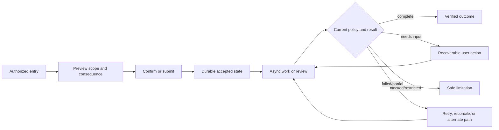
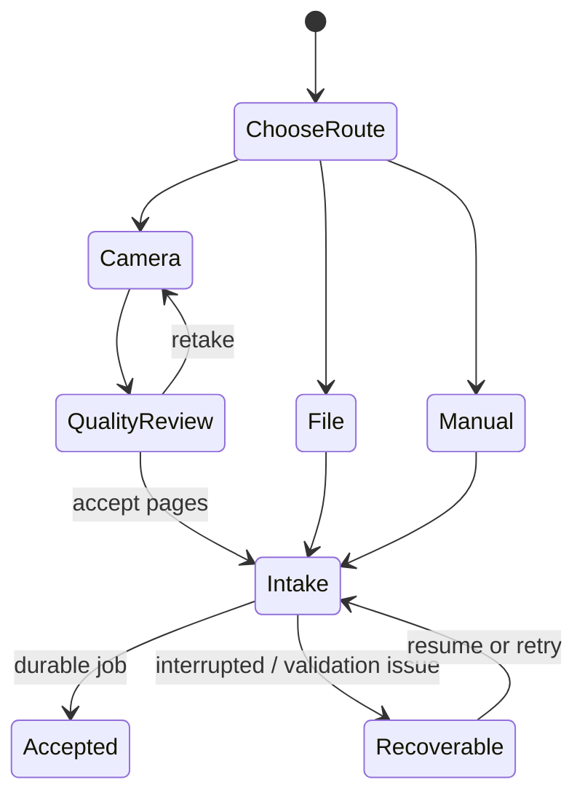
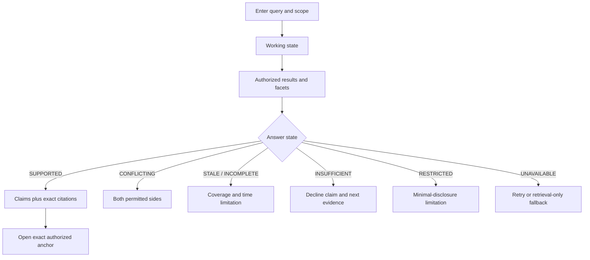
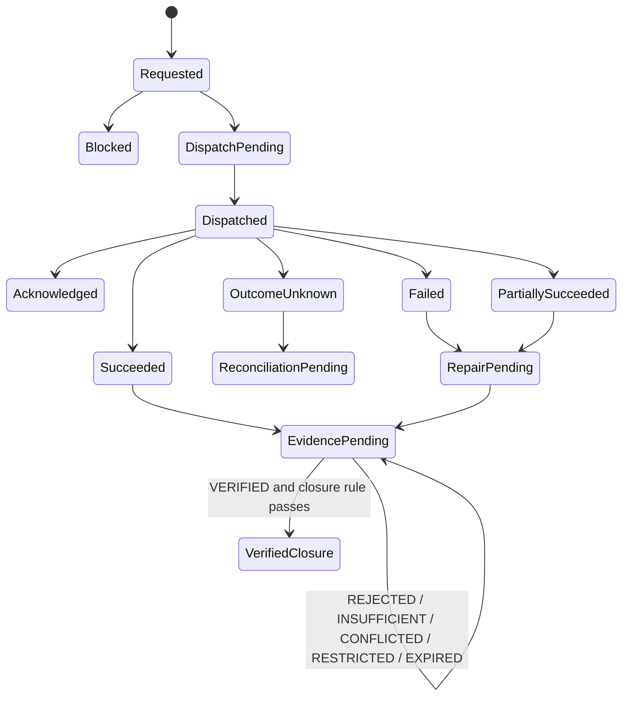

# Phase 1 User Flows

| Field | Value |
|---|---|
| Document ID | `UX-FLOW-001` |
| Version | `0.1` |
| Status | `DRAFT — product, design, accessibility, security, privacy, and quality approval required` |
| Product phase | Phase 1 — Personal and Family |
| Primary use cases | `UC-P1-001`–`UC-P1-013`; conditional catalogue boundaries `UC-P1-016`–`UC-P1-017` |
| Primary acceptance | `AC-P1-E2E-001`, `AC-P1-SEC-001`, `AC-P1-ING-001`, `AC-P1-RAG-001`, `AC-P1-MON-001`, `AC-P1-DEL-001`, `AC-P1-AI-001`, `AC-P1-A11Y-001` |
| Approved boundaries | `DEC-032`, `DEC-034`, `DEC-036`–`DEC-040`, `DEC-044`, `DEC-047`, `DEC-049`–`DEC-053`, `DEC-055` |
| Updated | 30 August 2026 |

## 1. Purpose and common flow contract

This document defines the user-visible sequence, branching, recovery, and completion criteria for critical Phase 1 journeys. Authenticated journeys have shared semantic outcomes across React web/PWA and Flutter iOS/Android under `DEC-052`; each client implements and verifies those outcomes in its own UI source. The public product, trust, privacy, terms, contact, and browser account-entry journey is React-specific under `DEC-044`. This document does not replace the use-case state machines, authorization policy, domain transitions, API contracts, or test specifications.

Every flow binds the current actor, workspace, subject/resource scope, purpose, authorization/policy epoch, expected revision where changing state, and correlation/idempotency identity. Each asynchronous boundary exposes a durable status, lets the user safely leave and return, and distinguishes retry, cancel, review, restriction, deletion, and unknown external outcome. A UI transition is not evidence that the owning domain transition succeeded.

## 2. Critical flows

### `UX-FLOW-P1-001` — onboard and establish a workspace

**Actors:** eligible identity; household organiser, caregiver, privacy-conscious adult, or low-confidence user.
**Entry:** signed-in eligible actor with no selected workspace, or explicit “create workspace.”
**Outcome:** one PERSONAL or eligible FAMILY workspace, one owner binding, owner membership, owner subject link, declared configuration/residency context, and durable audit; no duplicate or orphan state.

1. Explain purpose, personal/family boundary, Australian-first but not complete coverage, sensitive-data handling, clinical exclusion, AI review, monitoring limits, portability, and unavailable recovery/continuity routes.
2. Let the actor select PERSONAL or eligible FAMILY. ORGANISATION is absent.
3. Collect only required workspace attributes, terms/consent records, and current supported configuration choices. Do not require a document, dependant, family member, broad sharing, or marketing consent.
4. Preview that ownership is not blanket private-content authority and that subjects, memberships, and grants are separate.
5. Submit with an idempotency key; show `Creating` until all required records and audit/event obligations are durable.
6. On success, announce the created workspace and one safe next step: add a subject/resource, capture a document, or invite a member where authorized.

**Recovery:** same request/key returns the existing result; different request/key conflict is explained without duplicating. Validation preserves non-sensitive input. Policy, audit, or residency-route failure leaves no partial “active” workspace and provides retry or support-safe correlation. `DEC-038` means no recovery enrolment prompt.
**Trace:** `REQ-P1-WS-001`–`REQ-P1-WS-003`, `FEAT-P1-001`, `UC-P1-001`, `JRN-P1-001`, `WSP-P1-033`, `NFR-P1-003`–`NFR-P1-005`.

### `UX-FLOW-P1-002` — add subjects, relationships, members, and scoped participation

**Actors:** authorized owner/member administrator; represented subject; intended invitee.
**Entry:** active workspace.
**Outcome:** stable subject/relationship or invited/active membership, with resource access created only through separate explicit grants.

1. Choose “Add person or resource” or “Invite someone.” The first path never asks for fabricated login/contact details for a managed subject.
2. For a subject, collect configured minimum identity/context and effective-dated relationship evidence; state that relationship does not prove consent, guardianship, or access authority.
3. For an invitation, select a participation class, intended audience, expiry, and safe delivery route; preview administrative capabilities separately from actual resource/field/action access.
4. If access is intended, construct independent grants with purpose, exact resources/fields/actions, valid time, export/onward-sharing constraints, and effective-access preview.
5. On acceptance, authenticate the intended audience and reauthorize invitation, membership, and each grant; publish the authorization epoch before showing protected data.

**Alternatives:** duplicate subject candidates route to review; duplicate/member-existing invitations converge safely; wrong audience, expired/cancelled invitation, stale authority, or over-broad grant fails without enumerating the workspace. Managed-dependant transition remains proposal-only and cannot activate independent access.
**Trace:** `REQ-P1-WS-003`–`REQ-P1-WS-007`, `REQ-P1-SHR-001`–`REQ-P1-SHR-003`, `FEAT-P1-001`, `FEAT-P1-024`, `UC-P1-001`, `UC-P1-009`, `WSP-P1-006`–`WSP-P1-009`, `WSP-P1-021`–`WSP-P1-039`.

### `UX-FLOW-P1-003` — capture by file, camera, or manual record

**Actors:** any actor authorized to create the selected resource.
**Entry:** capture action from Home, Documents, or a dossier.
**Outcome:** durable acquisition/ingestion identity and observable job; not a claim of scanning, extraction, filing, or readiness.

1. Show supported format/profile behavior from active reference data, destination workspace and optional subject/resource, purpose, network state, and external-processing/residency availability.
2. Camera route provides capture guidance, page order, rotate/crop controls, and a file/manual alternative. No critical instruction is visual-only.
3. File/manual selection validates client-safe limits without claiming server acceptance. Filename, extension, and document instructions are untrusted.
4. Submit with progress and cancel where safe. Durable acceptance returns the same job on retry and preserves every acquisition attempt.
5. Explain exact-hash duplicate as a possible match only; let policy/user review logical identity rather than auto-merging.

**Recovery:** interrupted transfer resumes only from a verified checkpoint; otherwise restart without duplicate logical effect. Unsupported, zero-byte, encrypted, corrupt, oversized, wrong media, low-quality camera, client-storage denial, offline, or ineligible processor route gives a specific alternative. Local data is not described as uploaded until durable acceptance.
**Trace:** `REQ-P1-ING-001`–`REQ-P1-ING-004`, `REQ-P1-DOC-001`, `REQ-P1-DOC-006`, `FEAT-P1-003`–`FEAT-P1-005`, `UC-P1-002`, `JRN-P1-002`, `DIT-ING-P1-001`–`DIT-ING-P1-018`, `NFR-P1-008`, `NFR-P1-012`.

### `UX-FLOW-P1-004` — handle malware quarantine or suspected clinical policy hold

**Actors:** uploader; separately authorized restricted reviewer/remediator.
**Entry:** ingestion reaches `QUARANTINED` or `POLICY_HOLD`.
**Outcome:** unsafe/decision-pending content remains isolated; only an approved transition can release, rescan, reject, or delete it.

1. Replace ordinary document preview and metadata with a generic safety status, safe job reference, last state time, and whether the user may leave.
2. Do not expose document image/text, extracted values, title if sensitive, clinical classification detail, malware payload, or diagnostic trace.
3. Block preview, download, OCR/native parsing, AI, embeddings, search, graph, monitoring, notifications, ordinary support, and analytics.
4. Offer only the actor's authorized containment actions. Malware rescan/release/delete and clinical false-positive review/delete are separate actions; ordinary document read or workspace administration is insufficient.
5. Reauthorize at every action and retain privacy-safe audit.

**Clinical boundary:** approved `DEC-036` places suspected clinical content in `POLICY_HOLD`. The UI MUST NOT expose an ordinary processing route or promise retention, recovery, export, purge, or a false-positive transition that the configured restricted-review policy does not provide. If no approved restricted action exists, show “contained; action unavailable under the current policy” without asking the user to describe clinical content.
**Failure:** scanner unavailable/timeout stays isolated; reviewer loses access and the content disappears behind a normalized restricted state; deletion race makes the fence win; late scan/review cannot reactivate content.
**Trace:** `REQ-P1-DOC-007`, `REQ-P1-ING-002`–`REQ-P1-ING-003`, `FEAT-P1-005`, `UC-P1-002`, `JRN-P1-009`, `DIT-ING-P1-006`–`DIT-ING-P1-010`, `SEC-P1-013`–`SEC-P1-016`, `AUTH-P1-031`.

### `UX-FLOW-P1-005` — observe processing, review extraction, and correct proposals

**Actors:** uploader; authorized reviewer.
**Entry:** clean, policy-eligible ingestion job.
**Outcome:** `READY` processing state or explicit review/failure/cancel/deletion state; accepted-as-extraction fields retain exact evidence and do not become canonical facts automatically.

1. Present the exact ingestion state: `VALIDATING`, `SAFETY_CHECKING`, `PROCESSING`, `NEEDS_REVIEW`, `PUBLISHING`, `READY`, `FAILED_RETRYABLE`, `FAILED_TERMINAL`, `CANCELLING`, `CANCELLED`, `DELETION_BLOCKED`, `PURGE_PENDING`, or `PURGED` as applicable.
2. Show completed/current/remaining stage categories without invented ETA. Let the user leave; place the job in authorized Tasks/Documents.
3. At `NEEDS_REVIEW`, show document type/profile and each field proposal beside its exact page/span/region evidence, source form, normalized value, confidence/calibration band, validation issues, and review reason.
4. Reviewer may accept-as-extraction, correct with preserved source proposal, reject, defer, or request reprocessing according to policy. Bulk acceptance is never implicit and requires field-level preview/authority.
5. Correction appends review evidence. Reprocessing creates a new `DocumentAnalysis` generation and comparison; it never changes original bytes or rewrites prior output.

**Failure/recovery:** OCR/parser/model timeout, invalid schema, partial page, citation failure, budget exhaustion, provider refusal, publication lag, or revoked access produces an explicit state. Successful fields may remain visible only with declared partial coverage. Cancel/deletion intent wins over late output.
**Trace:** `REQ-P1-ING-002`, `REQ-P1-ING-005`–`REQ-P1-ING-008`, `FEAT-P1-009`, `UC-P1-002`, `DIT-EXT-P1-001`–`DIT-EXT-P1-035`, `AI-OUT-P1-001`–`AI-OUT-P1-025`, `NFR-P1-011`–`NFR-P1-013`.

### `UX-FLOW-P1-006` — inspect a document, exact evidence, versions, and conformed view

**Actors:** any currently authorized document reader; reviewer where separately permitted.
**Entry:** authorized document dossier or citation.
**Outcome:** user can distinguish immutable source versions, derived analyses, availability/effective state, comparison, and exact evidence.

1. Open the logical document summary with separate availability, effective, processing, review, fact, requirement, and deletion states.
2. Select an exact version. Reauthorize original/preview and request a short-lived scoped artifact grant only on demand.
3. Open an evidence anchor at exact version/page/span/region; synchronize source and field without trapping focus or exposing adjacent restricted regions.
4. Inspect explicit `SUPERSEDES`, `AMENDS`, `ADDENDUM_TO`, or `CANCELS` relationships with scope, evidence, valid/known perspective, review, and conflicts.
5. Compare ordered exact versions. Show changed/unchanged-within-scope/indeterminate/review outcome, two-sided citations, coverage, uncertainty, and algorithm/model version.
6. If a conformed view is requested, show `valid_at`, `known_at`, included/excluded/restricted/conflicted/missing sources and its `RESOLVED`, `CONFLICTED`, `INCOMPLETE`, `RESTRICTED`, or `UNAVAILABLE` state.

**Failure:** wrong-version/expired/revoked artifact grant, missing representation, unresolved anchor, partial comparison, restricted side, stale projection, deletion, or evaluator outage never becomes “unchanged” or “no effective clause.”
**Trace:** `REQ-P1-DOC-001`–`REQ-P1-DOC-005`, `REQ-P1-DOC-008`, `REQ-P1-SRCH-005`, `FEAT-P1-008`, `FEAT-P1-015`, `UC-P1-003`, `DIT-VER-P1-001`–`DIT-VER-P1-031`, `DIT-EXT-P1-008`–`DIT-EXT-P1-013`.

### `UX-FLOW-P1-007` — resolve a fact conflict or record a fact change

**Actors:** authorized fact reviewer/resolver; affected member with narrower visibility.
**Entry:** fact dossier, extraction review, conflict finding, or explicit “propose change.”
**Outcome:** additive bitemporal resolution/dispute history and, when material, one idempotent `ChangeCase`; evidence remains preserved.

1. Show the fact definition, target subject/resource, `valid_at`/`known_at`, current permitted value, and occurrence/conflict state.
2. Present authorized competing occurrences with source kind, exact anchors, effective time, source/review state, and separate confidence. A restricted occurrence is never summarized from its hidden value.
3. Allow an authorized actor to propose a value/time, accept evidence, retain current, correct, dispute, tolerate conflict, supersede a resolution, or record insufficiency according to policy.
4. Preview affected valid interval, prior/new state, reason, evidence, downstream reassessment, and whether additional approval is required.
5. Commit with expected revision. Preserve prior known-at history and surface `UNRESOLVED`, `RESOLVED_WITH_PRESERVED_CONFLICT`, `DISPUTED`, `INTENTIONALLY_TOLERATED`, `RESTRICTED`, `INSUFFICIENT`, or `EVIDENCE_UNAVAILABLE` as applicable.

**Failure:** stale revision refreshes the proposal without overwriting; entity ambiguity routes separately; deleted/unavailable anchor prevents unsupported resolution; revoked field access removes the value and any derived preview.
**Trace:** `REQ-P1-FCT-001`–`REQ-P1-FCT-006`, `FEAT-P1-010`–`FEAT-P1-011`, `UC-P1-004`, `JRN-P1-004`, `DIT-FCT-P1-001`–`DIT-FCT-P1-035`, `AC-P1-E2E-001`.

### `UX-FLOW-P1-008` — search, ask, verify citations, and continue safely

**Actors:** any currently authorized member/guest within exact grant and purpose.
**Entry:** global Search or scoped dossier search.
**Outcome:** authorized results and a cited structured answer, or an explicit limitation with a bounded next step; no product mutation.

1. Bind current workspace, purpose, resource/subject/date/version scope; never use query text as authority.
2. Show a working state within the provisional `NFR-P1-011` objective and provide cancel/new-query control.
3. Render only authorized results, counts, facets, snippets, and citations. Relevance is not confidence or evidence strength.
4. Label any combination of `SUPPORTED`, `CONFLICTING`, `STALE`, `INCOMPLETE`, `INSUFFICIENT`, `RESTRICTED`, and `UNAVAILABLE` with plain-language meaning, coverage, temporal perspective, and safe next step.
5. Material claims link to exact document version/page/passage/region or governed source snapshot. Citation open reauthorizes; failure removes the unsupported claim or returns insufficiency.
6. Continuing conversation reauthorizes every prior source and turn. Search/answer can create a separately confirmed task entry only through the owning workflow; it cannot change facts, grants, approvals, actions, exports, deletion, fulfilment, or closure.

**Failure:** stale index, semantic-store outage, model refusal/timeout, revoked source during generation, conflicting sources, hidden source, budget cap, deletion, or citation-integrity failure follows `AI-RAG-P1-025` and never uses a cached answer as current.
**Trace:** `REQ-P1-SRCH-001`–`REQ-P1-SRCH-005`, `FEAT-P1-013`–`FEAT-P1-014`, `UC-P1-005`, `JRN-P1-003`, `AI-RAG-P1-001`–`AI-RAG-P1-030`, `AC-P1-RAG-001`.

### `UX-FLOW-P1-009` — encounter a stale, failed, or partially covered source

**Actors:** affected household user; trusted-source maintainer only in a separate operational product boundary.
**Entry:** a source-derived finding, rule, answer, task, or monitor has unhealthy source state.
**Outcome:** user understands what is unavailable or historical and which action remains safe; no last-known result appears current.

1. Show authority tier, approved coverage description, last attempt, last success, last observation/snapshot, freshness, parser version class, and health state only to the authorized degree.
2. Keep source authority, freshness, health, coverage, evidence strength, confidence, applicability, severity, and urgency separate.
3. Display exact source state: `HEALTHY`, `DEGRADED`, `STALE`, `FAILED_RETRYING`, `FAILED_EXHAUSTED`, `PARSER_FAILED`, `COVERAGE_PARTIAL`, `SUSPENDED`, `DISABLED`, or `UNKNOWN`.
4. Mark dependent content historical, stale, incomplete, review-required, or unavailable according to policy; explain whether a prior action/approval remains valid.
5. Offer refresh/retry visibility or a user task only when authorized. Parser/source repair and publication remain outside household UI.

**Recovery:** after approved repair, replay updates affected results deterministically without duplicate tasks/recommendations and preserves the failure chronology. A retrieval success alone does not clear parser failure or prove currency.
**Trace:** `REQ-P1-MON-003`–`REQ-P1-MON-007`, `FEAT-P1-016`–`FEAT-P1-018`, `UC-P1-006`, `JRN-P1-007`, `DIT-SRC-P1-001`–`DIT-SRC-P1-032`, `DIT-MON-P1-001`–`DIT-MON-P1-034`, `AC-P1-MON-001`.

### `UX-FLOW-P1-010` — inspect impact, recommendation, and bound approval

**Actors:** affected authorized member; approver where separately permitted; scoped adviser for permitted review.
**Entry:** accepted `ChangeCase`, monitor trigger, document/rule change, or expected-evidence finding.
**Outcome:** inspectable authorized impact and a bound decision; no effect yet unless the separate action flow executes.

1. Present the observed change and exact generation, applicability outcome (`APPLICABLE`, `NON_APPLICABLE`, `INDETERMINATE`, `REVIEW_REQUIRED`, `RESTRICTED`, `UNAVAILABLE`), predicate rationale, source/rule versions, and unknowns.
2. Show each affected item with exact authorized `ImpactPath`, coverage/truncation/cycle state, and one primary class: `AUTOMATIC_TECHNICAL_UPDATE_POSSIBLE`, `USER_ACTION_REQUIRED`, `EXTERNAL_NOTIFICATION_REQUIRED`, `REVIEW_REQUIRED`, or `NO_ACTION`.
3. Display severity, urgency, confidence/calibration, evidence strength, source authority, source health, and coverage separately. Never merge them into risk/readiness.
4. Recommendation states what changed, why it may apply, proposed effect, target, evidence, uncertainty, current revision, approval requirement, and safe alternatives.
5. Authorized decision options are `APPROVE_REQUEST`, `REJECT`, `EDIT`, `DEFER`, `DISMISS`, or `NOT_APPLICABLE` only when the active workflow permits each.
6. Before approval, preview exact inputs/effect hash, actor, policy, expiry condition, external consequence, evidence requirement, and invalidation conditions. Step-up where required.
7. Commit the approval as a separate durable record. A material change, expiry, revoke, source/rule change, or target revision invalidates it.

**Failure:** missing evidence/applicability/path cannot enter actionable state; restricted paths use named minimal disclosure or suppress; graph truncation and source failure route review; audit failure leaves consequence pending.
**Trace:** `REQ-P1-ACT-001`–`REQ-P1-ACT-006`, `FEAT-P1-018`–`FEAT-P1-019`, `FEAT-P1-023`, `UC-P1-007`, `JRN-P1-004`, `DIT-IMP-P1-001`–`DIT-IMP-P1-024`, `NFR-P1-034`.

### `UX-FLOW-P1-011` — execute, reconcile, submit evidence, and close

**Actors:** authorized executor; evidence submitter; independent verifier where policy requires.
**Entry:** current bound approval or non-consequential authorized task.
**Outcome:** explicit action result, verified replacement/fulfilment evidence, and closure only when the owning rule passes.

1. Reauthorize actor, target, current revision, policy, approval/effect hash, deletion/revocation, audit, processor/connector route, and idempotency before any effect.
2. Show the exact action class and state among `Requested`, `Blocked`, `DispatchPending`, `Dispatched`, `Acknowledged`, `OutcomeUnknown`, `Failed`, `Succeeded`, `PartiallySucceeded`, `ReconciliationPending`, `RepairPending`, `EvidencePending`, `ReversalPending`, or `Reversed`.
3. A provider acknowledgement or timeout is not success. Show completed and unknown portions without inviting duplicate manual execution.
4. When replacement evidence is required, guide file/camera/manual capture through normal intake and preserve its separate extraction/review state.
5. An authorized verifier returns `VERIFIED`, `REJECTED`, `INSUFFICIENT`, `CONFLICTED`, `RESTRICTED`, or `EXPIRED` against exact evidence criteria.
6. Close only when the owning closure rule, verification, current inputs, and audit pass. Time elapsed, task check-off, file receipt, extraction, or provider submission is insufficient.

**Recovery:** retry uses the same execution identity; unknown external outcome reconciles before retry; partial success supports bounded repair or reversal; revoked approval blocks future effect; deletion fence blocks late evidence/action results.
**Trace:** `REQ-P1-ACT-005`–`REQ-P1-ACT-008`, `FEAT-P1-019`, `UC-P1-007`, `JRN-P1-004`, `DIT-IMP-P1-025`–`DIT-IMP-P1-044`, `AC-P1-E2E-001`, `AC-P1-AI-001`.

### `UX-FLOW-P1-012` — resolve expected evidence or a document-health finding

**Actors:** authorized subject/representative; reviewer/verifier where separately permitted.
**Entry:** item-level requirement case or finding.
**Outcome:** explicit disposition plus independent evidence/verification/fulfilment state; no aggregate score.

1. Explain profile/rule version, jurisdiction/context, applicability, evidence basis, validity/freshness, current authorized signals, and whether the item is authoritative or non-authoritative guidance.
2. Signals may include `MISSING`, `POTENTIALLY_EXPIRED`, `STALE`, `SUPERSEDED`, `CONTRADICTORY`, `INSUFFICIENT`, `RESTRICTED`, and `SOURCE_OR_RULE_UNAVAILABLE`; multiple signals remain visible.
3. Offer only configured choices: add evidence, select accepted alternative, request waiver/review, select not applicable with reason, dismiss, or set reminder.
4. Record exact disposition (`EVIDENCE_ADDED`, `ALTERNATIVE_SELECTED`, `WAIVER_REVIEW_REQUESTED`, `NOT_APPLICABLE_SELECTED`, `DISMISSED`, `REMINDER_SET`) without silently changing applicability or fulfilment.
5. Evidence capture/review/verification stays separate. Fulfilment may be `UNASSESSED`, `UNMET`, `EVIDENCE_PENDING`, `VERIFICATION_REQUIRED`, `FULFILLED_PRIMARY`, `FULFILLED_ALTERNATIVE`, `FULFILLED_BY_APPROVED_EXCEPTION`, `CONFLICTED`, `RESTRICTED`, or `EXPIRED_OR_REOPENED`.

**Failure:** missing/inactive profile yields no authoritative finding; stale source/rule remains visible; unauthorized evidence does not become “missing”; unsupported alternative/waiver is not fulfilment; later material change reopens with history. `DEC-034` removes every aggregate score and hidden ranking.
**Trace:** `REQ-P1-HLT-001`–`REQ-P1-HLT-005`, `FEAT-P1-020`, `UC-P1-008`, `JRN-P1-005`, `DIT-HLT-P1-001`–`DIT-HLT-P1-036`.

### `UX-FLOW-P1-013` — manage tasks, reminders, and notification state

**Actors:** task owner/assignee; authorized reassigner; scoped adviser; workspace service.
**Entry:** Tasks, in-app notification, or causal recommendation/obligation/finding.
**Outcome:** current task state and preserved causality; notification delivery never changes domain truth.

1. List only authorized tasks with privacy-safe title/category, due/updated time, owner, source class, evidence requirement, and current state. Counts are actor-scoped and disclosure-approved.
2. Open the task to show causal recommendation/obligation/finding and evidence only to the actor's separate permissions.
3. Allow acknowledge, snooze, reassign, complete, reopen, or dismiss only when valid in the active workflow; preview any evidence/closure consequence.
4. In-app notification exposes a safe summary and deep link that reauthorizes. Delivery, seen, acknowledgement, and task state remain separate.
5. Preferences and quiet periods affect notification attempts, not task existence, urgency, applicability, or fulfilment.

**Channel boundary:** approved `DEC-037` requires in-app notification behavior. No customer email/push/SMS control, delivery claim, escalation chain, or sensitive external message preview is enabled until that exact channel, consent, destination, content policy, and conformance evidence are configured. A failed external adapter, if enabled later, cannot mark task completion.
**Trace:** `REQ-P1-NTF-001`–`REQ-P1-NTF-004`, `FEAT-P1-021`, `FEAT-P1-027`, `UC-P1-010`, `AUD-P1-019`, `DIT-HLT-P1-035`.

### `UX-FLOW-P1-014` — create scoped sharing, redeem, expire, and revoke

**Actors:** authorized grantor; intended member/guest/adviser; auditor with separate permission.
**Entry:** Share from a dossier or member settings.
**Outcome:** explicit bounded grant/link and reliable current-policy revocation without household enumeration.

1. Select exact purpose, grantee/audience, resources, versions/fields, allowed actions, duration/expiry, download/export/onward-sharing constraints.
2. Show an effective-access preview of what will and will not be included. Related graph nodes/evidence are not silently expanded.
3. Require step-up or approval where policy classifies the grant high impact; issue invitation/authenticated access or short-lived redeemable link.
4. Invite content reveals minimum context. Redemption validates audience, expiry, use/rate, identity challenge, current grant/resource/policy/quarantine/deletion state and issues a bounded session.
5. Guest view contains only granted resources/actions and no general search, member/resource counts, household graph, audit, AI discovery, bulk download/export, or onward share unless each is explicit.
6. Revoke from grant detail; reauthorize and invalidate session, link, artifact/citation access, search/graph/AI context, cache, notification, export, job, and action. Show propagation/reconciliation state safely.

**Failure:** guessed/forwarded/reused/wrong-audience/expired/revoked link returns normalized denial; stale session fails current checks; already-completed external effect is disclosed and reconciled rather than hidden.
**Trace:** `REQ-P1-SHR-001`–`REQ-P1-SHR-003`, `REQ-P1-WS-006`, `FEAT-P1-024`, `UC-P1-009`, `JRN-P1-006`, `WSP-P1-021`–`WSP-P1-032`, `NFR-P1-016`.

### `UX-FLOW-P1-015` — request, prepare, verify, and download an export

**Actors:** actor with separate export authority over every selected item.
**Entry:** Settings or scoped dossier export.
**Outcome:** resumable, access-controlled, checksummed package and machine-readable manifest stating exact envelope, omissions, errors, versions, and expiry.

1. Select exact scope: resource(s), account-authorized data, or workspace-authorized envelope. Never infer export authority from ownership/administration.
2. Preview requested categories, third-party/restricted exclusions, format/manifest version, processing/residency route, reauthentication, temporary package handling, and revocation behavior.
3. Step up and submit an idempotent export case. Enumeration reauthorizes every item and records per-category included/excluded/error state.
4. Show durable preparing/partial/blocked/ready/expired/revoked/deleted status; current authorization is checked throughout.
5. At release, reauthorize and issue a short-lived audience/scope/version-bound download. Manifest checksums and category counts refer only to authorized contents.
6. Expiry, revoke, deletion, or successful policy cleanup removes temporary serviceability without claiming source deletion.

**Boundary:** approved `DEC-033` defines the complete authorized portability categories, but every generated export still declares its exact versioned envelope, inclusions, omissions, errors, rights, and limitations and MUST NOT claim completeness beyond that manifest. Ineligible processors or routes remain blocked under the route policy refined by `DEC-049`/`050`/`055`.
**Failure:** one category failure prevents a complete claim but may provide an explicitly partial package only if policy permits; interrupted build/download resumes safely; mid-job revoke removes affected contents or blocks release.
**Trace:** `REQ-P1-TRUST-006`, `FEAT-P1-029`, `UC-P1-011`, `JRN-P1-008`, `SEC-P1-015`, `SEC-P1-027`, `AUD-P1-020`.

### `UX-FLOW-P1-016` — archive, trash, restore, request deletion, and observe purge

**Actors:** actor with the exact lifecycle/destructive permission; affected-rights reviewer where policy requires.
**Entry:** document/resource/workspace Settings or dossier action.
**Outcome:** truthful availability/deletion state, fence-first protection, per-class residual status, and no resurrection.

1. Select one exact action—archive, trash, restore, resource purge, account deletion, or workspace deletion—and exact scope. Show that each has separate authority and consequence.
2. Present affected authorized source/derivative classes, shared-evidence implications, connector/external copies, retention exceptions, backup/audit residual categories, recoverability, reauthentication/approval, and cancellation only if configured.
3. Require explicit confirmation that names the action and scope; stronger typed/phrase confirmation is reserved for high-impact policy, never used as a dark pattern.
4. Submit with idempotency and expected revision. A destructive request activates the authoritative deletion fence before async purge; immediately remove serviceable content as policy requires.
5. Show actual states such as requested, policy/retention review, cancellation-eligible if configured, fenced, executing, partially failed, active-data complete, residual pending, or fully complete only when the authoritative contract proves it.
6. Per-class verification covers artifacts, metadata, analyses/anchors, previews, search/vector/graph, comparisons/conformed views, caches/conversations, tasks/notifications, exports, replicas/connectors, backups, and minimized audit as policy applies.

**Deletion boundary:** the local synthetic profile continues to follow `DEC-039`. The production document route follows `DEC-053`: access is fenced immediately, restricted Trash is recoverable for 30 calendar days after step-up authorization, and coordinated purge/non-resurrection follows expiry. Account/workspace deletion, lawful retention, backup expiry, and content-minimized audit duration remain separate governed policies and are not inferred from the document boundary. “Restore” appears only before the applicable irreversible boundary; disaster recovery/support cannot bypass the fence.
**Failure:** partial deletion keeps resource inaccessible and status incomplete; late worker/index/connector/restore is rejected; shared occurrences are handled by lineage rather than silently erasing another authorized subject's evidence.
**Trace:** `REQ-P1-DOC-003`, `REQ-P1-TRUST-007`, `FEAT-P1-029`, `UC-P1-012`, `JRN-P1-008`, `DIT-VER-P1-032`–`DIT-VER-P1-042`, `NFR-P1-017`, `AC-P1-DEL-001`.

### `UX-FLOW-P1-017` — account/workspace recovery unavailable boundary

**Actors:** signed-out or signed-in user seeking recovery; support actor has no standing content authority.
**Entry:** failed sign-in or account/security settings.
**Outcome under approved `DEC-038`:** no recovery, factor bypass, ownership transfer, key release, private-resource access, or support override is performed.

1. Present ordinary sign-in/factor options supported by the approved identity design without revealing whether a protected workspace or resource exists.
2. If those options fail, show a generic unavailable/policy-pending recovery message and safe incident/support contact that does not solicit documents, family assertions, keys, or sensitive workspace details through ordinary channels.
3. Record the attempt with privacy-safe reason/correlation. Do not preserve a protected return route or disclose member/owner/resource context.
4. Explain only that support, email possession, device possession, family relationship, adviser status, invitation history, or prior owner status cannot currently transfer authority.

`DEC-038`, `AUTH-P1-032`, and `NFR-P1-032` prohibit enabling a recovery ceremony until assurance, delay, challenge, MFA/key, private-resource, ownership, support, abuse, and audit contracts are approved. This flow is an explicit absence boundary, not a prototype recovery design.
**Trace:** `REQ-P1-TRUST-008`, `FEAT-P1-030`, `JRN-P1-010`, `UC-P1-017`, `SEC-P1-005`, `PRIV-P1-025`.

### `UX-FLOW-P1-018` — continuity preparation without automatic release

**Actors:** currently authorized resource owner/grantor; proposed future recipient has no release authority.
**Entry:** sharing or export education.
**Outcome under approved `DEC-032`:** ordinary time-bounded grant or curated export may be completed under its own contract; no emergency/incapacity/death release is enrolled or triggered.

1. Explain that account recovery and continuity are different, and that Phase 1 does not currently provide automatic release.
2. Offer links to the ordinary scoped-sharing flow and owner-created curated export flow only when the actor is already authorized.
3. Do not create nominee roles, dormant broad grants, future-release keys, triggers, timers, external webhooks, evidence upload, relationship-based release, support assertions, guarantees, or “set and forget” status.
4. An alleged trigger produces no disclosure and only privacy-safe denied-attempt evidence.

`DEC-032`, `WSP-P1-041`–`WSP-P1-043`, and `AUTH-P1-033` fence the capability. Any future flow requires approved evidence, consent, scope, delay, challenge, notice, revocation, jurisdiction, false-trigger recovery, encryption/key, appeal, audit, accessibility, and abuse-case contracts.
**Trace:** `REQ-P1-SHR-004`, `FEAT-P1-025`, `JRN-P1-010`, `UC-P1-016`, `THR-P1-025`.

### `UX-FLOW-P1-031` — discover Doculyra, inspect trust/legal information, and enter an account route

**Actors:** signed-out prospective user, evaluator, security/privacy reviewer, or returning user.
**Entry:** the React public home route, a direct privacy/terms link, or a safe external link to the public site.
**Outcome:** the person can understand the approved Doculyra purpose and current preview boundary, inspect product/features/trust/about/contact and legal information, and reach the intended create-account or sign-in mode without submitting protected workspace data.

1. Present the approved Doculyra identity, `Doculyra Home` Phase 1 positioning, product purpose, evidence-aware assistance, privacy/security principles, and explicit human-control boundary.
2. Keep product examples clearly illustrative and label the current development environment as synthetic/test-data only; do not imply complete source coverage, production encryption conformance, hosted-AI use, legal advice, certification, or public-release readiness.
3. Provide equivalent compact and wide navigation to Product, Intelligence, Features, Security, Company/About, Contact, Privacy, Terms, create-account, and sign-in destinations. Menu open/close, Escape, focus order, headings, landmarks, links, reflow, and reduced-motion behavior remain accessible.
4. Privacy and terms routes are directly addressable, retain the Doculyra context, expose document status/effective date, and return safely to the public site. Their development-preview wording does not substitute for final production legal approval.
5. Contact shows the configured approved public route or an accurate unavailable/pending state. It never invents a destination, records free-text contact content in product analytics, or treats email delivery as available without configuration.
6. Create-account and sign-in links preserve only the non-sensitive account-entry intent. Authentication then starts `UX-FLOW-P1-001` or the approved sign-in path; the public page and URL carry no workspace authority.

**Failure/recovery:** a missing contact route, disabled provider, unavailable account service, direct-route refresh, small viewport, keyboard-only input, reduced motion, or script/style degradation retains truthful content and a bounded accessible next step. No preview example is represented as current user data.
**Client boundary:** this public/trust/legal flow is React-specific under `DEC-044`. Once authenticated, React and Flutter implement the same protected product semantics under `DEC-052`; Flutter is not required to duplicate the marketing or browser legal presentation.
**Release gate:** final operator identity, production contact/domain, legal/privacy approval, public claims, supported browser/assistive-technology versions, disabled-user research, and release conformance evidence remain required before public production release.
**Trace:** `DEC-044`, `DEC-047`, `DEC-052`, `REQ-P1-PLT-001`, `OUT-P1-001`, `OUT-P1-007`, `AC-P1-A11Y-001`.

## 3. Cross-flow normative rules

- `UX-FLOW-P1-019` — Every state-changing flow MUST show exact scope and material consequence before confirmation and MUST reauthorize current actor, workspace, resource/action, policy, revision, fences, and required approval at commit/effect time.
- `UX-FLOW-P1-020` — A synchronous success MUST describe only the durable milestone actually reached; accepted, queued, delivered, acknowledged, processed, reviewed, verified, fulfilled, closed, and purged MUST remain distinct.
- `UX-FLOW-P1-021` — Every async flow MUST expose stable status, last safe update, whether the user may leave, retry/resume/cancel availability, and a route back without requiring duplicate submission.
- `UX-FLOW-P1-022` — Retry MUST use the existing idempotency identity for the same intent; the UI MUST warn or block when a changed input would create a new effect.
- `UX-FLOW-P1-023` — Revocation, expiry, deletion, cancellation, stale revision, policy change, and material input change MUST be checked before displaying protected output and before committing an effect; late results cannot reactivate prior state.
- `UX-FLOW-P1-024` — Destructive and high-impact confirmations MUST state action, exact target/scope, current recoverability, affected classes, approvals, and known residuals; confirmation MUST be accessible, non-coercive, and free of preselection or false urgency.
- `UX-FLOW-P1-025` — Error recovery MUST preserve authorized non-sensitive input, identify the problem and bounded next step, move focus predictably, and never expose raw provider/security/content detail.
- `UX-FLOW-P1-026` — The user MUST be able to cancel a client-side draft or request cancellation of an async job where the owning contract permits; the UI MUST distinguish requested cancellation from `CANCELLED`.
- `UX-FLOW-P1-027` — Offline behavior MUST not claim server acceptance or queue a consequential effect invisibly; reconnect requires current reauthorization, policy, revision, and explicit confirmation where intent could have changed.
- `UX-FLOW-P1-028` — Every flow MUST offer a non-camera path, avoid drag-only/file-system-only interaction, preserve a keyboard and screen-reader completion path, and meet `A11Y-P1-*` evidence gates.
- `UX-FLOW-P1-029` — Flow analytics MUST record only opaque flow/screen/state IDs, safe actor/workspace classes, step/outcome/error code, retry/cancel/resume, duration buckets, accessibility context when consented, and synthetic marker; content, names, titles, queries, answers, evidence, values, filenames, URLs, tokens, and screen recordings are prohibited.
- `UX-FLOW-P1-030` — Configuration-, assurance-, or release-gated branches MUST end in an explicit unavailable/policy-pending state and an approved alternative; UX copy, prototype links, feature flags, and analytics MUST NOT imply that a gated capability is active or guaranteed.

## 4. Flow-to-acceptance matrix

| Flow | Primary use-case/acceptance evidence | Required degraded/negative evidence |
|---|---|---|
| `UX-FLOW-P1-001`–`002` | `UC-P1-001`, `UC-P1-009`, `AC-P1-SEC-001` | duplicate create/invite, managed subject without account, private owner/admin denial, wrong audience, recovery absent |
| `UX-FLOW-P1-003`–`005` | `UC-P1-002`, `AC-P1-ING-001`, `AC-P1-AI-001` | offline/interrupted camera/file, quarantine, clinical hold, duplicate/out-of-order, partial extraction, cancel/delete race |
| `UX-FLOW-P1-006`–`008` | `UC-P1-003`–`UC-P1-005`, `AC-P1-RAG-001` | wrong/revoked version, inaccessible anchor, conflicting/stale/incomplete/restricted evidence, model/citation outage |
| `UX-FLOW-P1-009`–`011` | `UC-P1-006`–`UC-P1-007`, `AC-P1-MON-001`, `AC-P1-E2E-001` | parser/source failure, path cycle/truncation, stale approval, partial/unknown external outcome, failed verification |
| `UX-FLOW-P1-012`–`013` | `UC-P1-008`, `UC-P1-010` | restricted evidence, profile unavailable, alternative/waiver denial, channel failure, duplicate delivery, no score |
| `UX-FLOW-P1-014` | `UC-P1-009`, `AC-P1-SEC-001` | grant overreach, link abuse, mid-session revoke, cached search/AI/export/task denial |
| `UX-FLOW-P1-015`–`016` | `UC-P1-011`–`UC-P1-012`, `AC-P1-DEL-001` | incomplete export, mid-job revoke, deletion partial failure, backup residual, late-event/restore rejection, no invented duration |
| `UX-FLOW-P1-017`–`018` | `UC-P1-016`–`UC-P1-017`, `NFR-P1-032` | all unapproved recovery/ownership/continuity routes deny without resource disclosure |
| `UX-FLOW-P1-031` | `DEC-044`, `DEC-047`, `DEC-052`, `REQ-P1-PLT-001`, `AC-P1-A11Y-001` | direct privacy/terms routes, missing contact, disabled account/provider route, illustrative-preview disclosure, keyboard/focus/reflow/reduced-motion and truthful preview claims |
| All | `AC-P1-A11Y-001`, `NFR-P1-022`–`NFR-P1-025` | keyboard, screen reader, reflow/zoom, touch target, status/error, timeout, interruption, reduced motion, language/cognitive-load matrix |

## 5. Research and approval questions

Research must test with synthetic or specifically consented data whether users understand: public illustrative preview versus available product behavior; development legal/contact status; personal versus family scope; subject versus account; relationship versus authority; receipt versus ready; evidence versus accepted fact; supported versus restricted answer; applicability versus severity; source authority versus health; task completion versus verified closure; grant preview/revoke; export envelope; deletion residuals; and the explicit absence of recovery/automatic continuity. A finding that requires new authority or changes an approved boundary is escalated to the product/decision register rather than silently incorporated into UX.
