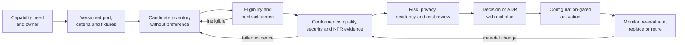

# Phase 1 Technology Stack Decision Contract

| Field | Value |
|---|---|
| Document ID | `ENG-STACK-001` |
| Version | `0.1` |
| Status | **APPROVED CONSTRAINTS — implementation selection in `ADR-ARCH-006`; production providers unselected** |
| Product phase | Phase 1 — Personal and Family |
| Updated | 26 August 2026 |
| Architecture inputs | `ARCH-SOL-001`, `ARCH-DATA-001`, `ARCH-NFR-001`, proposed `ADR-ARCH-001`–`005` |
| Decision boundary | Capability criteria and evidence only; selection requires an approved decision/ADR |

## 1. Purpose and non-selection statement

This document defines what every implementation and future production technology must prove. Accepted `ADR-ARCH-006` selects the Phase 1 local application language, modular repository, client/API frameworks, local adapters, and test toolchain. It does **not** select a cloud, production hosting model, identity provider, managed database, object store, queue, search/vector/graph engine, OCR/model provider, notification service, connector, analytics platform, observability product, or production key/secrets product.

Approved `DEC-009` requires provider-specific choices behind abstractions. Approved `DEC-021` requires a responsive web app/PWA product surface, and `DEC-022` requires strict multi-tenant workspace isolation with an Australian-residency option. Those decisions constrain capabilities, not products. Proposed ADRs are evaluation inputs until accepted. `DEC-031`–`DEC-040` continue to fence conditional connectors, continuity, scoring, launch profiles, clinical handling, channels, recovery, deletion timing, and residency routes.

## 2. Selection principles

1. **Contract before candidate.** Define the capability, data classes, trust boundary, failure semantics, and evidence before evaluating candidates.
2. **Domain before SDK.** Canonical identities, states, invariants, and events never adopt a provider object model.
3. **Eligibility before availability.** A reachable route is unusable unless current purpose, authorization, residency, privacy, retention, deletion, security, and cost policy allow it.
4. **Truth before convenience.** A candidate that cannot express partial, stale, restricted, unknown, repair, and deletion states is ineligible.
5. **Portable evidence.** Evaluation uses capability/contract versions and provider-neutral measures; provider-native evidence may supplement but not replace canonical proof.
6. **Safety is non-compensable.** Lower cost, speed, popularity, or availability cannot offset a failed isolation, authorization, audit, deletion, residency, integrity, or evidence gate.
7. **Smallest justified choice.** Logical components do not imply separate products, services, processes, or stores.
8. **Reversible adoption.** Canonical export, fixtures, migrations, adapter replacement, and forward repair must prevent irreversible provider lock-in.

## 3. Capability stack

| Capability family | Required provider-neutral behavior | Mandatory evaluation evidence | Decision dependencies |
|---|---|---|---|
| Responsive web/PWA client | Accessible responsive journeys; safe session/local-state behavior; secure rendering/download; versioned API consumption; truthful async/degraded states | Critical-journey/accessibility matrix, browser threat tests, contract compatibility, build provenance, offline/non-persistence tests | `DEC-021`; client technology deferred |
| Edge/API boundary | OpenAPI 3.1 conformance, authenticated workspace/purpose context, current authorization, quotas, ETags, idempotency, problem responses, artifact grant/redemption | `API-P1-*` suite, abuse/non-disclosure, compatibility and load evidence | `API-STD-001`, `API-OAS-001` |
| Domain/application runtime | Aggregate ownership, bitemporal/immutable semantics, deterministic rules, explicit workflows, provider-neutral ports | State-machine/property, temporal, boundary, replay and migration evidence | `ARCH-DOM-001`, `ARCH-DATA-001` |
| Identity/session/recovery port | Stable internal mapping, strong/session/step-up/revocation events, least disclosure, tenant-safe failure | Authentication/session conformance, revoke/race/abuse, credential isolation | `SEC-P1-003`–`007`; recovery disabled by `DEC-038` |
| Canonical record capability | Strong workspace scoping, revisions, constraints, bitemporal queries, durability, migration/restore, audit correlation | Two-workspace isolation, temporal, RPO/restore, concurrency, deletion/tombstone and portability | Proposed `ADR-ARCH-001`; store deferred |
| Immutable artifact capability | Write-once retained bytes, digest/integrity, quarantine separation, scoped redemption, lifecycle/deletion acknowledgement | Mutation denial, digest, malware containment, grant redemption, backup/restore/purge | Proposed `ADR-ARCH-002`; storage/scanner deferred |
| Durable command/event/workflow capability | Atomic transition/publication obligation, at-least-once semantics, ordering, idempotency, replay, DLQ/repair, truthful workflow state | Crash-window, duplicate/reorder/gap, audit outage, replay, poison, cancellation and recovery | Proposed `ADR-ARCH-004`; products deferred |
| Derived retrieval/projection capability | Generation/watermark/lineage, candidate minimization, current authorization, rebuild/cutover, stale/partial signaling | Revocation/deletion race, isolation, deterministic rebuild, freshness/load | Proposed `ADR-ARCH-002`–`003` |
| Search/vector/graph capability | Permission-trimmed bounded retrieval/traversal; exact version/evidence refs; no independent truth | Authorized recall/latency, hidden-existence, path/edge, stale/deletion, portability | `AI-RAG-001`, `DIT-GPH-001`; engine deferred |
| Document processing port | Safe native/OCR/parser stages, exact version/anchor provenance, schema-bound outputs, quarantine/clinical fences | Type/quality/layout corpus, injection/malformed-file, anchor, route/deletion evidence | Launch profile blocked by `DEC-035` |
| AI capability port | Registered capability, minimum authorized input, structured output, tool isolation, evidence/guardrails, usage/cost attribution | `AI-EVAL-001` suite, schema/citation/injection/privacy/deletion/cost and replacement parity | Processor/residency blocked by `DEC-040` |
| Source/connector/action port | Consent, cursor/external-version identity, permission mapping, bounded effects, reconciliation, revoke/delete | `CON-P1-*` suite, SSRF/permission-drift/partial/unknown/resync/deletion | No conditional connector enabled under `DEC-031` |
| Notification port | Canonical in-product state separate from delivery attempt; recipient/content/channel policy; idempotent evidence | Recipient/non-disclosure, duplicate, failure, acknowledgement, deletion | External channels disabled under `DEC-037` |
| Audit capability | Append-only safe evidence, integrity/gap detection, access control, export/minimization, durable coupling | Outage/tamper/gap/reconciliation, privileged access, deletion minimization | Retention timing blocked by `DEC-039` |
| Observability/analytics capability | Allow-listed content-free telemetry, correlation/gaps, NFR measures, no control dependency on telemetry | Canary/schema, loss/lag, residency/deletion inventory, metric reproducibility | `NFR-P1-036`, `041`–`045`; product deferred |
| Cryptography/key/secret capability | Separated key domains, scoped workload use, rotation/revoke/recovery, no raw material exposure | Protocol/configuration, secret scan, key drills and audit | `SEC-P1-008`–`011`; product/hierarchy deferred |
| Build/supply-chain capability | Deterministic locked builds, provenance, dependency inventory, approved artifacts, vulnerability/license policy | Clean rebuild, inventory, tamper/dependency/rollback | `SEC-P1-030`; tooling deferred |
| Deployment/backup/DR capability | Residency-eligible immutable release, staged rollout, rollback/forward repair, RPO/RTO and deletion-safe restore | Placement, compatibility, backup/restore/DR, schema/fence/audit gates | `NFR-P1-026`–`031`, `039`; DevOps decisions deferred |

## 4. Port and adapter contract

Every capability candidate is accessed through a port owned by the application/domain boundary. Each port specification defines:

- stable capability and contract IDs/versions;
- commands, queries, schemas, size/cardinality/time bounds, and compatibility range;
- actor/workload, workspace/reference scope, purpose, authorization, policy/configuration, deletion/quarantine, and correlation context;
- data classes/fields and allowed input/output/evidence forms;
- synchronous/asynchronous semantics, ordering, concurrency, idempotency, cancellation, timeout, retry, partial/unknown outcome, and reconciliation;
- processor, storage, support, telemetry, backup, failover, and subprocessor regions;
- credential, network/egress, encryption, retention, training/reuse, deletion, disconnect, and incident behavior;
- provenance, integrity, audit, observability, usage, cost, quota, and placement evidence;
- deterministic fake/reference behavior and conformance fixtures; and
- version change, deprecation, portability, replay/rebuild, and exit behavior.

A port is a logical boundary. It does not require a network call, separate deployable, multiple vendors, or a lowest-common-denominator interface.

## 5. Minimum qualification gates

| Gate | Required result |
|---|---|
| Contract | Exact port version and closed schemas supported; unknown/incompatible versions fail safely |
| Functional semantics | Canonical identity/state/evidence preserved; partial/unknown/degraded behavior represented |
| Workspace isolation | No cross-workspace read, write, index, cache, log, support, backup, or inference path |
| Authorization | Pre-dispatch and consequence-time current checks without cached broad allow |
| Security | Threat/control suite, scoped credentials, egress bounds, dependency evidence, accepted residual risk |
| Privacy | Purpose/data/processors/reuse/support/retention declared; minimum disclosure and clean telemetry |
| Residency | Approved route for every data role; unknown route denies |
| Integrity/durability | Applicable RPO, immutable-original, publication, audit, and recovery contracts met |
| Deletion | Fences, active copies, derivatives, caches, exports, callbacks, backups, acknowledgements, non-resurrection |
| Failure/resilience | Bounded retry/backpressure, circuit state, outage/partial/unknown/reconciliation, safe degradation |
| Performance/capacity | Representative segmented evidence against applicable provisional NFRs and forecast |
| Accessibility | Applicable surfaces meet the approved accessibility matrix |
| AI/document quality | Exact slices, evidence/citation, guardrail, calibration, and review gates |
| Cost | Provider-neutral attribution and budget behavior; no unsafe cheaper route |
| Operability | Health, safe correlation, gaps, repair, upgrades, rollback/forward repair, incident/export |
| Portability | Canonical export/replay/rebuild/replacement without identity, evidence, or tombstone loss |

Passing a benchmark does not substitute for these gates.

## 6. Evaluation and evidence package

Each evaluation produces a versioned `TechnologyCandidateRecord`:

| Field group | Required contents |
|---|---|
| Identity | Record ID/version, capability/port and adapter versions, evaluator, date, environment |
| Scope | Intended slices, data roles/classes, traffic/storage profile, jurisdictions, exclusions |
| Contracts | Supported schemas/versions, deviations, compatibility/deprecation |
| Security/privacy | Threat/control mapping, credentials/egress, processing/region/retention/deletion/reuse/support evidence and expiry |
| Functional | Conformance, semantic gaps, failure/degraded/reconciliation behavior |
| Quality/NFR | Dataset/load/chaos/recovery results by slice, sample/data-quality state, target comparison |
| Operations | Upgrade, migration, observability, incident, restore, repair, ownership |
| Economics | Provider-neutral usage, cost assumptions, budget behavior, switching cost |
| Portability | Export/rebuild/replay/replacement result and provider-native dependencies |
| Decision | Gate results, residual risks, controls, recommendation, approvers, expiry/revisit triggers |

Raw household content, prompts, answers, passages, names, filenames, credentials, tokens, unrestricted URLs, and provider payloads stay out of ordinary reports. Fixtures are synthetic unless an approved restricted plan permits otherwise.

## 7. Candidate decision workflow

Criteria and fixtures are approved before comparative execution. Candidate-specific exceptions cannot rewrite a common test solely to produce a pass. A selected candidate stays inactive until the decision/ADR is accepted, its exact version is approved, configuration is disabled by default, and every applicable open-decision gate is closed.

## 8. Stable engineering rules

| Rule ID | Draft normative rule |
|---|---|
| `ENG-STACK-P1-001` | Technology selection MUST start from a versioned capability/port contract, not a preferred product or SDK. |
| `ENG-STACK-P1-002` | Canonical IDs, aggregates, states, events, evidence, policies, and reference data MUST remain provider-neutral. |
| `ENG-STACK-P1-003` | No implementation language, framework, cloud, store, identity, processor, model, scanner, channel, connector, analytics, observability, build, or deployment product is selected here. |
| `ENG-STACK-P1-004` | A logical component or port MUST NOT be interpreted as a required service, process, repository, store, or vendor. |
| `ENG-STACK-P1-005` | Every candidate MUST declare the exact port, contract, schema, adapter, and capability versions it implements. |
| `ENG-STACK-P1-006` | Missing, expired, incompatible, or unverified capability-manifest claims MUST make a route ineligible. |
| `ENG-STACK-P1-007` | Evaluation MUST use approved common fixtures, workload assumptions, slices, and pass/fail definitions established before comparison. |
| `ENG-STACK-P1-008` | Benchmarks MUST report correctness, safety, evidence, failure, latency, capacity, and cost; one aggregate score MUST NOT decide selection. |
| `ENG-STACK-P1-009` | Security, privacy, isolation, authorization, original integrity, audit, deletion, and residency gates are mandatory and non-compensable. |
| `ENG-STACK-P1-010` | Every household processing/storage route MUST resolve current workspace, class, purpose, processor, region, retention, deletion, and policy eligibility. |
| `ENG-STACK-P1-011` | Availability or cost MUST NOT silently trigger a provider, processor, region, support, telemetry, backup, or failover route. |
| `ENG-STACK-P1-012` | External identifiers MUST be namespaced mappings and MUST NOT replace platform identities or prove domain equality. |
| `ENG-STACK-P1-013` | Each enabled adapter MUST have a deterministic fake and a shared conformance suite covering success and failure. |
| `ENG-STACK-P1-014` | Adapter conformance MUST cover context, minimization, egress, schemas, timeout, retry, idempotency, cancellation, partial/unknown outcomes, and reconciliation. |
| `ENG-STACK-P1-015` | Content-bearing adapters MUST prove retention, reuse, deletion, disconnect, incident, support, telemetry, backup, and subprocessor behavior. |
| `ENG-STACK-P1-016` | Candidate evidence MUST map to applicable requirements, architecture/NFR, security/threat, API/event, and test IDs. |
| `ENG-STACK-P1-017` | Results MUST retain candidate, adapter, build, schema, policy, fixture, dataset, and environment versions. |
| `ENG-STACK-P1-018` | Evaluation MUST use synthetic or specifically approved restricted data and keep protected content out of ordinary evidence systems. |
| `ENG-STACK-P1-019` | A candidate MUST express every blocked, restricted, stale, partial, unavailable, retry, cancelled, unknown, repair, and terminal state required by contract. |
| `ENG-STACK-P1-020` | Unknown schema, policy, residency, deletion, authorization, or capability state MUST fail closed or use an approved non-content fallback. |
| `ENG-STACK-P1-021` | Canonical export, migration, replay/rebuild, and replacement-adapter exercises MUST prove portability before enablement. |
| `ENG-STACK-P1-022` | Provider-native extensions MUST remain inside adapters and MUST NOT leak into domain interfaces, event identity, audit semantics, or canonical state. |
| `ENG-STACK-P1-023` | Dependencies MUST be inventoried, version-constrained, provenance-verifiable, vulnerability/license-reviewed, and owned for upgrade/removal. |
| `ENG-STACK-P1-024` | A material provider, model, API, region, subprocessor, support, retention, reuse, failover, pricing, or capability change MUST expire or rerun evidence. |
| `ENG-STACK-P1-025` | Selection MUST record alternatives, consequences, residual risks, exit plan, evidence, owners, review date, and triggers in an approved decision/ADR. |
| `ENG-STACK-P1-026` | An evaluation recommendation MUST NOT activate a candidate; accepted authority and a compatible disabled-by-default configuration are required. |
| `ENG-STACK-P1-027` | `DEC-031`–`DEC-040` MUST remain visible gates; an engineering default or local fake cannot close or bypass them. |
| `ENG-STACK-P1-028` | Performance/cost evidence MUST be segmented by capability, outcome, retry/cache class, slice, and data-quality state; safety failures cannot be averaged away. |
| `ENG-STACK-P1-029` | A selected technology MUST have operational, security, privacy, data, test, upgrade, incident, and decommission owners before production. |
| `ENG-STACK-P1-030` | Selection evidence and decisions MUST be immutable by version, safely auditable, reviewable, and reproducible from retained manifests/fixtures. |

## 9. Required decision output

No stack choice is valid until the decision states:

1. the capability and why an approved component cannot satisfy it;
2. exact port versions and mandatory/optional criteria;
3. candidates and evidence, including defer or reduce-scope alternatives;
4. data flow, trust/residency zones, processor/support/telemetry/backup implications, and decision fences;
5. compatibility, migration, failure, deletion, recovery, cost, operations, security, privacy, accessibility, and portability consequences;
6. residual risks, owners, evidence expiry, activation and rollback/forward-repair gates; and
7. review/replacement triggers.

`ADR-ARCH-006` supplies the approved local implementation output. Each production provider remains deliberately undecided until it supplies the evidence and decision output above.
