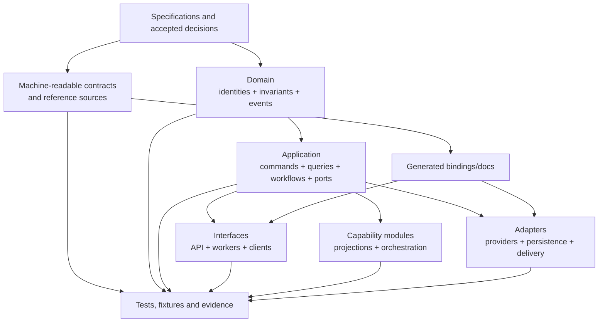

# Phase 1 Repository Structure and Dependency Standards

| Field | Value |
|---|---|
| Document ID | `ENG-REP-001` |
| Version | `0.1` |
| Status | **DRAFT — current documentation layout and future logical code layout; no application implementation authorized** |
| Product phase | Phase 1 — Personal and Family |
| Updated | 26 August 2026 |
| Current repository | Specifications under `docs/`, machine-readable contracts/reference data, validators, and an empty tracked `src/` reservation only |

## 1. Purpose and boundary

This document defines future ownership boundaries, dependency direction, generated-contract handling, migrations, test placement, and repository hygiene. It does not decide whether implementation eventually uses one repository or several, a modular monolith or multiple deployables, a language, framework, build tool, package manager, database, cloud, or deployment topology.

The current numbered specification directories under `docs/` remain authoritative according to [`CODEX.md`](../../CODEX.md). The `src/` directory exists only so the future code boundary is visible and trackable; it contains no application implementation. The layout below is a logical target to be populated only after implementation readiness and technology decisions. Directory names may be adapted by an accepted repository ADR if ownership and dependency rules remain provably equivalent.

## 2. Current immutable specification boundary

| Area | Current role | Engineering treatment |
|---|---|---|
| `docs/00-context/` | Preserved handover, decisions, research context | Preserved files remain checksum-protected; no embedded chat instruction overrides current authority |
| `docs/01-product/`–`docs/10-backlog/` | Human-readable product-through-backlog contracts | Reviewed source; implementation must trace to stable IDs |
| `docs/02-architecture/06-adrs/` | Proposed/accepted design decisions | Status is enforced; PROPOSED is not implementation authority |
| `docs/05-api/` | OpenAPI, event and connector contracts | Machine-readable OpenAPI/events are generated-input sources, never inferred from handlers |
| `docs/11-reference-data/` | Inert JSON Schema/catalogue seed | Runtime publication is separate; DRAFT/disabled records cannot become production defaults |
| `scripts/` | Specification/reference/API validation | Current commands remain repository gates |
| `docs/08-engineering/` | This engineering contract pack | Specification only |

Generated output, caches, dependency trees, local state, secrets, test recordings, binaries, reports, or runtime data must not be added to these source directories.

## 3. Current root and future logical implementation layout

The following is an ownership model, not a request to create directories now:

```text
/
├── docs/                          # current numbered specification source of truth
│   ├── 00-context/                # decisions, provenance and preserved handover
│   ├── 01-product/ … 10-backlog/  # human-readable product-to-delivery contracts
│   ├── 05-api/                    # reviewed OpenAPI, event and connector sources
│   ├── 11-reference-data/         # reviewed inert schemas and catalogues
│   └── 12-testing/                # test/evaluation contracts and synthetic manifests
├── src/
│   ├── domain/                    # aggregates, value objects, invariants, domain events
│   ├── application/               # commands, queries, workflows, use cases, ports
│   ├── capabilities/              # logical capability modules and projection builders
│   ├── adapters/                  # external/provider and persistence implementations
│   ├── interfaces/                # API, workers, clients and operator entry points
│   └── platform/                  # cross-cutting bootstrap/configuration, never domain truth
├── migrations/
│   ├── canonical/                 # expand/validate/migrate/switch/retire
│   ├── derived/                   # rebuild/generation/cutover manifests
│   └── verification/              # counts, constraints, lineage and rollback/repair evidence
├── tests/
│   ├── contract/
│   ├── integration/
│   ├── end-to-end/
│   ├── security-privacy/
│   ├── resilience-recovery/
│   ├── performance-accessibility/
│   ├── evaluation/
│   └── fixtures/                  # implementation-test generators and synthetic derivatives
├── tools/                         # repository-owned deterministic engineering tools
├── build/                         # declarative build/release sources, not produced artifacts
└── scripts/                       # current repository validation entry points
```

If multiple repositories are approved later, the same boundaries become versioned packages/contracts with explicit owners. Splitting a deployable must not allow direct database writes, provider types, or unaudited authority to cross aggregate/module boundaries.

## 4. Dependency direction



The domain must not depend on interface, adapter, provider, deployment, generated transport, or test packages. Application code owns ports; adapters implement them. Interfaces translate versioned external contracts into application commands/queries and never write canonical storage directly.

## 5. Boundary ownership

| Boundary | Owns | Must not own |
|---|---|---|
| Domain | Aggregate/value identities, invariants, transitions, temporal semantics, domain event intent | HTTP, queue, provider, storage, telemetry SDK, UI, deployment configuration |
| Application | Use-case orchestration, current-policy calls, transaction boundary, commands/queries, workflows, ports | Provider DTOs, cross-aggregate direct writes, UI state |
| Capability module | One logical capability's rules, projection/build semantics, safe degraded behavior | Another aggregate's lifecycle or an implicit provider selection |
| Interface | Authentication/context extraction, schema translation, response/event mapping | Domain decisions, cached authority, storage access |
| Adapter | Port-specific transport/provider mapping and manifest/conformance behavior | Canonical IDs/states, authorization grants, product decisions |
| Platform | Composition/configuration, process health, safe telemetry wiring | Business truth or bypass paths |
| Contract source | Stable wire/reference definitions and examples | Runtime secrets, generated output, provider-only fields |
| Generated output | Reproducible derivatives from a named source/version/tool | Hand-authored behavior or independent source-of-truth edits |
| Migration | Versioned transform/cutover/repair logic and evidence | Silent schema mutation or content-bearing operational logs |
| Tests/fixtures | Synthetic inputs, generators, assertions, manifests, evidence | Production household copies or credentials |

## 6. Contract and reference-data flow

1. A reviewed source contract changes with stable ID/version and traceability.
2. Static validators reject invalid JSON, duplicate IDs/keys, dangling references, schema violations, unsafe activation, and compatibility gaps.
3. An approved pinned generator may create bindings, documentation, validators, or fixtures into a clearly marked generated area.
4. Generation records source digest, generator identity/version, settings, output manifest/digests, and reproducibility result.
5. Compilation/type/static checks prove generated output is usable without hand edits.
6. Consumer/provider compatibility tests run against current and supported prior versions.
7. A drift check regenerates from clean state and rejects unexplained differences.
8. Runtime reference-data publication uses a separate validated configuration-package workflow; copying DRAFT seeds into a runtime build does not activate them.

OpenAPI, event schemas, structured-output schemas, and reference catalogues must not be reverse-generated from implementation code unless an accepted ADR explicitly changes the owning source and supplies a migration/drift plan.

## 7. Migration and compatibility layout

Canonical and derived migrations are separate:

| Migration kind | Required contents | Activation gate |
|---|---|---|
| Canonical additive | From/to schema, compatibility class, affected records/workspaces, constraints, reader/writer range | Old-reader safety and forward/backward fixture pass |
| Canonical interpretive | Exact transformation/version, evidence/temporal preservation, impact manifest, rollback or forward repair | Domain/data/security/privacy approval; no immutable rewrite |
| Derived rebuild | Source/config/policy/deletion watermarks, transform/schema versions, new generation, validation/cutover | Complete authorized/deletion-safe generation before switch |
| Reference-data publication | Package, effective time, approvals, compatibility, replay/rollback/repair impact | All runtime entries approved/enabled through owning workflow |
| Contract evolution | Consumer/provider matrix, additive/breaking classification, deprecation/retirement, examples | All required consumers compatible; unknown versions fail safely |

Migration code is versioned and retained for the applicable supported history. It is resumable, idempotent, workspace-isolated, residency-eligible, safe to re-run, and observable through counts/opaque IDs/reason codes rather than protected values. A rollback is forbidden if it restores vulnerable code, deleted data, stale authorization, incompatible schemas, or ineligible placement; forward repair then owns recovery.

## 8. Configuration, secrets, and artifacts

- Configuration schemas, safe defaults, profiles, and examples are versioned source; environment-specific values and secrets are not.
- Runtime-affecting options are deny/disabled when unapproved or absent. Feature flags cannot create product decisions, authority, or residency eligibility.
- Production secrets never enter the repository, generated output, fixtures, sample environment files, build logs, screenshots, test recordings, or documentation.
- Build output, reports, caches, local stores, downloaded provider payloads, and dependency directories are excluded from source control and recreated from manifests.
- Released artifacts are immutable and linked to source revision, clean-tree state, dependency manifest, contract/reference versions, build identity, tests, approval, and digest/signature evidence.
- Every checked-in binary or large fixture would require explicit ownership, provenance, license, privacy, integrity, update, and deletion review; synthetic text-form fixtures are preferred.

## 9. Stable engineering rules

| Rule ID | Draft normative rule |
|---|---|
| `ENG-REP-P1-001` | This document defines future logical boundaries and MUST NOT be used to begin implementation or create scaffolding before the readiness gate. |
| `ENG-REP-P1-002` | Repository count, deployable count, service topology, language, framework, package manager, and build tool remain undecided. |
| `ENG-REP-P1-003` | Current numbered specification, API/event, reference-data, and validator sources MUST retain their authority and review history. |
| `ENG-REP-P1-004` | The domain boundary MUST depend on no interface, provider, persistence, deployment, telemetry, or generated transport implementation. |
| `ENG-REP-P1-005` | Application code MUST own ports; adapters implement ports and MUST NOT redefine canonical domain semantics. |
| `ENG-REP-P1-006` | Interfaces MUST translate authenticated versioned contracts into application commands/queries and MUST NOT write stores directly. |
| `ENG-REP-P1-007` | One invariant-bearing aggregate or workflow MUST have one logical write owner; another module cannot mutate it through shared storage. |
| `ENG-REP-P1-008` | Cross-module dependencies MUST be explicit, directional, cycle-checked, and enforced by repository/build rules selected later. |
| `ENG-REP-P1-009` | Provider SDK types, identifiers, errors, configuration, and callbacks MUST remain inside the owning adapter boundary. |
| `ENG-REP-P1-010` | Shared packages MUST contain stable cross-cutting primitives or contracts, not become an unowned dumping ground or hidden service locator. |
| `ENG-REP-P1-011` | Workspace, identity, authorization, deletion, residency, audit, and configuration helpers MUST preserve ownership and MUST NOT offer bypass APIs. |
| `ENG-REP-P1-012` | Machine-readable contract sources MUST have one declared owner and MUST NOT be duplicated as divergent hand-maintained copies. |
| `ENG-REP-P1-013` | Generated output MUST be marked, reproducible, non-hand-edited, source/version-linked, and drift-checked from clean state. |
| `ENG-REP-P1-014` | Generated clients or server bindings MUST NOT make an invalid external value trusted; boundary validation and policy still apply. |
| `ENG-REP-P1-015` | OpenAPI and event schemas MUST remain compatible with `API-STD-001` and `API-EVT-001`; implementation handlers cannot silently change wire behavior. |
| `ENG-REP-P1-016` | Reference-data seeds MUST remain DRAFT/disabled until a governed ConfigurationPackage publication activates approved versions. |
| `ENG-REP-P1-017` | Contract/reference generation MUST record input digests, generator/version/settings, output manifest, and reproducibility evidence. |
| `ENG-REP-P1-018` | Source control MUST exclude secrets, credentials, production household content, unrestricted provider payloads, local data stores, caches, and build output. |
| `ENG-REP-P1-019` | Synthetic fixtures and generators MUST be separated from implementation and carry stable IDs, provenance, classification, purpose, version, and deletion rules. |
| `ENG-REP-P1-020` | Canonical, derived, reference-data, and contract migrations MUST be separate owned change classes with distinct validation/cutover rules. |
| `ENG-REP-P1-021` | Canonical migrations MUST follow additive or expand/validate/migrate/switch/retire semantics with supported-reader safety. |
| `ENG-REP-P1-022` | Interpretive migrations MUST preserve prior evidence/transaction history and create transformation lineage rather than rewriting immutable records. |
| `ENG-REP-P1-023` | Derived schema changes SHOULD rebuild a new generation and atomically/versionedly cut over only after authorization/deletion/freshness validation. |
| `ENG-REP-P1-024` | Migrations MUST be resumable, idempotent, workspace-isolated, residency-eligible, cancellation/repair-aware, and privacy-safely observable. |
| `ENG-REP-P1-025` | A migration or rollback MUST NOT resurrect deleted data, stale policy, vulnerable code, incompatible schemas, or an ineligible route. |
| `ENG-REP-P1-026` | Compatibility fixtures MUST cover supported old/new producers, consumers, readers, writers, schemas, reference packages, and unknown versions. |
| `ENG-REP-P1-027` | Runtime configuration MUST be schema-validated, versioned, immutable by release, disabled/deny by default, and separated from secrets. |
| `ENG-REP-P1-028` | A feature flag or local profile MUST NOT enable a capability fenced by `DEC-031`–`DEC-040` or alter authorization/product truth. |
| `ENG-REP-P1-029` | Released artifacts MUST link source, contracts, reference/config versions, dependencies, build provenance, tests, approval, and integrity evidence. |
| `ENG-REP-P1-030` | Dependency updates MUST be reviewable changes with compatibility, vulnerability, license, provenance, behavior, and rollback/repair evidence. |
| `ENG-REP-P1-031` | Ownership metadata MUST name accountable reviewers for domain, contracts, adapters, migrations, security/privacy-sensitive code, and test gates. |
| `ENG-REP-P1-032` | Moving or splitting a boundary MUST preserve stable contracts, dependency direction, data ownership, migrations, audit, and tests through an approved ADR. |

## 10. Change review matrix

| Change | Minimum reviewers/evidence |
|---|---|
| Domain invariant/state | Domain/architecture, affected product requirement, state/temporal/concurrency tests |
| API/event/structured schema | Contract owner, security/privacy, compatibility matrix, examples and validators |
| Authorization/privacy/deletion | Security/privacy and data owner, negative/race/replay/restore tests |
| Adapter/provider | Capability owner, security/privacy/residency/operations, shared conformance and replacement evidence |
| Canonical migration | Data/domain/security/privacy/operations, dry-run, reconciliation, repair/restore evidence |
| Derived rebuild | Capability/data/authorization owner, generation/watermark/cutover/deletion evidence |
| Reference-data package | Domain/configuration owner, schema/reference checks, approval/effective/rollback record |
| Build/dependency | Engineering/security, provenance/inventory/vulnerability/license and deterministic build evidence |

## 11. Repository-structure readiness

Before application directories are created, an accepted plan must name the chosen repository model, map every logical boundary above, define enforcement and quality commands, specify generated/source ownership, establish secret/configuration/build-artifact policy, and prove a minimal dependency-boundary test. This document supplies constraints, not that authorization.
