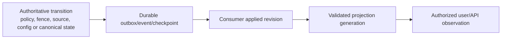

# Phase 1 Performance, Capacity, Resilience, and Recovery Tests

| Field | Value |
|---|---|
| Document ID | `TST-PRF-001` |
| Version | `0.1` |
| Status | **DRAFT — all numeric NFR targets, workloads, topology, routes, RPO/RTO and cadence remain provisional** |
| Product phase | Phase 1 — Personal and Family |
| Updated | 26 August 2026 |
| Primary trace | `NFR-P1-001`–`045`, `ENG-ERR-P1-001`–`040`, `OPS-DR-P1-001`–`032`, `OPS-OBS-P1-001`–`032` |

## 1. Measurement stance

Performance evidence is valid only for an approved representative candidate, workload/corpus, environment/topology, configuration, processor/route, dependency behavior, data scale, warm/cold/cache state, and measurement method. Current numeric targets are planning hypotheses from `ARCH-NFR-001`, not customer SLAs. Synthetic/local results validate harness semantics only.

Every run reports independent client/server and stage timing, percentile method, samples and confidence/data quality, exact success/failure/degraded mapping, queue/backlog and drain, concurrency/tenant mix, resource and provider-neutral usage/cost, retry/cache behavior, correctness/security assertions, and provisional target version. Faster unauthorized, stale, unsupported, partial or fabricated output is a failure.

## 2. Performance and capacity catalogue

| Test ID | Workload / NFR focus | Required evidence |
|---|---|---|
| `TEST-PERF-P1-001` | Availability and dependency degradation; `NFR-P1-001`–`006` | Eligible denominator, truthful outcome classes, synthetic journey split, dependency/control failure, incident/disable consequence. |
| `TEST-PERF-P1-002` | Simple authorized reads/mutations; `NFR-P1-007`–`009` | p50/p95/p99 client/server, concurrency, optimistic conflict, audit/event durability, no hidden-resource shortcut. |
| `TEST-PERF-P1-003` | Search, graph, comparison and citation redemption; `NFR-P1-010`–`011` | Mode/coverage/index generation, path bounds, authorization precision, stale/unavailable labeling, exact citation resolution. |
| `TEST-PERF-P1-004` | Cited Q&A/AI stages; `NFR-P1-012`, `044`–`045` | Retrieval/rerank/model/validation latency, schema/faithfulness/safety, usage/cost/retry/cache by outcome, budget-safe degradation. |
| `TEST-PERF-P1-005` | Ingestion/OCR/extraction queues; `NFR-P1-013`–`015` | Accepted rate, file/page/quality mix, scan/process percentiles, backlog age/drain, cancellation, quarantine and tenant isolation. |
| `TEST-PERF-P1-006` | Authorization/deletion propagation; `NFR-P1-016`–`018` | Policy/fence epochs at API/cache/index/graph/model/job/export/redemption, convergence distribution and zero post-fence disclosure. |
| `TEST-PERF-P1-007` | Source/configuration/projection freshness; `NFR-P1-019`–`021` | Observation/parser/source-health/config consumer/projection watermarks, lag, missingness and stale/partial/unavailable truth. |
| `TEST-PERF-P1-008` | Forecast, burst, fan-out and noisy neighbour | Household/resource/document/edge/task/event growth, burst admission, fair queueing, rate/quota, bounded retry and cross-tenant latency/isolation. |
| `TEST-PERF-P1-009` | Observability quality; `NFR-P1-041`–`043` | Correlation coverage, signal timeliness/gaps, alert fixture firing/recovery/dedup, cardinality and content-canary rejection. |
| `TEST-PERF-P1-010` | Cost exhaustion and safe capacity limit | Attribution by capability/route/outcome, budget/reference version, backpressure/review-only/disable behavior; no ineligible cheaper route or weakened evidence. |

## 3. Resilience and disaster-recovery catalogue

| Test ID | Exercise | Application-level oracle |
|---|---|---|
| `TEST-DR-P1-001` | Acknowledgement durability / provisional `NFR-P1-026` | Accepted original and consequential transition are recoverable with immutable bytes, canonical revision, outbox and required audit before success acknowledgement. |
| `TEST-DR-P1-002` | Mutable-state loss/replay / provisional `NFR-P1-027` | Restore/checkpoint/replay exposes any loss/duplicate and reconciles aggregate/workflow revisions within measured objective; no invented state. |
| `TEST-DR-P1-003` | Audit continuity / provisional `NFR-P1-028` | Required audit has independent integrity/gap checkpoints; outage blocks completion; restore reconciles gaps before service. |
| `TEST-DR-P1-004` | Safe-core recovery / provisional `NFR-P1-029` | RTO stops only when identity/auth, originals, canonical writes, audit, keys, policy, route and deletion gates pass—not infrastructure startup. |
| `TEST-DR-P1-005` | Derived rebuild / provisional `NFR-P1-030` | New search/vector/graph/comparison/health generations rebuild from authority with policy/deletion/source watermarks and explicit stale/unavailable state until cutover. |
| `TEST-DR-P1-006` | Backup control, sampled restore and full DR / provisional `NFR-P1-031` | Manifest completeness, chain/base, digests/counts, schema/config/key usability, per-role restore, timed exercise and content-free evidence. |
| `TEST-DR-P1-007` | Recovery/ownership-transfer absence / `NFR-P1-032` | Restored identity/session/factor/membership/owner/grant creates no human authority or support bypass while `DEC-038` is open. |
| `TEST-DR-P1-008` | Current-policy restore, unsafe rollback and forward repair | Isolated restore applies current authorization/quarantine/deletion/residency/schema; resurrection/ineligible route blocks; unsafe rollback rejected and additive repair reconciles. |

## 4. Workload and correctness contract

Workload manifests define population and growth assumptions, synthetic tenants and access mix, document/page/type/quality/layout distribution, graph shape and traversal limits, query/answer mix, source/monitor schedules, action/export/deletion rate, event retry/replay, cache state, concurrency/burst, dependency latency/failure, duration/ramp, deterministic seed, and route/cost assumptions. No version `0.1` profile claims representative production scale.

For each operation, success is the owning semantic success only. `RESTRICTED`, stale, partial, unavailable, policy blocked, cancelled, outcome unknown, repair pending and retryable/terminal failure are separately counted. Retries appear as attempts plus one reconciled logical outcome. Zero denominator is `NO_DATA`, not 100%. Missing/late/duplicate/sampled records cannot silently improve an SLI.

## 5. Freshness and propagation measurement

Each stage records occurred and recorded time, clock uncertainty, causation, exact revision/generation and data-quality state. The measurement identifies whether lag is producer, publish, queue, consumer, rebuild or client cache. Current authorization and deletion are enforced even before projection convergence; source/config/projection lag is presented as stale/partial/unavailable, never current completeness.

## 6. Fault and chaos matrix

| Injection point | Faults | Required behavior |
|---|---|---|
| Dependency/adapter | timeout, refusal, overload, malformed/inconsistent response, unknown version | bounded retry only if safe; truthful degraded/refused/failed state; no route fallback beyond policy. |
| Transaction/outbox | crash before/after commit, publish, acknowledgement | no phantom success; exact event identity; redelivery dedup; durable repair state. |
| Event/worker | delay, drop, duplicate, reorder, gap, poison, partition, checkpoint loss | hold/reconcile gaps, DLQ poison, replay original bytes/new generation, no duplicate effect. |
| Source/monitor | retrieval/parser failure, stale clock, schedule duplicate, configuration change | preserve observation/snapshot/version; health/freshness visible; deterministic replay; failure is not no change. |
| Model/tool/action | invalid schema, refusal, timeout before/after possible effect, partial/receipt only | validate before storage/use; outcome unknown/reconcile; no blind retry or false closure. |
| Control plane | auth epoch/fence/config/secret/key/audit/telemetry unavailable | auth/fence/audit-sensitive work fails closed; telemetry outage cannot disable controls; safe gaps/repair. |
| Capacity | queue saturation, retry/cost storm, hot tenant, fan-out/depth/size abuse | fair bounded admission/backpressure, privacy-safe status, unaffected tenant isolation, no safety shedding. |

Fault profiles are provider-neutral and deterministic. Recovery probes use synthetic/minimum data and cannot establish processor/residency eligibility or send content merely to test a route.

## 7. Backup and restore gate sequence

1. Declare incident, exact scope, objective clock, candidate and stop unsafe writes/effects.
2. Authorize recovery roles with duty separation; verify backup generation, chain, integrity, keys and route eligibility.
3. Restore into an isolated non-serviceable environment.
4. Apply current schemas/configuration/policy, quarantine and deletion fences before access.
5. Reconcile originals, aggregate/workflow revisions, outbox/events/checkpoints, required audit, external effects and purge acknowledgements.
6. Rebuild derivatives into new generations and verify source/policy/deletion watermarks, authorization, coverage and integrity.
7. Run security/privacy/residency, schema/compatibility, functional, accessibility where relevant, capacity/backlog and telemetry gates.
8. Obtain independent service-release approval; expose only capabilities whose application-level gates pass.
9. Preserve partial/blocked/repair state, actual RPO/RTO, residuals, findings and retest evidence.

Restore never transfers ownership or factors, invents deletion/backup expiry, crosses an unknown route, resurrects a fence, or rewrites append-only evidence. A missing role, decoder, key, audit checkpoint, fence, route or integrity proof keeps the affected capability blocked—not “recovered.”

## 8. Migration, rollback and repair exercises

Canonical migrations are interrupted and rerun at expand, backfill, validate, switch and contract. Tests cover old/new reader-writer combinations, duplicate/reordered work, stale configuration, consumer watermarks, retained replay/restore decoders, immutable evidence/history, and constraint reconciliation. Derived migrations rebuild a new generation, validate it, cut over safely, and keep retired output inaccessible.

Rollback is rejected where it would restore stale authorization/configuration, resurrect deleted data, lose immutable history, repeat/undo an external effect, re-enable a vulnerability, use incompatible schema/event data, or cross an ineligible route. Forward repair is additive, idempotent, scoped, auditable and leaves the capability contained/degraded until item-level reconciliation passes.

## 9. Accessibility, residency and evidence limitations

`NFR-P1-022`–`025` are evidenced by the E2E accessibility matrix, not latency alone. `NFR-P1-033`–`040` are jointly evidenced by security tests and route/secret/recovery exercises. All numeric targets, environment parity, population, alert thresholds, RPO/RTO and exercise cadence remain provisional. Test reports label them as such and never imply an SLA, Australian-only processing, complete recovery, complete deletion timing, or approved cost envelope.

Run artifacts contain safe IDs, versions, timestamps, counts/buckets, percentiles, watermarks, outcomes, finding refs and digests—not household content, filenames, extracted values, prompts/answers, provider payloads, unrestricted URLs, credentials or keys. First failures and all retries remain visible.
